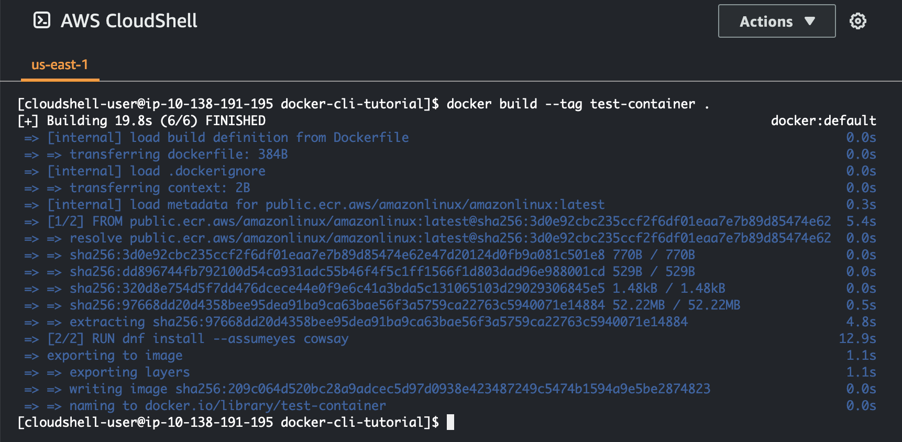
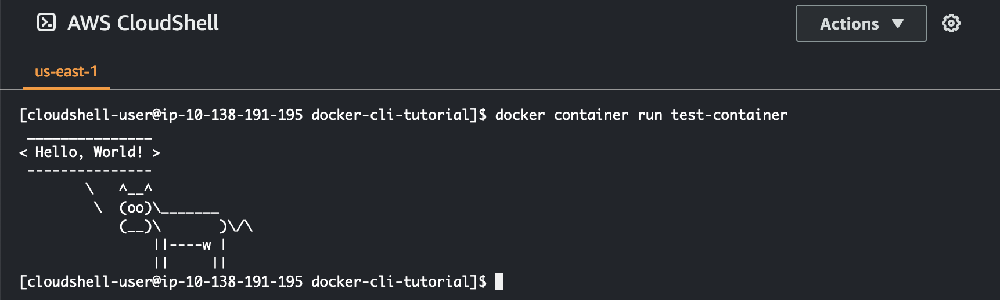
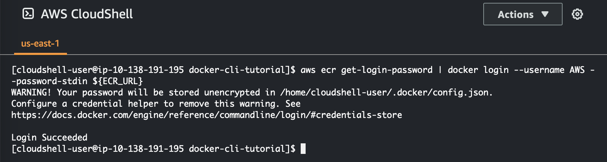

# Building

a Docker container
inside CloudShell
and pushing it to an Amazon ECR repository

This tutorial shows you how to define and build a Docker container in AWS CloudShell and push it to an Amazon ECR repository.

## Prerequisites

- You must have the necessary permissions to create and push to an Amazon ECR repository. For more
  information about repositories with Amazon ECR, see [Amazon ECR private repositories](../../../AmazonECR/latest/userguide/Repositories.md "../../../AmazonECR/latest/userguide/Repositories.md") in the _Amazon ECR User
  Guide_. For more information about the permissions required for
  pushing images with Amazon ECR, see [Required IAM permissions for pushing an image](../../../AmazonECR/latest/userguide/image-push.md#image-push-iam "../../../AmazonECR/latest/userguide/image-push.md#image-push-iam") in the
  _Amazon ECR User Guide_.

## Tutorial procedure

The following tutorial outlines how to use the CloudShell interface to build a Docker container and push it to an Amazon ECR repository.

1. Create a new folder in your home directory.

```
mkdir ~/docker-cli-tutorial
```

2. Navigate to the folder you created.

```
cd ~/docker-cli-tutorial
```

3. Create an empty Dockerfile.

```
touch Dockerfile
```

4. Using a text editor, for example `nano Dockerfile`, open the file and paste the
   following content into it.

```
# Dockerfile

# Base this container on the latest Amazon Linux version
FROM public.ecr.aws/amazonlinux/amazonlinux:latest

# Install the cowsay binary
RUN dnf install --assumeyes cowsay

# Default entrypoint binary
ENTRYPOINT [ "cowsay" ]

# Default argument for the cowsay entrypoint
CMD [ "Hello, World!" ]
```

5. The Dockerfile is now ready to be built. Build the container by running `docker
build`. Tag the container with an easy-to-type name for use in future
   commands.

```
docker build --tag test-container .
```

Make sure to include the trailing period (`.`).

 6. You can now test the container to check that it is running correctly in AWS CloudShell.

```
docker container run test-container
```

 7. Now that you have a functioning Docker container, you need to push it to an Amazon ECR repository.
If you have an existing Amazon ECR repository, you can skip this step.

Run the following command to create an Amazon ECR repository for this tutorial.

```
ECR_REPO_NAME=docker-tutorial-repo
aws ecr create-repository --repository-name ${ECR_REPO_NAME}
```

.png>) 8. After you create the Amazon ECR repository, you can push the Docker container to it.

Run the following command to get the Amazon ECR sign-in credentials for Docker.

```
AWS_ACCOUNT_ID=$(aws sts get-caller-identity --query "Account" --output text)
ECR_URL=${AWS_ACCOUNT_ID}.dkr.ecr.${AWS_REGION}.amazonaws.com
aws ecr get-login-password | docker login --username AWS --password-stdin ${ECR_URL}
```



###### Note

If the **AWS_REGION** environment variable is not set in
your CloudShell or you want to interact with resources in other
AWS Regions, run the following command:

```
AWS_REGION=<your-desired-region>
```

9. Tag the image with the target Amazon ECR repository and then push it to that repository.

```
docker tag test-container ${ECR_URL}/${ECR_REPO_NAME}
docker push ${ECR_URL}/${ECR_REPO_NAME}
```

.png>)

If you encounter errors or run into issues when trying to complete this tutorial, see the [Troubleshooting](troubleshooting.md "troubleshooting.md") section of this guide for help.

## Clean up

You have now successfully deployed your Docker container to your Amazon ECR repository. To remove
the files you created in this tutorial from your AWS CloudShell environment, run the following
command.

- ```
  cd ~
  rm -rf ~/docker-cli-tutorial
  ```

```
* Delete the Amazon ECR repository.


```

aws ecr delete-repository --force --repository-name ${ECR_REPO_NAME}

```

```
