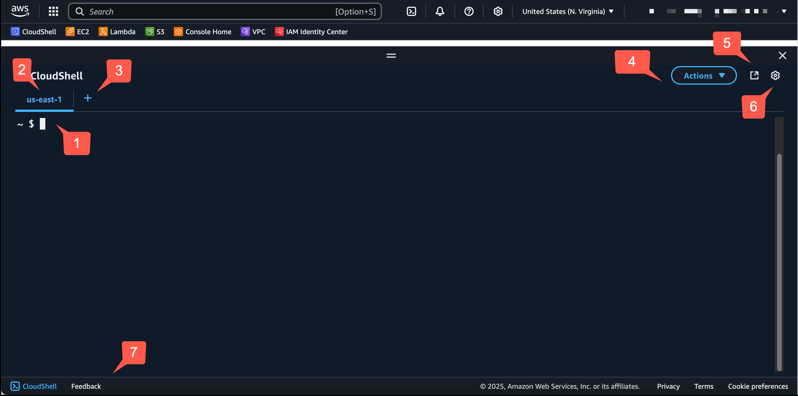

# AWS CloudShell Concepts

This section describes how to interact with AWS CloudShell and perform specific actions with supported applications.

###### Topics

* [Navigating the AWS CloudShell interface](#navigating-the-interface "#navigating-the-interface")
* [Working in AWS Regions](#region-selection "#region-selection")
* [Working with files and storage](#files-storage "#files-storage")
* [Access
 CloudShell in
 the
 Console Mobile Application](#working-with-cloudshell-in-console-mobile-application "#working-with-cloudshell-in-console-mobile-application")
* [Working with Docker](#working-with-docker "#working-with-docker")

## Navigating the AWS CloudShell interface


You can navigate CloudShell interface features from the AWS Management Console and Console
 Toolbar.


The following screenshot indicates several key AWS CloudShell interface features.





1. AWS CloudShell command line interface that you use to run commands by using [your preferred shell](getting-started.md#launch-region-shell "getting-started.md#launch-region-shell"). The current shell
 type is indicated by the command prompt.
2. The terminal tab, which uses AWS Region where AWS CloudShell is currently
 running.
3. The **+** icon is a dropdown menu that includes options to
 create, restart, and delete environments.
4. The **Actions** menu, which provides options for [changing the screen layout](customizing-cshell.md#tabs-layout "customizing-cshell.md#tabs-layout"), [downloading](getting-started.md#download-file "getting-started.md#download-file") and [uploading](getting-started.md#folder-upload "getting-started.md#folder-upload") files, [restarting your
 AWS CloudShell](getting-started.md#restart-shell-session "getting-started.md#restart-shell-session"), and [deleting your
 AWS CloudShell home directory](getting-started.md#delete-shell-session "getting-started.md#delete-shell-session"). 


###### Note

The **Download** option isn't available when you launch
 CloudShell on the Console Toolbar.
5. The **Open in new browser tab**, which provides the option to
 access your CloudShell session in a full screen.
6. The **Preferences** option, which you can use to [customize your shell experience](customizing-cshell.md "customizing-cshell.md").
7. The bottom bar, which provides the following options to:


	* Launch CloudShell from the **CloudShell** icon.
	* Provide feedback from the **Feedback** icon. Choose the
	 type of feedback that you want to submit, add your comments, and then choose
	 **Submit**.
	
	
	
	
		+ To submit feedback for CloudShell, choose one of the following
		 options:
		
		
		
		
			- From the console, launch CloudShell, and choose
			 **Feedback**. Add your comments, and then
			 choose **Submit**.
			- Choose **CloudShell** on the Console
			 Toolbar, on the lower left of the console, and then
			 choose **Open in new browser tab** icon,
			 **Feedback**. Add your comments, and then
			 choose **Submit**.
	###### Note
	
	The **Feedback** option isn't available when you launch
	 CloudShell on the Console Toolbar.
	* Learn about our privacy policy and terms of use, and customize cookie
	 preferences.

## Working in AWS Regions


The current AWS Region that you're running in is displayed as a tab.


You can choose an AWS Region to work in by selecting a specific Region using the
 Region selector. After you change Regions, the interface refreshes as your shell session
 connects to a different compute environment that's running in the selected Region. 


###### Important


* You can use up to 1 GB of persistent storage in each AWS Region. Persistent storage
 is stored in your home directory (`$HOME`). This means that any
 personal files, directories, programs, or scripts that are stored in your home directory
 are all located in one AWS Region. Moreover, they're different from those that are
 located in the home directory and stored a different Region. 


The long-term retention of files in persistent storage is also managed on a
 per-Region basis. For more information, see [Persistent storage](limits.md#persistent-storage-limitations "limits.md#persistent-storage-limitations").
* Persistent storage is not available for AWS CloudShell VPC environments.

### Specifying your default AWS Region
 for AWS CLI


You can use [environment
 variables](https://docs.aws.amazon.com/cli/latest/userguide/cli-configure-envvars.html "https://docs.aws.amazon.com/cli/latest/userguide/cli-configure-envvars.html") to specify configuration options and credentials required to access
 AWS services using AWS CLI. The environment variable that specifies the default
 AWS Region for your shell session is set in either when you launch AWS CloudShell
 from a specific Region in the AWS Management Console or when you choose an option in the Region
 selector.


[Environment variables have precedence over AWS CLI credentials files](https://docs.aws.amazon.com/cli/latest/userguide/cli-configure-quickstart.html#cli-configure-quickstart-precedence "https://docs.aws.amazon.com/cli/latest/userguide/cli-configure-quickstart.html#cli-configure-quickstart-precedence") that are
 updated by `aws configure`. So, you can't run the `aws configure`
 command to change the Region that's specified by the environment variable. Instead, to
 change the default Region for AWS CLI commands, assign a value to the
 `AWS_REGION` environment variable. In the examples that follow, replace
 `us-east-1` with the Region that you're in.


Bash or Zsh

```
$ export AWS_REGION=us-east-1
```

Setting the environment variable changes the value that's used until either
 at the end of your shell session or when you set the variable to a different
 value. You can set variables in your shell's startup script to make the
 variables persistent across future sessions. 


PowerShell

```
PS C:\> $Env:AWS_REGION="us-east-1"
```

If you set an environment variable at the PowerShell prompt, the environment
 variable saves the value for only the duration of the current session.
 Alternatively, you can set the variable for all future PowerShell sessions by
 adding the variable to your PowerShell profile. For more information about
 storing environment variables, see the [PowerShell documentation](https://docs.microsoft.com/en-us/powershell/module/microsoft.powershell.core/about/about_environment_variables?view=powershell-7.1 "https://docs.microsoft.com/en-us/powershell/module/microsoft.powershell.core/about/about_environment_variables?view=powershell-7.1"). 


To confirm that you've changed the default Region, run the `aws configure
 list` command to display the current AWS CLI configuration data.


###### Note

For specific AWS CLI commands, you can override the default Region using the command
 line option `--region`. For more information, see [Command line options](https://docs.aws.amazon.com/cli/latest/userguide/cli-configure-options.html "https://docs.aws.amazon.com/cli/latest/userguide/cli-configure-options.html") in the
 *AWS Command Line Interface User Guide*.


## Working with files and storage


Using AWS CloudShell's interface, you can upload files to and download files from the shell
 environment. For more information about downloading and uploading files, see [Getting started with AWS CloudShell.](getting-started.md "getting-started.md")


To ensure any of the files you add are available after your session ends, you should
 know the difference between persistent and temporary storage. 


* **Persistent storage:** You have 1 GB of persistent
 storage for each AWS Region. Persistent storage is in your home directory.
* **Temporary storage:** Temporary storage is recycled
 at the end of a session. Temporary storage is in the directories that are outside
 your home directory.

###### Important

Make sure to leave files that you want to keep and use for future shell sessions in
 your home directory. For example, suppose that you move a file out of your home
 directory by running the `mv` command. Then, that file is recycled when the
 current shell session ends. 


## Access
 CloudShell in
 the
 Console Mobile Application


You can access
 CloudShell in the AWS Console Mobile Application from the home screen. From the home screen, you can view
 information about CloudShell and other AWS services. For more information, see [Getting started with the AWS Console Mobile Application](https://docs.aws.amazon.com/consolemobileapp/latest/userguide/getting-started.html "https://docs.aws.amazon.com/consolemobileapp/latest/userguide/getting-started.html"). To launch CloudShell in the AWS Console Mobile Application,
 choose one of the following options:


* Select the **CloudShell** icon at the bottom of the navigation
 bar.
* Select the **CloudShell** on the Services menu.

You can exit CloudShell at any time by choosing **X**.


For more information about accessing CloudShell in Console Mobile Application, see [Access AWS CloudShell](https://docs.aws.amazon.com/consolemobileapp/latest/userguide/getting-started.html#step-7-access-aws-cloudshell "https://docs.aws.amazon.com/consolemobileapp/latest/userguide/getting-started.html#step-7-access-aws-cloudshell").


###### Note

Currently, you cannot create or launch VPC environments in the AWS Console Mobile Application.


## Working with Docker


AWS CloudShell fully supports Docker without installation or configuration. You can define, build and run Docker
 containers inside AWS CloudShell. You can deploy Docker-based resources, such as Lambda functions based on Docker containers, via the AWS CDK Toolkit as well
 as build Docker containers and push them to Amazon ECR repositories via the Docker CLI. For detailed steps on how to run both of these deployments, see the following tutorials: 


* [Tutorial: Deploying a Lambda function using the AWS CDK](tutorial-docker-cdk-deploy.md "tutorial-docker-cdk-deploy.md")
* [Tutorial: Building a Docker container inside AWS CloudShell and pushing it to an Amazon ECR repository](tutorial-docker-cli.md "tutorial-docker-cli.md")

There are certain restrictions and limitations with using Docker with AWS CloudShell:


* Docker has limited space in an environment. If you have large individual images, or too many pre-existing Docker images, it can cause issues that might prevent you from pulling, building, or running additional images. For more information on Docker, see the [Docker Documentation
 guide](https://docs.docker.com/get-started/overview/ "https://docs.docker.com/get-started/overview/").
* Docker is
 available
 in all
 AWS
 Regions,
 except the AWS GovCloud (US) Regions.
 For
 a list of Regions in which Docker is available, see
 [Supported AWS Regions for
 AWS CloudShell](supported-aws-regions.md "supported-aws-regions.md").
* If you encounter issues when using Docker with AWS CloudShell, see the [Troubleshooting](troubleshooting.md "troubleshooting.md") section of this guide for 
 information on how to potentially resolve these issues.
