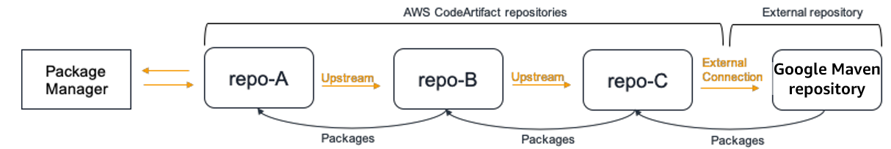

# Requesting

Maven packages from upstreams and external connections

## Importing standard asset names

When importing a Maven package version from a public repository, such as Maven Central, AWS CodeArtifact attempts to import all the assets in that package version. As described in [Requesting a package version with upstream
repositories](repo-upstream-behavior.md "repo-upstream-behavior.md"), importing
occurs when:

- A
  client requests a Maven asset from a CodeArtifact repository.
- The package version is not already present in the repository or its
  upstreams.
- There is a reachable external connection to a public Maven repository.

Even though the client may have only requested one asset, CodeArtifact attempts to import all the
assets it can find for that package version. How CodeArtifact discovers which assets are
available for a Maven package version depends on the particular public repository. Some
public Maven repositories support requesting a list of assets, but others do not. For
repositories that do not provide a way to list assets, CodeArtifact generates a set of asset
names that are likely to exist. For example, when any asset of the Maven package version
`junit 4.13.2` is requested, CodeArtifact will attempt to import the following
assets:

- `junit-4.13.2.pom`
- `junit-4.13.2.jar`
- `junit-4.13.2-javadoc.jar`
- `junit-4.13.2-sources.jar`

## Importing non-standard asset names

When a Maven client requests an asset that doesn’t match one of the patterns described
above, CodeArtifact checks to see if that asset is present in the public repository. If the asset is
present, it will be imported and added to the existing package version record, if one
exists. For example, the Maven package version `com.android.tools.build:aapt2
 7.3.1-8691043` contains the following assets:

- `aapt2-7.3.1-8691043.pom`
- `aapt2-7.3.1-8691043-windows.jar`
- `aapt2-7.3.1-8691043-osx.jar`
- `aapt2-7.3.1-8691043-linux.jar`

When a client requests the POM file, if CodeArtifact is unable to list the package version’s
assets, the POM will be the only asset imported. This is because none of the other
assets match the standard asset name patterns. However, when the client requests one of
the JAR assets, that asset will be imported and added to the existing package version
stored in CodeArtifact. The package versions in both the most-downstream repository (the
repository the client made the request against) and the repository with the external
connection attached will be updated to contain the new asset, as described in [Package retention from upstream repositories](repo-upstream-behavior.md#package-retention-upstream-repos "repo-upstream-behavior.md#package-retention-upstream-repos").

Normally, once a package version is retained in a CodeArtifact repository, it is not affected
by changes in upstream repositories. For more information, see [Package retention from upstream repositories](repo-upstream-behavior.md#package-retention-upstream-repos "repo-upstream-behavior.md#package-retention-upstream-repos"). However, the behavior for Maven
assets with non-standard names described earlier is an exception to this rule. While the
downstream package version won’t change without an additional asset being requested by a
client, in this situation, the retained package version is modified after initially
being retained and so is not immutable. This behavior is necessary because Maven assets
with non-standard names would otherwise not be accessible through CodeArtifact. The behavior
also enables if they are added to a Maven package version on a
public repository after the package version was retained in a CodeArtifact repository.

## Checking asset origins

When adding a new asset to a previously retained Maven package version, CodeArtifact confirms the origin of the retained package version is the same as origin of the new asset. This prevents creating a “mixed” package version where different assets originate from different public repositories. Without this check, asset mixing could occur if a Maven package version is published to more than one public repository and those repositories are part of a CodeArtifact repository’s upstream graph.

## Importing new assets and package version status in upstream repositories

The [package version status](packages-overview.md#package-version-status "packages-overview.md#package-version-status") of package versions in upstream repositories can prevent CodeArtifact from retaining those versions
in downstream repositories.

For example, let's say a domain has three repositories:
`repo-A`, `repo-B`, and `repo-C`, where
`repo-B` is an upsteam of `repo-A` and `repo-C` is
upstream of `repo-B`.

Package
version `7.3.1` of Maven package `com.android.tools.build:aapt2`
is present in `repo-B` and has a status of
`Published`. It is not present in `repo-A`. If
a client requests an asset of this package version from `repo-A`, the
response will be a 200 (OK) and Maven package version `7.3.1` will be
retained in `repo-A`. However, if the status of package version `7.3.1`
in `repo-B` is `Archived` or `Disposed`, the response
will be 404 (Not Found) because the assets of package versions in those two statuses are
not downloadable.

Note that setting the [package origin control](package-origin-controls.md "package-origin-controls.md") to `upstream=BLOCK` for `com.android.tools.build:aapt2` in `repo-A`, `repo-B`, and `repo-C` will prevent new assets from being fetched for all versions of that package from `repo-A`, regardless of the package version status.
