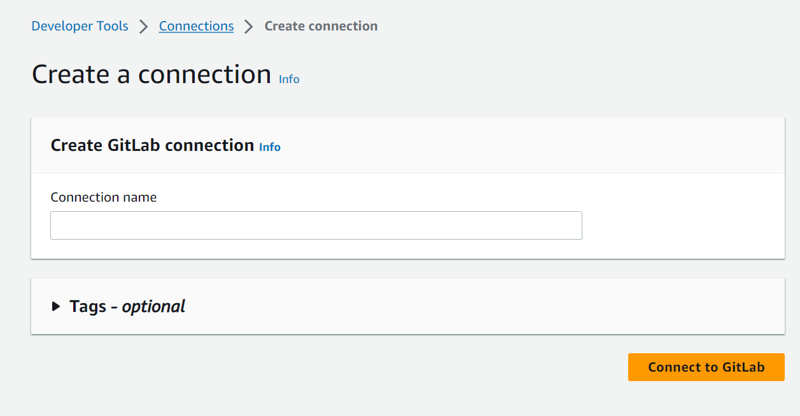
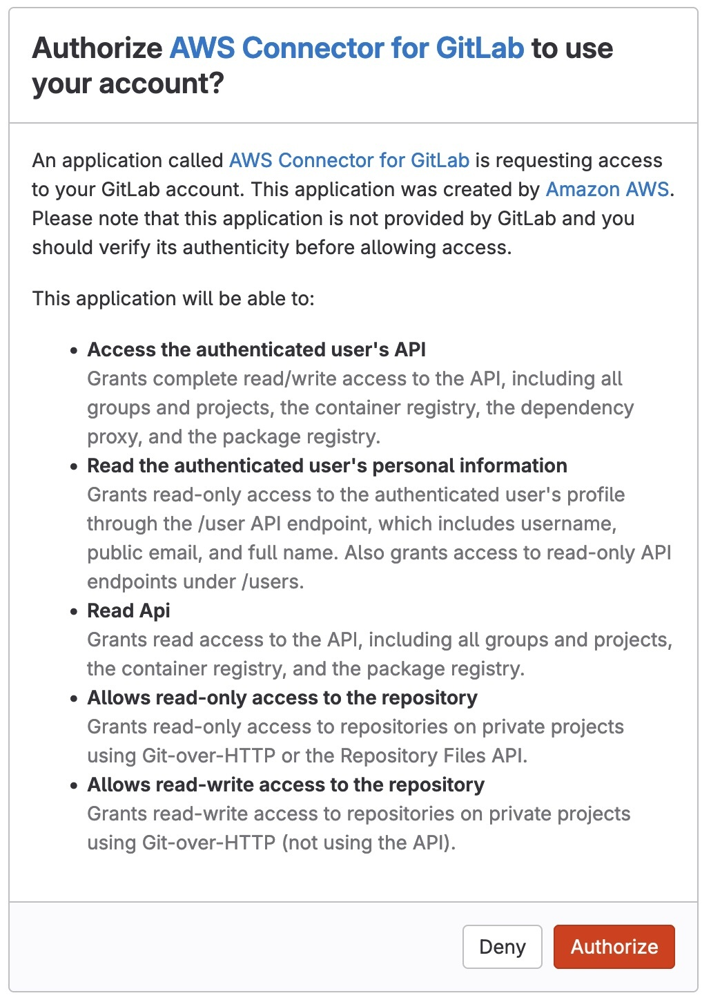

# GitLab access in CodeBuild

For GitLab, you use a GitLab connection to access the source provider.

###### Topics

- [Connect CodeBuild to GitLab](#connections-gitlab "#connections-gitlab")

## Connect CodeBuild to GitLab

Connections allow you to authorize and establish configurations that associate your
third-party provider with your AWS resources using AWS CodeConnections. To associate your
third-party repository as a source for your build project, you use a connection.

To add a GitLab or GitLab Self Managed source provider in CodeBuild, you can choose either to:

- Use the CodeBuild console **Create build project** wizard or
  **Edit Source** page to choose the **GitLab**
  or **GitLab Self Managed** provider option. See [Create a connection to GitLab
  (console)](#connections-gitlab-console "#connections-gitlab-console") to add the source provider. The console helps you create a connections
  resource.
- Use the CLI to create your connections resources, see [Create a connection to GitLab (CLI)](#connections-gitlab-cli "#connections-gitlab-cli") to
  create a connections resource with the CLI.

###### Note

You can also create a connection using the Developer Tools console under
**Settings**. See [Create a
Connection](../../../dtconsole/latest/userguide/connections-create.md "../../../dtconsole/latest/userguide/connections-create.md").

###### Note

By authorizing this connection installation in GitLab, you grant our service
permissions to process your data by accessing your account, and you can revoke the
permissions at any time by uninstalling the application.

### Create a connection to GitLab

This section describes how to connect GitLab to CodeBuild. For more information about
GitLab connections, see [Connect CodeBuild to GitLab](#connections-gitlab "#connections-gitlab").

Before you begin:

- You must have already created an account with GitLab.

###### Note

Connections only provide access to repositories owned by the account that
was used to create and authorize the connection.

###### Note

You can create connections to a repository where you have the **Owner** role in GitLab, and then the connection can
be used with the repository with resources such as CodeBuild. For repositories
in groups, you do not need to be the group owner.

- To specify a source for your build project, you must have already created a
  repository on GitLab.

###### Topics

- [Create a connection to GitLab
  (console)](#connections-gitlab-console "#connections-gitlab-console")
- [Create a connection to GitLab (CLI)](#connections-gitlab-cli "#connections-gitlab-cli")

#### Create a connection to GitLab

(console)

Use these steps to use the CodeBuild console to add a connection for your project
(repository) in GitLab.

###### Note

Instead of creating or using an existing connection in your account, you can use a connection shared from another AWS account.
For more information, see [Share connections with AWS accounts](../../../dtconsole/latest/userguide/connections-share.md "../../../dtconsole/latest/userguide/connections-share.md").

###### To create or edit your build project

1. Sign in to the CodeBuild console.
2. Choose one of the following.
   - Choose to create a build project. Follow the steps in [Create a build project (console)](create-project.md#create-project-console "create-project.md#create-project-console") to complete the first
     screen and in the **Source** section,
     under **Source Provider**, choose
     **GitLab**.
   - Choose to edit an existing build project. Choose
     **Edit**, and then choose
     **Source**. In the **Edit
     Source** page, under **Source
     provider**, choose **GitLab**.

3. Choose one of the following:
   - Under **Connection**, choose **Default
     connection**. Default connection applies a default
     GitLab connection across all projects.
   - Under **Connection**, choose **Custom
     connection**. Custom connection applies a custom GitLab
     connection that overrides your account's default settings.

4. Do one of the following:
   - Under **Default connection** or **Custom
     connection**, if you have not already created a
     connection to your provider, choose **Create a new GitLab
     connection**. Proceed to step 5 to create the
     connection.
   - Under **Connection**, if you have already created
     a connection to your provider, choose the connection. Proceed to
     step 10.

###### Note

If you close the pop-up window before a GitLab connection is created,
you need to refresh the page. 5. To create a connection to a GitLab repository, under **Select a
provider**, choose **GitLab**. In
**Connection name**, enter the name for the connection
that you want to create. Choose **Connect to
GitLab**.

 6. When the sign-in page for GitLab displays, log in with your credentials,
and then choose **Sign in**. 7. If this is your first time authorizing the connection, an authorization
page displays with a message requesting authorization for the connection to
access your GitLab account.

Choose **Authorize**.

 8. The browser returns to the connections console page. Under
**GitLab connection settings**, the new connection is
shown in **Connection name**. 9. Choose **Connect**.

After a GitLab connection is successfully created, a success banner will
be displayed at the top. 10. On the **Create build project** page, in the
**Default connection** or **Custom
connection** drop-down list, make sure your connection ARN is
listed. If not, choose the refresh button to have it appear. 11. In **Repository**, choose the name of your project in
GitLab by specifying the project path with the namespace. For example, for a
group-level repository, enter the repository name in the following format:
`group-name/repository-name`. For more information about the
path and namespace, see the `path_with_namespace` field in [https://docs.gitlab.com/ee/api/projects.html#get-single-project](https://docs.gitlab.com/ee/api/projects.html#get-single-project "https://docs.gitlab.com/ee/api/projects.html#get-single-project").
For more information about the namespace in GitLab, see [https://docs.gitlab.com/ee/user/namespace/](https://docs.gitlab.com/ee/user/namespace/ "https://docs.gitlab.com/ee/user/namespace/").

###### Note

For groups in GitLab, you must manually specify the project path with
the namespace. For example, for a repository named `myrepo`
in a group `mygroup`, enter the following:
`mygroup/myrepo`. You can find the project path with the
namespace in the URL in GitLab. 12. In **Source version - optional**, enter a pull request
ID, branch, commit ID, tag, or reference and a commit ID. For more
information, see [Source version sample with AWS CodeBuild](sample-source-version.md "sample-source-version.md").

###### Note

We recommend that you choose Git branch names that don't look like
commit IDs, such as `811dd1ba1aba14473856cee38308caed7190c0d`
or `5392f7`. This helps you avoid Git checkout collisions
with actual commits. 13. In **Git clone depth - optional**, you can create a
shallow clone with a history truncated to the specified number of commits.
If you want a full clone, choose **Full**. 14. In **Build Status - optional**, select **Report
build statuses to source provider when your builds start and finish** if you want the status of your build's start and completion
reported to your source provider.

To be able to report the build status to the source provider, the user associated with the source provider must
have write access to the repo. If the user does not have write access, the build status cannot be updated. For more information, see
[Source provider access](access-tokens.md "access-tokens.md").

#### Create a connection to GitLab (CLI)

You can use the AWS Command Line Interface (AWS CLI) to create a connection.

To do this, use the **create-connection** command.

###### Important

A connection created through the AWS CLI or AWS CloudFormation is in `PENDING`
status by default. After you create a connection with the CLI or CloudFormation, use the
console to edit the connection to make its status `AVAILABLE`.

###### To create a connection

- Follow the instructions in the _Developer Tools console User
  Guide_ for [Create a connection to GitLab (CLI)](../../../dtconsole/latest/userguide/connections-create-gitlab.md#connections-create-gitlab-cli "../../../dtconsole/latest/userguide/connections-create-gitlab.md#connections-create-gitlab-cli").
