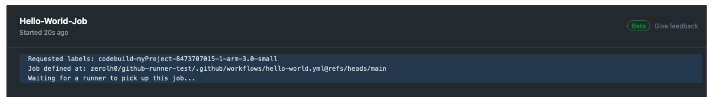
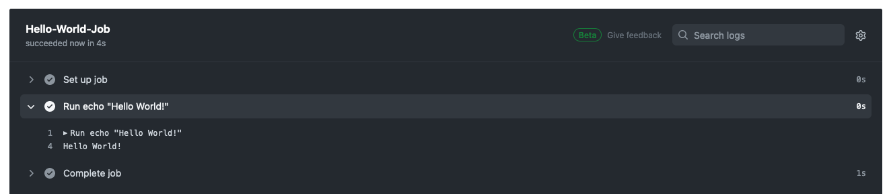

# Tutorial: Configure a CodeBuild-hosted GitHub

Actions runner

This tutorial shows you how to configure your CodeBuild projects to run GitHub Actions jobs.
For more information about using GitHub Actions with CodeBuild see Tutorial: Configure a CodeBuild-hosted GitHub
Actions runner.

To complete this tutorial, you must first:

- Connect with a personal access token, a Secrets Manager secret, OAuth app, or GitHub App. If you'd like to connect with an OAuth app, you must
  use the CodeBuild console to do so. If you'd like to create a personal access token, you can either use the CodeBuild console or use the [ImportSourceCredentials API](../APIReference/API_ImportSourceCredentials.md "../APIReference/API_ImportSourceCredentials.md"). For more instructions, see
  [GitHub and GitHub Enterprise Server access in CodeBuild](access-tokens-github-overview.md "access-tokens-github-overview.md").
- Connect CodeBuild to your GitHub account. To do so, you can do one of the following:
  - You can add GitHub as a source provider in the console. You
    can connect with either a personal access token,
    a Secrets Manager secret, OAuth app, or GitHub App. For
    instructions, see [GitHub and GitHub Enterprise Server access in CodeBuild](access-tokens-github-overview.md "access-tokens-github-overview.md").
  - You can import your GitHub credentials via the [ImportSourceCredentials API](../../../cli/latest/reference/codebuild/import-source-credentials.md "../../../cli/latest/reference/codebuild/import-source-credentials.md"). This can only be done with a
    personal access token. If you connect using an OAuth app, you must
    connect using the console instead. For instructions, see [Connect GitHub with an access token
    (CLI)](access-tokens-github.md#access-tokens-github-cli "access-tokens-github.md#access-tokens-github-cli") .

###### Note

This only needs to be done if you haven't connected to GitHub for your
account.

## Step 1: Create a CodeBuild

project with a webhook

In this step, you will create a CodeBuild project with a webhook and review it in the
GitHub console. You can also choose GitHub Enterprise as your source provider. To learn
more about creating a webhook within GitHub Enterprise, see [GitHub manual webhooks](github-manual-webhook.md "github-manual-webhook.md").

###### To create a CodeBuild project with a webhook

1. Open the AWS CodeBuild console at [https://console.aws.amazon.com/codesuite/codebuild/home](https://console.aws.amazon.com/codesuite/codebuild/home "https://console.aws.amazon.com/codesuite/codebuild/home").
2. Create a build project. For information, see [Create a build project (console)](create-project.md#create-project-console "create-project.md#create-project-console")
   and [Run a build (console)](run-build-console.md "run-build-console.md").
3. In **Project type**, choose **Runner
   project**.

In **Runner**:

    1. For **Runner provider**, choose
     **GitHub**.
    2. For **Runner location**, choose
     **Repository**.
    3. For Repository URL under **Repository**, choose
     **https://github.com/user-name/repository-name**.###### Note

By default, your project will only receive
`WORKFLOW_JOB_QUEUED` events for a single repository. If you
would like to receive events for all repositories within an organization or
enterprise, see [GitHub global and organization
webhooks](github-global-organization-webhook.md "github-global-organization-webhook.md"). 4. _ In **Environment**: + Choose a supported **Environment image** and
**Compute**. Note that you have the option
to override the image and instance settings by using a label in
your GitHub Actions workflow YAML. For more information, see
[Step 2: Update your GitHub
Actions workflow YAML](#sample-github-action-runners-update-yaml "#sample-github-action-runners-update-yaml")
_ In **Buildspec**: + Note that your buildspec will be ignored unless
`buildspec-override:true` is added as a label.
Instead, CodeBuild will override it to use commands that will setup
the self-hosted runner. 5. Continue with the default values and then choose **Create build
project**. 6. Open the GitHub console at
`https://github.com/`user-name`/`repository-name`/settings/hooks`
to verify that a webhook has been created and is enabled to deliver
**Workflow jobs** events.

## Step 2: Update your GitHub

Actions workflow YAML

In this step, you will update your GitHub Actions workflow YAML file in [`GitHub`](https://github.com/ "https://github.com/") to configure your build
environment and use GitHub Actions self-hosted runners in CodeBuild. For more information,
see [Using labels with self-hosted runners](https://docs.github.com/en/actions/hosting-your-own-runners/managing-self-hosted-runners/using-labels-with-self-hosted-runners "https://docs.github.com/en/actions/hosting-your-own-runners/managing-self-hosted-runners/using-labels-with-self-hosted-runners") and [Label overrides
supported with the CodeBuild-hosted GitHub Actions runner](sample-github-action-runners-update-labels.md "sample-github-action-runners-update-labels.md").

### Update your GitHub

Actions workflow YAML

Navigate to [`GitHub`](https://github.com/ "https://github.com/") and
update the [`runs-on`](https://docs.github.com/en/actions/hosting-your-own-runners/managing-self-hosted-runners/using-labels-with-self-hosted-runners "https://docs.github.com/en/actions/hosting-your-own-runners/managing-self-hosted-runners/using-labels-with-self-hosted-runners") setting in your GitHub Actions workflow YAML
to configure your build environment. To do so, you can do one of the
following:

- You can specify the project name and run ID, in which case the build will
  use your existing project configuration for the compute, image, image
  version, and instance size. The project name is needed to link the
  AWS-related settings of your GitHub Actions job to a specific CodeBuild
  project. By including the project name in the YAML, CodeBuild is allowed to
  invoke jobs with the correct project settings. By providing the run ID,
  CodeBuild will map your build to specific workflow runs and stop the build when
  the workflow run is cancelled. For more information, see [`github` context](https://docs.github.com/en/actions/learn-github-actions/contexts#github-context "https://docs.github.com/en/actions/learn-github-actions/contexts#github-context").

```
runs-on: codebuild-`<project-name>`-${{ github.run_id }}-${{ github.run_attempt }}
```

###### Note

Make sure that your `<project-name>`
matches the name of the project that you created in the previous step.
If it doesn't match, CodeBuild will not process the webhook and the GitHub
Actions workflow might hang.

The following is an example of a GitHub Actions workflow YAML:

```
name: Hello World
on: [push]
jobs:
  Hello-World-Job:
    runs-on:
      - codebuild-myProject-${{ github.run_id }}-${{ github.run_attempt }}
    steps:
      - run: echo "Hello World!"
```

- You can also override your image and compute type in the label. See [Compute images
  supported with the CodeBuild-hosted GitHub Actions runner](sample-github-action-runners-update-yaml.md "sample-github-action-runners-update-yaml.md")
  for a list of curated images. For using custom images, see [Label overrides
  supported with the CodeBuild-hosted GitHub Actions runner](sample-github-action-runners-update-labels.md "sample-github-action-runners-update-labels.md").
  The compute type and image in the label will override
  the environment settings on your project. To override your
  environment settings for an CodeBuild EC2 or Lambda compute build, use the following
  syntax:

```
runs-on:
  - codebuild-`<project-name>`-${{ github.run_id }}-${{ github.run_attempt }}
    image:`<environment-type>`-`<image-identifier>`
    instance-size:`<instance-size>`
```

The following is an example of a GitHub Actions workflow YAML:

```
name: Hello World
on: [push]
jobs:
  Hello-World-Job:
    runs-on:
      - codebuild-myProject-${{ github.run_id }}-${{ github.run_attempt }}
        image:arm-3.0
        instance-size:small
    steps:
      - run: echo "Hello World!"
```

- You can override the fleet used for your build in the label. This will
  override the fleet settings configured on your project to use the specified
  fleet. For more information, see [Run builds on reserved capacity fleets](fleets.md "fleets.md"). To override your fleet settings for an Amazon EC2
  compute build, use the following syntax:

```
runs-on:
  - codebuild-`<project-name>`-${{ github.run_id }}-${{ github.run_attempt }}
    fleet:`<fleet-name>`
```

To override both the fleet and the image used for the build, use the
following syntax:

```
runs-on:
  - codebuild-`<project-name>`-${{ github.run_id }}-${{ github.run_attempt }}
    fleet:`<fleet-name>`
    image:`<environment-type>`-`<image-identifier>`
```

The following is an example of a GitHub Actions workflow YAML:

```
name: Hello World
on: [push]
jobs:
  Hello-World-Job:
    runs-on:
      - codebuild-myProject-${{ github.run_id }}-${{ github.run_attempt }}
        fleet:myFleet
        image:arm-3.0
    steps:
      - run: echo "Hello World!"
```

- In order to run your GitHub Actions jobs on a custom image, you can configure a
  custom image in your CodeBuild project and avoid providing an image override label. CodeBuild
  will use the image configured in the project if no image override label is provided.
- Optionally, you can provide labels outside of those that CodeBuild supports. These labels will be ignored for the purpose of
  overriding attributes of the build, but will not fail the webhook request. For example, adding `testLabel` as a
  label will not prevent the build from running.

###### Note

If a dependency provided by GitHub-hosted runners is unavailable in the CodeBuild
environment, you can install the dependency using GitHub Actions in your
workflow run. For example, you can use the [`setup-python`](https://github.com/actions/setup-python "https://github.com/actions/setup-python") action to install Python for your build
environment.

### Run buildspec commands the INSTALL, PRE_BUILD, and POST_BUILD phases

By default, CodeBuild ignores any buildspec commands when running a self-hosted GitHub Actions build. To run buildspec
commands during the build, `buildspec-override:true` can be added as a suffix to the label:

```
runs-on:
  - codebuild-`<project-name>`-${{ github.run_id }}-${{ github.run_attempt }}
    buildspec-override:true
```

By using this command, CodeBuild will create a folder called `actions-runner` in the container's primary source folder. When
the GitHub Actions runner starts during the `BUILD` phase, the runner will run in the `actions-runner` directory.

There are several limitations when using a buildspec override in a self-hosted GitHub Actions build:

- CodeBuild will not run buildspec commands during the `BUILD` phase, as the self-hosted runner runs in the `BUILD` phase.
- CodeBuild will not download any primary or secondary sources during the `DOWNLOAD_SOURCE` phase. If you have a buildspec file configured,
  only that file will be downloaded from the project's primary source.
- If a build command fails in the `PRE_BUILD` or `INSTALL` phase, CodeBuild will not start the
  self-hosted runner and the GitHub Actions workflow job will need to be cancelled manually.
- CodeBuild fetches the runner token during the `DOWNLOAD_SOURCE` phase, which has an expiration time of one hour.
  If your `PRE_BUILD` or `INSTALL` phases exceed an hour, the runner token may expire before the GitHub self-hosted runner starts.

## Step 3: Review your

results

Whenever a GitHub Actions workflow run occurs, CodeBuild would receive the workflow job
events through the webhook. For each job in the workflow, CodeBuild starts a build to run an
ephemeral GitHub Actions runner. The runner is responsible for executing a single
workflow job. Once the job is completed, the runner and the associated build process
will be immediately terminated.

To view your workflow job logs, navigate to your repository in GitHub, choose
**Actions**, choose your desired workflow, and then choose the
specific **Job** that you'd like to review the logs for.

You can review the requested labels in the log while the job is waiting to be picked
up by a self-hosted runner in CodeBuild.



Once the job is completed, you will be able to view the log of the job.



## GitHub Actions runner configuration options

You can specify the following environment variables in your project configuration
to modify the setup configuration of your self-hosted runners.

`CODEBUILD_CONFIG_GITHUB_ACTIONS_ORG_REGISTRATION_NAME`

CodeBuild will register self-hosted runners to the organization name specified as
the value of this environment variable. For more information about registering runners
at the organization level and the necessary permissions, see
[Create configuration for a just-in-time runner for an organization](https://docs.github.com/en/rest/actions/self-hosted-runners?apiVersion=2022-11-28#create-configuration-for-a-just-in-time-runner-for-an-organization "https://docs.github.com/en/rest/actions/self-hosted-runners?apiVersion=2022-11-28#create-configuration-for-a-just-in-time-runner-for-an-organization").

`CODEBUILD_CONFIG_GITHUB_ACTIONS_ENTERPRISE_REGISTRATION_NAME`

CodeBuild will register self-hosted runners to the enterprise name specified as
the value of this environment variable. For more information about registering runners
at the enterprise level and the necessary permissions, see
[Create configuration for a just-in-time runner for an Enterprise](https://docs.github.com/en/enterprise-server/rest/actions/self-hosted-runners?apiVersion=2022-11-28#create-configuration-for-a-just-in-time-runner-for-an-enterprise "https://docs.github.com/en/enterprise-server/rest/actions/self-hosted-runners?apiVersion=2022-11-28#create-configuration-for-a-just-in-time-runner-for-an-enterprise").

###### Note

Enterprise runners are not available to organization repositories by default. For
self-hosted runners to pick up workflow jobs, you might need to configure your runner
group access settings. For more information, see
[Making enterprise runners available to repositories](https://docs.github.com/en/enterprise-server/actions/hosting-your-own-runners/managing-self-hosted-runners/adding-self-hosted-runners#making-enterprise-runners-available-to-repositories "https://docs.github.com/en/enterprise-server/actions/hosting-your-own-runners/managing-self-hosted-runners/adding-self-hosted-runners#making-enterprise-runners-available-to-repositories").

`CODEBUILD_CONFIG_GITHUB_ACTIONS_RUNNER_GROUP_ID`

CodeBuild will register self-hosted runners to the integer runner group ID
stored as the value of this environment variable. By default, this value is

1.  For more information about self-hosted runner groups, see [Managing access to self-hosted runners using groups](https://docs.github.com/en/rest/actions/self-hosted-runners?apiVersion=2022-11-28#create-configuration-for-a-just-in-time-runner-for-an-organization "https://docs.github.com/en/rest/actions/self-hosted-runners?apiVersion=2022-11-28#create-configuration-for-a-just-in-time-runner-for-an-organization").

`CODEBUILD_CONFIG_GITHUB_ACTIONS_ORG_REGISTRATION_NAME`
To configure organization level runner registration using your GitHub
Actions workflow YAML file, you can use the following syntax:

```
name: Hello World
on: [push]
jobs:
  Hello-World-Job:
    runs-on:
      - codebuild-myProject-${{ github.run_id }}-${{ github.run_attempt }}
        organization-registration-name:myOrganization
    steps:
      - run: echo "Hello World!"
```

`CODEBUILD_CONFIG_GITHUB_ACTIONS_ENTERPRISE_REGISTRATION_NAME`
To configure enterprise level runner registration using your GitHub
Actions workflow YAML file, you can use the following syntax:

```
name: Hello World
on: [push]
jobs:
  Hello-World-Job:
    runs-on:
      - codebuild-myProject-${{ github.run_id }}-${{ github.run_attempt }}
        enterprise-registration-name:myEnterprise
    steps:
      - run: echo "Hello World!"
```

`CODEBUILD_CONFIG_GITHUB_ACTIONS_RUNNER_GROUP_ID`
To configure registering runners to a specific runner group ID using your
GitHub Actions workflow YAML file, you can use the following syntax:

```
name: Hello World
on: [push]
jobs:
  Hello-World-Job:
    runs-on:
      - codebuild-myProject-${{ github.run_id }}-${{ github.run_attempt }}
        registration-group-id:3
    steps:
      - run: echo "Hello World!"
```

## Filter GitHub Actions webhook events (AWS CloudFormation)

The following YAML-formatted portion of an AWS CloudFormation
template creates a filter group that triggers a build when it evaluates to true.
The following filter group specifies a GitHub Actions workflow job request with a
workflow name matching the regular expression `\[CI-CodeBuild\]`.

```
CodeBuildProject:
  Type: AWS::CodeBuild::Project
  Properties:
    Name: MyProject
    ServiceRole: service-role
    Artifacts:
      Type: NO_ARTIFACTS
    Environment:
      Type: LINUX_CONTAINER
      ComputeType: BUILD_GENERAL1_SMALL
      Image: aws/codebuild/standard:5.0
    Source:
      Type: GITHUB
      Location: CODEBUILD_DEFAULT_WEBHOOK_SOURCE_LOCATION
    Triggers:
      Webhook: true
      ScopeConfiguration:
        Name: organization-name
        Scope: GITHUB_ORGANIZATION
      FilterGroups:
        - - Type: EVENT
            Pattern: WORKFLOW_JOB_QUEUED
          - Type: WORKFLOW_NAME
            Pattern: \[CI-CodeBuild\]
```

## Filter GitHub Actions webhook events (AWS CDK)

The following AWS CDK template creates a filter group that triggers a build when it evaluates to true.
The following filter group specifies a GitHub Actions workflow job request.

```
import { aws_codebuild as codebuild } from 'aws-cdk-lib';
import {EventAction, FilterGroup} from "aws-cdk-lib/aws-codebuild";

const source = codebuild.Source.gitHub({
      owner: 'owner',
      repo: 'repo',
      webhook: true,
      webhookFilters: [FilterGroup.inEventOf(EventAction.WORKFLOW_JOB_QUEUED)],
    })
```

## Filter GitHub Actions webhook events (Terraform)

The following Terraform template creates a filter group that triggers a build when it evaluates to true.
The following filter group specifies a GitHub Actions workflow job request.

```
resource "aws_codebuild_webhook" "example" {
  project_name = aws_codebuild_project.example.name
  build_type   = "BUILD"
  filter_group {
    filter {
      type    = "EVENT"
      pattern = "WORKFLOW_JOB_QUEUED"
    }
  }
}
```

## Filter GitHub Actions

webhook events (AWS CLI)

The following AWS CLI commands create a self-hosted GitHub Actions runner project with a
GitHub Actions workflow job request filter group that triggers a build when it evaluates
to true.

```
aws codebuild create-project \
--name <project name> \
--source "{\"type\":\"GITHUB\",\"location\":\"<repository location>\",\"buildspec\":\"\"}" \
--artifacts {"\"type\":\"NO_ARTIFACTS\""} \
--environment "{\"type\": \"LINUX_CONTAINER\",\"image\": \"aws/codebuild/amazonlinux-x86_64-standard:5.0\",\"computeType\": \"BUILD_GENERAL1_MEDIUM\"}" \
--service-role "<service role ARN>"
```

```
aws codebuild create-webhook \
--project-name <project name> \
--filter-groups "[[{\"type\":\"EVENT\",\"pattern\":\"WORKFLOW_JOB_QUEUED\"}]]"
```
