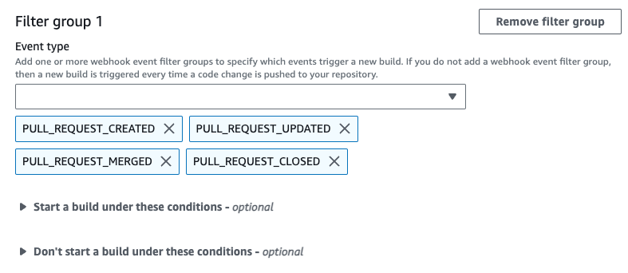
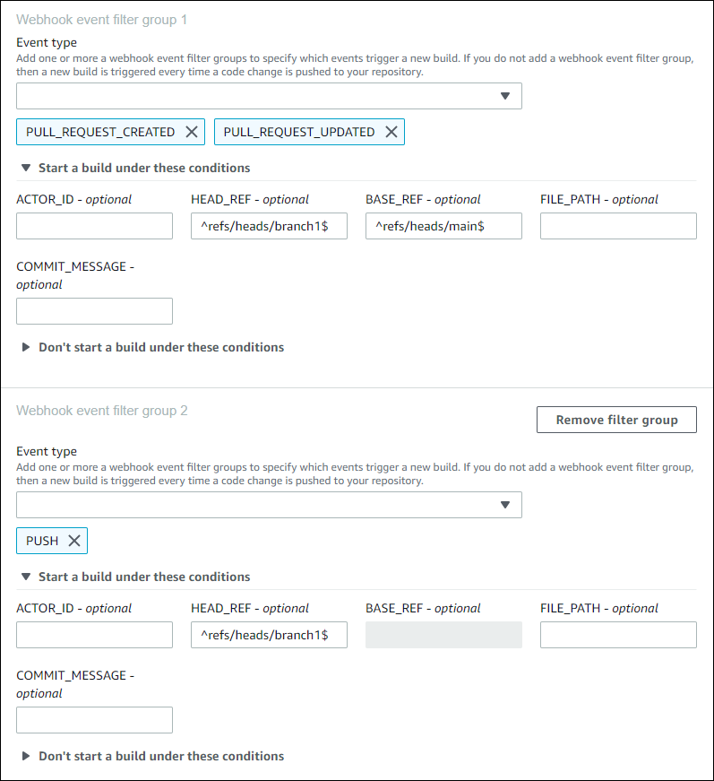
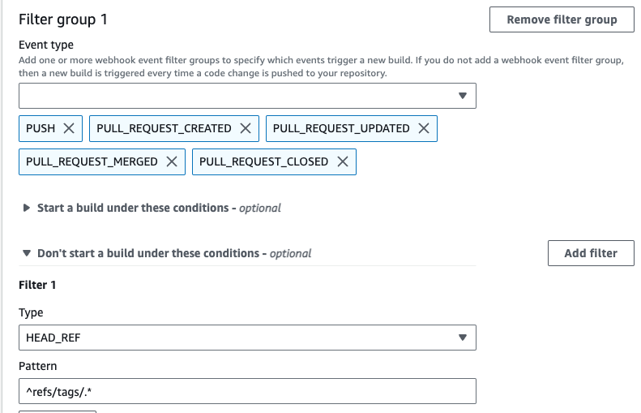
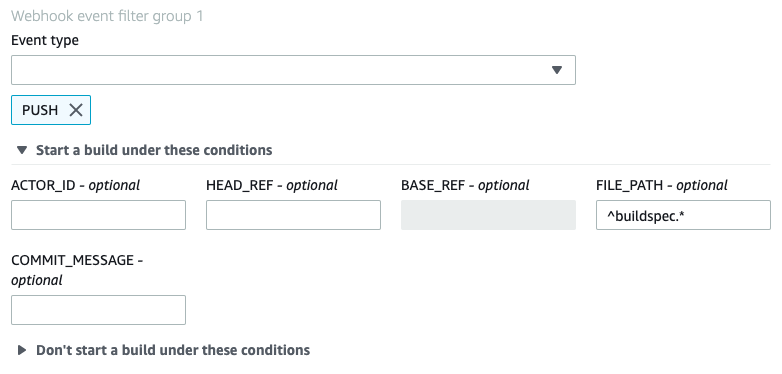
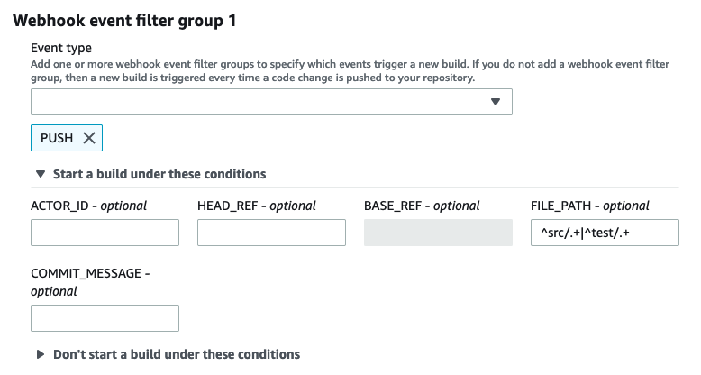
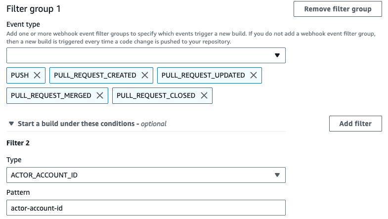

# Filter Bitbucket webhook events

(console)

To use the AWS Management Console to filter webhook events:

1. Select **Rebuild every time a code change is pushed to this
   repository** when you create your project.
2. From **Event type**, choose one or more events.
3. To filter when an event triggers a build, under **Start a build under
   these conditions**, add one or more optional filters.
4. To filter when an event is not triggered, under **Don't start a build
   under these conditions**, add one or more optional filters.
5. Choose **Add filter group** to add another filter group.
   For more information, see [Create a build project (console)](create-project.md#create-project-console "create-project.md#create-project-console") and [WebhookFilter](../APIReference/API_WebhookFilter.md "../APIReference/API_WebhookFilter.md") in the _AWS CodeBuild API Reference_.

In this example, a webhook filter group triggers a build for pull requests
only:

Using an example of two filter groups, a build is triggered when one or both evaluate
to true:

- The first filter group specifies pull requests that are created or updated on
  branches with Git reference names that match the regular expression
  `^refs/heads/main$` and head references that match
  `^refs/heads/branch1!`.
- The second filter group specifies push requests on branches with Git reference
  names that match the regular expression `^refs/heads/branch1$`.

In this example, a webhook filter group triggers a build for all requests except tag
events.

In this example, a webhook filter group triggers a build only when files with names
that match the regular expression `^buildspec.*` change.

In this example, a webhook filter group triggers a build only when files are changed in
`src` or `test` folders.

In this example, a webhook filter group triggers a build only when a change is made by
a Bitbucket user who does not have an account ID that matches the regular expression
`actor-account-id`.

###### Note

For information about how to find your Bitbucket account ID, see
https://api.bitbucket.org/2.0/users/`user-name`, where
`user-name` is your Bitbucket user name.

In this example, a webhook filter group triggers a build for a push event when the
head commit message matches the regular expression `\[CodeBuild\]`.

