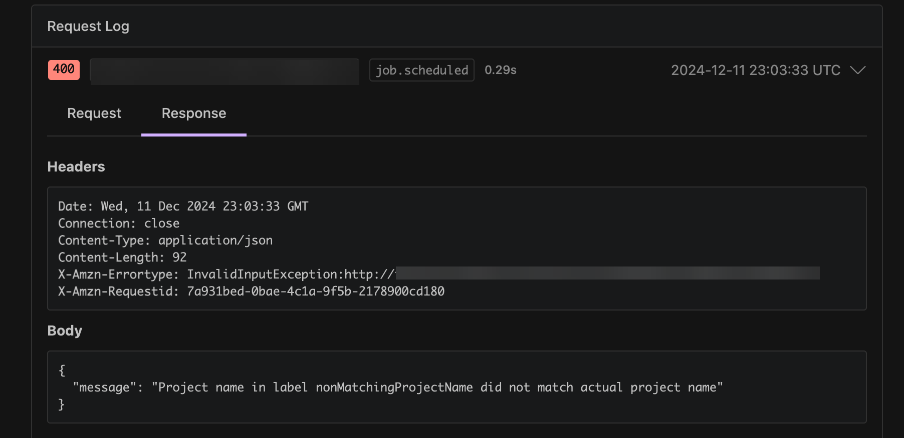

# Troubleshoot the webhook for

failed builds or a hanging job

**Issue:**

The webhook you set up in [Tutorial: Configure a CodeBuild-hosted Buildkite
runner](sample-runner-buildkite.md "sample-runner-buildkite.md") isn't working or your workflow job is
hanging in Buildkite.

**Possible causes:**

- Your webhook **job.scheduled** event might be failing to
  trigger a build. Review the **Response** logs to view the
  response or error message.
- Your CodeBuild build fails before starting the Buildkite self-hosted runner agent
  to handle your job.

**Recommended solutions:**

To debug failed Buildkite webhook events:

1. In your Buildkite organization settings, navigate to **Notification
   Services**, select your CodeBuild webhook, and then find the
   **Request Log**.
2. Find the `job.scheduled` webhook event associated with your stuck
   Buildkite job. You can use the job ID field within the webhook payload to
   correlate the webhook event to your Buildkite job.
3. Select the **Response** tab and check the response body.
   Verify that the **Response** status code is `200`
   and the **Response** body doesn’t contain any unexpected
   messages.

