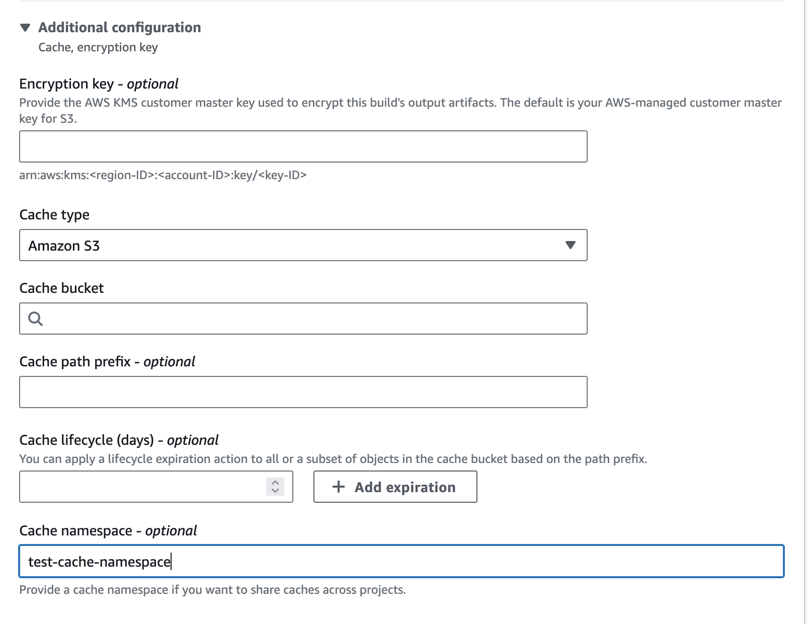

# Amazon S3 caching

Amazon S3 caching stores the cache in an Amazon S3 bucket that is available across multiple
build hosts. This is a good option for small to intermediate sized build artifacts
that are more expensive to build than to download.

To use Amazon S3 in a build, you can specify the paths for the files you want to cache
in `buildspec.yml`. CodeBuild will automatically store and update the cache to
the Amazon S3 location configured on the project. If you don't specify the file paths,
CodeBuild will best-effort cache common language dependencies to help you speed up the builds.
You can view the cache details in the build logs.

Additionally, if you want to have multiple versions of cache, you can define a cache key
in the `buildspec.yml`. CodeBuild stores the cache under the context of this cache key,
and create a unique cache copy that will not be updated once created. The cache keys can be
shared across projects as well. Features such as dynamic keys, cache versioning, and cache sharing
across builds are only available when a key is specified.

To learn more about the cache syntax in buildspec file, see [cache](build-spec-ref.md#build-spec.cache "build-spec-ref.md#build-spec.cache") in the buildspec reference.

###### Topics

- [Generate dynamic keys](#caching-s3-dynamic "#caching-s3-dynamic")
- [codebuild-hash-files](#caching-s3-dynamic.codebuild-hash-files "#caching-s3-dynamic.codebuild-hash-files")
- [Cache version](#caching-s3-version "#caching-s3-version")
- [Cache sharing between projects](#caching-s3-sharing "#caching-s3-sharing")
- [Buildspec examples](#caching-s3-examples "#caching-s3-examples")

## Generate dynamic keys

A cache key can include shell commands and environment variables to make it unique,
enabling automatic cache updates when key changes. For example, you can define a key
using the hash of the `package-lock.json` file. When the dependencies in that file
change, the hash—and therefore the cache key—changes, triggering the automatic creation
of a new cache.

```
cache:
    key: npm-key-$(codebuild-hash-files package-lock.json)
```

CodeBuild will evaluate the expression `$(codebuild-hash-files package-lock.json)`
to get the final key:

```
npm-key-abc123
```

You can also define a cache key using environment variables, such as `CODEBUILD_RESOLVED_SOURCE_VERSION`.
This ensures that whenever your source changes, a new key is generated,
resulting in a new cache being saved automatically:

```
cache:
   key: npm-key-$CODEBUILD_RESOLVED_SOURCE_VERSION
```

CodeBuild will evaluate the expression and get the final key:

```
npm-key-046e8b67481d53bdc86c3f6affdd5d1afae6d369
```

## codebuild-hash-files

`codebuild-hash-files` is a CLI tool that calculates a SHA-256 hash for a set of
files in the CodeBuild source directory using glob patterns:

```
codebuild-hash-files `<glob-pattern-1>` `<glob-pattern-2>` ...
```

Here are some examples using `codebuild-hash-files`:

```
codebuild-hash-files package-lock.json
codebuild-hash-files '**/*.md'
```

## Cache version

The cache version is a hash generated from the paths of the directories being cached. If two
caches have different versions, they are treated as distinct caches during the matching process.
For example, the following two caches are considered different because they reference different paths:

```
version: 0.2

phases:
  build:
    commands:
      - pip install pandas==2.2.3 --target pip-dependencies
cache:
  key: pip-dependencies
  paths:
    - "pip-dependencies/**/*"
```

```
version: 0.2

phases:
  build:
    commands:
      - pip install pandas==2.2.3 --target tmp/pip-dependencies
cache:
  key: pip-dependencies
  paths:
    - "tmp/pip-dependencies/**/*"
```

## Cache sharing between projects

You can use the `cacheNamespace` API field under the `cache` section
to share a cache across multiple projects. This field defines the scope of the cache. To share a cache,
must do the following:

- Use the same `cacheNamespace`.
- Specify the same cache `key`.
- Define identical cache paths.
- Use the same Amazon S3 buckets and `pathPrefix` if set.

This ensures consistency and enables cache sharing across projects.

### Specify a cache namespace (console)

1. Open the AWS CodeBuild console at [https://console.aws.amazon.com/codesuite/codebuild/home](https://console.aws.amazon.com/codesuite/codebuild/home "https://console.aws.amazon.com/codesuite/codebuild/home").
2. Choose **Create project**. For information, see [Create a build project (console)](create-project.md#create-project-console "create-project.md#create-project-console")
   and [Run a build (console)](run-build-console.md "run-build-console.md").
3. In **Artifacts**, choose **Additional configuration**.
4. For **Cache type**, choose **Amazon S3**.
5. For **Cache namespace - optional**, enter a namespace value.

 6. Continue with the default values and then choose **Create build project**.

### Specify a cache namespace (AWS CLI)

You can use the the `--cache` parameter in the AWS CLI to specify a cache namespace.

```
--cache '{"type": "S3", "location": "`your-s3-bucket`", "cacheNamespace": "`test-cache-namespace`"}'
```

## Buildspec examples

Here are several buildspec examples for common languages:

###### Topics

- [Cache Node.js dependencies](#caching-s3-examples.nodejs "#caching-s3-examples.nodejs")
- [Cache Python dependencies](#caching-s3-examples.python "#caching-s3-examples.python")
- [Cache Ruby dependencies](#caching-s3-examples.ruby "#caching-s3-examples.ruby")
- [Cache Go dependencies](#caching-s3-examples.go "#caching-s3-examples.go")

### Cache Node.js dependencies

If your project includes a `package-lock.json` file and uses `npm`
to manage Node.js dependencies, the following example shows how to set up caching. By default,
`npm` installs dependencies into the `node_modules` directory.

```
version: 0.2

phases:
  build:
    commands:
      - npm install
cache:
  key: npm-$(codebuild-hash-files package-lock.json)
  paths:
    - "node_modules/**/*"
```

### Cache Python dependencies

If your project includes a `requirements.txt` file and uses pip
to manage Python dependencies, the following example demonstrates how to configure caching.
By default, pip installs packages into the system's `site-packages` directory.

```
version: 0.2

phases:
  build:
    commands:
      - pip install -r requirements.txt
cache:
  key: python-$(codebuild-hash-files requirements.txt)
  paths:
    - "/root/.pyenv/versions/${python_version}/lib/python${python_major_version}/site-packages/**/*"
```

Additionally, you can install dependencies into a specific directory and configure
caching for that directory.

```
version: 0.2

phases:
  build:
    commands:
      - pip install -r requirements.txt --target python-dependencies
cache:
  key: python-$(codebuild-hash-files requirements.txt)
  paths:
    - "python-dependencies/**/*"
```

### Cache Ruby dependencies

If your project includes a `Gemfile.lock` file and uses `Bundler`
to manage gem dependencies, the following example demonstrates how to configure caching effectively.

```
version: 0.2

phases:
  build:
    commands:
      - bundle install --path vendor/bundle
cache:
  key: ruby-$(codebuild-hash-files Gemfile.lock)
  paths:
    - "vendor/bundle/**/*"
```

### Cache Go dependencies

If your project includes a `go.sum` file and uses Go modules to manage dependencies,
the following example demonstrates how to configure caching. By default, Go modules are downloaded
and stored in the `${GOPATH}/pkg/mod` directory.

```
version: 0.2

phases:
  build:
    commands:
      - go mod download
cache:
  key: go-$(codebuild-hash-files go.sum)
  paths:
    - "/go/pkg/mod/**/*"
```
