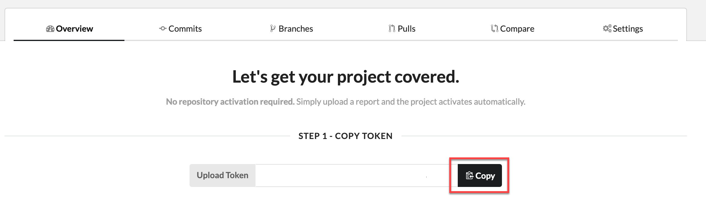
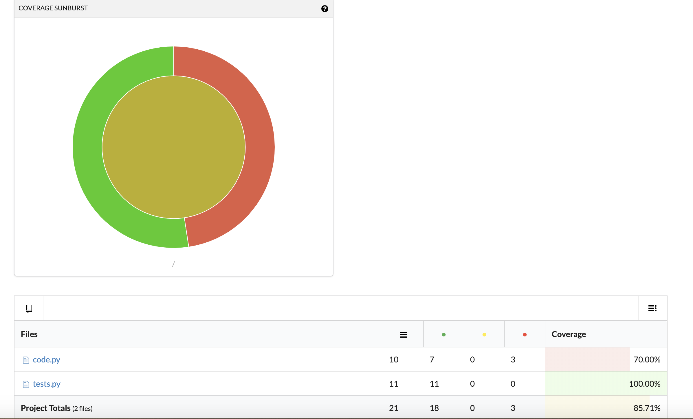

# Use AWS CodeBuild with Codecov

Codecov is a tool that measures the test coverage of your code. Codecov identifies which
methods and statements in your code are not tested. Use the results to determine where to
write tests to improve the quality of your code. Codecov is available for three of the
source repositories supported by CodeBuild: GitHub, GitHub Enterprise Server, and Bitbucket. If your
build project uses GitHub Enterprise Server, you must use Codecov Enterprise.

When you run a build of a CodeBuild project that is integrated with Codecov, Codecov reports that
analyzes code in your repository are uploaded to Codecov. The build logs include a link to
the reports. This sample shows you how to integrate a Python and a Java build project with
Codecov. For a list of languages supported by Codecov, see [Codecov supported
languages](https://docs.codecov.io/docs/supported-languages "https://docs.codecov.io/docs/supported-languages") on the Codecov website.

## Integrate Codecov into a build project

Use the following procedure to integration Codecov into a build project.

###### To integrate Codecov with your build project

1. Go to [https://codecov.io/signup](https://codecov.io/signup "https://codecov.io/signup")
   and sign up for a GitHub or Bitbucket source repository. If you use GitHub
   Enterprise, see [Codecov
   Enterprise](https://codecov.io/enterprise "https://codecov.io/enterprise") on the Codecov website.
2. In Codecov, add the repository for which you want coverage.
3. When token information is displayed, choose **Copy**.

 4. Add the copied token as an environment variable named
`CODECOV_TOKEN` to your build project. For more information, see
[Change a build project's settings
(console)](change-project.md#change-project-console "change-project.md#change-project-console"). 5. Create a text file named `my_script.sh` in your repository. Enter the following into the file:

```
#/bin/bash
bash <(curl -s https://codecov.io/bash) -t $CODECOV_TOKEN
```

6. Choose the **Python** or **Java** tab, as
   appropriate for your build project uses, and follow these steps.

Java

    1. Add the following JaCoCo plugin to
     `pom.xml` in your repository.


    ```
    <build>
      <plugins>
        <plugin>
          <groupId>org.jacoco</groupId>
          <artifactId>jacoco-maven-plugin</artifactId>
          <version>0.8.2</version>
          <executions>
              <execution>
                  <goals>
                      <goal>prepare-agent</goal>
                  </goals>
              </execution>
              <execution>
                  <id>report</id>
                  <phase>test</phase>
                  <goals>
                      <goal>report</goal>
                  </goals>
              </execution>
          </executions>
        </plugin>
      </plugins>
    </build>
    ```
    2. Enter the following commands in your buildspec file. For
     more information, see [Buildspec syntax](build-spec-ref.md#build-spec-ref-syntax "build-spec-ref.md#build-spec-ref-syntax").


    ```
    build:
      - mvn test -f pom.xml -fn
    postbuild:
      - echo 'Connect to CodeCov'
      - bash my_script.sh
    ```

Python
Enter the following commands in your buildspec file. For more
information, see [Buildspec syntax](build-spec-ref.md#build-spec-ref-syntax "build-spec-ref.md#build-spec-ref-syntax").

```
build:
  - pip install coverage
  - coverage run -m unittest discover
postbuild:
  - echo 'Connect to CodeCov'
  - bash my_script.sh
```

7. Run a build of your build project. A link to Codecov reports generated for
   your project appears in your build logs. Use the link to view the Codecov
   reports. For more information, see [Run AWS CodeBuild builds manually](run-build.md "run-build.md") and [Log AWS CodeBuild API calls with AWS CloudTrail](cloudtrail.md "cloudtrail.md"). Codecov information in the build logs looks
   like the following:

````
[Container] 2020/03/09 16:31:04 Running command bash my_script.sh

  _____          _
 / ____|        | |
| |     ___   __| | ___  ___ _____   __
| |    / _ \ / _` |/ _ \/ __/ _ \ \ / /
| |___| (_) | (_| |  __/ (_| (_) \ V / \_____\___/ \__,_|\___|\___\___/ \_/ Bash-20200303-bc4d7e6 ·[0;90m==>·[0m AWS CodeBuild detected. `... The full list of Codecov log entries has been omitted for brevity ...` · ·[0;32m->·[0m View reports at ·[0;36m`https://codecov.io/github/user/test_py/commit/commit-id`·[0m [Container] 2020/03/09 16:31:07 Phase complete: POST_BUILD State: SUCCEEDED ``` The reports look like the following: 
````
