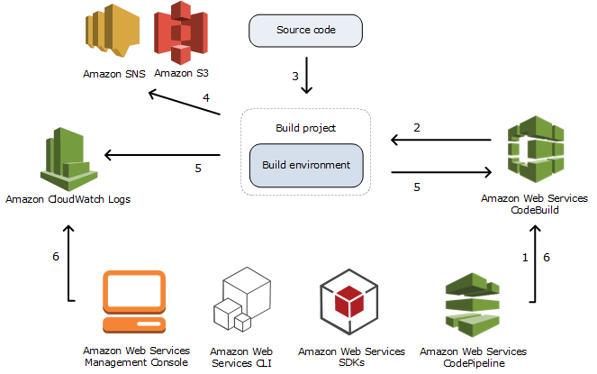

# AWS CodeBuild concepts

The following concepts are important for understanding how CodeBuild works.

###### Topics

- [How CodeBuild works](#concepts-how-it-works "#concepts-how-it-works")
- [Next steps](#concepts-next-steps "#concepts-next-steps")

## How CodeBuild works

The following diagram shows what happens when you run a build with CodeBuild:

1. As input, you must provide CodeBuild with a build project.
   A _build project_ includes information about how to run a build, including where to get the source code, which build environment to use, which build commands to run, and where to store the build output. A _build environment_ represents a combination of operating system, programming language runtime, and tools that CodeBuild uses to run a build. For more information, see:
   - [Create a build project](create-project.md "create-project.md")
   - [Build environment reference](build-env-ref.md "build-env-ref.md")

2. CodeBuild uses the build project to create the build environment.
3. CodeBuild downloads the source code into the build environment and then uses the
   build specification (buildspec), as defined in the build project or included
   directly in the source code. A _buildspec_ is a collection of build commands and related settings, in YAML format, that CodeBuild uses to run a build. For more information, see the
   [Buildspec reference](build-spec-ref.md "build-spec-ref.md").
4. If there is any build output, the build environment uploads its output to an
   S3 bucket. The build environment can also perform tasks that you specify in
   the buildspec (for example, sending build notifications to an Amazon SNS topic). For
   an example, see [Build notifications
   sample](sample-build-notifications.md "sample-build-notifications.md").
5. While the build is running, the build environment sends information to CodeBuild
   and Amazon CloudWatch Logs.
6. While the build is running, you can use the AWS CodeBuild console, AWS CLI, or AWS
   SDKs to get summarized build information from CodeBuild and detailed build
   information from Amazon CloudWatch Logs. If you use AWS CodePipeline to run builds, you can get
   limited build information from CodePipeline.

## Next steps

Now that you know more about AWS CodeBuild, we recommend these next steps:

1. **Experiment** with CodeBuild in an example scenario by following the instructions in [Getting started using the
   console](getting-started-overview.md#getting-started "getting-started-overview.md#getting-started").
2. **Use** CodeBuild in your own scenarios by following
   the instructions in [Plan a build](planning.md "planning.md").
