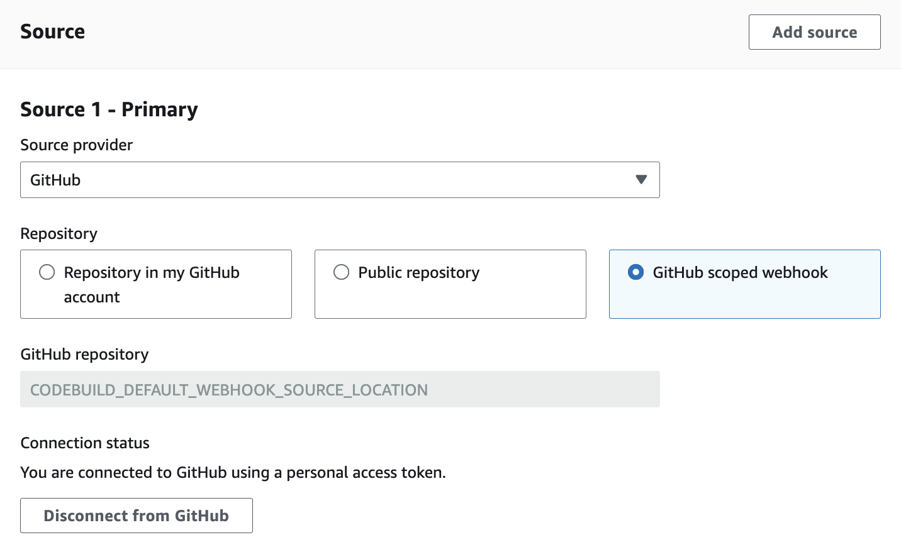
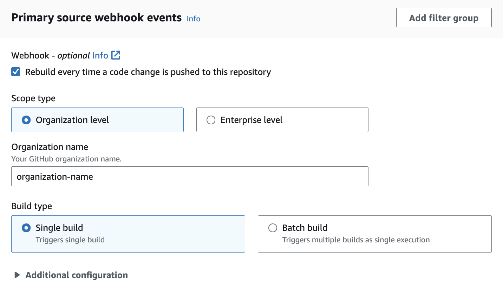

# Filter GitHub global

or organization webhook events (console)

When creating a GitHub project through the console, select the following options to
create a GitHub global or organization webhook within the project. For more information
about global and organization GitHub webhooks, see [GitHub global and organization
webhooks](github-global-organization-webhook.md "github-global-organization-webhook.md").

1. Open the AWS CodeBuild console at [https://console.aws.amazon.com/codesuite/codebuild/home](https://console.aws.amazon.com/codesuite/codebuild/home "https://console.aws.amazon.com/codesuite/codebuild/home").
2. Create a build project. For information, see [Create a build project (console)](create-project.md#create-project-console "create-project.md#create-project-console")
   and [Run a build (console)](run-build-console.md "run-build-console.md").
   - In **Source**:
     - For **Source provider**, choose
       **GitHub** or **GitHub
       Enterprise**.
     - For **Repository**, choose **GitHub
       scoped webhook**.

     The GitHub repository will automatically be set to
     `CODEBUILD_DEFAULT_WEBHOOK_SOURCE_LOCATION`,
     which is the required source location for global and
     organization webhooks.

     ###### Note

     If you are using organization webhooks, make sure that
     CodeBuild has permissions to create organization level webhooks
     within GitHub. If you're using an [existing OAuth
     connection](oauth-app-github.md "oauth-app-github.md"), you may need to regenerate the
     connection in order to grant CodeBuild this permission.
     Alternatively, you can create the webhook manually using the
     [CodeBuild manual
     webhooks feature](github-manual-webhook.md "github-manual-webhook.md"). Note that if you have an
     existing GitHub OAuth token and would like to add additional
     organization permissions, you can [revoke the OAuth token's permission](https://docs.github.com/en/apps/oauth-apps/using-oauth-apps/reviewing-your-authorized-oauth-apps "https://docs.github.com/en/apps/oauth-apps/using-oauth-apps/reviewing-your-authorized-oauth-apps") and
     reconnect the token through the CodeBuild console.

   
   - In **Primary source webhook events**:
     - For **Scope type**, choose
       **Organization level** if you're creating
       an organization webhook or **Enterprise level**
       if you're creating a global webhook.
     - For **Name**, enter either the enterprise or
       organization name, depending on if the webhook is a global or
       organization webhook.

     If the project's source type is
     `GITHUB_ENTERPRISE`, you also need to specify a
     domain as part of the webhook organization configuration. For
     example, if the URL of your organization is
     `https://domain.com/orgs/org-name`,
     then the domain is
     `https://domain.com`.

     ###### Note

     This name cannot be changed after the webhook has been
     created. To change the name, you can delete and re-create
     the webhook. If you want to remove the webhook entirely, you
     can also update the project source location to a GitHub
     repository.

     
     - (Optional) In **Webhook event filter
       groups**, you can specify which [events you would like to trigger a
       new build](github-webhook.md "github-webhook.md"). You can also specify
       `REPOSITORY_NAME` as a filter to only trigger
       builds on webhook events from specific repositories.

     

     You can also set the event type to
     `WORKFLOW_JOB_QUEUED` to set up self-hosted
     GitHub Actions runners. For more information, see [Tutorial: Configure a CodeBuild-hosted GitHub
     Actions runner](action-runner.md "action-runner.md").

3. Continue with the default values and then choose **Create build
   project**.
