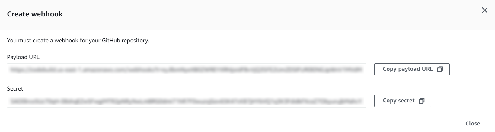

# GitHub manual webhooks

You can configure manual GitHub webhooks to prevent CodeBuild from automatically
attempting to create a webhook within GitHub. CodeBuild returns a payload URL in as part of the call to
create the webhook and can be used to manually create the webhook within GitHub. Even if CodeBuild is not allowlisted
to create a webhook in your GitHub account, you can still manually create a webhook for your build project.

Use the following procedure to create a GitHub manual webhook.

###### To create a GitHub manual webhook

1. Open the AWS CodeBuild console at [https://console.aws.amazon.com/codesuite/codebuild/home](https://console.aws.amazon.com/codesuite/codebuild/home "https://console.aws.amazon.com/codesuite/codebuild/home").
2. Create a build project. For information, see [Create a build project (console)](create-project.md#create-project-console "create-project.md#create-project-console") and
   [Run a build (console)](run-build-console.md "run-build-console.md").
   - In **Source**:
     - For **Source provider**, choose
       **GitHub**.
     - For **Repository**, choose **Repository in my GitHub account**.
     - For **Repository URL**, enter
       `https://github.com/`user-name`/`repository-name``.

   - In **Primary source webhook events**:
     - For **Webhook - optional**, choose
       **Rebuild every time a code change is pushed to this repository**.
     - Choose **Additional configuration** and for **Manual creation - optional**,
       choose **Manually create a webhook for this repository in GitHub console.**.

3. Continue with the default values and then choose **Create build project**. Take note of the
   **Payload URL** and **Secret** values as you will use these later.

 4. Open the GitHub console at
`https://github.com/`user-name`/`repository-name`/settings/hooks`
and choose **Add webhook**.

    * For **Payload URL**, enter the Payload URL value you took note of earlier.
    * For **Content type**, choose **application/json**.
    * For **Secret**, enter the Secret value you took note of earlier.
    * Configure the individual events that will send a webhook payload to CodeBuild. For **Which events
     would you like to trigger this webhook?**, choose **Let me select individual events**, and
     then choose from the following events: **Pushes**, **Pull requests**, and
     **Releases**. If you want to start builds for `WORKFLOW_JOB_QUEUED` events, choose
     **Workflow jobs**. To learn more about GitHub Actions runners, see [Tutorial: Configure a CodeBuild-hosted GitHub
     Actions runner](action-runner.md "action-runner.md"). To learn more about event types supported by CodeBuild, see [GitHub webhook events](github-webhook.md "github-webhook.md").

5. Choose **Add webhook**.
