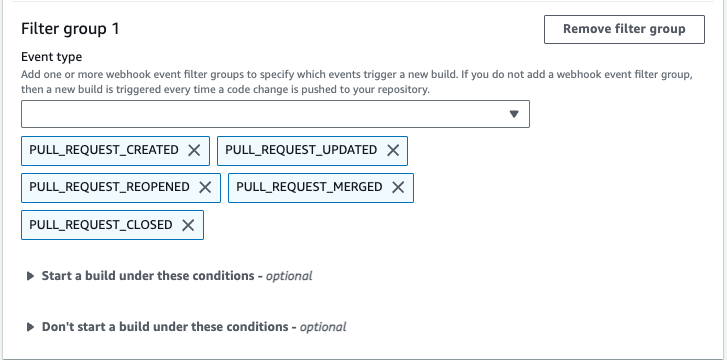
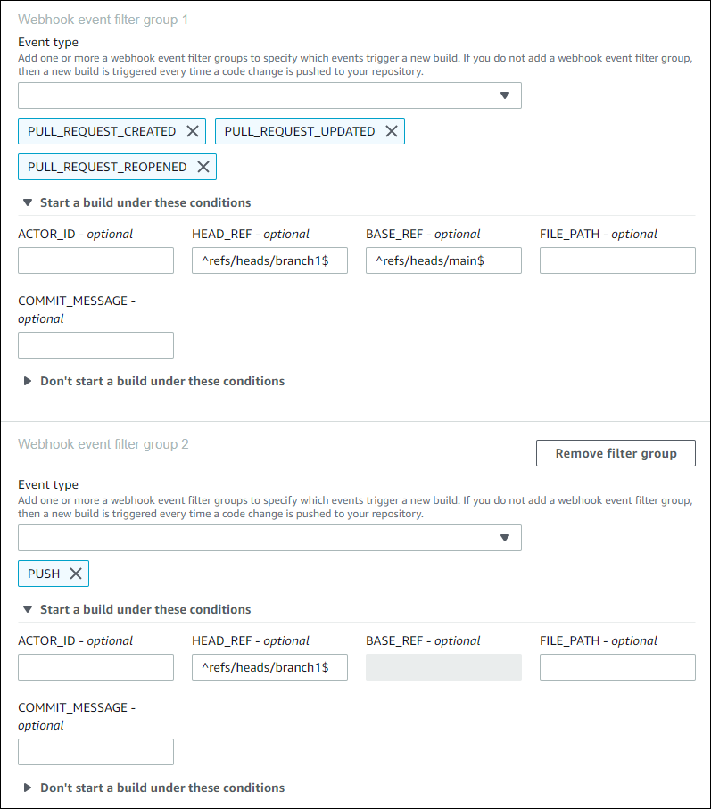
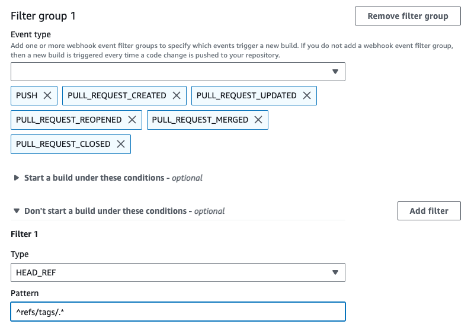
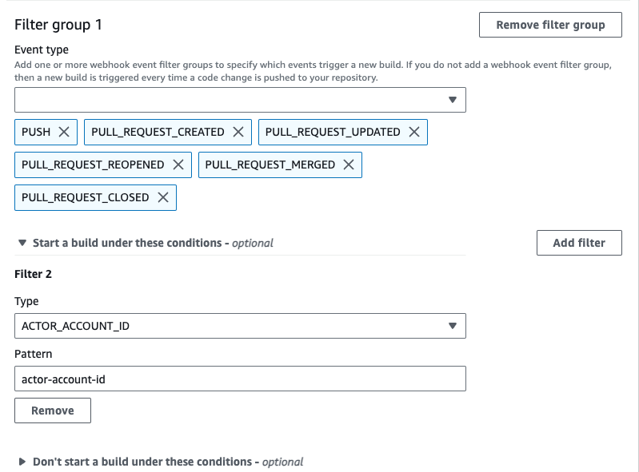
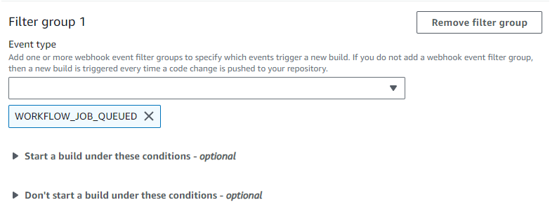
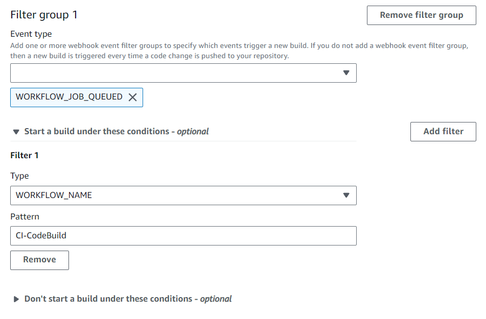

# Filter GitHub webhook events

(console)

Use the following instructions to filter GitHub webhook events using the AWS Management Console.
For more information about GitHub webhook events, see [GitHub webhook events](github-webhook.md "github-webhook.md").

In **Primary source webhook events**, select the following. This
section is only available when you chose **Repository in my GitHub
account** for the source repository.

1. Select **Rebuild every time a code change is pushed to this repository**
   when you create your project.
2. From **Event type**, choose one or more events.
3. To filter when an event triggers a build, under **Start a build under these
   conditions**, add one or more optional filters.
4. To filter when an event is not triggered, under **Don't start a build under these
   conditions**, add one or more optional filters.
5. Choose **Add filter group** to add another filter group, if needed.
   For more information, see [Create a build project (console)](create-project.md#create-project-console "create-project.md#create-project-console") and [WebhookFilter](../APIReference/API_WebhookFilter.md "../APIReference/API_WebhookFilter.md") in the _AWS CodeBuild API Reference_.

In this example, a webhook filter group triggers a build for pull requests
only:

Using an example of two webhook filter groups, a build is triggered when one or both
evaluate to true:

- The first filter group specifies pull requests that are created, updated, or
  reopened on branches with Git reference names that match the regular expression
  `^refs/heads/main$` and head references that match
  `^refs/heads/branch1$`.
- The second filter group specifies push requests on branches with Git reference
  names that match the regular expression `^refs/heads/branch1$`.

In this example, a webhook filter group triggers a build for all requests except tag
events.

In this example, a webhook filter group triggers a build only when files with names
that match the regular expression `^buildspec.*` change.

In this example, a webhook filter group triggers a build only when files are changed
in `src` or `test` folders.

In this example, a webhook filter group triggers a build only when a change is made by
a specified GitHub or GitHub Enterprise Server user with an account ID that matches the
regular expression `actor-account-id`.

###### Note

For information about how to find your GitHub account ID, see
https://api.github.com/users/`user-name`, where
`user-name` is your GitHub user name.

In this example, a webhook filter group triggers a build for a push event when the
head commit message matches the regular expression `\[CodeBuild\]`.

In this example, a webhook filter group triggers a build for GitHub Actions workflow
job events only.

###### Note

CodeBuild will only process GitHub Actions workflow jobs if a webhook has filter
groups containing the **WORKFLOW_JOB_QUEUED** event filter.

In this example, a webhook filter group triggers a build for a workflow name that
matches the regular expression `CI-CodeBuild`.

