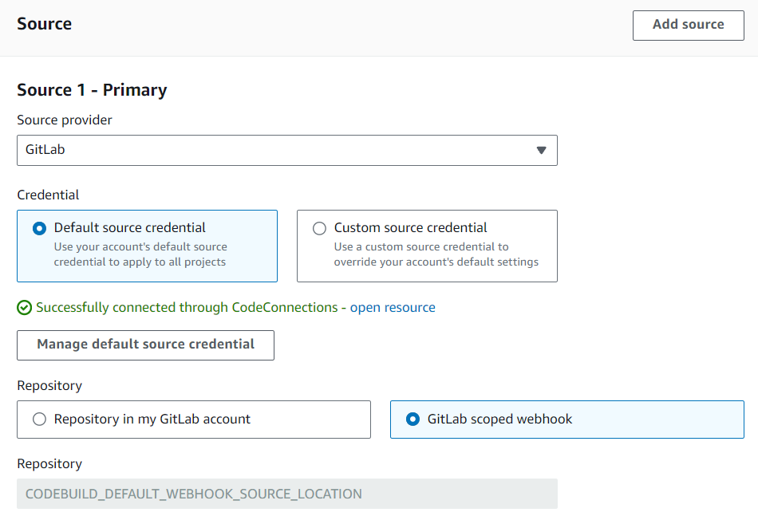
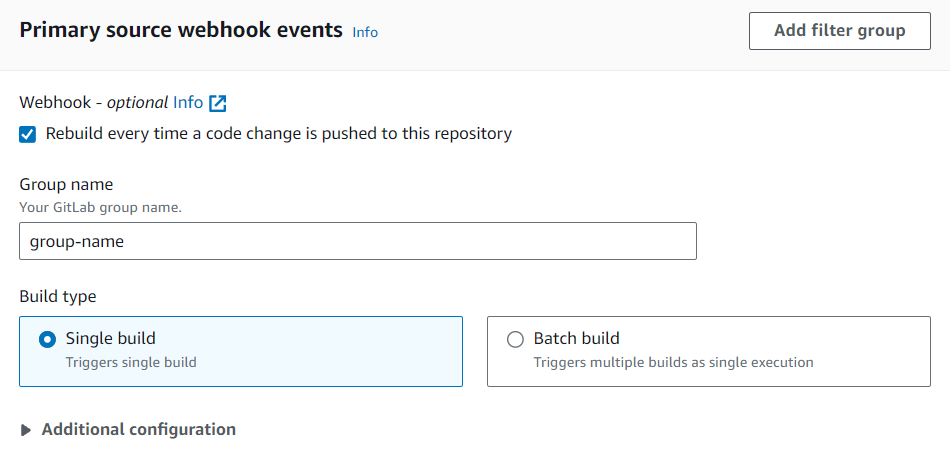
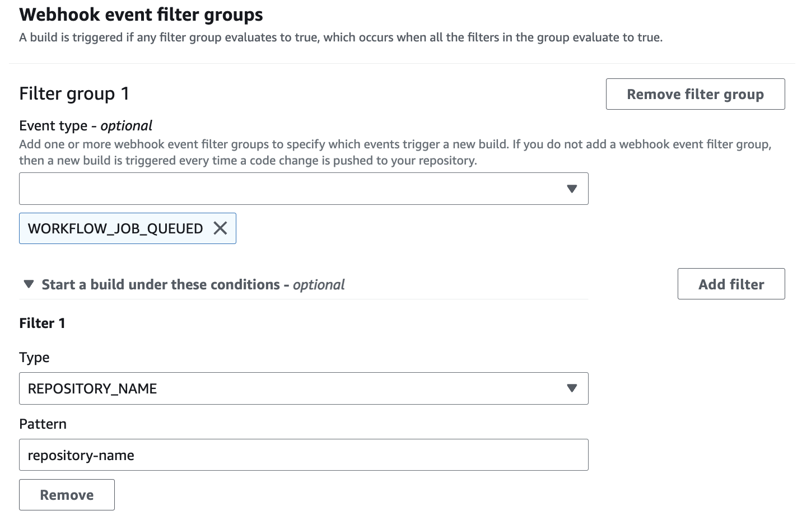

# Filter GitLab group webhook events (console)

When creating a GitLab project through the console, select the following options to
create a GitLab group webhook within the project. For more information
about group GitLab webhooks, see [GitLab group webhooks](gitlab-group-webhook.md "gitlab-group-webhook.md").

1. Open the AWS CodeBuild console at [https://console.aws.amazon.com/codesuite/codebuild/home](https://console.aws.amazon.com/codesuite/codebuild/home "https://console.aws.amazon.com/codesuite/codebuild/home").
2. Create a build project. For information, see [Create a build project (console)](create-project.md#create-project-console "create-project.md#create-project-console")
   and [Run a build (console)](run-build-console.md "run-build-console.md").
   - In **Source**:
     - For **Source provider**, choose
       **GitLab** or **GitLab
       Self Managed**.
     - For **Repository**, choose **GitLab
       scoped webhook**.

     The GitLab repository will automatically be set to
     `CODEBUILD_DEFAULT_WEBHOOK_SOURCE_LOCATION`,
     which is the required source location for group webhooks.

     ###### Note

     When using group webhooks, make sure that
     CodeBuild has permissions to create group level webhooks
     within GitLab. If you're using an [existing OAuth
     connection](access-tokens-gitlab-overview.md#connections-gitlab "access-tokens-gitlab-overview.md#connections-gitlab"), you may need to regenerate the
     connection in order to grant CodeBuild this permission.

   
   - In **Primary source webhook events**:
     - For **Group name**, enter the
       group name.

     If the project's source type is
     `GITLAB_SELF_MANAGED`, you also need to specify a
     domain as part of the webhook group configuration. For example,
     if the URL of your group is
     `https://domain.com/group/group-name`,
     then the domain is
     `https://domain.com`.

     ###### Note

     This name cannot be changed after the webhook has been
     created. To change the name, you can delete and re-create
     the webhook. If you want to remove the webhook entirely, you
     can also update the project source location to a GitLab
     repository.

     
     - (Optional) In **Webhook event filter
       groups**, you can specify which [events you would like to trigger a
       new build](gitlab-webhook.md "gitlab-webhook.md"). You can also specify
       `REPOSITORY_NAME` as a filter to only trigger
       builds on webhook events from specific repositories.

     

     You can also set the event type to
     `WORKFLOW_JOB_QUEUED` to set up self-hosted
     GitLab runners. For more information, see [Self-managed GitLab runners in AWS CodeBuild](gitlab-runner.md "gitlab-runner.md").

3. Continue with the default values and then choose **Create build
   project**.
