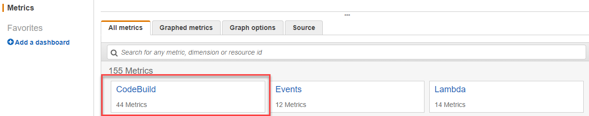

# View CodeBuild resource utilization

metrics

AWS CodeBuild monitors build resource utilization on your behalf and reports metrics through
Amazon CloudWatch. These include metrics such as CPU, memory, and storage utilization.

###### Note

CodeBuild resource utilization metrics are only recorded for builds that run for more than one
minute.

You can use the CodeBuild console or the CloudWatch console to monitor resource utilization metrics
for CodeBuild.

###### Note

CodeBuild resource utilization metrics are only available in the following regions:

- Asia Pacific (Tokyo) Region
- Asia Pacific (Seoul) Region
- Asia Pacific (Mumbai) Region
- Asia Pacific (Singapore) Region
- Asia Pacific (Sydney) Region
- Canada (Central) Region
- Europe (Frankfurt) Region
- Europe (Ireland) Region
- Europe (London) Region
- Europe (Paris) Region
- South America (São Paulo) Region
- US East (N. Virginia) Region
- US East (Ohio) Region
- US West (N. California) Region
- US West (Oregon) Region
  The following procedures show you how to access your resource utilization metrics.

###### Topics

- [Access resource utilization
  metrics (CodeBuild console)](#utilization-metrics-codebuild-console "#utilization-metrics-codebuild-console")
- [Access resource utilization
  metrics (Amazon CloudWatch console)](#utilization-metrics-cloudwatch-console "#utilization-metrics-cloudwatch-console")

## Access resource utilization

metrics (CodeBuild console)

###### Note

You can't customize the metrics or the graphs used to display them in the CodeBuild
console. If you want to customize the display, use the Amazon CloudWatch console to view your
build metrics.

### Project-level resource

utilization metrics

###### To access project-level resource utilization metrics

1. Sign in to the AWS Management Console and open the AWS CodeBuild console at [https://console.aws.amazon.com/codesuite/codebuild/home](https://console.aws.amazon.com/codesuite/codebuild/home "https://console.aws.amazon.com/codesuite/codebuild/home").
2. In the navigation pane, choose **Build projects**.
3. In the list of build projects, in the **Name** column,
   choose the project you want to view the utilization metrics for.
4. Choose the **Metrics** tab. The resource utilization
   metrics are displayed in the **Resource utilization
   metrics** section.
5. To view the project-level resource utilization metrics in the CloudWatch
   console, choose **View in CloudWatch** in the
   **Resource utilization metrics** section.

### Build-level resource

utilization metrics

###### To access build-level resource utilization metrics

1. Sign in to the AWS Management Console and open the AWS CodeBuild console at [https://console.aws.amazon.com/codesuite/codebuild/home](https://console.aws.amazon.com/codesuite/codebuild/home "https://console.aws.amazon.com/codesuite/codebuild/home").
2. In the navigation pane, choose **Build history**.
3. In the list of builds, in the **Build run** column,
   choose the build you want to view the utilization metrics for.
4. Choose the **Resource utilization** tab.
5. To view the build-level resource utilization metrics in the CloudWatch console,
   choose **View in CloudWatch** in the **Resource
   utilization metrics** section.

## Access resource utilization

metrics (Amazon CloudWatch console)

The Amazon CloudWatch console can be used to access CodeBuild resource utilization metrics.

### Project-level

resource utilization metrics

###### To access project-level resource

utilization metrics

1. Sign in to the AWS Management Console and open the CloudWatch console at
   [https://console.aws.amazon.com/cloudwatch/](https://console.aws.amazon.com/cloudwatch/ "https://console.aws.amazon.com/cloudwatch/").
2. In the navigation pane, choose **Metrics**.
3. On the **All metrics** tab, choose
   **CodeBuild**.

 4. Choose **By Project**. 5. Choose one or more project and metric combinations to add to the graph.
All selected project and metric combinations are displayed in the graph on
the page. 6. (Optional) You can customize your metrics and graphs from the
**Graphed metrics** tab. For example, from the
drop-down list in the **Statistic** column, you can choose
a different statistic to display. Or from the drop-down menu in the
**Period** column, you can choose a different time
period to use to monitor the metrics.

For more information, see [Graphing metrics](../../../AmazonCloudWatch/latest/monitoring/graph_metrics.md "../../../AmazonCloudWatch/latest/monitoring/graph_metrics.md") and [Viewing
available metrics](../../../AmazonCloudWatch/latest/monitoring/viewing_metrics_with_cloudwatch.md "../../../AmazonCloudWatch/latest/monitoring/viewing_metrics_with_cloudwatch.md") in the _Amazon CloudWatch User
Guide_.

### Build-level resource

utilization metrics

###### To access build-level resource utilization metrics

1. Sign in to the AWS Management Console and open the CloudWatch console at
   [https://console.aws.amazon.com/cloudwatch/](https://console.aws.amazon.com/cloudwatch/ "https://console.aws.amazon.com/cloudwatch/").
2. In the navigation pane, choose **Metrics**.
3. On the **All metrics** tab, choose
   **CodeBuild**.

 4. Choose **BuildId, BuildNumber, ProjectName**. 5. Choose one or more build and metric combinations to add to the graph. All
selected build and metric combinations are displayed in the graph on the
page. 6. (Optional) You can customize your metrics and graphs from the
**Graphed metrics** tab. For example, from the
drop-down list in the **Statistic** column, you can choose
a different statistic to display. Or from the drop-down menu in the
**Period** column, you can choose a different time
period to use to monitor the metrics.

For more information, see [Graphing metrics](../../../AmazonCloudWatch/latest/monitoring/graph_metrics.md "../../../AmazonCloudWatch/latest/monitoring/graph_metrics.md") and [Viewing
available metrics](../../../AmazonCloudWatch/latest/monitoring/viewing_metrics_with_cloudwatch.md "../../../AmazonCloudWatch/latest/monitoring/viewing_metrics_with_cloudwatch.md") in the _Amazon CloudWatch User
Guide_.
