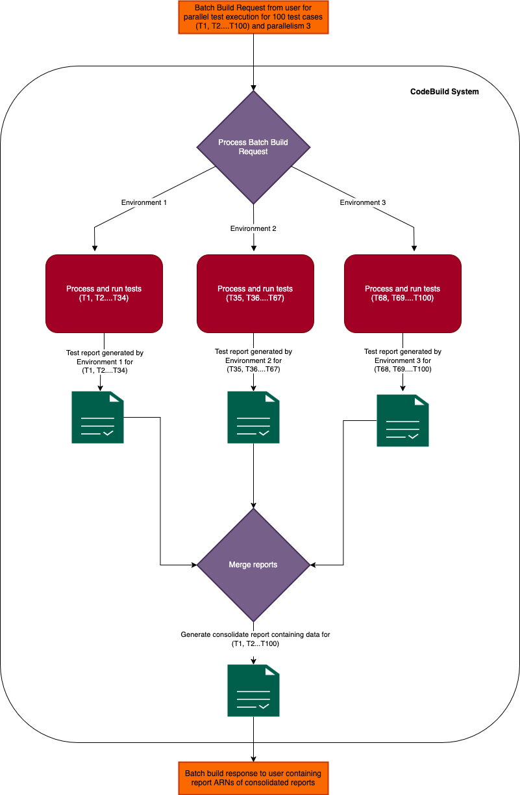

# Execute parallel tests in batch builds

You can use AWS CodeBuild to execute parallel tests in batch
builds. Parallel test execution is a testing approach where multiple test cases run simultaneously across
different environments, machines, or browsers, rather than executing sequentially. This approach can
significantly reduce overall test execution time and improve testing efficiency. In CodeBuild, you can split your tests
across multiple environments and run them concurrently.

The key advantages of parallel test execution include:

1. **Reduced execution time** - Tests that would take hours sequentially can complete in minutes.
2. **Better resource utilization** - Makes efficient use of available computing resources.
3. **Earlier feedback** - Faster test completion means quicker feedback to developers.
4. **Cost-effective** - Saves both time and computing costs in the long run.
   When implementing parallel test execution, two main approaches are commonly considered: separate
   environments and multithreading. While both methods aim to achieve concurrent test execution, they differ significantly
   in their implementation and effectiveness. Separate environments create isolated instances where each test suite runs
   independently, while multithreading executes multiple tests simultaneously within the same process space using different threads.

The key advantages of separate environments over multithreading include:

1. **Isolation** - Each test runs in a completely isolated environment, preventing interference between tests.
2. **Resource conflicts** - No competition for shared resources that often occurs in multithreading.
3. **Stability** - Less prone to race conditions and synchronization issues.
4. **Easier debugging** - When tests fail, it's simpler to identify the cause as each environment is independent.
5. **State management** - Easily manage shared state issues that plague multithreaded tests.
6. **Better scalability** - Can easily add more environments without complexity.

###### Topics

- [Support in AWS CodeBuild](#parallel-test-support "#parallel-test-support")
- [Enable parallel test execution in batch builds](parallel-test-enable.md "parallel-test-enable.md")
- [Use the codebuild-tests-run CLI command](parallel-test-tests-run.md "parallel-test-tests-run.md")
- [Use the codebuild-glob-search CLI command](parallel-test-glob-search.md "parallel-test-glob-search.md")
- [About test splitting](parallel-test-splitting.md "parallel-test-splitting.md")
- [Automatically merge individual build reports](parallel-test-auto-merge.md "parallel-test-auto-merge.md")
- [Parallel test execution for various test frameworks sample](sample-parallel-test.md "sample-parallel-test.md")

## Support in AWS CodeBuild

AWS CodeBuild provides robust support for parallel test execution through its batch build feature, specifically designed
to leverage separate environment execution. This implementation aligns perfectly with the benefits of isolated testing environments.

**Batch build with test distribution**

CodeBuild's batch build functionality enables the creation of multiple build environments that run simultaneously. Each environment operates
as a completely isolated unit, with its own compute resources, runtime environment, and dependencies. Through the batch build configuration,
you can specify how many parallel environments they need and how tests should be distributed across them.

**Test sharding CLI**

CodeBuild includes a built-in test distribution mechanism through its CLI tool, `codebuild-tests-run`, which automatically divides tests into different environments.

**Report aggregation**

One of the key strengths of CodeBuild's implementation is its ability to handle test result aggregation seamlessly. While tests execute in separate environments,
CodeBuild automatically collects and combines the test reports from each environment into a unified test report at the batch build level. This consolidation provides
a comprehensive view of test results while maintaining the efficiency benefits of parallel execution.

The following is the diagram explains the complete concept of parallel test execution in AWS CodeBuild.

