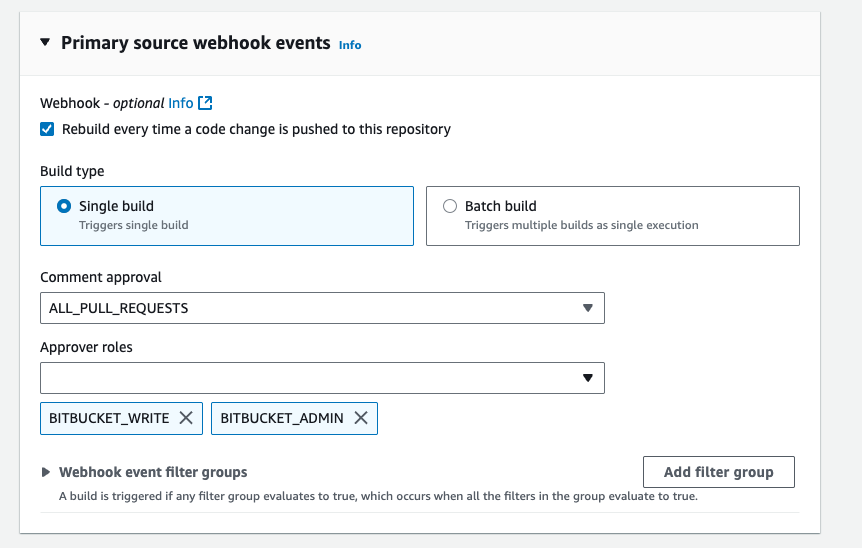

# Pull request comment approval

CodeBuild supports pull request build policies that provide additional control over builds triggered by pull requests. You may not want to automatically build pull requests from unknown users until their changes can be reviewed. This feature allows you to require one of your team members to first review the code and then run the pipeline. This is commonly used as a security measure when building a code submitted by unknown contributors.

Pull request build policies allow you to control when CodeBuild triggers builds for pull requests based on the contributor's permissions and approval status. This is particularly important for public repositories or repositories that accept contributions from external collaborators.

When enabled, this feature ensures that builds are only triggered for pull requests when either:

- The pull request is created by a trusted contributor.
- A trusted contributor approves the pull request by posting a specific comment.

## How it works

**Trusted contributors**

Trusted contributor is a user who’s current role in the source control system is set in the pull request based policy as an approver roles. When a trusted contributor creates a pull request, CodeBuild triggers the build automatically, maintaining the current behavior.

**Untrusted contributors**

Untrusted contributor is a user who’s role is not set in the list of the approver roles. When an untrusted contribute creates a pull request:

1. CodeBuild marks the build status as “Failed" with the message "Pull request approval required for starting a build".
2. A trusted contributor must review the changes and post a comment with `/codebuild_run(`<SHA_OF_THE_LATEST_COMMIT>`)` to trigger the build. For example, `/codebuild_run(`046e8b67481d53bdc86c3f6affdd5d1afae6d369`)`.
3. CodeBuild validates the commenter's permissions and triggers the build if approved.
4. Build results are reported back on the pull request page.

**Comment approval syntax**

Trusted contributors can approve builds using the following comment formats:

- `/codebuild_run(`046e8b67481d53bdc86c3f6affdd5d1afae6d369`)` - Triggers build on the specified commit SHA.

## Configuration

**Default behavior**

Pull request build policy is enabled by default for all newly created CodeBuild projects.

**API parameters**

The pull request build policy is configured using the `PullRequestBuildPolicy` parameter in the following actions:

- `CreateWebhook`
- `UpdateWebhook`

**`PullRequestBuildPolicy` structure**

```
{
    "requiresCommentApproval": "string",
    "approverRoles": ["string", ...]
}
```

**`requiresCommentApproval`**

Specifies when comment-based approval is required before triggering a build on pull requests. This setting determines whether builds run automatically or require explicit approval through comments.

Type: String

Valid values:

- `DISABLED` - Builds trigger automatically without requiring comment approval.
- `FORK_PULL_REQUESTS` - Only pull requests from forked repositories require comment approval (unless contributor is one of the approver roles).
- `ALL_PULL_REQUESTS` - All pull requests require comment approval before builds execute (unless contributor is one of the approver roles). This is the default value.

**`approverRoles`**

List of repository roles that have approval privileges for pull request builds when comment approval is required. Only users with these roles can provide valid comment approvals. If a pull request contributor is one of these roles, their pull request builds will trigger automatically.

Type: Array of strings

Valid values for GitHub projects (the values are mapped to the GitHub roles):

- `GITHUB_ADMIN` - Repository administrators
- `GITHUB_MAINTAIN` - Repository maintainers
- `GITHUB_WRITE` - User with write permissions
- `GITHUB_TRIAGE` - User with triage permissions
- `GITHUB_READ` - User with read permissions
- Default: `["GITHUB_ADMIN", "GITHUB_MAINTAINER", "GITHUB_WRITE"]`

Valid values for GitLab projects (the values are mapped to the GitLab roles):

- `GITLAB_OWNER` - Repository owner
- `GITLAB_MAINTAINER` - Repository maintainer
- `GITLAB_DEVELOPER` - User with developer permissions
- `GITLAB_REPORTER` - User with reporter permissions
- `GITLAB_PLANNER` - User with planner permissions
- `GITLAB_GUEST` - User with guest permissions
- Default: `["GITLAB_OWNER", "GITLAB_MAINTAINER", "GITLAB_DEVELOPER"]`

Valid values for Bitbucket projects (the values are mapped to the Bitbucket roles):

- `BITBUCKET_ADMIN` - Repository administrator
- `BITBUCKET_WRITE` - User with write permissions
- `BITBUCKET_READ` - User with read permissions
- Default: `["BITBUCKET_ADMIN", "BITBUCKET_WRITE"]`

## Examples

**Enable comment approval for all pull requests**

To use the AWS CodeBuild SDK to enable or disable Pull Request Build policy for a webhook, use the `pullRequestBuildPolicy` field in the request syntax of the `CreateWebhook` or `UpdateWebhook` API methods. For more information, see [WebhookFilter](../APIReference/API_WebhookFilter.md "../APIReference/API_WebhookFilter.md") in the _CodeBuild API Reference_.

Users with Github roles Admin, Maintain, and Write will be treated as trusted contributors.

```
"pullRequestBuildPolicy": {
    "requiresCommentApproval": "ALL_PULL_REQUESTS",
    "approverRoles": ["GITHUB_ADMIN", "GITHUB_MAINTAIN", "GITHUB_WRITE"]
}
```

**Enable comment approval only for repository admins and maintainers**

Users with GitHub roles Admin, Maintain, will be treated as trusted contributors.

```
"pullRequestBuildPolicy": {
    "requiresCommentApproval": "FORK_PULL_REQUESTS",
    "approverRoles": ["GITHUB_ADMIN", "GITHUB_MAINTAINER"]
}
```

**Disable comment approval**

```
"pullRequestBuildPolicy": {
    "requiresCommentApproval": "DISABLED"
}
```

## AWS CloudFormation

To use an AWS CloudFormation template to enable or disable Pull Request Build policy for a webhook use PullRequestBuildPolicy property. The following YAML-formatted portion of an AWS CloudFormation template create a project with a webhook that has Pull Request Build Policy enabled for all pull requests. Maintain and Admin roles as specified as approvers.

```
CodeBuildProject:
  Type: AWS::CodeBuild::Project
  Properties:
    Name: MyProject
    ServiceRole: service-role
    Artifacts:
      Type: NO_ARTIFACTS
    Environment:
      Type: LINUX_CONTAINER
      ComputeType: BUILD_GENERAL1_SMALL
      Image: aws/codebuild/standard:5.0
    Source:
      Type: BITBUCKET
      Location: source-location
    Triggers:
      Webhook: true
      FilterGroups:
        - - Type: EVENT
            Pattern: PULL_REQUEST_CREATED,PULL_REQUEST_UPDATED
          - Type: BASE_REF
            Pattern: ^refs/heads/main$
            ExcludeMatchedPattern: false
      PullRequestBuildPolicy:
        RequiresCommentApproval: ALL_PULL_REQUESTS
        ApproverRoles:
          - GITHUB_MAINTAIN
          - GITHUB_ADMIN
```

## Console configuration

To use the AWS Management Console to filter webhook events:

1. For **Comment approval**, select either disabled or enabled for all pull requests (`ALL_PULL_REQUEST`) or only for pull requests from forks (`FORK_PULL_REQUEST`).
2. For **Approver roles**, select repository roles that have approval privileges for pull request builds when comment approval is required.

For more information, see [Create a build project (console)](create-project.md#create-project-console "create-project.md#create-project-console") and [WebhookFilter](../APIReference/API_WebhookFilter.md "../APIReference/API_WebhookFilter.md") in the _CodeBuild API Reference_.


