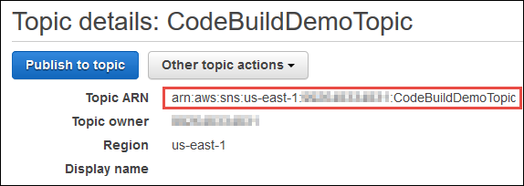
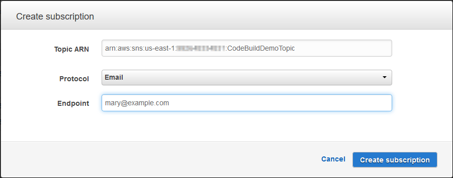

# Build notifications sample for CodeBuild

Amazon CloudWatch Events has built-in support for AWS CodeBuild. CloudWatch Events is a stream of system events
describing changes in your AWS resources. With CloudWatch Events, you write declarative rules to
associate events of interest with automated actions to be taken. This sample uses Amazon CloudWatch Events
and Amazon Simple Notification Service (Amazon SNS) to send build notifications to subscribers whenever builds succeed,
fail, go from one build phase to another, or any combination of these events.

###### Important

Running this sample might result in charges to your AWS account. These include
possible charges for CodeBuild and for AWS resources and actions related to Amazon CloudWatch and
Amazon SNS. For more information, see [CodeBuild pricing](http://aws.amazon.com/codebuild/pricing "http://aws.amazon.com/codebuild/pricing"), [Amazon CloudWatch
pricing](http://aws.amazon.com/cloudwatch/pricing "http://aws.amazon.com/cloudwatch/pricing"), and [Amazon SNS
pricing](http://aws.amazon.com/sns/pricing "http://aws.amazon.com/sns/pricing").

###### Topics

- [Run the build notifications
  sample](#sample-build-notifications-running "#sample-build-notifications-running")
- [Build notifications input format
  reference](sample-build-notifications-ref.md "sample-build-notifications-ref.md")

## Run the build notifications

sample

Use the following procedure to run the build notifications sample.

###### To run this sample

1. If you already have a topic set up and subscribed to in Amazon SNS that you want to
   use for this sample, skip ahead to step 4. Otherwise, if you are using an IAM
   user instead of an AWS root account or an administrator user to work with
   Amazon SNS, add the following statement (between `### BEGIN ADDING
STATEMENT HERE ###` and `### END ADDING STATEMENT
HERE ###`) to the user (or IAM group the user is associated
   with). Using an AWS root account is not recommended. This statement enables
   viewing, creating, subscribing, and testing the sending of notifications to
   topics in Amazon SNS. Ellipses (`...`) are used for brevity and to help
   you locate where to add the statement. Do not remove any statements, and do not
   type these ellipses into the existing policy.

JSON

```
`{
 "Version":"2012-10-17",
 "Statement": [
 {
 "Effect": "Allow",
 "Action": [
 "sns:CreateTopic",
 "sns:GetTopicAttributes",
 "sns:List*",
 "sns:Publish",
 "sns:SetTopicAttributes",
 "sns:Subscribe"
 ],
 "Resource": "*"
 }
 ]
}`

```

###### Note

The IAM entity that modifies this policy must have permission in IAM
to modify policies.

For more information, see [Editing customer managed policies](../../../IAM/latest/UserGuide/access_policies_managed-using.md#edit-managed-policy-console "../../../IAM/latest/UserGuide/access_policies_managed-using.md#edit-managed-policy-console") or the "To edit or delete an
inline policy for a group, user, or role" section in [Working with inline policies (console)](../../../IAM/latest/UserGuide/access_policies_inline-using.md#AddingPermissions_Console "../../../IAM/latest/UserGuide/access_policies_inline-using.md#AddingPermissions_Console") in the
_IAM User Guide_. 2. Create or identify a topic in Amazon SNS. AWS CodeBuild uses CloudWatch Events to send build
notifications to this topic through Amazon SNS.

To create a topic:

    1. Open the Amazon SNS console at [https://console.aws.amazon.com/sns](https://console.aws.amazon.com/sns "https://console.aws.amazon.com/sns").
    2. Choose **Create topic**.
    3. In **Create new topic**, for **Topic
     name**, enter a name for the topic (for example,
     `CodeBuildDemoTopic`). (If you choose a
     different name, substitute it throughout this sample.)
    4. Choose **Create topic**.
    5. On the **Topic details: CodeBuildDemoTopic**
     page, copy the **Topic ARN** value. You need this value
     for the next step.


    

For more information, see [Create a
topic](../../../sns/latest/dg/CreateTopic.md "../../../sns/latest/dg/CreateTopic.md") in the _Amazon SNS Developer Guide_. 3. Subscribe one or more recipients to the topic to receive email notifications.

To subscribe a recipient to a topic:

    1. With the Amazon SNS console open from the previous step, in the navigation
     pane, choose **Subscriptions**, and then choose
     **Create subscription**.
    2. In **Create subscription**, for **Topic
     ARN**, paste the topic ARN you copied from the previous
     step.
    3. For **Protocol**, choose
     **Email**.
    4. For **Endpoint**, enter the recipient's full email
     address.


    
    5. Choose **Create Subscription**.
    6. Amazon SNS sends a subscription confirmation email to the recipient. To
     begin receiving email notifications, the recipient must choose the
     **Confirm subscription** link in the subscription
     confirmation email. After the recipient clicks the link, if successfully
     subscribed, Amazon SNS displays a confirmation message in the recipient's web
     browser.

For more information, see [Subscribe to a topic](../../../sns/latest/dg/SubscribeTopic.md "../../../sns/latest/dg/SubscribeTopic.md") in the _Amazon SNS Developer
Guide_. 4. If you are using an user instead of an AWS root account or an administrator
user to work with CloudWatch Events, add the following statement (between `###
 BEGIN ADDING STATEMENT HERE ###` and `### END
 ADDING STATEMENT HERE ###`) to the user (or IAM group the
user is associated with). Using an AWS root account is not recommended. This
statement is used to allow the user to work with CloudWatch Events. Ellipses
(`...`) are used for brevity and to help you locate where to add
the statement. Do not remove any statements, and do not type these ellipses into
the existing policy.

JSON

```
`{
 "Version":"2012-10-17",
 "Statement": [
 {
 "Effect": "Allow",
 "Action": [
 "events:*",
 "iam:PassRole"
 ],
 "Resource": "`arn:aws:iam::*:role/Service*`"
 }
 ]
}`

```

###### Note

The IAM entity that modifies this policy must have permission in IAM
to modify policies.

For more information, see [Editing customer managed policies](../../../IAM/latest/UserGuide/access_policies_managed-using.md#edit-managed-policy-console "../../../IAM/latest/UserGuide/access_policies_managed-using.md#edit-managed-policy-console") or the "To edit or delete an
inline policy for a group, user, or role" section in [Working with inline policies (console)](../../../IAM/latest/UserGuide/access_policies_inline-using.md#AddingPermissions_Console "../../../IAM/latest/UserGuide/access_policies_inline-using.md#AddingPermissions_Console") in the
_IAM User Guide_. 5. Create a rule in CloudWatch Events. To do this, open the CloudWatch console, at [https://console.aws.amazon.com/cloudwatch](https://console.aws.amazon.com/cloudwatch "https://console.aws.amazon.com/cloudwatch"). 6. In the navigation pane, under **Events**, choose
**Rules**, and then choose **Create
rule**. 7. On the **Step 1: Create rule page**, **Event
Pattern** and **Build event pattern to match events by
service** should already be selected. 8. For **Service Name**, choose
**CodeBuild**. For **Event Type**,
**All Events** should already be selected. 9. The following code should be displayed in **Event Pattern
Preview**:

```
{
  "source": [
    "aws.codebuild"
  ]
}
```

10. Choose **Edit** and replace the code in **Event
    Pattern Preview** with one of the following two rule
    patterns.

This first rule pattern triggers an event when a build starts or completes for
the specified build projects in AWS CodeBuild.

```
{
  "source": [
    "aws.codebuild"
  ],
  "detail-type": [
    "CodeBuild Build State Change"
  ],
  "detail": {
    "build-status": [
      "IN_PROGRESS",
      "SUCCEEDED",
      "FAILED",
      "STOPPED"
    ],
    "project-name": [
      "`my-demo-project-1`",
      "`my-demo-project-2`"
    ]
  }
}
```

In the preceding rule, make the following code changes as needed.

    * To trigger an event when a build starts or completes, either leave all
     of the values as shown in the `build-status` array, or remove
     the `build-status` array altogether.
    * To trigger an event only when a build completes, remove
     `IN_PROGRESS` from the `build-status` array.
    * To trigger an event only when a build starts, remove all of the values
     except `IN_PROGRESS` from the `build-status`
     array.
    * To trigger events for all build projects, remove the
     `project-name` array altogether.
    * To trigger events only for individual build projects, specify the name
     of each build project in the `project-name` array.

This second rule pattern triggers an event whenever a build moves from one
build phase to another for the specified build projects in AWS CodeBuild.

```
{
  "source": [
    "aws.codebuild"
  ],
  "detail-type": [
    "CodeBuild Build Phase Change"
  ],
  "detail": {
    "completed-phase": [
      "SUBMITTED",
      "PROVISIONING",
      "DOWNLOAD_SOURCE",
      "INSTALL",
      "PRE_BUILD",
      "BUILD",
      "POST_BUILD",
      "UPLOAD_ARTIFACTS",
      "FINALIZING"
    ],
    "completed-phase-status": [
      "TIMED_OUT",
      "STOPPED",
      "FAILED",
      "SUCCEEDED",
      "FAULT",
      "CLIENT_ERROR"
    ],
    "project-name": [
      "`my-demo-project-1`",
      "`my-demo-project-2`"
    ]
  }
}
```

In the preceding rule, make the following code changes as needed.

    * To trigger an event for every build phase change (which might send up
     to nine notifications for each build), either leave all of the values as
     shown in the `completed-phase` array, or remove the
     `completed-phase` array altogether.
    * To trigger events only for individual build phase changes, remove the
     name of each build phase in the `completed-phase` array that
     you do not want to trigger an event for.
    * To trigger an event for every build phase status change, either leave
     all of the values as shown in the `completed-phase-status`
     array, or remove the `completed-phase-status` array
     altogether.
    * To trigger events only for individual build phase status changes,
     remove the name of each build phase status in the
     `completed-phase-status` array that you do not want to
     trigger an event for.
    * To trigger events for all build projects, remove the
     `project-name` array.
    * To trigger events for individual build projects, specify the name of
     each build project in the `project-name` array.

For more information about event patterns, see [Event Patterns](../../../eventbridge/latest/userguide/filtering-examples-structure.md "../../../eventbridge/latest/userguide/filtering-examples-structure.md")
in the Amazon EventBridge User Guide.

For more information about filtering with event patterns, see [Content-based
Filtering with Event Patterns](../../../eventbridge/latest/userguide/content-filtering-with-event-patterns.md "../../../eventbridge/latest/userguide/content-filtering-with-event-patterns.md") in the Amazon EventBridge User Guide.

###### Note

If you want to trigger events for both build state changes and build phase
changes, you must create two separate rules: one for build state changes and
another for build phase changes. If you try to combine both rules into a
single rule, the combined rule might produce unexpected results or stop
working altogether.

When you have finished replacing the code, choose
**Save**. 11. For **Targets**, choose **Add target**. 12. In the list of targets, choose **SNS topic**. 13. For **Topic**, choose the topic you identified or created
earlier. 14. Expand **Configure input**, and then choose **Input
Transformer**. 15. In the **Input Path** box, enter one of the following input
paths.

For a rule with a `detail-type` value of `CodeBuild Build
 State Change`, enter the following.

```
{"build-id":"$.detail.build-id","project-name":"$.detail.project-name","build-status":"$.detail.build-status"}
```

For a rule with a `detail-type` value of `CodeBuild Build
 Phase Change`, enter the following.

```
{"build-id":"$.detail.build-id","project-name":"$.detail.project-name","completed-phase":"$.detail.completed-phase","completed-phase-status":"$.detail.completed-phase-status"}
```

To get other types of information, see the [Build notifications input format
reference](sample-build-notifications-ref.md "sample-build-notifications-ref.md"). 16. In the **Input Template** box, enter one of the following
input templates.

For a rule with a `detail-type` value of `CodeBuild Build
 State Change`, enter the following.

```
"Build '<build-id>' for build project '<project-name>' has reached the build status of '<build-status>'."
```

For a rule with a `detail-type` value of `CodeBuild Build
 Phase Change`, enter the following.

```
"Build '<build-id>' for build project '<project-name>' has completed the build phase of '<completed-phase>' with a status of '<completed-phase-status>'."
```

17. Choose **Configure details**.
18. On the **Step 2: Configure rule details** page, enter a name
    and an optional description. For **State**, leave
    **Enabled** selected.
19. Choose **Create rule**.
20. Create build projects, run the builds, and view build information.
21. Confirm that CodeBuild is now successfully sending build notifications. For
    example, check to see if the build notification emails are now in your
    inbox.

To change a rule's behavior, in the CloudWatch console, choose the rule you want to change,
choose **Actions**, and then choose **Edit**. Make
changes to the rule, choose **Configure details**, and then choose
**Update rule**.

To stop using a rule to send build notifications, in the CloudWatch console, choose the rule
you want to stop using, choose **Actions**, and then choose
**Disable**.

To delete a rule altogether, in the CloudWatch console, choose the rule you want to delete,
choose **Actions**, and then choose **Delete**.
