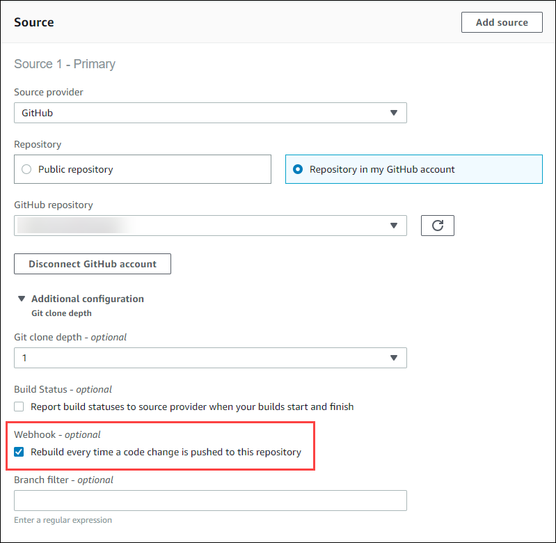

# Create a static website with build output

hosted in an S3 bucket

You can disable the encryption of artifacts in a build. You might want to do this so that
you can publish artifacts to a location that is configured to host a website. (You cannot
publish encrypted artifacts.) This sample shows how you can use webhooks to trigger a build and
publish its artifacts to an S3 bucket that is configured to be a website.

1. Follow the instructions in [Setting up a static website](../../../AmazonS3/latest/userguide/HostingWebsiteOnS3Setup.md "../../../AmazonS3/latest/userguide/HostingWebsiteOnS3Setup.md") to configure an S3 bucket to function like a website.
2. Open the AWS CodeBuild console at [https://console.aws.amazon.com/codesuite/codebuild/home](https://console.aws.amazon.com/codesuite/codebuild/home "https://console.aws.amazon.com/codesuite/codebuild/home").
3. If a CodeBuild information page is displayed, choose **Create build project**. Otherwise, on the navigation pane, expand **Build**,
   choose **Build projects**, and then choose **Create build project**.
4. In **Project name**, enter
   a name for this build project. Build project names must be unique across each AWS account. You can also include an optional description of the build project to
   help other users understand what this project is used for.
5. In **Source**, for **Source provider**, choose
   **GitHub**. Follow the instructions to connect (or reconnect) with
   GitHub, and then choose **Authorize**.

For **Webhook**, select **Rebuild every time a code change is
pushed to this repository**. You can select this check box only if you chose
**Use a repository in my account**.

 6. In **Environment**:

For **Environment image**, do one of the following:

    * To use a Docker image managed by AWS CodeBuild, choose **Managed image**, and then make selections from
     **Operating system**, **Runtime(s)**, **Image**, and
     **Image version**. Make a selection from **Environment type** if it is available.
    * To use another Docker image, choose **Custom image**. For **Environment type**,
     choose **ARM**, **Linux**, **Linux GPU**, or **Windows**. If you
     choose **Other registry**, for **External registry URL**, enter the name and tag of the Docker image in Docker
     Hub, using the format
     ``docker repository`/`docker image name``.
     If you choose **Amazon ECR**, use **Amazon ECR
     repository** and **Amazon ECR image** to choose
     the Docker image in your AWS account.
    * To use a private Docker image, choose **Custom image**. For **Environment type**, choose
     **ARM**, **Linux**, **Linux GPU**, or **Windows**. For **Image registry**, choose
     **Other registry**, and then enter the ARN of the credentials for your private Docker image.
     The credentials must be created by Secrets Manager. For more information,
     see [What Is
     AWS Secrets Manager?](../../../secretsmanager/latest/userguide.md "../../../secretsmanager/latest/userguide.md") in the *AWS Secrets Manager User Guide*.

7. In **Service role**, do one of the following:
   - If you do not have a CodeBuild service role, choose **New service role**. In **Role
     name**, enter a name for the new role.
   - If you have a CodeBuild service role, choose **Existing service role**. In **Role
     ARN**, choose the service role.

###### Note

When you use the console to create or update a build project, you can
create a CodeBuild service role at the same time. By default, the role works
with that build project only. If you use the console to associate this
service role with another build project, the role is updated to work with
the other build project. A service role can work with up to 10 build
projects. 8. In **Buildspec**, do one of the following:

    * Choose **Use a buildspec file** to use the buildspec.yml file in the source code root
     directory.
    * Choose **Insert build commands** to use the console to insert build commands.

For more information, see the [Buildspec reference](build-spec-ref.md "build-spec-ref.md"). 9. In **Artifacts**, for **Type**, choose
**Amazon S3** to store the build output in an S3 bucket. 10. For **Bucket name**, choose the name of the S3 bucket you configured
to function as a website in step 1. 11. If you chose **Insert build commands** in
**Environment**, then for **Output files**, enter the
locations of the files from the build that you want to put into the output bucket. If you
have more than one location, use a comma to separate each location (for example,
`appspec.yml, target/my-app.jar`). For more information, see [Artifacts reference-key in the buildspec file](build-spec-ref.md#artifacts-build-spec "build-spec-ref.md#artifacts-build-spec"). 12. Select **Disable artifacts encryption**. 13. Expand **Additional configuration** and choose options as
appropriate. 14. Choose **Create build project**. On the build project page, in
**Build history**, choose **Start build** to run the
build. 15. (Optional) Follow the instructions in [Example: Speed up your
website with Amazon CloudFront](../../../AmazonS3/latest/userguide/website-hosting-cloudfront-walkthrough.md "../../../AmazonS3/latest/userguide/website-hosting-cloudfront-walkthrough.md") in the _Amazon S3 Developer
Guide_.
