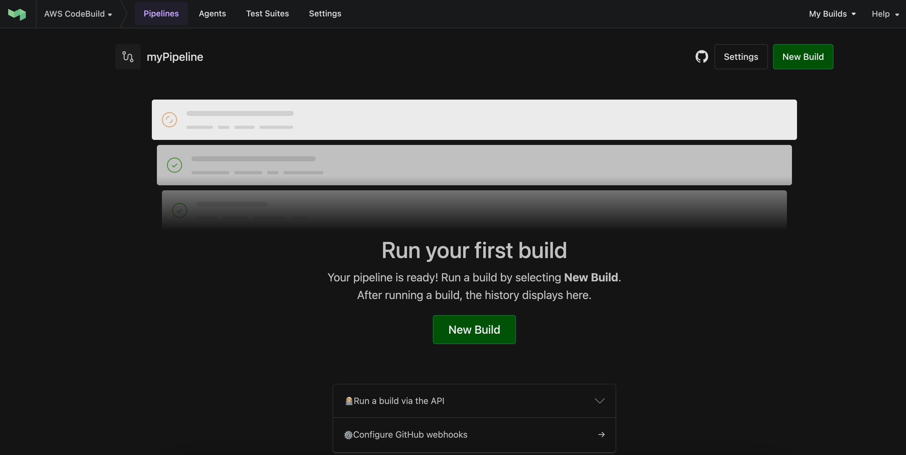
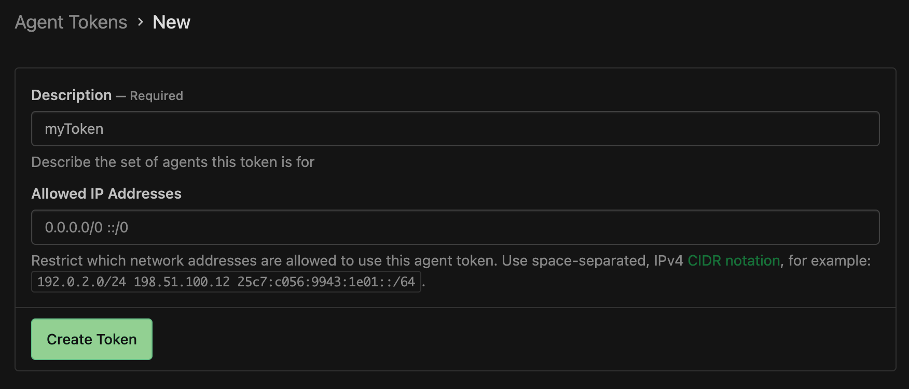
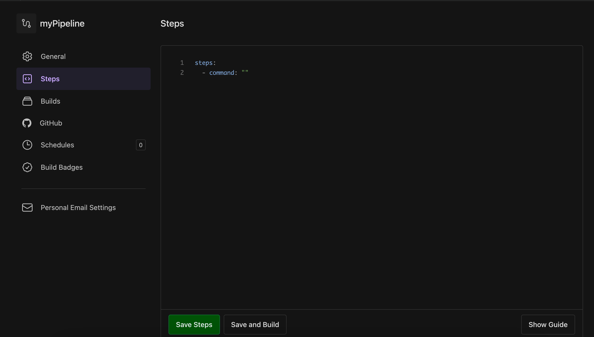
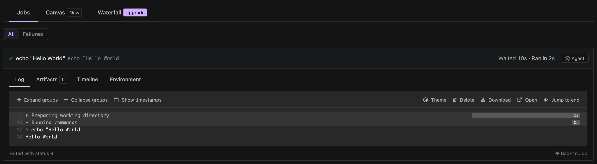
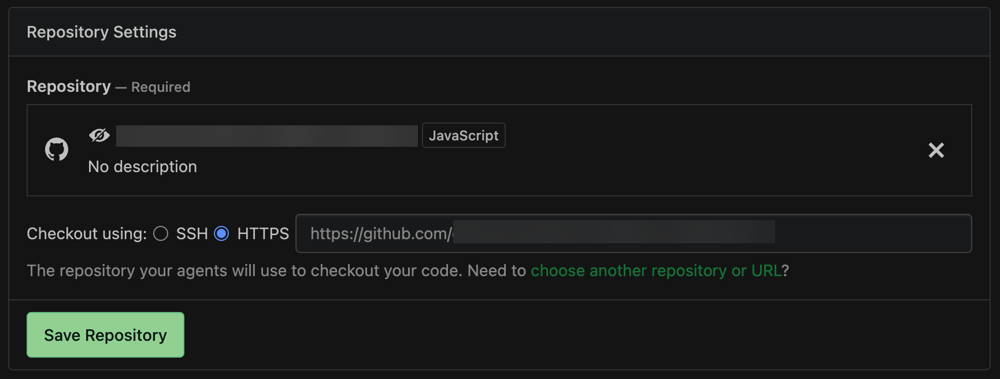
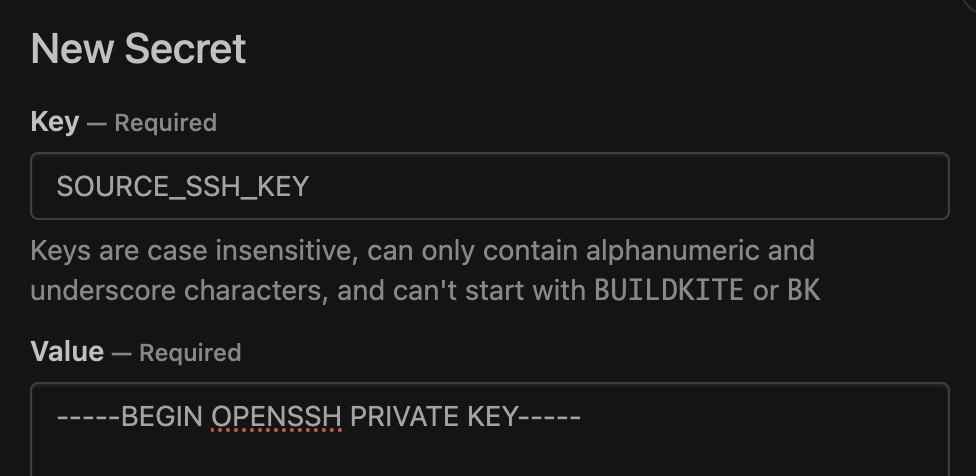
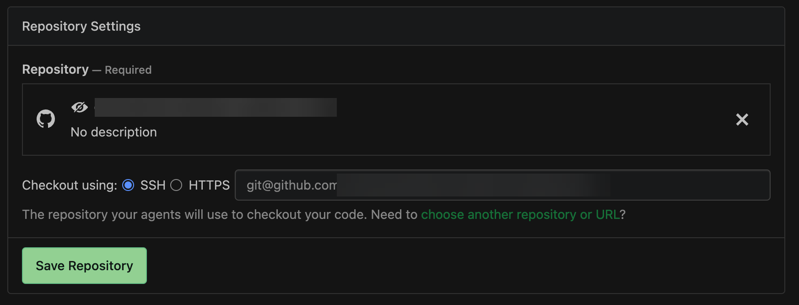

# Tutorial: Configure a CodeBuild-hosted Buildkite

runner

This tutorial shows you how to configure your CodeBuild projects to run Buildkite jobs. For
more information about using Buildkite with CodeBuild see [Self-managed Buildkite runner in AWS CodeBuild](buildkite-runner.md "buildkite-runner.md").

To complete this tutorial, you must first:

- Have access to a Buildkite organization. For more information about setting up
  a Buildkite account and organization, you can follow this [Getting Started
  Tutorial](https://buildkite.com/docs/pipelines/getting-started "https://buildkite.com/docs/pipelines/getting-started").
- Create a Buildkite pipeline, cluster, and queue configured to use self-hosted
  runners. For more information about setting up these resources, you can
  reference the [Buildkite Pipeline Setup Tutorial](https://buildkite.com/docs/pipelines/create-your-own "https://buildkite.com/docs/pipelines/create-your-own").



## Step 1: Generate a Buildkite agent token

In this step, you will generate an agent token within Buildkite that will be used to
authenticate the CodeBuild self-hosted runners. For more information about this resource,
see [Buildkite Agent
Tokens](https://buildkite.com/docs/agent/v3/tokens "https://buildkite.com/docs/agent/v3/tokens").

###### To generate a Buildkite agent token

1. In your Buildkite cluster, choose **Agent Tokens**, and then
   choose **New Token**.
2. Add a description to the token and click **Create
   Token**.
3. Save the agent token value, as it will be used later during the CodeBuild project
   setup.



## Step 2: Create a CodeBuild project

with a webhook

###### To create a CodeBuild project with a webhook

1. Open the AWS CodeBuild console at [https://console.aws.amazon.com/codesuite/codebuild/home](https://console.aws.amazon.com/codesuite/codebuild/home "https://console.aws.amazon.com/codesuite/codebuild/home").
2. Create a self-hosted build project. For information, see [Create a build project (console)](create-project.md#create-project-console "create-project.md#create-project-console")
   and [Run a build (console)](run-build-console.md "run-build-console.md").
   - In **Project configuration**, select
     **Runner project**. In **Runner**:
     - For **Runner provider**, choose
       **Buildkite**.
     - For **Buildkite agent token**, choose
       **Create a new agent token by using the create
       secret page**. You will be prompted to create a new
       secret in AWS Secrets Manager with a secret value equal to the Buildkite
       agent token you generated above.
     - (Optional) If you would like to use CodeBuild managed credentials
       for your job, select your job’s source repository provider under
       **Buildkite source credential options** and
       verify that credentials are configured for your account.
       Additionally, verify that your Buildkite pipeline uses
       **Checkout using HTTPS**.

   ###### Note

   Buildkite requires source credentials within the build environment
   in order to pull your job’s source. See [Authenticating Buildkite to a Private
   Repository](#sample-runner-buildkite-config "#sample-runner-buildkite-config") for available
   source credential options.
   - (Optional) In **Environment**:
     - Choose a supported **Environment image** and
       **Compute**.

     Note that you have the option to override the image and
     instance settings by using a label in your Buildkite YAML steps.
     For more information, see [Step 4: Update your Buildkite
     pipeline steps](#sample-runner-buildkite-update-pipeline "#sample-runner-buildkite-update-pipeline").

   - (Optional) In **Buildspec**:
     - Your buildspec will be ignored by default unless
       `buildspec-override: "true"` is added as a label.
       Instead, CodeBuild will override it to use commands that will set up
       the self-hosted runner.

     ###### Note

     CodeBuild does not support buildspec files for Buildkite
     self-hosted runner builds. For inline buildspecs, you will
     need to enable [git-credential-helper](build-spec-ref.md#build-spec.env.git-credential-helper "build-spec-ref.md#build-spec.env.git-credential-helper") in your buildspec if you
     have configured CodeBuild managed source credentials

3. Continue with the default values and then choose **Create build
   project**.
4. Save the **Payload URL** and **Secret**
   values from the **Create Webhook** popup. Either
   follow the instructions in the popup to create a new Buildkite organization
   webhook or continue to the next section.

## Step 3: Create a CodeBuild

webhook within Buildkite

In this step, you will use the **Payload URL** and
**Secret** values from the CodeBuild webhook to create a new webhook
within Buildkite. This webhook will be used to trigger builds within CodeBuild when a valid
Buildkite job starts.

###### To create a new webhook in Buildkite

1. Navigate to your Buildkite organization’s **Settings**
   page.
2. Under **Integrations**, select **Notification
   Services**.
3. Choose **Add** next to the **Webhook** box.
   In the **Add Webhook Notification** page, use the following
   configuration:
   1. Under **Webhook URL**, add the saved
      **Payload URL** value.
   2. Under **Token**, verify that **Send the token
      as X-Buildkite-Token** is selected. Add your webhook
      **Secret** value to the **Token**
      field.
   3. Under , verify that **Send the token as
      X-Buildkite-Token** is selected. Add your webhook
      **Secret** value to the **Token**
      field.
   4. Under **Events**, select the
      `job.scheduled` webhook event.
   5. (Optional) Under **Pipelines**, you can optionally
      choose to only trigger builds for a specific pipeline.

4. Choose **Add Webhook Notification**.

## Step 4: Update your Buildkite

pipeline steps

In this step, you will update your Buildkite pipeline’s steps in order to add
necessary labels and optional overrides. For the full list of supported label overrides,
see [Label overrides supported with the
CodeBuild-hosted Buildkite runner](buildkite-runner-update-labels.md "buildkite-runner-update-labels.md").

###### Update your pipeline steps

1. Navigate to your Buildkite pipeline steps page by selecting your Buildkite
   pipeline, choosing **Settings**, and then choosing
   **Steps**.

If you haven’t already, choose **Convert to YAML
steps**.

 2. At a minimum, you will need to specify a [Buildkite agent tag](https://buildkite.com/docs/agent/v3/cli-start#agent-targeting "https://buildkite.com/docs/agent/v3/cli-start#agent-targeting") referencing the name of your CodeBuild pipeline.
The project name is needed to link the AWS-related settings of your Buildkite
job to a specific CodeBuild project. By including the project name in the YAML,
CodeBuild is allowed to invoke jobs with the correct project settings.

```
agents:
  project: "codebuild-<project name>"
```

The following is an example of Buildkite pipeline steps with just the project
label tag:

```
agents:
  project: "codebuild-myProject"
steps:
  - command: "echo \"Hello World\""
```

You can also override your image and compute type in the label. See [Compute images supported with the
CodeBuild-hosted Buildkite runner](buildkite-runner-update-yaml.md "buildkite-runner-update-yaml.md") for a list of
available images. The compute type and image in the label will override the
environment settings on your project. To override your environment settings for
a CodeBuild EC2 or Lambda compute build, use the following syntax:

```
agents:
  project: "codebuild-`<project name>`"
  image: "`<environment-type>`-`<image-identifier>`"
  instance-size: "`<instance-size>`"
```

The following is an example of Buildkite pipeline steps with image and
instance size overrides:

```
agents:
  project: "codebuild-myProject"
  image: "arm-3.0"
  instance-size: "small"
steps:
  - command: "echo \"Hello World\""
```

You can override the fleet used for your build in the label. This will
override the fleet settings configured on your project to use the specified
fleet. For more information, see [Run builds on reserved capacity fleets](fleets.md "fleets.md") .

To override your fleet settings for an Amazon EC2 compute build, use the following
syntax:

```
agents:
  project: "codebuild-`<project name>`"
  fleet: "`<fleet-name>`"

```

To override both the fleet and the image used for the build, use the following
syntax:

```
agents:
  project: "codebuild-`<project name>`"
  fleet: "`<fleet-name>`"
  image: "`<environment-type>`-`<image-identifier>`"
```

The following is an example of Buildkite pipeline steps with fleet and image
overrides:

```
agents:
  project: "codebuild-myProject"
  fleet: "myFleet"
  image: "arm-3.0"
steps:
  - command: "echo \"Hello World\""
```

3. You can choose to run inline buildspec commands during the self-hosted
   Buildkite runner build (see [Run buildspec commands for the
   INSTALL, PRE_BUILD, and POST_BUILD phases](sample-runner-buildkite-buildspec.md "sample-runner-buildkite-buildspec.md") for more details). To
   specify that the CodeBuild build should run buildspec commands during your Buildkite
   self-hosted runner build, use the following syntax:

```
agents:
  project: "codebuild-`<project name>`"
  buildspec-override: "true"
```

The following is an example of a Buildkite pipeline with a buildspec
override:

```
agents:
  project: "codebuild-myProject"
  buildspec-override: "true"
steps:
  - command: "echo \"Hello World\""
```

4. Optionally, you can provide labels outside of those that CodeBuild supports. These
   labels will be ignored for the purpose of overriding attributes of the build,
   but will not fail the webhook request. For example, adding `myLabel:
“testLabel"` as a label will not prevent the build from
   running.

## Step 5: Review your results

Whenever a Buildkite job is started in your pipeline, CodeBuild will receive a
`job.scheduled` webhook event through the Buildkite webhook. For each job
in your Buildkite build, CodeBuild will start a build to run an ephemeral Buildkite runner.
The runner is responsible for executing a single Buildkite job. Once the job is
completed, the runner and the associated build process will be immediately
terminated.

To view your workflow job logs, navigate to your Buildkite pipeline and select the
most recent build (you can trigger a new build by choosing **New
Build**). Once the associated CodeBuild build for each of your jobs starts and
picks up the job, you should see logs for the job within the Buildkite console



## Authenticating Buildkite to a Private

Repository

If you have a private repository configured within your Buildkite pipeline, Buildkite
requires [additional
permissions within the build environment](https://buildkite.com/docs/agent/v3/github-ssh-keys "https://buildkite.com/docs/agent/v3/github-ssh-keys") to pull the repository, as
Buildkite does not vend credentials to self-hosted runners to pull from private
repositories. In order to authenticate the Buildkite self-hosted runner agent to your
external private source repository, you can use one of the following options.

###### To authenticate with CodeBuild

CodeBuild offers managed credentials handling for Supported source types. In order to
use CodeBuild source credentials to pull your job’s source repository, you can use the
following steps:

1. In the CodeBuild console, navigate to **Edit project** or create
   a new CodeBuild project using the steps in [Step 2: Create a CodeBuild project
   with a webhook](#sample-runner-buildkite-create-project "#sample-runner-buildkite-create-project").
2. Under **Buildkite source credential options**, select your
   job’s source repository provider.
   1. If you would like to use account-level CodeBuild credentials, verify that
      they are configured correctly. Additionally, if your project has an
      inline buildspec configured, verify that [git-credential-helper](build-spec-ref.md#build-spec.env.git-credential-helper "build-spec-ref.md#build-spec.env.git-credential-helper") is enabled.
   2. If you would like to use project level CodeBuild credentials, select
      **Use override credentials for this project only**
      and set up credentials for your project.

3. In your Buildkite pipeline settings, navigate to **Repository
   Settings**. Set your source repository checkout settings to
   **Checkout using HTTPS**



###### To authenticate with Buildkite secrets

Buildkite maintains an [ssh-checkout plugin](https://github.com/buildkite-plugins/git-ssh-checkout-buildkite-plugin "https://github.com/buildkite-plugins/git-ssh-checkout-buildkite-plugin") which can be used to authenticate the self-hosted
runner to an external source repository using an ssh key. The key value is stored as
a [Buildkite secret](https://buildkite.com/docs/pipelines/security/secrets/buildkite-secrets "https://buildkite.com/docs/pipelines/security/secrets/buildkite-secrets") and fetched automatically by the Buildkite self-hosted
runner agent when attempting to pull a private repository. In order to configure the
ssh-checkout plugin for your Buildkite pipeline, you can use the following
steps:

1. Generate a private and public ssh key using your email address e.g.
   `ssh-keygen -t rsa -b 4096 -C "myEmail@address.com"`
2. Add the public key to your private source repository. For example, you can
   follow [this guide](https://docs.github.com/en/authentication/connecting-to-github-with-ssh/adding-a-new-ssh-key-to-your-github-account "https://docs.github.com/en/authentication/connecting-to-github-with-ssh/adding-a-new-ssh-key-to-your-github-account") to add a key to a GitHub account.
3. Add a [new SSH key secret](https://buildkite.com/docs/pipelines/hosted-agents/code-access#private-repositories-with-other-providers-add-the-ssh-key-secret "https://buildkite.com/docs/pipelines/hosted-agents/code-access#private-repositories-with-other-providers-add-the-ssh-key-secret") to your Buildkite cluster. Within your
   Buildkite cluster, select **Secrets** → **New
   Secret**. Add a name for you secret in the **Key**
   field and add your private SSH key into the **Value**
   field:

 4. Within your Buildkite pipeline, navigate to your repository settings and set
checkout to use **SSH**.

 5. Update your pipeline YAML steps to use the `git-ssh-checkout`
plugin. For example, the following pipeline YAML file uses the checkout action
with the above Buildkite secret key:

```
agents:
  project: "codebuild-myProject"
steps:
  - command: "npm run build"
    plugins:
      - git-ssh-checkout#v0.4.1:
          ssh-secret-key-name: 'SOURCE_SSH_KEY'
```

6. When running a Buildkite self-hosted runner job within CodeBuild, Buildkite will
   now automatically use your configured secret value when pulling your private
   repository

## Runner configuration options

You can specify the following environment variables in your project configuration to
modify the setup configuration of your self-hosted runners:

- `CODEBUILD_CONFIG_BUILDKITE_AGENT_TOKEN`: CodeBuild will fetch the
  secret value configured as the value of this environment variable from AWS Secrets Manager
  in order to register the Buildkite self-hosted runner agent. This environment
  variable must be of type `SECRETS_MANAGER`, and the value should be
  the name of your secret in Secrets Manager. A Buildkite agent token environment variable
  is required for all Buildkite runner projects.
- `CODEBUILD_CONFIG_BUILDKITE_CREDENTIAL_DISABLE`: By default, CodeBuild
  will load account or project level source credentials into the build
  environment, as these credentials are used by the Buildkite agent to pull the
  job’s source repository. To disable this behavior, you can add this environment
  variable to your project with the value set to `true`, which will
  prevent source credentials from being loaded into the build environment.
