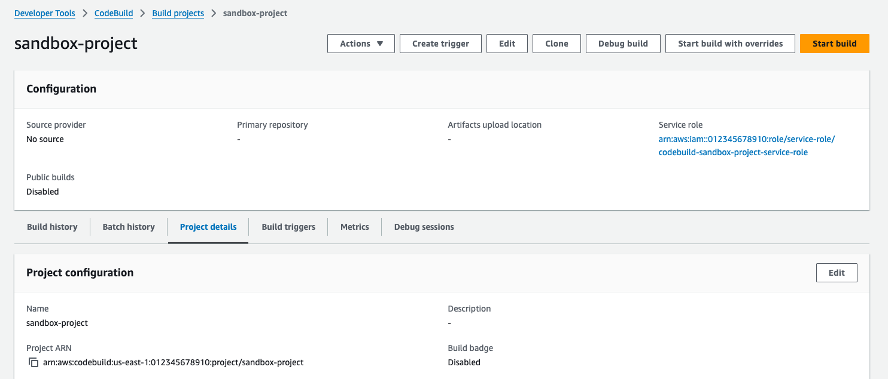
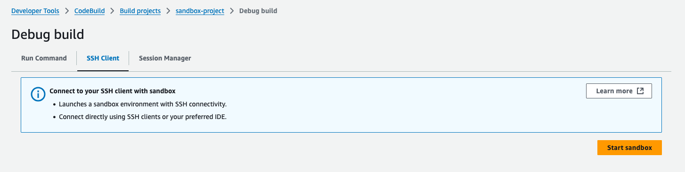
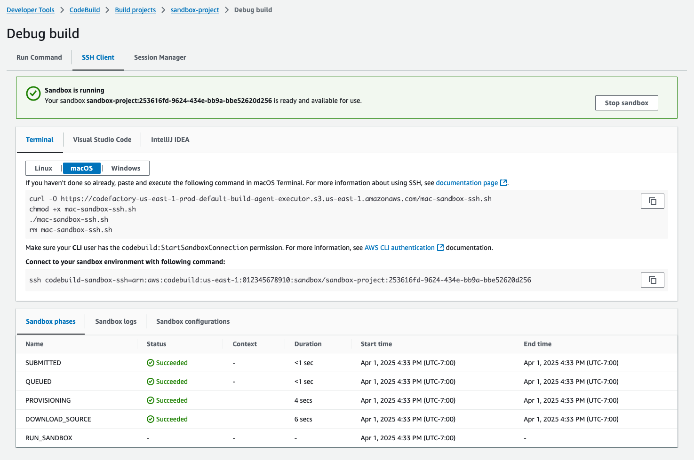
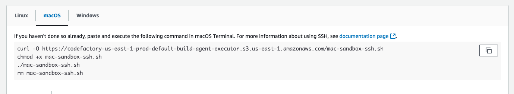
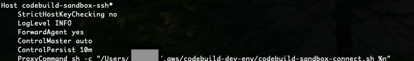

# Tutorial: Connecting to a sandbox using SSH

This tutorial shows you how to connect to a CodeBuild sandbox using an SSH client.

To complete this tutorial, you must first:

- Ensure you have an existing AWS CodeBuild project.
- Setup appropriate IAM permissions configured for your CodeBuild project role.
- Install and configure AWS CLI on your local machine.

## Step 1: Start a sandbox

###### To start a CodeBuild sandbox in the console

1. Open the AWS CodeBuild console at [https://console.aws.amazon.com/codesuite/codebuild/home](https://console.aws.amazon.com/codesuite/codebuild/home "https://console.aws.amazon.com/codesuite/codebuild/home").
2. In the navigation pane, choose **Build projects**. Choose the
   build project, and then choose **Debug build**.

 3. In the **SSH Client** tab and choose **Start sandbox**.

 4. The sandbox initialization process may take some time. You can connect to the sandbox when its
status changes to `RUN_SANDDBOX`.



## Step 2: Modify local SSH configuration

If you're connecting to sandbox for the first time, you need to perform a one-time setup process using
the following steps:

###### To modify the local SSH configuration in the console

1. Locate the setup commands for your operating system.
2. Open your local terminal, then copy and execute the provided commands to download and
   run the script to set up your local SSH configuration. For example, if your
   operating system is macOS, use the following command:

 3. The configuration script will add the required configurations for connecting to your sandboxes.
You'll be prompted to accept these changes. 4. Upon successful configuration, a new SSH configuration entry for CodeBuild
sandbox will be created.



## Step 3: Connect to the sandbox

###### To modify the local SSH configuration in the console

1. Configure AWS CLI Authentication and ensure your AWS CLI user has the
   `codebuild:StartSandboxConnection` permission. For more information, see
   [Authenticating using IAM user credentials for the AWS CLI](../../../cli/v1/userguide/cli-authentication-user.md "../../../cli/v1/userguide/cli-authentication-user.md") in the
   _AWS Command Line Interface User Guide for Version 1_.
2. Connect to your sandbox with following command:

```
ssh codebuild-sandbox-ssh=arn:aws:codebuild:us-east-1:`<account-id>`:sandbox/`<sandbox-id>`
```

###### Note

To troubleshoot connection failures, use the `-v` flag to enable verbose output.
For example, `ssh -v codebuild-sandbox-ssh=arn:aws:codebuild:us-east-1:`<account-id>`:sandbox/`<sandbox-id>``.

For additional troubleshooting guidance, see [Troubleshooting AWS CodeBuild sandbox SSH connection issues](sandbox-troubleshooting.md "sandbox-troubleshooting.md").

## Step 4: Review your results

Once connected, you can debug build failures, test build commands, experiment with configuration
changes and verify environment variables and dependencies with your sandbox.
