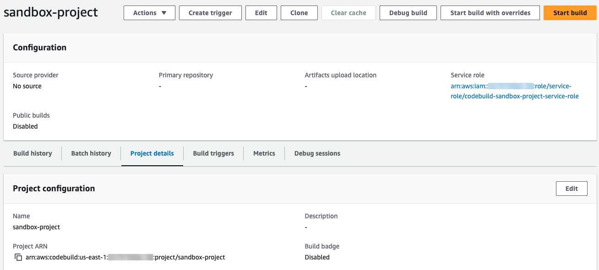
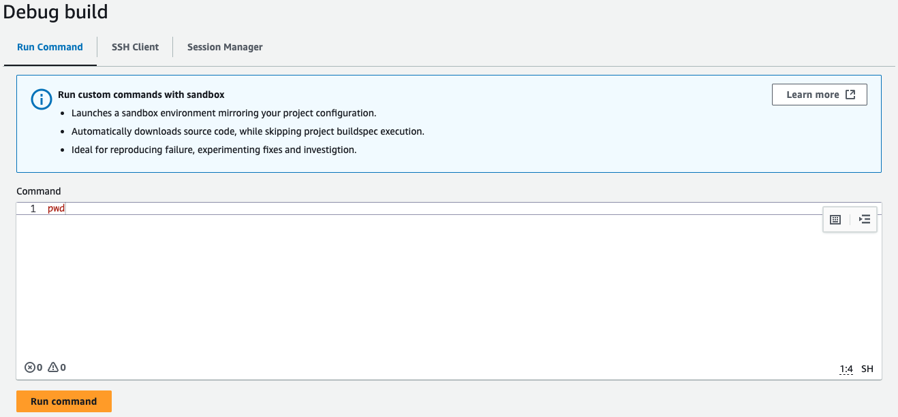
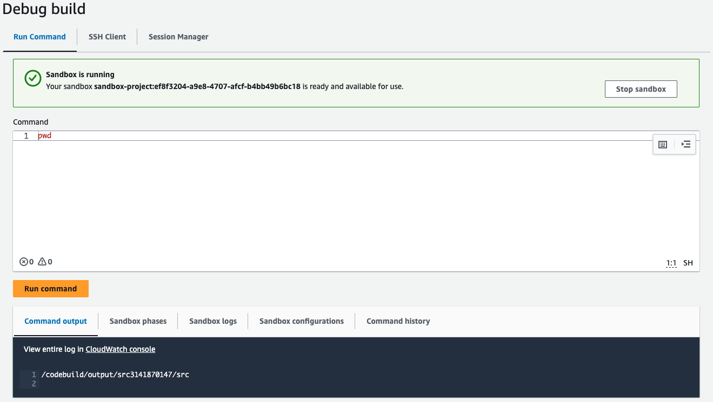
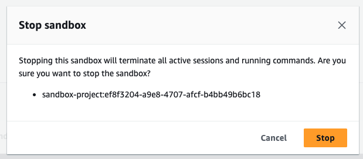
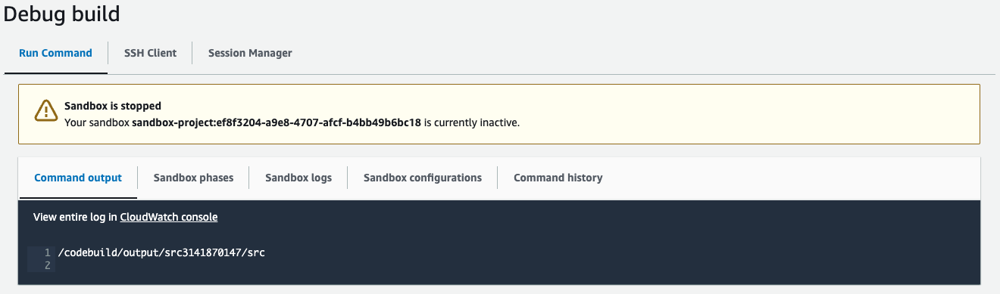
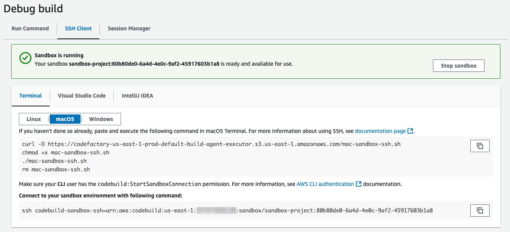
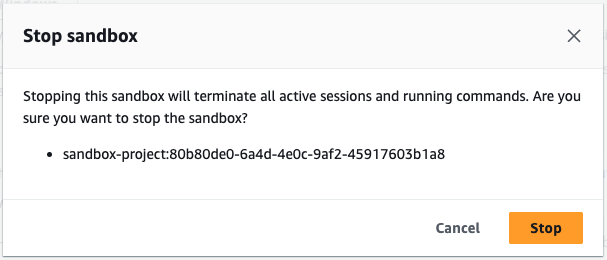
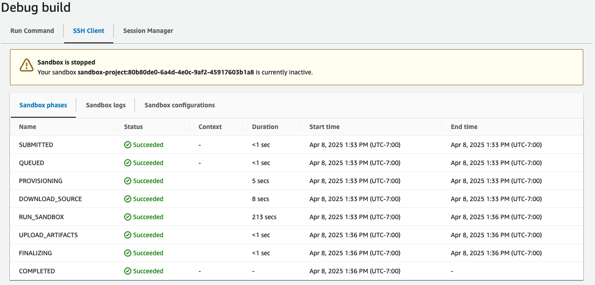

# Debug builds with CodeBuild sandbox

In AWS CodeBuild, you can debug a build by using CodeBuild sandbox to run custom
commands and troubleshoot your build.

###### Topics

- [Prerequisites](#sandbox-prereq "#sandbox-prereq")
- [Debug builds with CodeBuild sandbox (console)](#sandbox-console "#sandbox-console")
- [Debug builds with CodeBuild sandbox (AWS CLI)](#sandbox-cli "#sandbox-cli")
- [Tutorial: Connecting to a sandbox using SSH](sandbox-ssh-tutorial.md "sandbox-ssh-tutorial.md")
- [Troubleshooting AWS CodeBuild sandbox SSH connection issues](sandbox-troubleshooting.md "sandbox-troubleshooting.md")

## Prerequisites

Before using a CodeBuild sandbox, make sure that your CodeBuild service role has the following SSM policy:

JSON

```
`{
 "Version":"2012-10-17",
 "Statement": [
 {
 "Effect": "Allow",
 "Action": [
 "ssmmessages:CreateControlChannel",
 "ssmmessages:CreateDataChannel",
 "ssmmessages:OpenControlChannel",
 "ssmmessages:OpenDataChannel"
 ],
 "Resource": "*"
 },
 {
 "Effect": "Allow",
 "Action": [
 "ssm:StartSession"
 ],
 "Resource": [
 "arn:aws:codebuild:us-east-1:`111122223333`:build/*",
 "arn:aws:ssm:us-east-1::document/AWS-StartSSHSession"
 ]
 }
 ]
}`

```

## Debug builds with CodeBuild sandbox (console)

Use the following instructions to run commands and connect your SSH client with CodeBuild sandbox in the console.

### Run commands with CodeBuild sandbox (console)

1. Open the AWS CodeBuild console at [https://console.aws.amazon.com/codesuite/codebuild/home](https://console.aws.amazon.com/codesuite/codebuild/home "https://console.aws.amazon.com/codesuite/codebuild/home").
2. In the navigation pane, choose **Build projects**. Choose the
   build project, and then choose **Debug build**.

 3. In the **Run command** tab, enter your custom commands,
and then choose **Run command**.

 4. Your CodeBuild sandbox will then be initialized and start running your custom commands.
The output will be shown in the **Output** tab when it's completed.

 5. When troubleshooting is completed, you can stop the sandbox by choosing
**Stop sandbox**. Then choose **Stop** to confirm
that your sandbox will be stopped.





### Connect to your SSH client with CodeBuild sandbox (console)

1. Open the AWS CodeBuild console at [https://console.aws.amazon.com/codesuite/codebuild/home](https://console.aws.amazon.com/codesuite/codebuild/home "https://console.aws.amazon.com/codesuite/codebuild/home").
2. In the navigation pane, choose **Build projects**. Choose the
   build project, and then choose **Debug build**.

 3. In the **SSH Client** tab and choose **Start sandbox**.

 4. After the CodeBuild sandbox starts running, follow the console instructions to connect your SSH
client with the sandbox.

 5. When troubleshooting is completed, you can stop the sandbox by choosing
**Stop sandbox**. Then choose **Stop** to confirm
that your sandbox will be stopped.





## Debug builds with CodeBuild sandbox (AWS CLI)

Use the following instructions to run commands and connect your SSH client with CodeBuild sandbox.

### Start a CodeBuild sandbox (AWS CLI)

CLI command

```
aws codebuild start-sandbox --project-name $PROJECT_NAME
```

- `--project-name` : CodeBuild project name

Sample request

```
aws codebuild start-sandbox --project-name "project-name"
```

Sample response

```
{
    "id": "project-name",
    "arn": "arn:aws:codebuild:us-west-2:962803963624:sandbox/project-name",
    "projectName": "project-name",
    "requestTime": "2025-02-06T11:24:15.560000-08:00",
    "status": "QUEUED",
    "source": {
        "type": "S3",
        "location": "arn:aws:s3:::cofa-e2e-test-1-us-west-2-beta-default-build-sources/eb-sample-jetty-v4.zip",
        "insecureSsl": false
    },
    "environment": {
        "type": "LINUX_CONTAINER",
        "image": "aws/codebuild/standard:6.0",
        "computeType": "BUILD_GENERAL1_SMALL",
        "environmentVariables": [{
                "name": "foo",
                "value": "bar",
                "type": "PLAINTEXT"
            },
            {
                "name": "bar",
                "value": "baz",
                "type": "PLAINTEXT"
            }
        ],
        "privilegedMode": false,
        "imagePullCredentialsType": "CODEBUILD"
    },
    "timeoutInMinutes": 10,
    "queuedTimeoutInMinutes": 480,
    "logConfig": {
        "cloudWatchLogs": {
            "status": "ENABLED",
            "groupName": "group",
            "streamName": "stream"
        },
        "s3Logs": {
            "status": "ENABLED",
            "location": "codefactory-test-pool-1-us-west-2-beta-default-build-logs",
            "encryptionDisabled": false
        }
    },
    "encryptionKey": "arn:aws:kms:us-west-2:962803963624:alias/SampleEncryptionKey",
    "serviceRole": "arn:aws:iam::962803963624:role/BuildExecutionServiceRole",
    "currentSession": {
        "id": "0103e0e7-52aa-4a3d-81dd-bfc27226fa54",
        "currentPhase": "QUEUED",
        "status": "QUEUED",
        "startTime": "2025-02-06T11:24:15.626000-08:00",
        "logs": {
            "groupName": "group",
            "streamName": "stream/0103e0e7-52aa-4a3d-81dd-bfc27226fa54",
            "deepLink": "https://console.aws.amazon.com/cloudwatch/home?region=us-west-2#logsV2:log-groups/log-group/group/log-events/stream$252F0103e0e7-52aa-4a3d-81dd-bfc27226fa54",
            "s3DeepLink": "https://s3.console.aws.amazon.com/s3/object/codefactory-test-pool-1-us-west-2-beta-default-build-logs/0103e0e7-52aa-4a3d-81dd-bfc27226fa54.gz?region=us-west-2",
            "cloudWatchLogsArn": "arn:aws:logs:us-west-2:962803963624:log-group:group:log-stream:stream/0103e0e7-52aa-4a3d-81dd-bfc27226fa54",
            "s3LogsArn": "arn:aws:s3:::codefactory-test-pool-1-us-west-2-beta-default-build-logs/0103e0e7-52aa-4a3d-81dd-bfc27226fa54.gz",
            "cloudWatchLogs": {
                "status": "ENABLED",
                "groupName": "group",
                "streamName": "stream"
            },
            "s3Logs": {
                "status": "ENABLED",
                "location": "codefactory-test-pool-1-us-west-2-beta-default-build-logs",
                "encryptionDisabled": false
            }
        }
    }
}
```

### Get information about the sandbox status (AWS CLI)

CLI command

```
aws codebuild batch-get-sandboxes --ids $SANDBOX_IDs
```

Sample request

```
aws codebuild stop-sandbox --id "arn:aws:codebuild:us-west-2:962803963624:sandbox/project-name"
```

- `--ids` : Comma separated list of `sandboxIds` or `sandboxArns`.

You can either provide a sandbox ID or a sandbox ARN:

- Sandbox ID: ``<codebuild-project-name>`:`<UUID>``

For example, `project-name:d25be134-05cb-404a-85da-ac5f85d2d72c`.

- Sandbox ARN: arn:aws:codebuild:`<region>`:`<account-id>`:sandbox/`<codebuild-project-name>`:`<UUID>`

For example, `arn:aws:codebuild:us-west-2:962803963624:sandbox/project-name:d25be134-05cb-404a-85da-ac5f85d2d72c`.

Sample response

```
{
    "sandboxes": [{
        "id": "project-name",
        "arn": "arn:aws:codebuild:us-west-2:962803963624:sandbox/project-name",
        "projectName": "project-name",
        "requestTime": "2025-02-06T11:24:15.560000-08:00",
        "endTime": "2025-02-06T11:39:21.587000-08:00",
        "status": "STOPPED",
        "source": {
            "type": "S3",
            "location": "arn:aws:s3:::cofa-e2e-test-1-us-west-2-beta-default-build-sources/eb-sample-jetty-v4.zip",
            "insecureSsl": false
        },
        "environment": {
            "type": "LINUX_CONTAINER",
            "image": "aws/codebuild/standard:6.0",
            "computeType": "BUILD_GENERAL1_SMALL",
            "environmentVariables": [{
                    "name": "foo",
                    "value": "bar",
                    "type": "PLAINTEXT"
                },
                {
                    "name": "bar",
                    "value": "baz",
                    "type": "PLAINTEXT"
                }
            ],
            "privilegedMode": false,
            "imagePullCredentialsType": "CODEBUILD"
        },
        "timeoutInMinutes": 10,
        "queuedTimeoutInMinutes": 480,
        "logConfig": {
            "cloudWatchLogs": {
                "status": "ENABLED",
                "groupName": "group",
                "streamName": "stream"
            },
            "s3Logs": {
                "status": "ENABLED",
                "location": "codefactory-test-pool-1-us-west-2-beta-default-build-logs",
                "encryptionDisabled": false
            }
        },
        "encryptionKey": "arn:aws:kms:us-west-2:962803963624:alias/SampleEncryptionKey",
        "serviceRole": "arn:aws:iam::962803963624:role/BuildExecutionServiceRole",
        "currentSession": {
            "id": "0103e0e7-52aa-4a3d-81dd-bfc27226fa54",
            "currentPhase": "COMPLETED",
            "status": "STOPPED",
            "startTime": "2025-02-06T11:24:15.626000-08:00",
            "endTime": "2025-02-06T11:39:21.600000-08:00",
            "phases": [{
                    "phaseType": "SUBMITTED",
                    "phaseStatus": "SUCCEEDED",
                    "startTime": "2025-02-06T11:24:15.577000-08:00",
                    "endTime": "2025-02-06T11:24:15.606000-08:00",
                    "durationInSeconds": 0
                },
                {
                    "phaseType": "QUEUED",
                    "phaseStatus": "SUCCEEDED",
                    "startTime": "2025-02-06T11:24:15.606000-08:00",
                    "endTime": "2025-02-06T11:24:16.067000-08:00",
                    "durationInSeconds": 0
                },
                {
                    "phaseType": "PROVISIONING",
                    "phaseStatus": "SUCCEEDED",
                    "startTime": "2025-02-06T11:24:16.067000-08:00",
                    "endTime": "2025-02-06T11:24:20.519000-08:00",
                    "durationInSeconds": 4,
                    "contexts": [{
                        "statusCode": "",
                        "message": ""
                    }]
                },
                {
                    "phaseType": "DOWNLOAD_SOURCE",
                    "phaseStatus": "SUCCEEDED",
                    "startTime": "2025-02-06T11:24:20.519000-08:00",
                    "endTime": "2025-02-06T11:24:22.238000-08:00",
                    "durationInSeconds": 1,
                    "contexts": [{
                        "statusCode": "",
                        "message": ""
                    }]
                },
                {
                    "phaseType": "RUNNING_SANDBOX",
                    "phaseStatus": "TIMED_OUT",
                    "startTime": "2025-02-06T11:24:22.238000-08:00",
                    "endTime": "2025-02-06T11:39:21.560000-08:00",
                    "durationInSeconds": 899,
                    "contexts": [{
                        "statusCode": "BUILD_TIMED_OUT",
                        "message": "Build has timed out. "
                    }]
                },
                {
                    "phaseType": "COMPLETED",
                    "startTime": "2025-02-06T11:39:21.560000-08:00"
                }
            ],
            "logs": {
                "groupName": "group",
                "streamName": "stream/0103e0e7-52aa-4a3d-81dd-bfc27226fa54",
                "deepLink": "https://console.aws.amazon.com/cloudwatch/home?region=us-west-2#logsV2:log-groups/log-group/group/log-events/stream$252F0103e0e7-52aa-4a3d-81dd-bfc27226fa54",
                "s3DeepLink": "https://s3.console.aws.amazon.com/s3/object/codefactory-test-pool-1-us-west-2-beta-default-build-logs/0103e0e7-52aa-4a3d-81dd-bfc27226fa54.gz?region=us-west-2",
                "cloudWatchLogsArn": "arn:aws:logs:us-west-2:962803963624:log-group:group:log-stream:stream/0103e0e7-52aa-4a3d-81dd-bfc27226fa54",
                "s3LogsArn": "arn:aws:s3:::codefactory-test-pool-1-us-west-2-beta-default-build-logs/0103e0e7-52aa-4a3d-81dd-bfc27226fa54.gz",
                "cloudWatchLogs": {
                    "status": "ENABLED",
                    "groupName": "group",
                    "streamName": "stream"
                },
                "s3Logs": {
                    "status": "ENABLED",
                    "location": "codefactory-test-pool-1-us-west-2-beta-default-build-logs",
                    "encryptionDisabled": false
                }
            }
        }
    }],
    "sandboxesNotFound": []
}
```

### Stop a sandbox (AWS CLI)

CLI command

```
aws codebuild stop-sandbox --id $SANDBOX-ID
```

- `--id` : A `sandboxId` or `sandboxArn`.

Sample request

```
aws codebuild stop-sandbox --id "arn:aws:codebuild:us-west-2:962803963624:sandbox/project-name"
```

Sample response

```
{
    "id": "project-name",
    "arn": "arn:aws:codebuild:us-west-2:962803963624:sandbox/project-name",
    "projectName": "project-name",
    "requestTime": "2025-02-06T11:24:15.560000-08:00",
    "status": "STOPPING",
    "source": {
        "type": "S3",
        "location": "arn:aws:s3:::cofa-e2e-test-1-us-west-2-beta-default-build-sources/eb-sample-jetty-v4.zip",
        "insecureSsl": false
    },
    "environment": {
        "type": "LINUX_CONTAINER",
        "image": "aws/codebuild/standard:6.0",
        "computeType": "BUILD_GENERAL1_SMALL",
        "environmentVariables": [{
                "name": "foo",
                "value": "bar",
                "type": "PLAINTEXT"
            },
            {
                "name": "bar",
                "value": "baz",
                "type": "PLAINTEXT"
            }
        ],
        "privilegedMode": false,
        "imagePullCredentialsType": "CODEBUILD"
    },
    "timeoutInMinutes": 10,
    "queuedTimeoutInMinutes": 480,
    "logConfig": {
        "cloudWatchLogs": {
            "status": "ENABLED",
            "groupName": "group",
            "streamName": "stream"
        },
        "s3Logs": {
            "status": "ENABLED",
            "location": "codefactory-test-pool-1-us-west-2-beta-default-build-logs",
            "encryptionDisabled": false
        }
    },
    "encryptionKey": "arn:aws:kms:us-west-2:962803963624:alias/SampleEncryptionKey",
    "serviceRole": "arn:aws:iam::962803963624:role/BuildExecutionServiceRole",
    "currentSession": {
        "id": "0103e0e7-52aa-4a3d-81dd-bfc27226fa54",
        "currentPhase": "RUN_SANDBOX",
        "status": "STOPPING",
        "startTime": "2025-02-06T11:24:15.626000-08:00",
        "phases": [{
                "phaseType": "SUBMITTED",
                "phaseStatus": "SUCCEEDED",
                "startTime": "2025-02-08T14:33:26.144000-08:00",
                "endTime": "2025-02-08T14:33:26.173000-08:00",
                "durationInSeconds": 0
            },
            {
                "phaseType": "QUEUED",
                "phaseStatus": "SUCCEEDED",
                "startTime": "2025-02-08T14:33:26.173000-08:00",
                "endTime": "2025-02-08T14:33:26.702000-08:00",
                "durationInSeconds": 0
            },
            {
                "phaseType": "PROVISIONING",
                "phaseStatus": "SUCCEEDED",
                "startTime": "2025-02-08T14:33:26.702000-08:00",
                "endTime": "2025-02-08T14:33:30.530000-08:00",
                "durationInSeconds": 3,
                "contexts": [{
                    "statusCode": "",
                    "message": ""
                }]
            },
            {
                "phaseType": "DOWNLOAD_SOURCE",
                "phaseStatus": "SUCCEEDED",
                "startTime": "2025-02-08T14:33:30.530000-08:00",
                "endTime": "2025-02-08T14:33:33.478000-08:00",
                "durationInSeconds": 2,
                "contexts": [{
                    "statusCode": "",
                    "message": ""
                }]
            },
            {
                "phaseType": "RUN_SANDBOX",
                "startTime": "2025-02-08T14:33:33.478000-08:00"
            }
        ],
        "logs": {
            "groupName": "group",
            "streamName": "stream/0103e0e7-52aa-4a3d-81dd-bfc27226fa54",
            "deepLink": "https://console.aws.amazon.com/cloudwatch/home?region=us-west-2#logsV2:log-groups/log-group/group/log-events/stream$252F0103e0e7-52aa-4a3d-81dd-bfc27226fa54",
            "s3DeepLink": "https://s3.console.aws.amazon.com/s3/object/codefactory-test-pool-1-us-west-2-beta-default-build-logs/0103e0e7-52aa-4a3d-81dd-bfc27226fa54.gz?region=us-west-2",
            "cloudWatchLogsArn": "arn:aws:logs:us-west-2:962803963624:log-group:group:log-stream:stream/0103e0e7-52aa-4a3d-81dd-bfc27226fa54",
            "s3LogsArn": "arn:aws:s3:::codefactory-test-pool-1-us-west-2-beta-default-build-logs/0103e0e7-52aa-4a3d-81dd-bfc27226fa54.gz",
            "cloudWatchLogs": {
                "status": "ENABLED",
                "groupName": "group",
                "streamName": "stream"
            },
            "s3Logs": {
                "status": "ENABLED",
                "location": "codefactory-test-pool-1-us-west-2-beta-default-build-logs",
                "encryptionDisabled": false
            }
        }
    }
}
```

### Start a command execution (AWS CLI)

CLI command

```
aws codebuild start-command-execution --command $COMMAND --type $TYPE --sandbox-id $SANDBOX-ID
```

- `--command` : The command that needs to be executed.
- `--sandbox-id` : A `sandboxId` or `sandboxArn`.
- `--type` : The command type, `SHELL`.

Sample request

```
aws codebuild start-command-execution --command "echo "Hello World"" --type SHELL --sandbox-id "arn:aws:codebuild:us-west-2:962803963624:sandbox/project-name
```

Sample response

```
{
    "id": "e1c658c2-02bb-42a8-9abb-94835241fcd6",
    "sandboxId": "f7126a4a-b0d5-452f-814c-fea73718f805",
    "submitTime": "2025-02-06T20:12:02.683000-08:00",
    "status": "SUBMITTED",
    "command": "echo \"Hello World\"",
    "type": "SHELL",
    "logs": {
        "groupName": "group",
        "streamName": "stream",
        "deepLink": "https://console.aws.amazon.com/cloudwatch/home?region=us-west-2#logsV2:log-groups/log-group/group/log-events/stream",
        "s3DeepLink": "https://s3.console.aws.amazon.com/s3/object/codefactory-test-pool-1-us-west-2-beta-default-build-logs/f7126a4a-b0d5-452f-814c-fea73718f805.gz?region=us-west-2",
        "cloudWatchLogsArn": "arn:aws:logs:us-west-2:962803963624:log-group:group:log-stream:stream",
        "s3LogsArn": "arn:aws:s3:::codefactory-test-pool-1-us-west-2-beta-default-build-logs/f7126a4a-b0d5-452f-814c-fea73718f805.gz",
        "cloudWatchLogs": {
            "status": "ENABLED",
            "groupName": "group",
            "streamName": "stream"
        },
        "s3Logs": {
            "status": "ENABLED",
            "location": "codefactory-test-pool-1-us-west-2-beta-default-build-logs",
            "encryptionDisabled": false
        }
    }
}
```

### Get information about the command executions (AWS CLI)

CLI command

```
aws codebuild batch-get-command-executions --command-execution-ids $COMMAND-IDs --sandbox-id $SANDBOX-IDs
```

- `--command-execution-ids` : Comma separated list of `commandExecutionIds`.
- `--sandbox-id` : A `sandboxId` or `sandboxArn`.

Sample request

```
aws codebuild batch-get-command-executions --command-execution-ids"c3c085ed-5a8f-4531-8e95-87d547f27ffd" --sandbox-id "arn:aws:codebuild:us-west-2:962803963624:sandbox/project-name"
```

Sample response

```
{
    "commandExecutions": [{
        "id": "c3c085ed-5a8f-4531-8e95-87d547f27ffd",
        "sandboxId": "cd71e456-2a4c-4db4-ada5-da892b0bba05",
        "submitTime": "2025-02-10T20:18:17.118000-08:00",
        "startTime": "2025-02-10T20:18:17.939000-08:00",
        "endTime": "2025-02-10T20:18:17.976000-08:00",
        "status": "SUCCEEDED",
        "command": "echo \"Hello World\"",
        "type": "SHELL",
        "exitCode": "0",
        "standardOutputContent": "Hello World\n",
        "logs": {
            "groupName": "group",
            "streamName": "stream",
            "deepLink": "https://console.aws.amazon.com/cloudwatch/home?region=us-west-2#logsV2:log-groups/log-group/group/log-events/stream",
            "s3DeepLink": "https://s3.console.aws.amazon.com/s3/object/codefactory-test-pool-1-us-west-2-beta-default-build-logs/cd71e456-2a4c-4db4-ada5-da892b0bba05.gz?region=us-west-2",
            "cloudWatchLogsArn": "arn:aws:logs:us-west-2:962803963624:log-group:group:log-stream:stream",
            "s3LogsArn": "arn:aws:s3:::codefactory-test-pool-1-us-west-2-beta-default-build-logs/cd71e456-2a4c-4db4-ada5-da892b0bba05.gz",
            "cloudWatchLogs": {
                "status": "ENABLED",
                "groupName": "group",
                "streamName": "stream"
            },
            "s3Logs": {
                "status": "ENABLED",
                "location": "codefactory-test-pool-1-us-west-2-beta-default-build-logs",
                "encryptionDisabled": false
            }
        }
    }],
    "commandExecutionsNotFound": []
}
```

### List command executions for a sandbox (AWS CLI)

CLI command

```
aws codebuild list-command-executions-for-sandbox --sandbox-id $SANDBOX-ID --next-token $NEXT_TOKEN --max-results $MAX_RESULTS --sort-order $SORT_ORDER
```

- `--next-token` : The next token, if any, to get paginated results. You will get this value from previous execution of list sandboxes.
- `--max-results` : (Optional) The maximum number of sandbox records to be retrieved.
- `--sort-order` : The order in which sandbox records should be retrieved.

Sample request

```
aws codebuild list-command-executions-for-sandbox --sandbox-id "arn:aws:codebuild:us-west-2:962803963624:sandbox/project-name"
```

Sample response

```
{
    "commandExecutions": [{
            "id": "aad6687e-07bc-45ab-a1fd-f5440229b528",
            "sandboxId": "cd71e456-2a4c-4db4-ada5-da892b0bba05",
            "submitTime": "2025-02-10T20:18:35.304000-08:00",
            "startTime": "2025-02-10T20:18:35.615000-08:00",
            "endTime": "2025-02-10T20:18:35.651000-08:00",
            "status": "FAILED",
            "command": "fail command",
            "type": "SHELL",
            "exitCode": "127",
            "standardErrContent": "/codebuild/output/tmp/script.sh: 4: fail: not found\n",
            "logs": {
                "groupName": "group",
                "streamName": "stream",
                "deepLink": "https://console.aws.amazon.com/cloudwatch/home?region=us-west-2#logsV2:log-groups/log-group/group/log-events/stream",
                "s3DeepLink": "https://s3.console.aws.amazon.com/s3/object/codefactory-test-pool-1-us-west-2-beta-default-build-logs/cd71e456-2a4c-4db4-ada5-da892b0bba05.gz?region=us-west-2",
                "cloudWatchLogsArn": "arn:aws:logs:us-west-2:962803963624:log-group:group:log-stream:stream",
                "s3LogsArn": "arn:aws:s3:::codefactory-test-pool-1-us-west-2-beta-default-build-logs/cd71e456-2a4c-4db4-ada5-da892b0bba05.gz",
                "cloudWatchLogs": {
                    "status": "ENABLED",
                    "groupName": "group",
                    "streamName": "stream"
                },
                "s3Logs": {
                    "status": "ENABLED",
                    "location": "codefactory-test-pool-1-us-west-2-beta-default-build-logs",
                    "encryptionDisabled": false
                }
            }
        },
        {
            "id": "c3c085ed-5a8f-4531-8e95-87d547f27ffd",
            "sandboxId": "cd71e456-2a4c-4db4-ada5-da892b0bba05",
            "submitTime": "2025-02-10T20:18:17.118000-08:00",
            "startTime": "2025-02-10T20:18:17.939000-08:00",
            "endTime": "2025-02-10T20:18:17.976000-08:00",
            "status": "SUCCEEDED",
            "command": "echo \"Hello World\"",
            "type": "SHELL",
            "exitCode": "0",
            "standardOutputContent": "Hello World\n",
            "logs": {
                "groupName": "group",
                "streamName": "stream",
                "deepLink": "https://console.aws.amazon.com/cloudwatch/home?region=us-west-2#logsV2:log-groups/log-group/group/log-events/stream",
                "s3DeepLink": "https://s3.console.aws.amazon.com/s3/object/codefactory-test-pool-1-us-west-2-beta-default-build-logs/cd71e456-2a4c-4db4-ada5-da892b0bba05.gz?region=us-west-2",
                "cloudWatchLogsArn": "arn:aws:logs:us-west-2:962803963624:log-group:group:log-stream:stream",
                "s3LogsArn": "arn:aws:s3:::codefactory-test-pool-1-us-west-2-beta-default-build-logs/cd71e456-2a4c-4db4-ada5-da892b0bba05.gz",
                "cloudWatchLogs": {
                    "status": "ENABLED",
                    "groupName": "group",
                    "streamName": "stream"
                },
                "s3Logs": {
                    "status": "ENABLED",
                    "location": "codefactory-test-pool-1-us-west-2-beta-default-build-logs",
                    "encryptionDisabled": false
                }
            }
        }
    ]
}
```

### List sandboxes (AWS CLI)

CLI command

```
aws codebuild list-sandboxes --next-token $NEXT_TOKEN --max-results $MAX_RESULTS --sort-order $SORT_ORDER
```

Sample request

```
aws codebuild list-sandboxes
```

Sample response

```
{
    "ids": [
        "s3-log-project-integ-test-temp173925062814985d64e0f-7880-41df-9a3c-fb6597a266d2:827a5243-0841-4b69-a720-4438796f6967",
        "s3-log-project-integ-test-temp1739249999716bbd438dd-8bb8-47bd-ba6b-0133ac65b3d3:e2fa4eab-73af-42e3-8903-92fddaf9f378",
        "s3-log-project-integ-test-temp17392474779450fbdacc2-2d6e-4190-9ad5-28f891bb7415:cd71e456-2a4c-4db4-ada5-da892b0bba05",
        "s3-log-project-integ-test-temp17392246284164301421c-5030-4fa1-b4d3-ca15e44771c5:9e26ab3f-65e4-4896-a19c-56b1a95e630a",
        "s3-log-project-integ-test-temp173921367319497056d8d-6d8e-4f5a-a37c-a62f5686731f:22d91b06-df1e-4e9c-a664-c0abb8d5920b",
        "s3-log-project-integ-test-temp1739213439503f6283f19-390c-4dc8-95a9-c8480113384a:82cc413e-fc46-47ab-898f-ae23c83a613f",
        "s3-log-project-integ-test-temp1739054385570b1f1ddc2-0a23-4062-bd0c-24e9e4a99b99:c02562f3-2396-42ec-98da-38e3fe5da13a",
        "s3-log-project-integ-test-temp173905400540237dab1ac-1fde-4dfb-a8f5-c0114333dc89:d2f30493-f65e-4fa0-a7b6-08a5e77497b9",
        "s3-log-project-integ-test-temp17390534055719c534090-7bc4-48f1-92c5-34acaec5bf1e:df5f1c8a-f017-43b7-91ba-ad2619e2c059",
        "s3-log-project-integ-test-temp1739052719086a61813cc-ebb9-4db4-9391-7f43cc984ee4:d61917ec-8037-4647-8d52-060349272c4a",
        "s3-log-project-integ-test-temp173898670094078b67edb-c42f-42ed-9db2-4b5c1a5fc66a:ce33dfbc-beeb-4466-8c99-a3734a0392c7",
        "s3-log-project-integ-test-temp17389863425584d21b7cd-32e2-4f11-9175-72c89ecaffef:046dadf0-1f3a-4d51-a2c0-e88361924acf",
        "s3-log-project-integ-test-temp1738985884273977ccd23-394b-46cc-90d3-7ab94cf764dc:0370dc41-9339-4b0a-91ed-51929761b244",
        "s3-log-project-integ-test-temp1738985365972241b614f-8e41-4387-bd25-2b8351fbc9e0:076c392a-9630-47d8-85a9-116aa34edfff",
        "s3-log-project-integ-test-temp1738985043988a51a9e2b-09d6-4d24-9c3c-1e6e21ac9fa8:6ea3949c-435b-4177-aa4d-614d5956244c",
        "s3-log-project-integ-test-temp1738984123354c68b31ad-49d1-4f4b-981d-b66c00565ff6:6c3fff6c-815b-48b5-ada3-737400a6dee8",
        "s3-log-project-integ-test-temp1738977263715d4d5bf6c-370a-48bf-8ea6-905358a6cf92:968a0f54-724a-42d1-9207-6ed854b2fae8",
        "s3-log-project-integ-test-temp173897358796816ce8d7d-2a5e-41ef-855b-4a94a8d2795d:80f9a7ce-930a-402e-934e-d8b511d68b04",
        "s3-log-project-integ-test-temp17389730633301af5e452-0966-467c-b684-4e36d47f568c:cabbe989-2e8a-473c-af25-32edc8c28646",
        "s3-log-project-integ-test-temp1738901503813173fd468-b723-4d7b-9f9f-82e88d17f264:f7126a4a-b0d5-452f-814c-fea73718f805",
        "s3-log-project-integ-test-temp1738890502472c13616fb-bd0f-4253-86cc-28b74c97a0ba:c6f197e5-3a53-45b6-863e-0e6353375437",
        "s3-log-project-integ-test-temp17388903044683610daf3-8da7-43c6-8580-9978432432ce:d20aa317-8838-4966-bbfc-85b908213df1",
        "s3-log-project-integ-test-temp173888857196780b5ab8b-e54b-44fd-a222-c5a374fffe96:ab4b9970-ffae-47a0-b3a8-7b6790008cad",
        "s3-log-project-integ-test-temp1738888336931c11d378d-e74d-49a4-a723-3b92e6f7daac:4922f0e8-9b7d-4119-9c9f-115cd85e703e",
        "s3-log-project-integ-test-temp17388881717651612a397-c23f-4d88-ba87-2773cd3fc0c9:be91c3fc-418e-4feb-8a3a-ba58ff8f4e8a",
        "s3-log-project-integ-test-temp17388879727174c3c62ed-6195-4afb-8a03-59674d0e1187:a48826a8-3c0d-43c5-a1b5-1c98a0f978e9",
        "s3-log-project-integ-test-temp1738885948597cef305e4-b8b4-46b0-a65b-e2d0a7b83294:c050e77d-e3f8-4829-9a60-46149628fe96",
        "s3-log-project-integ-test-temp173888561463001a7d2a8-e4e4-4434-94db-09d3da9a9e17:8c3ac3f5-7111-4297-aec9-2470d3ead873",
        "s3-log-project-integ-test-temp1738869855076eb19cafd-04fe-41bd-8aa0-40826d0c0d27:d25be134-05cb-404a-85da-ac5f85d2d72c",
        "s3-project-integ-test-temp1738868157467148eacfc-d39b-49fc-a137-e55381cd2978:4909557b-c221-4814-b4b6-7d9e93d37c35",
        "s3-project-integ-test-temp1738820926895abec0af2-e33d-473c-9cf4-2122dd9d6876:8f5cf218-71d6-40a4-a4be-6cacebd7765f",
        "s3-project-integ-test-temp173881998877574f969a6-1c2e-4441-b463-ab175b45ce32:04396851-c901-4986-9117-585528e3877f",
        "s3-project-integ-test-temp17388189812309abd2604-29ba-4cf6-b6bf-073207b7db9c:540075c7-f5ec-41e8-9341-2233c09247eb",
        "s3-project-integ-test-temp1738818843474d3ea9ac1-b609-461b-bbdb-2da245c9bc96:865d4c3c-fbfe-4ece-9c92-d0c928341404",
        "s3-project-integ-test-temp1738818542236006e9169-e6d9-4344-9b59-f557e7aec619:1f9ffa87-da15-4290-83e2-eebdd877497b",
        "s3-project-integ-test-temp173881809557486ad11fd-7931-48d7-81d5-499cea52a6bc:c4c2efc4-685f-4e13-8b0f-1ef85ec300b1",
        "s3-project-integ-test-temp173881794103322941020-3f0b-49c3-b836-fcd818ec9484:0344cfba-de48-456d-b2a8-6566bd4a5d6e",
        "s3-project-integ-test-temp1738817680747b93d0d0b-ea16-497f-9559-af25ee6dcfdf:654a3a55-d92a-4dc6-8da8-56fd4d40d7e1",
        "s3-project-integ-test-temp17388174027191255c3da-086c-4270-b047-acac0b7bee0d:b7e82740-2c69-42fc-ab5a-dbf15bc016a1",
        "s3-project-integ-test-temp1738817099799016e7fa3-b9b5-46a2-bcd5-0888c646743f:8705a6a4-79ff-427a-a1c3-85c4e8fe462e",
        "s3-project-integ-test-temp1738816479281bb0c3606-5ebf-4623-bed5-12b60e9d3512:f23fc74b-a981-4835-8e28-375fcd4c99e4",
        "s3-project-integ-test-temp1738816263585c939a133-4d37-482c-9238-1dbff34b7674:ca28e234-0045-4ae6-8732-938b17597f50",
        "s3-project-integ-test-temp173881580873072d18733-8fe4-43b1-83f7-95f25bb27ccf:c6f0f55b-5736-47c7-a3aa-1b8461a6d5ed"
    ]
}
```
