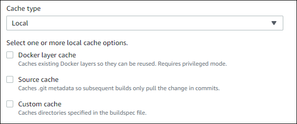

# Specify a local cache

You can use the AWS CLI, console, SDK, or AWS CloudFormation to
specify a local cache. For more information about local caching, see [Local caching](caching-local.md "caching-local.md").

###### Topics

- [Specify local caching (CLI)](#caching-local-cli "#caching-local-cli")
- [Specify local caching (console)](#caching-local-console "#caching-local-console")
- [Specify local caching (AWS CloudFormation)](#caching-local-cfn "#caching-local-cfn")

## Specify local caching (CLI)

You can use the the `--cache` parameter in the AWS CLI to specify
each of the three local cache types.

- To specify a source cache:

```
--cache type=LOCAL,mode=[LOCAL_SOURCE_CACHE]
```

- To specify a Docker layer cache:

```
--cache type=LOCAL,mode=[LOCAL_DOCKER_LAYER_CACHE]
```

- To specify a custom cache:

```
--cache type=LOCAL,mode=[LOCAL_CUSTOM_CACHE]
```

For more information, see [Create a build project (AWS CLI)](create-project.md#create-project-cli "create-project.md#create-project-cli").

## Specify local caching (console)

You specify a cache in the **Artifacts** section of the
console. For **Cache type**, choose **Amazon S3**
or **Local**. If you choose **Local**, choose
one or more of the three local cache options.



For more information, see [Create a build project (console)](create-project.md#create-project-console "create-project.md#create-project-console").

## Specify local caching (AWS CloudFormation)

If you use AWS CloudFormation to specify a local cache, on the `Cache` property,
for `Type`, specify `LOCAL`. The following sample
YAML-formatted AWS CloudFormation code specifies all three local cache types. You can specify
any combination of the types. If you use a Docker layer cache, under
`Environment`, you must set `PrivilegedMode` to
`true` and `Type` to `LINUX_CONTAINER`.

```
CodeBuildProject:
    Type: AWS::CodeBuild::Project
    Properties:
      Name: MyProject
      ServiceRole: `<service-role>`
      Artifacts:
        Type: S3
        Location: `<bucket-name>`
        Name: myArtifact
        EncryptionDisabled: true
        OverrideArtifactName: true
      Environment:
        Type: LINUX_CONTAINER
        ComputeType: BUILD_GENERAL1_SMALL
        Image: aws/codebuild/standard:5.0
        Certificate: `<bucket/cert.zip>`
        # PrivilegedMode must be true if you specify LOCAL_DOCKER_LAYER_CACHE
        PrivilegedMode: true
      Source:
        Type: GITHUB
        Location: `<github-location>`
        InsecureSsl: true
        GitCloneDepth: 1
        ReportBuildStatus: false
      TimeoutInMinutes: 10
      Cache:
        Type: LOCAL
        Modes: # You can specify one or more cache mode,
          - LOCAL_CUSTOM_CACHE
          - LOCAL_DOCKER_LAYER_CACHE
          - LOCAL_SOURCE_CACHE
```

###### Note

By default, Docker daemon is enabled for non-VPC builds. If you would like to use Docker
containers for VPC builds, see [Runtime
Privilege and Linux Capabilities](https://docs.docker.com/engine/reference/run/#runtime-privilege-and-linux-capabilities "https://docs.docker.com/engine/reference/run/#runtime-privilege-and-linux-capabilities") on the Docker Docs website and enable privileged mode. Also, Windows does not support privileged mode.

For more information, see [Create a build project (AWS CloudFormation)](create-project.md#create-project-cloud-formation "create-project.md#create-project-cloud-formation").
