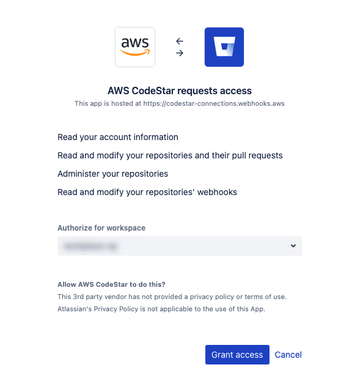

# Troubleshooting AWS CodeBuild

Use the information in this topic to help you identify, diagnose, and address issues. To
learn how to log and monitor CodeBuild builds to troubleshoot issues, see
[Logging and monitoring](logging-monitoring.md "logging-monitoring.md").

###### Topics

- [Apache Maven builds reference artifacts
  from the wrong repository](#troubleshooting-maven-repos "#troubleshooting-maven-repos")
- [Build commands run as root by
  default](#troubleshooting-root-build-commands "#troubleshooting-root-build-commands")
- [Builds might fail when file names have non-U.S.
  English characters](#troubleshooting-utf-8 "#troubleshooting-utf-8")
- [Builds might fail when getting
  parameters from Amazon EC2 Parameter Store](#troubleshooting-parameter-store "#troubleshooting-parameter-store")
- [Cannot access branch filter in the
  CodeBuild console](#troubleshooting-webhook-filter "#troubleshooting-webhook-filter")
- [Cannot view build success or failure](#no-status-when-build-triggered "#no-status-when-build-triggered")
- [Build status not reported to source
  provider](#build-status-not-reported "#build-status-not-reported")
- [Cannot find and select the base image of
  the Windows Server Core 2019 platform](#windows-image-not-available "#windows-image-not-available")
- [Earlier commands in buildspec
  files are not recognized by later commands](#troubleshooting-build-spec-commands "#troubleshooting-build-spec-commands")
- [Error: "Access denied" when
  attempting to download cache](#troubleshooting-dependency-caching "#troubleshooting-dependency-caching")
- [Error:
  "BUILD_CONTAINER_UNABLE_TO_PULL_IMAGE" when using a custom build image](#troubleshooting-unable-to-pull-image "#troubleshooting-unable-to-pull-image")
- [Error: "Build container found dead before
  completing the build. build container died because it was out of memory, or the
  Docker image is not supported. ErrorCode: 500"](#windows-server-core-version "#windows-server-core-version")
- [Error: "Cannot connect to the Docker daemon" when running a build](#troubleshooting-cannot-connect-to-docker-daemon "#troubleshooting-cannot-connect-to-docker-daemon")
- [Error: "CodeBuild is not authorized
  to perform: sts:AssumeRole" when creating or updating a build project](#troubleshooting-assume-role "#troubleshooting-assume-role")
- [Error: "Error calling
  GetBucketAcl: Either the bucket owner has changed or the service role no longer has
  permission to called s3:GetBucketAcl"](#troubleshooting-calling-bucket-error "#troubleshooting-calling-bucket-error")
- [Error: "Failed to
  upload artifacts: Invalid arn" when running a build](#troubleshooting-output-bucket-different-region "#troubleshooting-output-bucket-different-region")
- [Error: "Git clone failed:
  Unable to access 'your-repository-URL': SSL certificate
  problem: Self signed certificate"](#troubleshooting-self-signed-certificate "#troubleshooting-self-signed-certificate")
- [Error: "The bucket you
  are attempting to access must be addressed using the specified endpoint" when
  running a build](#troubleshooting-input-bucket-different-region "#troubleshooting-input-bucket-different-region")
- [Error: "This build image
  requires selecting at least one runtime version."](#troubleshooting-build-must-specify-runtime "#troubleshooting-build-must-specify-runtime")
- [Error: "QUEUED: INSUFFICIENT_SUBNET"
  when a build in a build queue fails](#queued-insufficient-subnet-error "#queued-insufficient-subnet-error")
- [Error: "Unable to download cache:
  RequestError: Send request failed caused by: x509: Failed to load system roots and
  no roots provided"](#troubleshooting-cache-image "#troubleshooting-cache-image")
- [Error: "Unable to download
  certificate from S3. AccessDenied"](#troubleshooting-certificate-in-S3 "#troubleshooting-certificate-in-S3")
- [Error: "Unable to locate credentials"](#troubleshooting-versions "#troubleshooting-versions")
- [RequestError timeout error when running
  CodeBuild in a proxy server](#code-request-timeout-error "#code-request-timeout-error")
- [The bourne shell (sh) must exist in
  build images](#troubleshooting-sh-build-images "#troubleshooting-sh-build-images")
- [Warning: "Skipping
  install of runtimes. runtime version selection is not supported by this build image"
  when running a build](#troubleshooting-skipping-all-runtimes-warning "#troubleshooting-skipping-all-runtimes-warning")
- [Error: "Unable to verify
  JobWorker identity" when opening the CodeBuild console](#troubleshooting-unable-to-verify-jobworker "#troubleshooting-unable-to-verify-jobworker")
- [Build failed to start](#troubleshooting-build-failed-to-start "#troubleshooting-build-failed-to-start")
- [Accessing GitHub metadata in locally
  cached builds](#troubleshooting-github-metadata "#troubleshooting-github-metadata")
- [AccessDenied: The bucket owner for the
  report group does not match the owner of the S3 bucket...](#troubleshooting-bucket-owner "#troubleshooting-bucket-owner")
- [Error: "Your credentials lack one or
  more required privilege scopes" when creating a CodeBuild project with CodeConnections](#troubleshooting-permission-bitbucket "#troubleshooting-permission-bitbucket")
- [Error: "Sorry, no terminal at all requested - can't get input"
  when building with the Ubuntu install command](#troubleshooting-nvidia-container-toolkit "#troubleshooting-nvidia-container-toolkit")

## Apache Maven builds reference artifacts

from the wrong repository

**Issue:** When you use Maven with an AWS CodeBuild-provided
Java build environment, Maven pulls build and plugin dependencies from the secure
central Maven repository at [https://repo1.maven.org/maven2](https://repo1.maven.org/maven2 "https://repo1.maven.org/maven2"). This happens even if your build project's
`pom.xml` file explicitly declares other locations to use
instead.

**Possible cause:** CodeBuild-provided Java build
environments include a file named `settings.xml` that is preinstalled
in the build environment's `/root/.m2` directory. This
`settings.xml` file contains the following declarations, which
instruct Maven to always pull build and plugin dependencies from the secure central
Maven repository at [https://repo1.maven.org/maven2](https://repo1.maven.org/maven2 "https://repo1.maven.org/maven2").

```
<settings>
  <activeProfiles>
    <activeProfile>securecentral</activeProfile>
  </activeProfiles>
  <profiles>
    <profile>
      <id>securecentral</id>
      <repositories>
        <repository>
          <id>central</id>
          <url>https://repo1.maven.org/maven2</url>
          <releases>
            <enabled>true</enabled>
          </releases>
        </repository>
      </repositories>
      <pluginRepositories>
        <pluginRepository>
          <id>central</id>
          <url>https://repo1.maven.org/maven2</url>
          <releases>
            <enabled>true</enabled>
          </releases>
        </pluginRepository>
      </pluginRepositories>
    </profile>
  </profiles>
</settings>
```

**Recommended solution:** Do the following:

1. Add a `settings.xml` file to your source code.
2. In this `settings.xml` file, use the preceding
   `settings.xml` format as a guide to declare the
   repositories you want Maven to pull the build and plugin dependencies from
   instead.
3. In the `install` phase of your build project, instruct CodeBuild to
   copy your `settings.xml` file to the build environment's
   `/root/.m2` directory. For example, consider the
   following snippet from a `buildspec.yml` file that
   demonstrates this behavior.

```
version 0.2

phases:
  install:
    commands:
      - cp ./settings.xml /root/.m2/settings.xml
```

## Build commands run as root by

default

**Issue:** AWS CodeBuild runs your build commands as the root
user. This happens even if your related build image's Dockerfile sets the
`USER` instruction to a different user.

**Cause:** By default, CodeBuild runs all build commands as
the root user.

**Recommended solution:** None.

## Builds might fail when file names have non-U.S.

English characters

**Issue:** When you run a build that uses files with file
names that contain non-U.S. English characters (for example, Chinese characters), the
build fails.

**Possible cause:** Build environments provided by
AWS CodeBuild have their default locale set to `POSIX`. `POSIX`
localization settings are less compatible with CodeBuild and file names that contain
non-U.S. English characters and can cause related builds to fail.

**Recommended solution:** Add the following commands to
the `pre_build` section of your buildspec file. These commands make the build
environment use U.S. English UTF-8 for its localization settings, which is more
compatible with CodeBuild and file names that contain non-U.S. English characters.

For build environments based on Ubuntu:

```
pre_build:
  commands:
    - export LC_ALL="en_US.UTF-8"
    - locale-gen en_US en_US.UTF-8
    - dpkg-reconfigure -f noninteractive locales
```

For build environments based on Amazon Linux:

```
pre_build:
  commands:
    - export LC_ALL="en_US.utf8"
```

## Builds might fail when getting

parameters from Amazon EC2 Parameter Store

**Issue:** When a build tries to get the value of one or
more parameters stored in Amazon EC2 Parameter Store, the build fails in the
`DOWNLOAD_SOURCE` phase with the error `Parameter does not
 exist`.

**Possible cause:** The service role the build project
relies on does not have permission to call the `ssm:GetParameters` action or
the build project uses a service role that is generated by AWS CodeBuild and allows calling
the `ssm:GetParameters` action, but the parameters have names that do not
start with `/CodeBuild/`.

**Recommended solutions:**

- If the service role was not generated by CodeBuild, update its definition to allow
  CodeBuild to call the `ssm:GetParameters` action. For example, the
  following policy statement allows calling the `ssm:GetParameters`
  action to get parameters with names starting with
  `/CodeBuild/`:

JSON

```
`{
 "Version":"2012-10-17",
 "Statement": [
 {
 "Action": "ssm:GetParameters",
 "Effect": "Allow",
 "Resource": "arn:aws:ssm:us-east-1:`111122223333`:parameter/CodeBuild/*"
 }
 ]
}`

```

- If the service role was generated by CodeBuild, update its definition to allow
  CodeBuild to access parameters in Amazon EC2 Parameter Store with names other than those
  starting with `/CodeBuild/`. For example, the following policy
  statement allows calling the `ssm:GetParameters` action to get
  parameters with the specified name:

JSON

```
`{
 "Version":"2012-10-17",
 "Statement": [
 {
 "Action": "ssm:GetParameters",
 "Effect": "Allow",
 "Resource": "arn:aws:ssm:us-east-1:`111122223333`:parameter/`PARAMETER_NAME`"
 }
 ]
}`

```

## Cannot access branch filter in the

CodeBuild console

**Issue:** The branch filter option is not available in
the console when you create or update an AWS CodeBuild project.

**Possible cause:** The branch filter option is deprecated.
It has been replaced by webhook filter groups, which provide more control over the
webhook events that trigger a new build in CodeBuild.

**Recommended solution:** To migrate a branch filter that
you created before the introduction of webhook filters, create a webhook filter group
with a `HEAD_REF` filter with the regular expression
`^refs/heads/`branchName`$`. For example, if
your branch filter regular expression was `^branchName$`, then the updated
regular expression you put in the `HEAD_REF` filter is
`^refs/heads/branchName$`. For more information, see [Bitbucket webhook events](bitbucket-webhook.md "bitbucket-webhook.md") and
[Filter GitHub webhook events
(console)](github-webhook-events-console.md "github-webhook-events-console.md").

## Cannot view build success or failure

**Issue:** You cannot see the success or failure of a
retried build.

**Possible cause:** The option to report your build's
status is not enabled.

**Recommended solutions:** Enable **Report build
status** when you create or update a CodeBuild project. This option tells CodeBuild
to report back the status when you trigger a build. For more information, see [reportBuildStatus](../APIReference/API_ProjectSource.md#CodeBuild-Type-ProjectSource-reportBuildStatus "../APIReference/API_ProjectSource.md#CodeBuild-Type-ProjectSource-reportBuildStatus") in the _AWS CodeBuild API
Reference_.

## Build status not reported to source

provider

**Issue:** After allowing build status reporting to a
source provider, such as GitHub or Bitbucket, the build status is not updated.

**Possible cause:** The user associated with the source
provider does not have write access to the repo.

**Recommended solutions:** To be able to report the build status to the source provider, the user associated with the source provider must
have write access to the repo. If the user does not have write access, the build status cannot be updated. For more information, see
[Source provider access](access-tokens.md "access-tokens.md").

## Cannot find and select the base image of

the Windows Server Core 2019 platform

**Issue:** You cannot find or select the base image of
the Windows Server Core 2019 platform.

**Possible cause:** You are using an AWS Region that does
not support this image.

**Recommended solutions:** Use one of the following AWS
Regions where the base image of the Windows Server Core 2019 platform is
supported:

- US East (N. Virginia)
- US East (Ohio)
- US West (Oregon)
- Europe (Ireland)

## Earlier commands in buildspec

files are not recognized by later commands

**Issue:** The results of one or more commands in your
buildspec file are not recognized by later commands in the same buildspec file. For
example, a command might set a local environment variable, but a command run later might
fail to get the value of that local environment variable.

**Possible cause:** In buildspec file version 0.1,
AWS CodeBuild runs each command in a separate instance of the default shell in the build
environment. This means that each command runs in isolation from all other commands. By
default, then, you cannot run a single command that relies on the state of any previous
commands.

**Recommended solutions:** We recommend that you use
build spec version 0.2, which solves this issue. If you must use buildspec version 0.1,
we recommend that you use the shell command chaining operator (for example,
`&&` in Linux) to combine multiple commands into a single
command. Or include a shell script in your source code that contains multiple commands,
and then call that shell script from a single command in the buildspec file. For more
information, see [Shells and commands in build environments](build-env-ref-cmd.md "build-env-ref-cmd.md")
and [Environment variables in build
environments](build-env-ref-env-vars.md "build-env-ref-env-vars.md").

## Error: "Access denied" when

attempting to download cache

**Issue:** When attempting to download the cache on a
build project that has cache enabled, you receive an `Access denied`
error.

**Possible causes:**

- You have just configured caching as part of your build project.
- The cache has recently been invalidated through the
  `InvalidateProjectCache` API.
- The service role being used by CodeBuild does not have
  `s3:GetObject` and `s3:PutObject` permissions to the
  S3 bucket that is holding the cache.

**Recommended solution:** For first time use, it's normal
to see this immediately after updating the cache configuration. If this error persists,
then you should check to see if your service role has `s3:GetObject` and
`s3:PutObject` permissions to the S3 bucket that is holding the cache.
For more information, see [Specifying
S3 permissions](../../../AmazonS3/latest/userguide/using-with-s3-actions.md "../../../AmazonS3/latest/userguide/using-with-s3-actions.md") in the _Amazon S3 Developer
Guide_.

## Error:

"BUILD_CONTAINER_UNABLE_TO_PULL_IMAGE" when using a custom build image

**Issue:** When you try to run a build that uses a custom
build image, the build fails with the error
`BUILD_CONTAINER_UNABLE_TO_PULL_IMAGE`.

**\*Possible cause:** The build image's overall
uncompressed size is larger than the build environment compute type's available
disk space. To check your build image's size, use Docker to run the `docker
 images
 `REPOSITORY`:`TAG``
command. For a list of available disk space by compute type, see [Build environment compute modes and types](build-env-ref-compute-types.md "build-env-ref-compute-types.md").\*

**Recommended solution:** Use a larger
compute type with more available disk space, or reduce the size of your
custom build image.

**\*Possible cause:** AWS CodeBuild does not have
permission to pull the build image from your Amazon Elastic Container Registry (Amazon ECR).\*

**Recommended solution:** Update the
permissions in your repository in Amazon ECR so that CodeBuild can pull your custom
build image into the build environment. For more information, see the [Amazon ECR sample](sample-ecr.md "sample-ecr.md").

**\*Possible cause:** The Amazon ECR image you requested
is not available in the AWS Region that your AWS account is using.\*

**Recommended solution:** Use an Amazon ECR image
that is in the same AWS Region as the one your AWS account is using.

**\*Possible cause:** You are using a private
registry in a VPC that does not have public internet access. CodeBuild cannot pull
an image from a private IP address in a VPC. For more information, see [Private registry with AWS Secrets Manager sample for CodeBuild](sample-private-registry.md "sample-private-registry.md").\*

**Recommended solution:** If you use a
private registry in a VPC, make sure the VPC has public internet access.

**\*Possible cause:** If the error message contains
"**toomanyrequests**", and the
image is obtained from Docker Hub, this error means the Docker Hub pull limit
has been reached.\*

**Recommended solution:** Use a Docker Hub
private registry, or obtain your image from Amazon ECR. For more information
about using a private registry, see [Private registry with AWS Secrets Manager sample for CodeBuild](sample-private-registry.md "sample-private-registry.md"). For more information about
using Amazon ECR, see [Amazon ECR sample for CodeBuild](sample-ecr.md "sample-ecr.md") .

## Error: "Build container found dead before

completing the build. build container died because it was out of memory, or the
Docker image is not supported. ErrorCode: 500"

**Issue:** When you try to use a Microsoft Windows or Linux
container in AWS CodeBuild, this error occurs during the PROVISIONING phase.

**Possible causes:**

- The container OS version is not supported by CodeBuild.
- `HTTP_PROXY`, `HTTPS_PROXY`, or both are specified in the
  container.

**Recommended solutions:**

- For Microsoft Windows, use a Windows container with a container OS that is
  version microsoft/windowsservercore:10.0.x (for example,
  microsoft/windowsservercore:10.0.14393.2125).
- For Linux, clear the `HTTP_PROXY` and `HTTPS_PROXY`
  settings in your Docker image, or specify the VPC configuration in your build
  project.

## Error: "Cannot connect to the Docker daemon" when running a build

**Issue:** Your build fails and you receive an error similar to `Cannot connect to the Docker daemon 
 at unix:/var/run/docker.sock. Is the docker daemon running?` in the build log.

**Possible cause:** You are not running your build in privileged mode.

**Recommended solution:** To fix this error, you must enable privileged mode and update your buildspec using the following instructions.

To run your build in privileged mode, follow these steps:

1. Open the CodeBuild console at
   [https://console.aws.amazon.com/codebuild/](https://console.aws.amazon.com/codebuild/ "https://console.aws.amazon.com/codebuild/").
2. In the navigation pane, choose **Build projects**, then choose your build project.
3. From **Edit**, choose **Environment**.
4. Choose **Additional configuration**.
5. From **Privileged**, select **Enable this flag if you want to
   build Docker images or want your builds to get elevated privileges.**.
6. Choose **Update environment**.
7. Choose **Start build** to retry your build.

You'll also need to start the Docker daemon inside your container. The `install` phase of your
buildspec might look similar to this.

```
phases:
  install:
    commands:
      - nohup /usr/local/bin/dockerd --host=unix:///var/run/docker.sock --host=tcp://127.0.0.1:2375 --storage-driver=overlay2 &
      - timeout 15 sh -c "until docker info; do echo .; sleep 1; done"
```

For more information about the OverlayFS storage driver referenced in the
buildspec file, see [Use the
OverlayFS storage driver](https://docs.docker.com/storage/storagedriver/overlayfs-driver/ "https://docs.docker.com/storage/storagedriver/overlayfs-driver/") on the Docker website.

###### Note

If the base operating system is Alpine Linux, in the
`buildspec.yml` add the `-t` argument to
`timeout`:

```
- timeout -t 15 sh -c "until docker info; do echo .; sleep 1; done"
```

To learn more about how to build and run a Docker image by using AWS CodeBuild, see [Docker in custom image sample for CodeBuild](sample-docker-custom-image.md "sample-docker-custom-image.md").

## Error: "CodeBuild is not authorized

to perform: sts:AssumeRole" when creating or updating a build project

**Issue:** When you try to create or update a build
project, you receive the error `Code:InvalidInputException,
 Message:CodeBuild is not authorized to perform: sts:AssumeRole on
 arn:aws:iam::`account-ID`:role/`service-role-name``.

**Possible causes:**

- The AWS Security Token Service (AWS STS) has been deactivated for the AWS region where you are
  attempting to create or update the build project.
- The AWS CodeBuild service role associated with the build project does not exist or
  does not have sufficient permissions to trust CodeBuild.
- The AWS CodeBuild service role casing associated with the build project does not
  match with the actual IAM role.

**Recommended solutions:**

- Make sure AWS STS is activated for the AWS region where you are attempting to
  create or update the build project. For more information, see [Activating and
  deactivating AWS STS in an AWS Region](../../../IAM/latest/UserGuide/id_credentials_temp_enable-regions.md "../../../IAM/latest/UserGuide/id_credentials_temp_enable-regions.md") in the
  _IAM User Guide_.
- Make sure the target CodeBuild service role exists in your AWS account. If you
  are not using the console, make sure you did not misspell the Amazon Resource
  Name (ARN) of the service role when you created or updated the build
  project. Note that IAM roles are case sensitive, so check that the casing
  of the IAM role is correct.
- Make sure the target CodeBuild service role has sufficient permissions to trust
  CodeBuild. For more information, see the trust relationship policy statement in
  [Allow CodeBuild to interact with other AWS
  services](setting-up-service-role.md "setting-up-service-role.md").

## Error: "Error calling

GetBucketAcl: Either the bucket owner has changed or the service role no longer has
permission to called s3:GetBucketAcl"

**Issue:** When you run a build, you receive an error
about a change in ownership of an S3 bucket and `GetBucketAcl`
permissions.

**Possible cause:** You added the
`s3:GetBucketAcl` and `s3:GetBucketLocation` permissions to
your IAM role. These permissions secure your project's S3 bucket and ensure that only
you can access it. After you added these permissions, the owner of the S3 bucket
changed.

**Recommended solution:** Verify you are an owner of the
S3 bucket, and then add permissions to your IAM role again. For more information,
see [Secure access to S3 buckets](auth-and-access-control-iam-access-control-identity-based.md#secure-s3-buckets "auth-and-access-control-iam-access-control-identity-based.md#secure-s3-buckets").

## Error: "Failed to

upload artifacts: Invalid arn" when running a build

**Issue:** When you run a build, the
`UPLOAD_ARTIFACTS` build phase fails with the error `Failed to
 upload artifacts: Invalid arn`.

**Possible cause:** Your S3 output bucket (the bucket
where AWS CodeBuild stores its output from the build) is in an AWS Region different from
the CodeBuild build project.

**Recommended solution:** Update the build project's
settings to point to an output bucket that is in the same AWS Region as the build
project.

## Error: "Git clone failed:

Unable to access `'your-repository-URL'`: SSL certificate
problem: Self signed certificate"

**Issue:** When you try to run a build project, the build
fails with this error.

**Possible cause:** Your source repository has a
self-signed certificate, but you have not chosen to install the certificate from your S3
bucket as part of your build project.

**Recommended solutions:**

- Edit your project. For **Certificate**, choose
  **Install certificate from S3**. For **Bucket of
  certificate**, choose the S3 bucket where your SSL certificate is
  stored. For **Object key of certificate**, enter the name of
  your S3 object key.
- Edit your project. Select **Insecure SSL** to ignore SSL
  warnings while connecting to your GitHub Enterprise Server project repository.

###### Note

We recommend that you use **Insecure SSL** for testing
only. It should not be used in a production environment.

## Error: "The bucket you

are attempting to access must be addressed using the specified endpoint" when
running a build

**Issue:** When you run a build, the
`DOWNLOAD_SOURCE` build phase fails with the error `The bucket you
 are attempting to access must be addressed using the specified endpoint. Please send
 all future requests to this endpoint`.

**Possible cause:** Your pre-built source code is stored
in an S3 bucket, and that bucket is in an AWS Region different from the AWS CodeBuild
build project.

**Recommended solution:** Update the build project's
settings to point to a bucket that contains your pre-built source code. Make sure that
bucket is in the same AWS Region as the build project.

## Error: "This build image

requires selecting at least one runtime version."

**Issue:** When you run a build, the
`DOWNLOAD_SOURCE` build phase fails with the error `YAML_FILE_ERROR:
 This build image requires selecting at least one runtime version`.

**Possible cause:** Your build uses version 1.0 or later of the Amazon Linux 2 (AL2)
standard image, or version 2.0 or later of the Ubuntu standard image, and a runtime is not specified in the buildspec
file.

**Recommended solution:** If you use the
`aws/codebuild/standard:2.0` CodeBuild managed image, you must specify a
runtime version in the `runtime-versions` section of the buildspec file. For
example, you might use the following buildspec file for a project that uses PHP:

```
version: 0.2

phases:
  install:
    runtime-versions:
        php: 7.3
  build:
    commands:
      - php --version
artifacts:
  files:
    -  README.md
```

###### Note

If you specify a `runtime-versions` section and use an image other than Ubuntu Standard Image 2.0 or later,
or the Amazon Linux 2 (AL2) standard image 1.0 or later, the build issues the warning,
"`Skipping install of runtimes. Runtime version selection is not supported by this build image`."

For more information, see [Specify runtime versions in the buildspec file](build-spec-ref.md#runtime-versions-buildspec-file "build-spec-ref.md#runtime-versions-buildspec-file").

## Error: "QUEUED: INSUFFICIENT_SUBNET"

when a build in a build queue fails

**Issue:** A build in a build queue fails with an error
similar to `QUEUED: INSUFFICIENT_SUBNET`.

**Possible causes:** The IPv4 CIDR block specified for
your VPC uses a reserved IP address. The first four IP addresses and the last IP address
in each subnet CIDR block are not available for you to use and cannot be assigned to an
instance. For example, in a subnet with CIDR block `10.0.0.0/24`, the
following five IP addresses are reserved:

- `10.0.0.0:` Network address.
- `10.0.0.1`: Reserved by AWS for the VPC router.
- `10.0.0.2`: Reserved by AWS. The IP address of the DNS server is
  always the base of the VPC network range plus two; however, we also reserve the
  base of each subnet range plus two. For VPCs with multiple CIDR blocks, the IP
  address of the DNS server is located in the primary CIDR. For more information,
  see [Amazon DNS
  server](../../../vpc/latest/userguide/VPC_DHCP_Options.md#AmazonDNS "../../../vpc/latest/userguide/VPC_DHCP_Options.md#AmazonDNS") in the _Amazon VPC User Guide_.
- `10.0.0.3`: Reserved by AWS for future use.
- `10.0.0.255`: Network broadcast address. We do not support broadcast
  in a VPC. This address is reserved.

**Recommended solutions:** Check if your VPC uses a
reserved IP address. Replace any reserved IP address with one that is not reserved. For
more information, see [VPC and subnet sizing](../../../vpc/latest/userguide/VPC_Subnets.md#VPC_Sizing "../../../vpc/latest/userguide/VPC_Subnets.md#VPC_Sizing")
in the _Amazon VPC User Guide_.

## Error: "Unable to download cache:

RequestError: Send request failed caused by: x509: Failed to load system roots and
no roots provided"

**Issue:** When you try to run a build project, the build
fails with this error.

**Possible cause:** You configured caching as part of your
build project and are using an older Docker image that includes an expired root
certificate.

**Recommended solution:** Update the Docker image that is
being used in your AWS CodeBuild the project. For more information, see [Docker images provided by CodeBuild](build-env-ref-available.md "build-env-ref-available.md").

## Error: "Unable to download

certificate from S3. AccessDenied"

**Issue:** When you try to run a build project, the build
fails with this error.

**Possible causes:**

- You have chosen the wrong S3 bucket for your certificate.
- You have entered the wrong object key for your certificate.

**Recommended solutions:**

- Edit your project. For **Bucket of certificate**, choose the
  S3 bucket where your SSL certificate is stored.
- Edit your project. For **Object key of certificate**, enter
  the name of your S3 object key.

## Error: "Unable to locate credentials"

**Issue:** When you try to run the AWS CLI, use an AWS
SDK, or call another similar component as part of a build, you get build errors that are
directly related to the AWS CLI, AWS SDK, or component. For example, you might get a
build error such as `Unable to locate credentials`.

**Possible causes:**

- The version of the AWS CLI, AWS SDK, or component in the build environment is
  incompatible with AWS CodeBuild.
- You are running a Docker container within a build environment that uses
  Docker, and the container does not have access to the AWS credentials by
  default.

**Recommended solutions:**

- Make sure your build environment has the following version or higher of the
  AWS CLI, AWS SDK, or component.
  - AWS CLI: 1.10.47
  - AWS SDK for C++: 0.2.19
  - AWS SDK for Go: 1.2.5
  - AWS SDK for Java: 1.11.16
  - AWS SDK for JavaScript: 2.4.7
  - AWS SDK for PHP: 3.18.28
  - AWS SDK for Python (Boto3): 1.4.0
  - AWS SDK for Ruby: 2.3.22
  - Botocore: 1.4.37
  - CoreCLR: 3.2.6-beta
  - Node.js: 2.4.7

- If you need to run a Docker container in a build environment and the container
  requires AWS credentials, you must pass through the credentials from the build
  environment to the container. In your buildspec file, include a Docker
  `run` command such as the following. This example uses the
  `aws s3 ls` command to list your available S3 buckets. The
  `-e` option passes through the environment variables required for
  your container to access AWS credentials.

```
docker run -e AWS_DEFAULT_REGION -e AWS_CONTAINER_CREDENTIALS_RELATIVE_URI `your-image-tag` aws s3 ls
```

- If you are building a Docker image and the build requires AWS credentials
  (for example, to download a file from Amazon S3), you must pass through the
  credentials from the build environment to the Docker build process as
  follows.
  1.  In your source code's Dockerfile for the Docker image, specify the
      following `ARG` instructions.

  ```
  ARG AWS_DEFAULT_REGION
  ARG AWS_CONTAINER_CREDENTIALS_RELATIVE_URI
  ```

  2.  In your buildspec file, include a Docker `build` command
      such as the following. The `--build-arg` options sets the
      environment variables required for your Docker build process to access
      the AWS credentials.

  ```
  docker build --build-arg AWS_DEFAULT_REGION=$AWS_DEFAULT_REGION --build-arg AWS_CONTAINER_CREDENTIALS_RELATIVE_URI=$AWS_CONTAINER_CREDENTIALS_RELATIVE_URI -t `your-image-tag` .
  ```

## RequestError timeout error when running

CodeBuild in a proxy server

**Issue:** You receive a `RequestError` error similar to one
of the following:

- `RequestError: send request failed caused by: Post
https://logs.<your-region>.amazonaws.com/: dial tcp 52.46.158.105:443: i/o
timeout` from CloudWatch Logs.
- `Error uploading artifacts: RequestError: send request failed caused by: 
Put https://`your-bucket`.s3.`your-aws-region`.amazonaws.com/*: dial tcp 52.219.96.208:443: 
connect: connection refused` from Amazon S3.

**Possible causes:**

- `ssl-bump` is not configured properly.
- Your organization's security policy does not allow you to use
  `ssl_bump`.
- Your buildspec file does not have proxy settings specified using a
  `proxy` element.

**Recommended solutions:**

- Make sure `ssl-bump` is configured properly. If you use Squid for
  your proxy server, see [Configure Squid as an
  explicit proxy server](run-codebuild-in-explicit-proxy-server.md#use-proxy-server-explicit-squid-configure "run-codebuild-in-explicit-proxy-server.md#use-proxy-server-explicit-squid-configure").
- Follow these steps to use private endpoints for Amazon S3 and CloudWatch Logs:
  1.  In your private subnet routing table, remove the rule you added that
      routes traffic destined for the internet to your proxy server. For
      information, see [Creating a
      subnet in your VPC](../../../vpc/latest/userguide/working-with-vpcs.md#AddaSubnet "../../../vpc/latest/userguide/working-with-vpcs.md#AddaSubnet") in the _Amazon VPC User
      Guide_.
  2.  Create a private Amazon S3 endpoint and CloudWatch Logs endpoint and associate them
      with the private subnet of your Amazon VPC. For information, see [VPC endpoint services](../../../vpc/latest/userguide/endpoint-service.md "../../../vpc/latest/userguide/endpoint-service.md") in the _Amazon VPC User Guide_.
  3.  Confirm **Enable Private DNS Name** in
      your Amazon VPC is selected. For more information, see [Creating an interface endpoint](../../../vpc/latest/userguide/vpce-interface.md#create-interface-endpoint "../../../vpc/latest/userguide/vpce-interface.md#create-interface-endpoint") in the _Amazon VPC User Guide_.

- If you do not use `ssl-bump` for an explicit proxy server, add a proxy configuration to your buildspec file using
  a `proxy` element. For more information, see [Run CodeBuild in an explicit proxy
  server](run-codebuild-in-explicit-proxy-server.md "run-codebuild-in-explicit-proxy-server.md") and [Buildspec syntax](build-spec-ref.md#build-spec-ref-syntax "build-spec-ref.md#build-spec-ref-syntax").

```
version: 0.2
proxy:
  upload-artifacts: yes
  logs: yes
phases:
  build:
    commands:
```

## The bourne shell (sh) must exist in

build images

**Issue:** You are using a build image that is not
provided by AWS CodeBuild, and your builds fail with the message `Build container found
 dead before completing the build`.

**Possible cause:** The Bourne shell (`sh`) is
not included in your build image. CodeBuild needs `sh` to run build commands and
scripts.

**Recommended solution:** If `sh` in not
present in your build image, be sure to include it before you start any more builds that
use your image. (CodeBuild already includes `sh` in its build images.)

## Warning: "Skipping

install of runtimes. runtime version selection is not supported by this build image"
when running a build

**Issue:** When you run a build, the build log contains
this warning.

**Possible cause:** Your build does not use version 1.0 or later
of the Amazon Linux 2 (AL2) standard image, or version 2.0
or later of the Ubuntu standard image, and a runtime is specified in a
`runtime-versions` section in your buildspec file.

**Recommended solution:** Be sure your buildspec file
does not contain a `runtime-versions` section. The
`runtime-versions` section is only required if you use the Amazon Linux 2 (AL2) standard image or later or the Ubuntu
standard image version 2.0 or later.

## Error: "Unable to verify

JobWorker identity" when opening the CodeBuild console

**Issue:** When you open the CodeBuild console, an "Unable to
verify JobWorker identity" error message is displayed.

**Possible cause:** The IAM role that is used for
console access has a tag with `jobId` as the key. This tag key is reserved
for CodeBuild and will cause this error if it is present.

**Recommended solution:** Change any custom IAM role
tags that have the key `jobId` to have a different key, such as
`jobIdentifier`.

## Build failed to start

**Issue:** When starting a build, you receive a
**Build failed to start** error message.

**Possible cause:** The number of concurrent builds has
been reached.

**Recommended solutions:** Wait until other builds are
complete, or increase the concurrrent build limit for the project, and start the build
again. For more information, see [Project configuration](create-project.md#create-project-console-project-config "create-project.md#create-project-console-project-config").

## Accessing GitHub metadata in locally

cached builds

**Issue:** In some cases, the .git directory in a cached
build is a text file and not a directory.

**Possible causes:** When local source caching is enabled
for a build, CodeBuild creates a gitlink for the `.git` directory. This
means that the `.git` directory is actually a text file containing
the path to the directory.

**Recommended solutions:** In all cases, use the
following command to obtain the Git metadata directory. This command will work no matter
the format of `.git`:

```
git rev-parse --git-dir
```

## AccessDenied: The bucket owner for the

report group does not match the owner of the S3 bucket...

**Issue:** When uploading test data to an Amazon S3 bucket,
CodeBuild is unable to write the test data to the bucket.

**Possible causes:**

- The account specified for the report group bucket owner does not match the
  owner of the Amazon S3 bucket.
- The service role does not have write access to the bucket.

**Recommended solutions:**

- Change the report group bucket owner to match the owner of the Amazon S3
  bucket.
- Modify the service role to allow write access to the Amazon S3 bucket.

## Error: "Your credentials lack one or

more required privilege scopes" when creating a CodeBuild project with CodeConnections

**Issue:** When creating a CodeBuild project with CodeConnections,
you don't have permission to install a Bitbucket webhook.

**Possible causes:**

- The new permission scope may not have been accepted in your Bitbucket account.

**Recommended solutions:**

- To accept the new permission, you should have received any email with a subject
  titled **Action required - Scopes for AWS CodeStar have changed**
  sent by Bitbucket, `notifications-noreply@bitbucket.org`. The email contains
  a link to grant the webhook permissions to your existing CodeConnections Bitbucket app installation.
- If you cannot locate the email, you can grant the permission by navigating to
  `https://bitbucket.org/site/addons/reauthorize?account=`<workspace-name>`&addon_key=aws-codestar`, or
  `https://bitbucket.org/site/addons/reauthorize?addon_key=aws-codestar` and selecting the workspace you'd like to grant the webhook permission to.



## Error: "Sorry, no terminal at all requested - can't get input"

when building with the Ubuntu install command

**Issue:** If you're running GPU container privileged builds, you may be installing the
NVIDIA Container Toolkit following this
[procedure](https://docs.nvidia.com/datacenter/cloud-native/container-toolkit/latest/install-guide.html#installing-with-apt "https://docs.nvidia.com/datacenter/cloud-native/container-toolkit/latest/install-guide.html#installing-with-apt").
In the latest CodeBuild image release, CodeBuild pre-installs and configures docker with `nvidia-container-toolkit` in the
latest `amazonlinux` and `ubuntu` curated image. Following this procedure will cause builds with the Ubuntu
install command to fail with following error:

```
Running command curl -fsSL https://nvidia.github.io/libnvidia-container/gpgkey | gpg --dearmor --no-tty -o /usr/share/keyrings/nvidia-container-toolkit-keyring.gpg
gpg: Sorry, no terminal at all requested - can't get input
curl: (23) Failed writing body
```

**Possible causes:** The gpg key already exists at the same location.

**Recommended solutions:** The `nvidia-container-toolkit` is
already installed in the image. If you see this error, you can skip the install and restart docker process in your buildspec.
