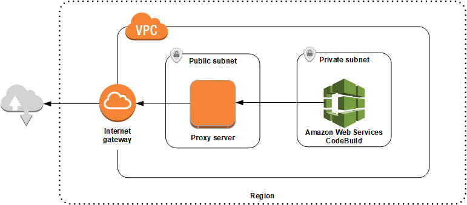

# Set up components required to run

CodeBuild in a proxy server

You need these components to run AWS CodeBuild in a transparent or explicit proxy server:

- A VPC.
- One public subnet in your VPC for the proxy server.
- One private subnet in your VPC for CodeBuild.
- An internet gateway that allows communcation between the VPC and the
  internet.
  The following diagram shows how the components interact.



## Set up a VPC, subnets, and a network

gateway

The following steps are required to run AWS CodeBuild in a transparent or explicit
proxy server.

1. Create a VPC. For information, see [Creating a
   VPC](../../../vpc/latest/userguide/working-with-vpcs.md#Create-VPC "../../../vpc/latest/userguide/working-with-vpcs.md#Create-VPC") in the _Amazon VPC User
   Guide_.
2. Create two subnets in your VPC. One is a public subnet named `Public Subnet`
   in which your proxy server runs. The other is a private subnet named `Private
Subnet` in which CodeBuild runs.

For information, see [Creating a subnet
in your VPC](../../../vpc/latest/userguide/working-with-vpcs.md#AddaSubnet "../../../vpc/latest/userguide/working-with-vpcs.md#AddaSubnet"). 3. Create and attach an internet gateway to your VPC. For more information,
see [Creating and attaching an internet gateway](../../../vpc/latest/userguide/VPC_Internet_Gateway.md#Add_IGW_Attach_Gateway "../../../vpc/latest/userguide/VPC_Internet_Gateway.md#Add_IGW_Attach_Gateway"). 4. Add a rule to the default route table that routes outgoing traffic from
the VPC (0.0.0.0/0) to the internet gateway. For information, see [Adding and
removing routes from a route table](../../../vpc/latest/userguide/VPC_Route_Tables.md#AddRemoveRoutes "../../../vpc/latest/userguide/VPC_Route_Tables.md#AddRemoveRoutes"). 5. Add a rule to the default security group of your VPC that allows ingress
SSH traffic (TCP 22) from your VPC (0.0.0.0/0). 6. Follow the instructions in [Launching an instance using
the launch instance wizard](../../../AWSEC2/latest/UserGuide/launching-instance.md "../../../AWSEC2/latest/UserGuide/launching-instance.md") in the _Amazon
EC2 User Guide_ to launch an Amazon Linux instance. When you run the
wizard, choose the following options:

    * In **Choose an Instance Type**, choose an Amazon Linux
     Amazon Machine Image (AMI).
    * In **Subnet**, choose the public subnet you
     created earlier in this topic. If you used the suggested name, it is
     **Public Subnet**.
    * In **Auto-assign Public IP**, choose
     **Enable**.
    * On the **Configure Security Group** page, for
     **Assign a security group**, choose
     **Select an existing security group**. Next,
     choose the default security group.
    * After you choose **Launch**, choose an existing
     key pair or create one.

Choose the default settings for all other options. 7. After your EC2 instance is running, disable source/destination checks.
For information, see [Disabling Source/Destination checks](../../../vpc/latest/userguide/VPC_NAT_Instance.md#EIP_Disable_SrcDestCheck "../../../vpc/latest/userguide/VPC_NAT_Instance.md#EIP_Disable_SrcDestCheck") in the _Amazon VPC User Guide_. 8. Create a route table in your VPC. Add a rule to the route table that
routes traffic destined for the internet to your proxy server. Associate
this route table with your private subnet. This is required so that outbound
requests from instances in your private subnet, where CodeBuild runs, are always
routed through the proxy server.

## Install and configure a proxy

server

There are many proxy servers from which to choose. An open-source proxy server,
Squid, is used here to demonstrate how AWS CodeBuild runs in a proxy server. You can
apply the same concepts to other proxy servers.

To install Squid, use a yum repo by running the following commands:

```
sudo yum update -y
sudo yum install -y squid
```

After you install Squid, edit its `squid.conf` file using the
instructions later in this topic.

## Configure Squid for HTTPS

traffic

For HTTPS, the HTTP traffic is encapsulated in a Transport Layer Security (TLS)
connection. Squid uses a feature called [SslPeekAndSplice](https://wiki.squid-cache.org/Features/SslPeekAndSplice "https://wiki.squid-cache.org/Features/SslPeekAndSplice") to retrieve the Server Name Indication (SNI) from the
TLS initiation that contains the requested internet host. This is required so Squid
does not need to unencrypt HTTPS traffic. To enable SslPeekAndSplice, Squid requires
a certificate. Create this certificate using OpenSSL:

```
sudo mkdir /etc/squid/ssl
cd /etc/squid/ssl
sudo openssl genrsa -out squid.key 2048
sudo openssl req -new -key squid.key -out squid.csr -subj "/C=XX/ST=XX/L=squid/O=squid/CN=squid"
sudo openssl x509 -req -days 3650 -in squid.csr -signkey squid.key -out squid.crt
sudo cat squid.key squid.crt | sudo tee squid.pem
```

###### Note

For HTTP, Squid does not require configuration. From all HTTP/1.1 request
messages, it can retrieve the host header field, which specifies the internet
host that is being requested.
