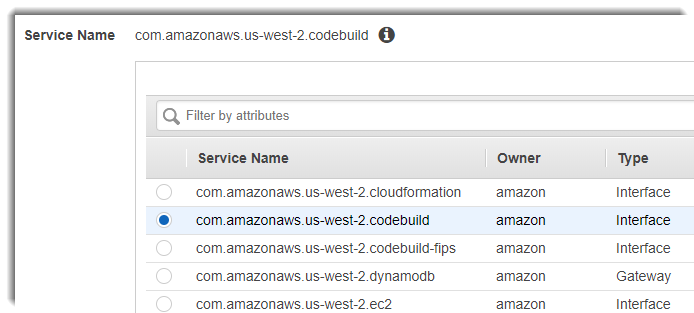

# Use VPC endpoints

You can improve the security of your builds by configuring AWS CodeBuild to use an interface
VPC endpoint. Interface endpoints are powered by PrivateLink, a technology that you can use
to privately access Amazon EC2 and CodeBuild by using private IP addresses. PrivateLink restricts all
network traffic between your managed instances, CodeBuild, and Amazon EC2 to the Amazon network.
(Managed instances don't have access to the internet.) Also, you don't need an internet
gateway, NAT device, or virtual private gateway. You are not required to configure
PrivateLink, but it's recommended. For more information about PrivateLink and VPC endpoints,
see [What is AWS PrivateLink?](../../../vpc/latest/privatelink/what-is-privatelink.md "../../../vpc/latest/privatelink/what-is-privatelink.md").

## Before you create VPC endpoints

Before you configure VPC endpoints for AWS CodeBuild, be aware of the following restrictions
and limitations.

###### Note

Use a [NAT gateway](../../../vpc/latest/userguide/VPC_NAT_Instance.md "../../../vpc/latest/userguide/VPC_NAT_Instance.md") if you
want to use CodeBuild with AWS services that do not support Amazon VPC PrivateLink
connections.

- VPC endpoints support Amazon-provided DNS through Amazon Route 53 only. If you want
  to use your own DNS, you can use conditional DNS forwarding. For more
  information, see [DHCP option
  sets](../../../vpc/latest/userguide/VPC_DHCP_Options.md "../../../vpc/latest/userguide/VPC_DHCP_Options.md") in the _Amazon VPC User Guide_.
- VPC endpoints currently do not support cross-Region requests. Make sure that
  you create your endpoint in the same AWS Region as any S3 buckets that store
  your build input and output. You can use the Amazon S3 console or the [get-bucket-location](../../../cli/latest/reference/s3api/get-bucket-location.md "../../../cli/latest/reference/s3api/get-bucket-location.md") command to find the location of your bucket.
  Use a Region-specific Amazon S3 endpoint to access your bucket (for example,
  ``<bucket-name>`.s3-us-west-2.amazonaws.com`). For more information
about Region-specific endpoints for Amazon S3, see [Amazon Simple Storage Service](../../../general/latest/gr/rande.md#s3_region "../../../general/latest/gr/rande.md#s3_region") in the *Amazon Web Services General Reference*. If you use the AWS CLI to make
requests to Amazon S3, set your default Region to the same Region where your bucket
was created, or use the `--region` parameter in your requests.

## Create VPC endpoints for CodeBuild

Follow the instructions in [Creating an
interface endpoint](../../../vpc/latest/userguide/vpce-interface.md#create-interface-endpoint "../../../vpc/latest/userguide/vpce-interface.md#create-interface-endpoint") to create the endpoint
`com.amazonaws.`region`.codebuild`. This is
a VPC endpoint for AWS CodeBuild.



`region` represents the region identifier for an AWS Region
supported by CodeBuild, such as `us-east-2` for the US East (Ohio) Region.
For a list of supported AWS Regions, see [CodeBuild](../../../general/latest/gr/rande.md#codebuild_region "../../../general/latest/gr/rande.md#codebuild_region") in the _AWS General Reference_. The endpoint is prepopulated with
the Region you specified when you signed in to AWS. If you change your Region, the VPC
endpoint is updated accordingly.

## Create a VPC endpoint policy for CodeBuild

You can create a policy for Amazon VPC endpoints for AWS CodeBuild in which you can
specify:

- The principal that can perform actions.
- The actions that can be performed.
- The resources that can have actions performed on them.

The following example policy specifies that all principals can only start and view
builds for the `project-name` project.

```
{
    "Statement": [
        {
            "Action": [
                "codebuild:ListBuildsForProject",
                "codebuild:StartBuild",
                "codebuild:BatchGetBuilds"
            ],
            "Effect": "Allow",
            "Resource": "arn:aws:codebuild:region-ID:account-ID:project/project-name",
            "Principal": "*"
        }
    ]
}
```

For more information, see [Controlling access to services with VPC endpoints](../../../vpc/latest/userguide/vpc-endpoints-access.md "../../../vpc/latest/userguide/vpc-endpoints-access.md") in the _Amazon VPC
User Guide_.
