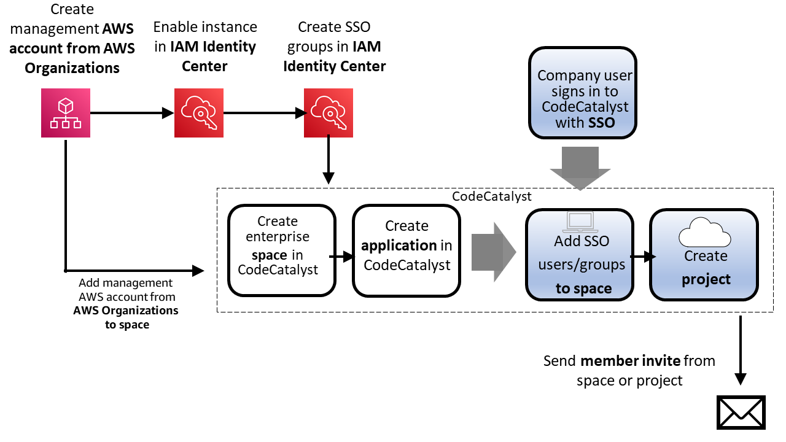

Amazon CodeCatalyst will no longer be open to new customers starting on November
7, 2025. If you would like to use the service, please sign up prior to November 7, 2025. For
more information, see [Migrating from Amazon CodeCatalyst](../userguide/migration.md "../userguide/migration.md").

# Concepts

Get familiar with the key concepts for administration in CodeCatalyst. These concepts include
terms used in supporting access, user management, and identity federation.

###### Topics

- [AWS Builder ID spaces in CodeCatalyst](#concepts-spaces "#concepts-spaces")
- [Spaces that support identity
  federation in CodeCatalyst](#concepts-ent-spaces "#concepts-ent-spaces")
- [Identity provider (IdP)](#concepts-idp "#concepts-idp")
- [Identity source](#concepts-identity-source "#concepts-identity-source")
- [Identity store](#concepts-identity-store "#concepts-identity-store")
- [Single sign-on (SSO)](#concepts-sso "#concepts-sso")
- [Identity Center application](#concepts-space-application "#concepts-space-application")
- [Instance in IAM Identity Center](#concepts-instance "#concepts-instance")
- [Organization instance in IAM Identity Center](#concepts-organization-instance "#concepts-organization-instance")
- [Account instance in IAM Identity Center](#concepts-account-instance "#concepts-account-instance")
- [How do spaces work with identity
  federation and SSO](#federation-how-it-works "#federation-how-it-works")

## AWS Builder ID spaces in CodeCatalyst

The **Space administrator** adds users to CodeCatalyst by sending individual
emails from the members page. Users who are invited or sign up to CodeCatalyst create their own
AWS Builder ID. The profile is managed in AWS Builder ID and displays as the user name and profile
information in the user settings in CodeCatalyst.

## Spaces that support identity

federation in CodeCatalyst

Users who have been added to the SSO users and groups for the IAM Identity Center instance and are
managed in the identity store and are added to your space through IAM Identity Center. The
**Space administrator** syncs the CodeCatalyst members page for the latest updates.
Users sign in using the SSO sign-in portal as set up in the instance in IAM Identity Center for your
company. Spaces that support identity federation are connected to the identity store
through the Identity Center application and its mapping to the identity store ID. For more information, see
[Setting up a space that supports identity federation](setting-up-federation.md "setting-up-federation.md").

## Identity provider (IdP)

When you add single sign-on access to an AWS account, IAM Identity Center creates an identity
provider. An identity provider helps keep your AWS account secure because you don't have to
distribute or embed long-term security credentials, such as access keys, in your
application.

## Identity source

With IAM Identity Center, you can manage your identities in your preferred identity source. While you
can change your identity source, you can have only one directory or one SAML 2.0 identity
provider connected to IAM Identity Center at any given time. For information about supported providers, see
[Supported
identity providers](../../../singlesignon/latest/userguide/supported-idps.md "../../../singlesignon/latest/userguide/supported-idps.md").

###### Important

Dev Environments aren't available for users in spaces where Active Directory is used as
the identity provider. When planning a space where the identity provider will be Active
Directory, note that users will not be able to use Dev Environments. For more information, see
[I can't create a Dev Environment when I'm signed into CodeCatalyst using a single sign-on
account](../userguide/devenvironments-troubleshooting.md#troubleshoot-create-dev-env-idprovider "../userguide/devenvironments-troubleshooting.md#troubleshoot-create-dev-env-idprovider").

###### Note

CodeCatalyst spaces with identity federation can support service providers that are
supported by IAM Identity Center. CodeCatalyst inherits the identity source that is managed in IAM Identity Center. For more
information, see [Manage your identity source](../../../singlesignon/latest/userguide/manage-your-identity-source.md "../../../singlesignon/latest/userguide/manage-your-identity-source.md").

## Identity store

Your provider in IAM Identity Center uses an identity store where federated identities are managed. The
identity store ID is associated with your enabled IAM Identity Center instance and represents your company's
association through your application. The identity store in IAM Identity Center is where your federated
identities are managed. Members are shown in the CodeCatalyst member lists for your space. Your
Identity Center application is associated with at least one identity store ID and instance ID in IAM Identity Center.
Deleting the IAM Identity Center instance invalidates your Identity Center application.

## Single sign-on (SSO)

Single sign-on allows users to sign in to multiple applications by signing in to a single
page. SSO support for spaces in CodeCatalyst is managed across domains for each identity store or
external provider that is connected as a company to the CodeCatalyst space. A user whose
company has been onboarded to a CodeCatalyst space can use SSO to enter their sign-in
credentials on a single sign-in page to access CodeCatalyst and all other SaaS applications.

###### Note

SSO configuration for CodeCatalyst is not associated with an AWS Builder ID. The association is
through the AWS account for the space.

## Identity Center application

An _Identity Center application_ is an association between your CodeCatalyst
space and IAM Identity Center. The Identity Center application allows users from your company directory to sign in to CodeCatalyst,
so your application name will represent your company and will be visible for selection as an
option where users from a workforce directory will access CodeCatalyst. As part of creating a space
that supports identity federation, you will choose or create the Identity Center application that will be
associated with your space. You can associate multiple spaces with a single
Identity Center application. When setting up the Identity Center application for CodeCatalyst, note that the application name must
be unique across CodeCatalyst and your IAM Identity Center instances. This uniqueness requirement helps prevent
confusion and ensures proper identification of different applications. This unique name is
primarily for administrative purposes within IAM Identity Center and doesn't affect the functionality of
CodeCatalyst.

###### Note

The name for your Identity Center application must be globally unique. In addition, since the name will be viewable for signing in and on certain pages in CodeCatalyst, choose a name that will suitably relate to your company for users signing in.

## Instance in IAM Identity Center

A single deployment of IAM Identity Center. There are two types of instances available for IAM Identity Center:
_organization instances_ and _account instances_.

## Organization instance in IAM Identity Center

An instance of IAM Identity Center that you enable in the management account in AWS Organizations. Organization
instances support all features of IAM Identity Center. We recommend that you deploy an organization instance
of IAM Identity Center rather than account instances to minimize the number of management points.

## Account instance in IAM Identity Center

An instance of IAM Identity Center that is bound to a single AWS account, and that is visible only
within the AWS account and AWS Region in which it is enabled.

## How do spaces work with identity

federation and SSO

Companies who want to set up a space for management through identity federation must
create a space that supports SSO users and groups.

This guide helps you use CodeCatalyst to perform administration tasks for spaces in CodeCatalyst
that support setting up identity federation, managing members, connecting a space to an
identity provider and Identity Center application for identity federation, connecting spaces to
AWS accounts for billing and access to resources in workflows, or setting user privileges.

The space creation is set up by integrating with AWS tools that support identity
federation and SAML configuration. A large company that has a user directory managed in an
identity store will want to use these services and tools to allow their users to sign in and
be authorized and managed as SSO users with an identity provider such as IAM Identity Center. CodeCatalyst users
of the space will be able to use SSO to sign in to CodeCatalyst. This means that the users do
not need to sign up individually for CodeCatalyst. The users are added to the identity store and
then an email is issued from the space. The users receive an invitation and then go to
CodeCatalyst to sign in with their corporate sign-on to a portal. Once the users sign in, they can
view the CodeCatalyst space and project in the space where they have access. Users can
work in the space, and if they have the **Space administrator** role, they
can manage the space and view all projects in the space.

You cannot directly add or remove users in your space in CodeCatalyst. You must work with
your Identity federation administrator to manage SSO users and groups in IAM Identity Center. CodeCatalyst syncs
on a regular basis with the IAM Identity Center identity store with the latest directory status for your
space members.

