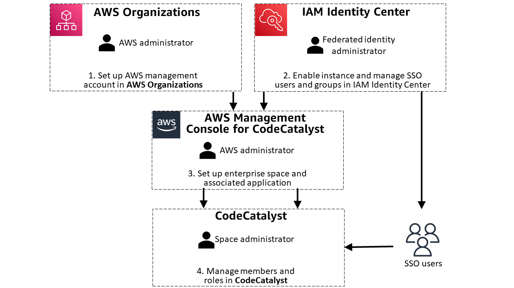

Amazon CodeCatalyst will no longer be open to new customers starting on November
7, 2025. If you would like to use the service, please sign up prior to November 7, 2025. For
more information, see [Migrating from Amazon CodeCatalyst](../userguide/migration.md "../userguide/migration.md").

# Setting up a space that supports identity federation

You can create a space that supports either of two types of users in CodeCatalyst.

You can create a space that manages users with AWS Builder ID access to CodeCatalyst. This is a
CodeCatalyst space for AWS Builder ID users.

Setting up a space in CodeCatalyst includes creating the space, adding users, and
assigning CodeCatalyst roles to space members. To set up a AWS Builder ID space and create your first
project, use the steps in [Sign up to
create your first space and your development role](../userguide/sign-up-create-resources.md "../userguide/sign-up-create-resources.md") in the _Amazon CodeCatalyst User Guide_.

To set up a space that supports identity federation, you must configure prerequisites
in the following services before you create or connect a CodeCatalyst space. Use the planning
steps in the following section to help you with planning your space.

After completing the prerequisites here, to continue creating your space, see [Creating a space for identity
federation](setting-up-federation-space-create.md "setting-up-federation-space-create.md").

The organization administrator creates the management accounts and Organizational Units for
the company in AWS Organizations. After the management account is available, the company identity
federation administrator works with IAM Identity Center to enable a provider instance where federated
identities will be managed.

The company directory will authorize users to federate through SAML with IAM Identity Center as the SSO
provider. Mary coordinates with the company identity federation administrator to set up the
users and groups in IAM Identity Center. After this is complete, Mary uses the CodeCatalyst page in the AWS
console to create or choose a CodeCatalyst space that will support identity federation. As part of the
setup process, Mary creates an SSO application to represent the company and map to the identity
store ID in IAM Identity Center. Next, Mary uses the CodeCatalyst page in the AWS Management Console to choose one or more groups
to which to grant single sign-on access and to add CodeCatalyst roles. Next, Mary wants to create a
team for the space. She incorporates the SSO group into a new team on the **Teams** page in CodeCatalyst.

The following diagram illustrates the flow of tasks for setting up your space.

###### Topics

- [Planning your space that supports
  identity federation](#setting-up-planning-federation "#setting-up-planning-federation")
- [Prerequisite 1: Setting up an organization in
  AWS Organizations](#setting-up-prereq-organization "#setting-up-prereq-organization")
- [Prerequisite 2: Enable an instance for identity
  federation](#setting-up-prereq-enable "#setting-up-prereq-enable")
- [Prerequisite 3: Setting up identity federation in
  IAM Identity Center](#setting-up-prereq-identity "#setting-up-prereq-identity")

## Planning your space that supports

identity federation

After you complete the prerequisites here for AWS Organizations and IAM Identity Center, you will use the CodeCatalyst
page in the AWS Management Console to create or choose a space and associate it with identity
federation. This makes the space a space that supports SSO users and groups. A
space that supports identity federation can only manage members through the membership in
IAM Identity Center SSO users and groups. These users are maintained in an identity store. When you use the
wizard in CodeCatalyst to create or choose a space and enable it for identity federation, you
will create an application and give it a name associated with your company.

###### Important

Dev Environments aren't available for users in spaces where Active Directory is used as
the identity provider. When planning a space where the identity provider will be Active
Directory, note that users will not be able to use Dev Environments. For more information, see
[I can't create a
Dev Environment when I'm signed into CodeCatalyst using a single sign-on
account](../userguide/devenvironments-troubleshooting.md#troubleshoot-create-dev-env-idprovider "../userguide/devenvironments-troubleshooting.md#troubleshoot-create-dev-env-idprovider").

An _Identity Center application_ is an association between your CodeCatalyst
space and IAM Identity Center. The Identity Center application allows users from your company directory to sign in to CodeCatalyst,
so your application name will represent your company and will be visible for selection as an
option where users from a workforce directory will access CodeCatalyst. As part of creating a space
that supports identity federation, you will choose or create the Identity Center application that will be
associated with your space. You can associate multiple spaces with a single
Identity Center application. When setting up the Identity Center application for CodeCatalyst, note that the application name must
be unique across CodeCatalyst and your IAM Identity Center instances. This uniqueness requirement helps prevent
confusion and ensures proper identification of different applications. This unique name is
primarily for administrative purposes within IAM Identity Center and doesn't affect the functionality of
CodeCatalyst.

###### Note

The name for your Identity Center application must be globally unique. In addition, since the name will be viewable for signing in and on certain pages in CodeCatalyst, choose a name that will suitably relate to your company for users signing in.

Mary Major is a **Space administrator** who will set up an
organization in AWS Organizations that is associated with your company. Mary will need to have the
AWS account that is set up a management account for your organization and associate it with
the company that will use the space. Additional Organizational Units (OUs) and accounts
will be set up for your organization for use with the space.

Mary will work with the Identity federation administrator to set up the directory of users
for the company. These are the federated identities that will be set up for the IAM Identity Center
instance. The users in the company directory will be set up to sign in to the space using
SSO. These users will be defined by the SSO users and groups that the Identity federation
administrator sets up in the IAM Identity Center instance.

###### Note

Users or groups that are added to IAM Identity Center assignments usually appear in CodeCatalyst within two
hours. Depending on the amount of data being synchronized, this process might take longer.

## Prerequisite 1: Setting up an organization in

AWS Organizations

Before you create a space and configure your user membership, complete the following
prerequisities for organization and identity federation setup in AWS. You can follow the
references in this chapter to get set up.

The AWS Organizations administrator sets up the organization and AWS accounts for your company. The
management account for the organization will be specified as the billing account for the
space in CodeCatalyst. For more information, see [What is
AWS Organizations?](../../../organizations/latest/userguide/orgs_introduction.md "../../../organizations/latest/userguide/orgs_introduction.md").

###### Note

Depending on the type of instance in IAM Identity Center you plan to use in IAM Identity Center, you can choose to
create an organization instance or an account instance. If you choose an account instance,
then the step to create an organization in AWS Organizations is optional. Choose the instance that best
fits your use case. For more information about use cases, see [When to use an organization instance](../../../singlesignon/latest/userguide/organization-instances-identity-center.md#when-to-use-organization-instance "../../../singlesignon/latest/userguide/organization-instances-identity-center.md#when-to-use-organization-instance") and [When to use an account instance](../../../singlesignon/latest/userguide/account-instances-identity-center.md "../../../singlesignon/latest/userguide/account-instances-identity-center.md") in the _IAM Identity Center User
Guide_.

###### Topics

- [Create an organization in AWS Organizations](#setting-up-prereq-organization-create "#setting-up-prereq-organization-create")
- [Add member accounts in AWS Organizations](#setting-up-prereq-organization-add-accounts "#setting-up-prereq-organization-add-accounts")
- [Create organizational units (OUs) in AWS Organizations](#setting-up-prereq-organization-create-OUs "#setting-up-prereq-organization-create-OUs")

### Create an organization in AWS Organizations

Create an organization for your company. Create an organization with your current
AWS account as the management account in AWS Organizations. See the steps in [Creating
an organization](../../../organizations/latest/userguide/orgs_manage_org_create.md "../../../organizations/latest/userguide/orgs_manage_org_create.md").

### Add member accounts in AWS Organizations

Add member accounts to your organization. See the steps in [Add
an AWS account to join your organization](../../../organizations/latest/userguide/Creating an organization.md "../../../organizations/latest/userguide/Creating an organization.md") .

### Create organizational units (OUs) in AWS Organizations

Create organizational units (OUs) and add member accounts for those OUs in AWS Organizations. See
the steps in [Managing organizational units](../../../organizations/latest/userguide/orgs_manage_ous.md "../../../organizations/latest/userguide/orgs_manage_ous.md").

## Prerequisite 2: Enable an instance for identity

federation

Before you create a space that supports identity federation, complete the following
prerequisities for enabling your instance. You can follow the references in this chapter to get
set up.

###### Note

For IAM Identity Center resources, choose the same Region as your CodeCatalyst space. While you can
choose a different Region, this might impact connectivity and latency.

###### Topics

- [Enable IAM Identity Center](#w2aac15c24c29b9 "#w2aac15c24c29b9")

### Enable IAM Identity Center

You must have identity federation administrator permissions and the appropriate IAM
permissions in IAM Identity Center to complete these steps. Use the steps to enable an AWS IAM Identity Center instance
in IAM Identity Center. For more information about this step in IAM Identity Center, see [Step 1: Enable instance](../../../singlesignon/latest/userguide/get-started-enable-identity-center.md "../../../singlesignon/latest/userguide/get-started-enable-identity-center.md").

1. Sign in to the IAM Identity Center console.
2. On the welcome page, choose **Enable AWS SSO**. A success banner
   displays.

## Prerequisite 3: Setting up identity federation in

IAM Identity Center

IAM Identity Center helps you securely create or connect your identity federation and manage user access
centrally across AWS accounts and applications. IAM Identity Center is the recommended approach for identity
federation on AWS for organizations of any size and type.

###### Note

For IAM Identity Center resources, choose the same Region as your CodeCatalyst space. While you can
choose a different Region, this might impact connectivity and latency.

The Identity federation administrator sets up the IAM Identity Center instance and SSO users and groups
for the company. This represents the identity provider (IdP) for the company. As the identity
federation administrator for your company, complete the following tasks in IAM Identity Center.

In IAM Identity Center, you can choose to create an organization instance or an account instance. Choose
the type that best fits your use case. For more information about use cases, see [When to use an organization instance](../../../singlesignon/latest/userguide/organization-instances-identity-center.md#when-to-use-organization-instance "../../../singlesignon/latest/userguide/organization-instances-identity-center.md#when-to-use-organization-instance") and [When to use an account instance](../../../singlesignon/latest/userguide/account-instances-identity-center.md "../../../singlesignon/latest/userguide/account-instances-identity-center.md") in the _IAM Identity Center User
Guide_.

###### Topics

- [Set up your provider in IAM Identity Center](#setting-up-prereq-identity-provider "#setting-up-prereq-identity-provider")
- [Set up your portal in IAM Identity Center](#setting-up-prereq-identity-portal "#setting-up-prereq-identity-portal")
- [Create users and groups in
  IAM Identity Center](#setting-up-prereq-identity-users-groups "#setting-up-prereq-identity-users-groups")

### Set up your provider in IAM Identity Center

Connect your recently created or existing IAM Identity Center instance to your IdP.

###### Important

Dev Environments aren't available for users in spaces where Active Directory is used as
the identity provider. When planning a space where the identity provider will be Active
Directory, note that users will not be able to use Dev Environments. For more information, see
[I can't create a Dev Environment when I'm signed into CodeCatalyst using a single sign-on
account](../userguide/devenvironments-troubleshooting.md#troubleshoot-create-dev-env-idprovider "../userguide/devenvironments-troubleshooting.md#troubleshoot-create-dev-env-idprovider").

Set up your provider in IAM Identity Center. See the steps in [What is
IAM Identity Center?](../../../singlesignon/latest/userguide/what-is.md "../../../singlesignon/latest/userguide/what-is.md").

###### Note

CodeCatalyst spaces with identity federation can support service providers that are
supported by IAM Identity Center. CodeCatalyst inherits the identity source that is managed in IAM Identity Center. For more
information, see [Manage your identity source](../../../singlesignon/latest/userguide/manage-your-identity-source.md "../../../singlesignon/latest/userguide/manage-your-identity-source.md").

### Set up your portal in IAM Identity Center

Connect your recently created or existing instance in IAM Identity Center to your IdP.

Create an SSO portal login for your provider in IAM Identity Center. See [Manage sign-in and attribute use for all identity source types](../../../singlesignon/latest/userguide/manage-your-identity-source-attribute-use.md "../../../singlesignon/latest/userguide/manage-your-identity-source-attribute-use.md").

An _Identity Center application_ is an association between your CodeCatalyst
space and IAM Identity Center. The Identity Center application allows users from your company directory to sign in to CodeCatalyst,
so your application name will represent your company and will be visible for selection as an
option where users from a workforce directory will access CodeCatalyst. As part of creating a space
that supports identity federation, you will choose or create the Identity Center application that will be
associated with your space. You can associate multiple spaces with a single
Identity Center application. When setting up the Identity Center application for CodeCatalyst, note that the application name must
be unique across CodeCatalyst and your IAM Identity Center instances. This uniqueness requirement helps prevent
confusion and ensures proper identification of different applications. This unique name is
primarily for administrative purposes within IAM Identity Center and doesn't affect the functionality of
CodeCatalyst.

###### Note

The name for your Identity Center application must be globally unique. In addition, since the name will be viewable for signing in and on certain pages in CodeCatalyst, choose a name that will suitably relate to your company for users signing in.

### Create users and groups in

IAM Identity Center

You must create users and groups in IAM Identity Center that you will manage in IAM Identity Center and then specify
in CodeCatalyst when you create or view your space. Create and connect groups in IAM Identity Center.

You must have Identity federation administrator permissions and the appropriate IAM
permissions in IAM Identity Center to complete these steps. Use the steps to create users and groups who
will be the directory users for your space. For more information about this step in
IAM Identity Center, see [Manage identities in IAM Identity Center](../../../singlesignon/latest/userguide/manage-your-identity-source-sso.md "../../../singlesignon/latest/userguide/manage-your-identity-source-sso.md").

###### Note

CodeCatalyst user names have a minimum length of 3 and a maximum length of 100 characters.
Provided user names longer than 100 characters will be truncated. This can result in a user
name that appears to be a duplicate of another 100-character user name. For more
information, see [I can’t access my
AWS Builder ID space as a new user or can’t be added as a new SSO user due to truncated user
name](../userguide/troubleshooting.md#troubleshoot-username-truncated "../userguide/troubleshooting.md#troubleshoot-username-truncated").
