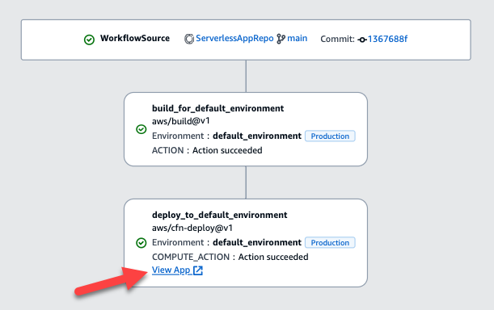

Amazon CodeCatalyst will no longer be open to new customers starting on November
7, 2025. If you would like to use the service, please sign up prior to November 7, 2025. For
more information, see [How to migrate from CodeCatalyst](migration.md "migration.md").

# Displaying the app URL in the workflow diagram

If your workflow deploys an application, you can configure Amazon CodeCatalyst to display the
application's URL as a clickable link. This link appears in the CodeCatalyst console, inside the
action that deployed it. The following workflow diagram shows the **View App**
URL appearing at the bottom of an action.


By making this URL clickable in the CodeCatalyst console, you can quickly verify your application
deployment.

###### Note

The app URL is not supported with the **Deploy to Amazon ECS** action.

To enable this feature, add an output variable to your action with a name that contains
`appurl`, or `endpointurl`. You can use a name with or without a joining
dash (`-`), underscore (`_`), or space (). The string is
case-insensitive. Set the variable's value to the `http` or `https` URL of
your deployed application.

###### Note

If you're updating an existing output variable to include the `app url`, or
`endpoint url` string, update all references to this variable to use the new
variable name.

For detailed steps, see one of the following procedures:

- [To display the app URL in the "AWS CDK deploy" action](#deploy-app-url-cdk "#deploy-app-url-cdk")
- [To display the app URL in the "Deploy AWS CloudFormation stack"
  action](#deploy-app-url-cfn "#deploy-app-url-cfn")
- [To display the app URL in all other actions](#deploy-app-url-other "#deploy-app-url-other")
  When you've finished configuring the URL, verify that it appears as expected by following
  these instructions:

- [To verify that the application URL was added](#deploy-app-url-verify "#deploy-app-url-verify")

###### To display the app URL in the "AWS CDK deploy" action

1.  If you're using the **AWS CDK deploy** action, add a
    `CfnOutput` construct (which is a key-value pair) in your AWS CDK application
    code:

        * The key name must contain `appurl`, or `endpointurl`, with or
         without a joining dash (`-`), underscore (`_`), or space
         (). The string is case-insensitive.
        * The value must be the `http` or `https` URL of your deployed
         application.

    For example, your AWS CDK code might look like this:

```
import { Duration, Stack, StackProps, CfnOutput, RemovalPolicy} from 'aws-cdk-lib';
import * as dynamodb from 'aws-cdk-lib/aws-dynamodb';
import * as s3 from 'aws-cdk-lib/aws-s3';
import { Construct } from 'constructs';
import * as cdk from 'aws-cdk-lib';
export class HelloCdkStack extends Stack {
  constructor(scope: Construct, id: string, props?: StackProps) {
    super(scope, id, props);
    const bucket = new s3.Bucket(this, 'amzn-s3-demo-bucket', {
      removalPolicy: RemovalPolicy.DESTROY,
    });
    **`new CfnOutput(this, 'APP-URL', {`**
      **`value: https://mycompany.myapp.com,`**
      description: 'The URL of the deployed application',
      exportName: 'myApp',
    });
    ...
  }
}
```

For more information about the `CfnOutput` construct, see [interface
CfnOutputProps](../../../cdk/api/v2/docs/aws-cdk-lib.md "../../../cdk/api/v2/docs/aws-cdk-lib.md") in the _AWS Cloud Development Kit (AWS CDK) API Reference_. 2. Save and commit your code. 3. Proceed to [To verify that the application URL was added](#deploy-app-url-verify "#deploy-app-url-verify").

###### To display the app URL in the "Deploy AWS CloudFormation stack"

action

1.  If you're using the **Deploy AWS CloudFormation stack** action, add an output to the
    `Outputs` section in your CloudFormation template or AWS SAM template with these
    characteristics:

        * The key (also called the logical ID) must contain `appurl`, or
         `endpointurl`, with or without a joining dash (`-`), underscore
         (`_`), or space (). The string is case-insensitive.
        * The value must be the `http` or `https` URL of your deployed
         application.

    For example, your CloudFormation template might look like this:

```
"Outputs" : {
  **`"APP-URL" : {`**
    "Description" : "The URL of the deployed app",
    **`"Value" : "https://mycompany.myapp.com",`**
    "Export" : {
      "Name" : "My App"
    }
  }
}
```

For more information about CloudFormation outputs, see [Outputs](../../../AWSCloudFormation/latest/UserGuide/outputs-section-structure.md "../../../AWSCloudFormation/latest/UserGuide/outputs-section-structure.md") in
the _AWS CloudFormation User Guide_. 2. Save and commit your code. 3. Proceed to [To verify that the application URL was added](#deploy-app-url-verify "#deploy-app-url-verify").

###### To display the app URL in all other actions

If you're using another action to deploy your application, such as the build action or
**GitHub Actions**, do the following to have the app URL displayed.

1.  Define an environment variable in the `Inputs` or `Steps` section
    of the action in the workflow definition file. The variable must have these
    characteristics:

        * The `name` must contain `appurl`, or `endpointurl`,
         with or without a joining dash (`-`), underscore (`_`), or space
         (). The string is case-insensitive.
        * The value must be the `http` or `https` URL of your deployed
         application.

    For example, a build action might look like this:

```
Build-action:
  Identifier: aws/build@v1
  Inputs:
    Variables:
      - **`Name: APP-URL`**
        **`Value: https://mycompany.myapp.com`**
```

...or this:

```
Actions:
  Build:
    Identifier: aws/build@v1
    Configuration:
      Steps:
        - Run: **`APP-URL=https://mycompany.myapp.com`**
```

For more information about defining environment variables, see [Defining a
variable](workflows-working-with-variables-define-input.md "workflows-working-with-variables-define-input.md"). 2. Export the variable.

For example, your build action might look like this:

```
Build-action:
  ...
  Outputs:
    Variables:
      - **`APP-URL`**
```

For information about exporting variables, see [Exporting a variable
so that other actions can use it](workflows-working-with-variables-export-input.md "workflows-working-with-variables-export-input.md"). 3. (Optional) Choose **Validate** to validate the workflow's YAML code
before committing. 4. Choose **Commit**, enter a commit message, and choose
**Commit** again. 5. Proceed to [To verify that the application URL was added](#deploy-app-url-verify "#deploy-app-url-verify").

###### To verify that the application URL was added

- Start a workflow run, if it hasn't started automatically. The new run should have the
  app URL displayed as a clickable link in its workflow diagram. For more information about
  starting runs, see [Starting a workflow run manually](workflows-manually-start.md "workflows-manually-start.md").
