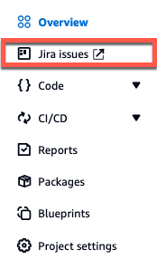

Amazon CodeCatalyst is no longer open to new customers. Existing customers can continue to use the service as normal. For more information, see [How to migrate from CodeCatalyst](migration.md "migration.md").

# Quickstart: Installing extensions, connecting providers, and linking resources in CodeCatalyst

This tutorial provides a walkthrough of the following three tasks:

1. Install the **GitHub repositories**, **Bitbucket repositories**, **GitLab repositories**, or **Jira Software** extension. You're
   prompted in an external site to connect and provide CodeCatalyst with access to your third-party resources,
   which is done as part of the next step.

###### Important

To install the **GitHub repositories**, **Bitbucket repositories**, **GitLab repositories**, or **Jira Software** extension to your
CodeCatalyst space, you must be signed in with an account that has the **Space administrator** role in the
space. 2. Connect your GitHub account, Bitbucket workspace, GitLab user, or Jira site to CodeCatalyst.

###### Important

To connect your GitHub account, Bitbucket workspace, GitLab user, or Jira site to your CodeCatalyst space, you must be
both the third-party source's administrator and the CodeCatalyst **Space administrator**.

###### Important

After you install a repository extension, any repositories you link to CodeCatalyst will have
their code indexed and stored in CodeCatalyst. This will make the code searchable in
CodeCatalyst. To better understand the data protection for your code when using linked
repositories in CodeCatalyst, see [Data protection](data-protection.md "data-protection.md")
in the _Amazon CodeCatalyst User Guide_.

###### Note

If you're using a connection to a GitHub account, you must create a personal connection to establish identity mapping
between your CodeCatalyst identity and your GitHub identity. For more information, see [Personal connections](concepts.md#personal-connection-concept "concepts.md#personal-connection-concept") and [Accessing GitHub resources with personal
connections](ipa-settings-connections.md "ipa-settings-connections.md"). 3. Link your GitHub repository, Bitbucket repository, GitLab project repository, or Jira project to your CodeCatalyst project.

###### Important

    * While you can link a GitHub repository, Bitbucket repository, or GitLab project repository as a
     **Contributor**, you can only unlink a third-party repository as the **Space administrator**
     or the **Project administrator**. For more information, see [Unlinking GitHub repositories, Bitbucket repositories, GitLab project repositories,
     and Jira projects in CodeCatalyst](extensions-unlink.md "extensions-unlink.md").
    * To link your Jira project to your CodeCatalyst project, you must be the CodeCatalyst
     **Space administrator** or CodeCatalyst **Project administrator**.

###### Important

CodeCatalyst doesn't support detecting changes in the default branch for linked
repositories. To change the default branch for a linked repository, you must first unlink it
from CodeCatalyst, change the default branch, and then link it again. For more information,
see [Linking GitHub repositories, Bitbucket repositories, GitLab project repositories,
and Jira projects in CodeCatalyst](extensions-link.md "extensions-link.md").

As a best practice, always make sure you have the latest version of the extension
before you link a repository.

###### Note

    * A GitHub repository, Bitbucket repository, or GitLab project repository can only be linked to one CodeCatalyst
     project in a space.
    * You can't use empty or archived GitHub repositories, Bitbucket repositories, or GitLab project
     repositories with CodeCatalyst projects.
    * You can't link a GitHub repository, Bitbucket repository, or GitLab project repository that has the
     same name as a repository in a CodeCatalyst project.
    * The **GitHub repositories** extension isn't compatible with GitHub Enterprise Server repositories.
    * The **Bitbucket repositories** extension isn't compatible with Bitbucket Data Center repositories.
    * The **GitLab repositories** extension isn't compatible with GitLab self-managed project repositories.
    * You can't use the **Write description for me** or
     **Summarize comments** features with linked repositories.
     These features are only available in pull requests in CodeCatalyst.
    * A CodeCatalyst project can only be linked to one Jira project. A Jira project can be linked to multiple CodeCatalyst
     projects.

You can also install the **GitHub repositories**, **Bitbucket repositories**, **GitLab repositories** extension, connect to your GitHub account, Bitbucket workspace, or GitLab
user, and link third-party repositories when creating a new CodeCatalyst project. For more information,
see [Creating a project with a linked third-party
repository](projects-create.md#projects-create-3p-repo "projects-create.md#projects-create-3p-repo").

###### Topics

- [Step 1: Install a third-party extension from the CodeCatalyst catalog](#extensions-quickstart-install "#extensions-quickstart-install")
- [Step 2: Connect your third-party provider to your CodeCatalyst
  space](#extensions-github-extension-get-started-connect "#extensions-github-extension-get-started-connect")
- [Step 3: Link your third-party resources to your CodeCatalyst project](#extensions-quickstart-link "#extensions-quickstart-link")
- [Next steps](#extensions-quickstart-next-steps "#extensions-quickstart-next-steps")

## Step 1: Install a third-party extension from the CodeCatalyst catalog

The first step to using thid-party resources in CodeCatalyst is to install the **GitHub repositories** extension from the CodeCatalyst catalog.
To install the extension, perform the following steps, choosing the extension for the third-party resources you want to
use. **GitHub repositories**, **Bitbucket repositories**, and **GitLab repositories** allow you to use GitHub repositories, Bitbucket repositories, or GitLab project
repositories in CodeCatalyst. **Jira Software** allows you to manage Jira issues in CodeCatalyst.

###### To install an extension from the CodeCatalyst catalog

1. Open the CodeCatalyst console at [https://codecatalyst.aws/](https://codecatalyst.aws/ "https://codecatalyst.aws/").
2. Navigate to your CodeCatalyst space.
3. Navigate to the CodeCatalyst CodeCatalyst catalog by choosing the **Catalog** icon

in the top menu. You can search for **GitHub repositories**, **Bitbucket repositories**, **GitLab repositories**, or **Jira Software**. You can also
filter extensions based on categories. 4. (Optional) To see more details about the extension, such as the permissions the extension will
have, choose the extension name. 5. Choose **Install**. Review the permissions required by the extension, and if you want to
continue, choose **Install** again.

After installing the extension, you are taken to the extension details page. Depending on the extension
you installed, you can view and manage connected providers and linked resources.

## Step 2: Connect your third-party provider to your CodeCatalyst

space

After you install the **GitHub repositories**, **Bitbucket repositories**, **GitLab repositories**, or **Jira Software** extension, the next step is to connect your GitHub account,
Bitbucket workspace, GitLab project repository, or Jira site to your CodeCatalyst space.

###### To connect your GitHub account, Bitbucket workspace, or Jira site to CodeCatalyst

- Do one of the following depending on the third-party extension you installed:
  - **GitHub repositories**: Connect to a GitHub account.

        1. In the **Connected GitHub accounts** tab, choose **Connect GitHub account** to go to
         the external site for GitHub.
        2. Sign in to your GitHub account using your GitHub credentials, and then choose the
         account where you want to install Amazon CodeCatalyst.

        ###### Tip

        If you have previously connected a GitHub account to the space, you will not be
         prompted to reauthorize. You will instead see a dialog box asking you where you would
         like to install the extension if you are a member or collaborator in more than one
         GitHub organization, or the configuration page for the Amazon CodeCatalyst application if you only
         belong to one GitHub organization. Configure the application for the repository access
         that you want to allow, and then choose **Save**. If the
         **Save** button is not active, make a change to the configuration,
         and then try again.
        3. Choose whether you want to allow CodeCatalyst to access all current and future repositories,
         or choose the specific GitHub repositories you want to use in CodeCatalyst. The default
         option is to include all GitHub repositories in the GitHub account, including
         future repositories that will be accessed by CodeCatalyst.
        4. Review the permissions given to CodeCatalyst, and then choose
         **Install**.

    After connecting your GitHub account to CodeCatalyst, you're taken to the **GitHub repositories** extension details
    page, where you can view and manage connected GitHub accounts and linked GitHub repositories.

  - **Bitbucket repositories**: Connect to a Bitbucket workspace.

        1. In the **Connected Bitbucket workspaces** tab, choose **Connect Bitbucket workspace** to go to
         the external site for Bitbucket.
        2. Sign into your Bitbucket workspace using your Bitbucket credentials and review the permissions given to CodeCatalyst.
        3. From the **Authorize for workspace** dropdown menu, choose the Bitbucket workspace you want to
         provide CodeCatalyst access to, and then choose **Grant access**.

        ###### Tip

        If you have previously connected a Bitbucket workspace to the space, you will not be prompted
         to reauthorize. You will instead see a dialog asking you where you would like to
         install the extension if you're a member or collaborator in more than one Bitbucket
         workspace, or the configuration page for the Amazon CodeCatalyst application if you only
         belong to one Bitbucket workspace. Configure the application for the workspace access
         you want to allow, and then choose **Grant access**. If the
         **Grant access** button is not active, make a change to the configuration,
         and then try again.

    After connecting your Bitbucket workspace to CodeCatalyst, you're taken to the **Bitbucket repositories** extension details
    page, where you can view and manage connected Bitbucket workspaces and linked Bitbucket repositories.

  - **GitLab repositories**: Connect to a GitLab user.

        1. Choose **Connect GitLab user** to go to
         the external site for GitLab.
        2. Sign in to your GitLab user using your GitLab credentials and review the permissions given to CodeCatalyst.

        ###### Tip

        If you have previously connected a GitLab user to the space, you will not be
         prompted to reauthorize. You will instead be navigated back to the CodeCatalyst console.
        3. Choose **Authorize AWS Connector for GitLab**.

    After connecting your GitLab user to CodeCatalyst, you're taken to the **GitLab repositories** extension details
    page, where you can view and manage connected GitLab user and linked GitLab project repositories.

  - **Jira Software**: Connect a Jira site.

        1. In the **Connected Jira sites** tab, choose **Connect Jira site** to go to the external
         site for Atlassian Marketplace.
        2. Choose **Get it now** to get started with installing CodeCatalyst on your Jira site.

        ###### Note

        If you previously installed CodeCatalyst to your Jira site, you will be notified. Choose **Get
         started** to be taken to the final step.
        3. Depending on your role, do one of the following:

        	1. If you are a Jira site administrator, from the site dropdown menu, choose the Jira site to install the CodeCatalyst application, and
        	 then choose **Install app**.

        	###### Note

        	If you have one Jira site, this step won't appear, and you'll automatically be directed to the next step.
        	2. 1. If you aren't a Jira administrator, from the site dropdown menu, choose the Jira site to install the CodeCatalyst
        		 application, and then choose **Request app**. For more information on installing Jira apps, see
        		 [Who can install apps?](https://www.atlassian.com/licensing/marketplace#who-can-install-apps "https://www.atlassian.com/licensing/marketplace#who-can-install-apps").
        		2. Enter the reason you need to install CodeCatalyst into the input text field or keep the default text, and then choose
        		 **Submit request**.
        4. Review the actions performed by CodeCatalyst when the application is installed, and then choose **Get it
         now**.
        5. After the application is installed, choose **Return to CodeCatalyst** to return to CodeCatalyst.

    After connecting your Jira site to CodeCatalyst, you can view the connected site in the
    **Connected Jira sites** tab of the **Jira Software** extension
    details page.

## Step 3: Link your third-party resources to your CodeCatalyst project

The third and final step to using your GitHub repositories, Bitbucket repositories, or GitLab project repositories or manage
Jira issues in CodeCatalyst is to link them to the CodeCatalyst project in which you want to use it.

###### To link a GitHub repository, Bitbucket repository, GitLab project repository, or Jira project to a CodeCatalyst project from

the extension details page

- Do one of the following depending on the third-party extension you installed and provider you connected:
  - **GitHub repositories**: Link a GitHub repository.

        1. In the **Linked GitHub repositories** tab, choose **Link GitHub repository**.
        2. From the **GitHub account** dropdown, choose the GitHub account that contains the repository that you want to link.
        3. From the **GitHub repository** dropdown, choose the repository you want to link to a CodeCatalyst project.

        ###### Tip

        If the name of the repository is greyed out, you can't link that repository because it has already been linked to another project in the space.
        4. (Optional) If you don't see a GitHub repository in the list of repositories, it might not have been configured for repository access in the Amazon CodeCatalyst
         application in GitHub. You can configure which GitHub repositories can be used in CodeCatalyst in the connected account.

        	1. Navigate to your [GitHub](https://github.com/ "https://github.com/") account, choose **Settings**, and then choose **Applications**.
        	2. In the **Installed GitHub Apps** tab, choose **Configure** for the Amazon CodeCatalyst application.
        	3. Do one of the following to configure access of GitHub repositories you want to link in CodeCatalyst:

        		- To provide access to all current and future repositories, choose **All repositories**.
        		- To provide access to specific repositories, choose **Only select repositories**, choose the **Select
        		 repositories** dropdown, and then choose a repository you want to allow to link in CodeCatalyst.
        5. From the **CodeCatalyst project** dropdown menu, choose the CodeCatalyst project you want to link the GitHub repository to.
        6. Choose **Link**.

    If you no longer want to use a GitHub repository in CodeCatalyst, you can unlink it from a CodeCatalyst
    project. When a repository is unlinked, events in that repository will not start workflow
    runs, and you will not be able to use that repository with CodeCatalyst Dev Environments. For more information, see
    [Unlinking GitHub repositories, Bitbucket repositories, GitLab project repositories,
    and Jira projects in CodeCatalyst](extensions-unlink.md "extensions-unlink.md").

  - **Bitbucket repositories**: Link a Bitbucket repository.

        1. In the **Linked Bitbucket repositories** tab, choose **Link Bitbucket repository**.
        2. From the **Bitbucket workspace** dropdown, choose the Bitbucket workspace that contains the repository that you want to link.
        3. From the **Bitbucket repository** dropdown, choose the repository you want to link to a CodeCatalyst project.

        ###### Tip

        If the name of the repository is greyed out, you can't link that repository because it has already been linked to another project in the space.
        4. From the **CodeCatalyst project** dropdown menu, choose the CodeCatalyst project you want to link the Bitbucket repository to.
        5. Choose **Link**.

    If you no longer want to use a Bitbucket repository in CodeCatalyst, you can unlink it from a CodeCatalyst
    project. When a repository is unlinked, events in that repository will not start workflow
    runs, and you will not be able to use that repository with CodeCatalyst Dev Environments. For more information, see
    [Unlinking GitHub repositories, Bitbucket repositories, GitLab project repositories,
    and Jira projects in CodeCatalyst](extensions-unlink.md "extensions-unlink.md").

  - **GitLab repositories**: Link a GitLab project repository.

        1. In the **Linked GitLab project repositories** tab, choose **Link GitLab project repository**.
        2. From the **GitLab user** dropdown, choose the GitLab user that contains the repository that you want to link.
        3. From the **GitLab project repository** dropdown, choose the repository you want to link to a CodeCatalyst project.

        ###### Tip

        If the name of the repository is greyed out, you can't link that repository because it has already been linked to another project in the space.
        4. From the **CodeCatalyst project** dropdown menu, choose the CodeCatalyst project you want to link the GitLab project repository to.
        5. Choose **Link**.

    If you no longer want to use a GitLab project repository in CodeCatalyst, you can unlink it from a CodeCatalyst
    project. When a project repository is unlinked, events in that project repository will not start workflow
    runs, and you will not be able to use that project repository with CodeCatalyst Dev Environments. For more information, see
    [Unlinking GitHub repositories, Bitbucket repositories, GitLab project repositories,
    and Jira projects in CodeCatalyst](extensions-unlink.md "extensions-unlink.md").

  - **Jira Software**: Link a Jira project.

        1. In the **Linked Jira projects** tab, choose **Link Jira project**.
        2. From the **Jira site** dropdown menu, choose the Jira site that contains the project that you want to link.
        3. From the **Jira project** dropdown menu, choose the project you want to link to a CodeCatalyst project.
        4. From the **CodeCatalyst project** dropdown menu, choose the CodeCatalyst project you want to link to a Jira project.
        5. Choose **Link**.

    Once a Jira project is linked to a CodeCatalyst project, access to CodeCatalyst issues is disabled entirely,
    and **Issues** in the CodeCatalyst navigation pane will be replaced with a
    **Jira issues** item that links to the Jira project.

  

  If you no longer want to use a Jira project in CodeCatalyst, you can unlink it from your CodeCatalyst
  project. When a Jira project is unlinked, Jira issues will not be available in the CodeCatalyst
  project, and CodeCatalyst **Issues** will be the issue provider again. For more information,
  see [Unlinking GitHub repositories, Bitbucket repositories, GitLab project repositories,
  and Jira projects in CodeCatalyst](extensions-unlink.md "extensions-unlink.md").

You can also link your GitHub repository, Bitbucket repository, or GitLab project repository to a project from **Source repositories**
in **Code**. For more information, see [Linking resources from connected third-party providers](extensions-link.md#extensions-link-resources "extensions-link.md#extensions-link-resources").

## Next steps

After installing the **GitHub repositories**, **Bitbucket repositories**, or **GitLab repositories** extension, connecting your resource provider, and linking your third-party repositories to your CodeCatalyst projects,
you can use it in CodeCatalyst workflows and Dev Environments. You can also create third-party repositories in the connected GitHub account, Bitbucket workspace, or GitLab user with
code generated from a blueprint. For more information, see [Automatically starting a workflow run after third-party repository events](extensions-workflow-repositories.md "extensions-workflow-repositories.md") and [Creating a Dev Environment](devenvironment-create.md "devenvironment-create.md").

After installing the **Jira Software** extension, connecting your Jira site, linking your Jira projects to your CodeCatalyst project, and linking a pull request,
updates from CodeCatalyst are reflected in your Jira project. For more information about linking pull requests to Jira issues, see
[Linking Jira issues to CodeCatalyst pull requests](link-jira-issues-pull-requests.md "link-jira-issues-pull-requests.md"). For more information on viewing CodeCatalyst events in Jira,
see [Viewing CodeCatalyst events in Jira issues](view-codecatalyst-events-jira.md "view-codecatalyst-events-jira.md").
