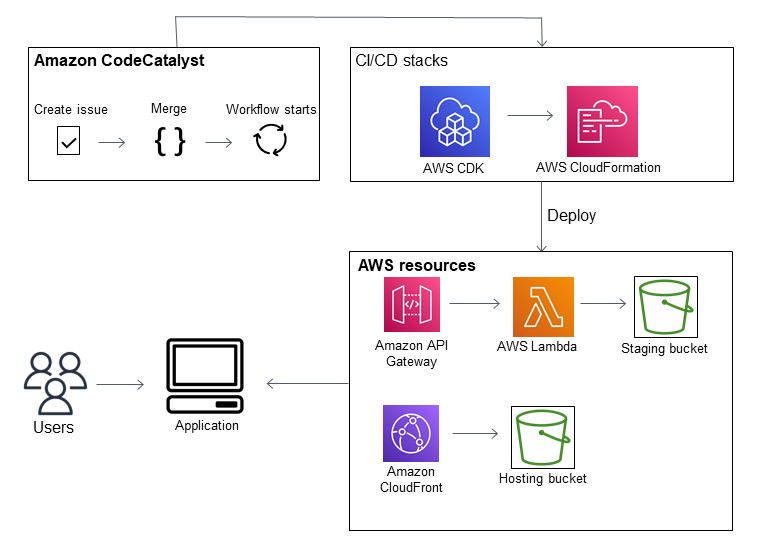
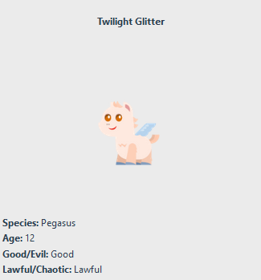

Amazon CodeCatalyst will no longer be open to new customers starting on November
7, 2025. If you would like to use the service, please sign up prior to November 7, 2025. For
more information, see [How to migrate from CodeCatalyst](migration.md "migration.md").

# Tutorial: Creating a project with the

Modern three-tier web application blueprint

You can get started more quickly with developing software by creating a project with a
blueprint. A project created with a blueprint includes the resources that you need,
including a source repository to manage your code, and a workflow to build and deploy the
application. In this tutorial, we will walk you through using the
**Modern three-tier web application** blueprint to create a project in Amazon CodeCatalyst. The
tutorial also includes viewing the deployed sample, inviting other users to work on it, and
making changes to the code with pull requests that are automatically built and deployed to
resources in the connected AWS account when the pull request is merged. Where CodeCatalyst creates
your project with reports, activity feeds, and other tools, your blueprint creates AWS
resources in the AWS account associated with your project. Your blueprint files allow you to
build and test a sample modern application and deploy it to infrastructure in the
AWS Cloud.

The following illustration shows how tools in CodeCatalyst are used to create an issue for
tracking, merge and automatically build the change, and then start a workflow in the CodeCatalyst
project that runs actions to allow AWS CDK and AWS CloudFormation to provision your infrastructure.

The actions generate resources in the associated AWS account and deploy your application
to a serverless AWS Lambdafunction with an API Gateway endpoint. The AWS Cloud Development Kit (AWS CDK) action converts one or
more AWS CDK stacks to AWS CloudFormation templates and deploys stacks to your AWS account. Resources in your
stacks include Amazon CloudFront resources to distribute dynamic web content, an Amazon DynamoDB instance for
your application data, and the roles and policies that support the deployed application.


When you create a project with the **Modern three-tier web application** blueprint,
your project is created with the following resources:

**In the CodeCatalyst project**:

- A [source repository](source.md "source.md") with sample code and workflow
  YAML
- A [workflow](workflow.md "workflow.md") that builds and deploys the sample code whenever
  a change is made to the default branch
- An issues board and backlog that you can use to plan and track work
- A test reports suite with automated reports included in the sample code
  **In the associated AWS account**:

- Three AWS CloudFormation stacks that create the resources needed for the application.
  For expanded details about the resources that will be created in AWS and CodeCatalyst as part of
  this tutorial, see [Reference](#getting-started-template-project-reference "#getting-started-template-project-reference").

###### Note

The resources and samples included in a project depend on which blueprint you select.
Amazon CodeCatalyst offers several project blueprints that define resources related to their defined
language or framework. To learn more about blueprints, see [Creating a comprehensive project with CodeCatalyst blueprints](project-blueprints.md "project-blueprints.md").

###### Topics

- [Prerequisites](#getting-started-template-project-prerequisites "#getting-started-template-project-prerequisites")
- [Step 1: Create the
  Modern three-tier web application project](#getting-started-template-project-proj-create "#getting-started-template-project-proj-create")
- [Step 2: Invite someone to your
  project](#getting-started-template-project-ipa-user "#getting-started-template-project-ipa-user")
- [Step 3: Create issues to collaborate
  on and track work](#getting-started-template-project-issue "#getting-started-template-project-issue")
- [Step 4: View your source
  repository](#getting-started-template-project-source "#getting-started-template-project-source")
- [Step 5: Create a
  Dev Environment with a test branch and make a quick code change](#getting-started-template-project-create-devenvironment "#getting-started-template-project-create-devenvironment")
- [Step 6: View the workflow
  that builds the modern application](#getting-started-template-project-view-workflow "#getting-started-template-project-view-workflow")
- [Step 7: Ask others to review
  your changes](#getting-started-template-project-pull-request "#getting-started-template-project-pull-request")
- [Step 8: Close the issue](#getting-started-template-project-close-issue "#getting-started-template-project-close-issue")
- [Clean up resources](#getting-started-template-project-clean-up "#getting-started-template-project-clean-up")
- [Reference](#getting-started-template-project-reference "#getting-started-template-project-reference")

## Prerequisites

To create a modern application project in this tutorial, you must have completed the tasks
in [Set up and sign in to CodeCatalyst](setting-up-topnode.md "setting-up-topnode.md") as follows:

- Have an AWS Builder ID for signing in to CodeCatalyst.
- Belong to a space and have the **Space administrator** or
  **Power user** role assigned to you in that space. For more
  information, see [Creating a space](spaces-create.md "spaces-create.md"), [Granting users space permissions](spaces-members.md "spaces-members.md"), and [Space administrator role](ipa-role-types.md#ipa-role-space-admin "ipa-role-types.md#ipa-role-space-admin").
- Have an AWS account associated with your space and have the IAM role you
  created during sign-up. For example, during sign-up, you have the option to choose to
  create a service role with a role policy called the **CodeCatalystWorkflowDevelopmentRole-`spaceName`** role policy. The role will
  have a name `CodeCatalystWorkflowDevelopmentRole-`spaceName`` with a unique identifier appended. For more information about
  the role and role policy, see [Understanding the CodeCatalystWorkflowDevelopmentRole-spaceName service role](ipa-iam-roles.md#ipa-iam-roles-service-role "ipa-iam-roles.md#ipa-iam-roles-service-role"). For the steps to create the role, see [Creating the CodeCatalystWorkflowDevelopmentRole-spaceName role for your account
  and space](ipa-iam-roles.md#ipa-iam-roles-service-create "ipa-iam-roles.md#ipa-iam-roles-service-create").

## Step 1: Create the

Modern three-tier web application project

After you've created it, your project is where you will develop and test code, coordinate
development tasks, and view project metrics. Your project also contains your development tools
and resources.

In this tutorial, you will use the **Modern three-tier web application** blueprint to
create an interactive application. The workflow that is created and run automatically as part
of your project will build and deploy the application. The workflow only runs successfully
after all roles and account information is configured for your space. After the workflow
has run successfully, you can visit the endpoint URL to see the application.

###### To create a project with a blueprint

1. Open the CodeCatalyst console at [https://codecatalyst.aws/](https://codecatalyst.aws/ "https://codecatalyst.aws/").
2. In the CodeCatalyst console, navigate to the space where you want to create a
   project.
3. Choose **Create project**.
4. Choose **Start with a blueprint**.
5. In the search bar, enter `modern`.
6. Select the **Modern three-tier web application** blueprint, and then choose
   **Next**.
7. In **Name your project**, enter a project name. For example:

`MyExampleProject`.

###### Note

The name must be unique in your space. 8. In **Account**, choose the AWS account you added during sign-up.
The blueprint will install resources into this account. 9. In **Deployment Role**, choose the role that you added during
sign-up. For example, choose `CodeCatalystWorkflowDevelopmentRole-`spaceName``.

If there are no roles listed, add one. To add a role, choose **Add IAM
role** and add the role to your AWS account. For more information, see [Allowing access to AWS resources with connected
AWS accounts](ipa-connect-account.md "ipa-connect-account.md"). 10. In **Compute platform**, choose **Lambda**. 11. In **Frontend Hosting Option**, choose **Amplify
Hosting**. For information about AWS Amplify, see [What is AWS Amplify Hosting?](../../../amplify/latest/userguide/welcome.md "../../../amplify/latest/userguide/welcome.md") in
the _AWS Amplify User Guide_. 12. In **Deployment Region**, enter the Region code of the AWS Region
where you want the blueprint to deploy the Mysfits application and supporting resources.
For a list of Region codes, see [Regional endpoints](../../../general/latest/gr/rande.md#regional-endpoints "../../../general/latest/gr/rande.md#regional-endpoints") in the
_AWS General Reference_. 13. In **Application name**, leave the default of
`mysfits`string``. 14. (Optional) Under **Generate project preview**, choose **View
code** to preview the source files that the blueprint will install. Choose
**View workflow** to preview the CI/CD workflow definition files that
the blueprint will install. The preview dynamically updates based on your
selections. 15. Choose **Create project**.

The project workflow starts as soon as you create the project. It will take a little time
to finish building and deploying the code. In the meantime, go ahead and invite someone else
to your project.

## Step 2: Invite someone to your

project

Now that you've set up your project, invite others to work with you.

###### To invite someone to your project

1. Navigate to the project to which you want to invite users.
2. In the navigation pane, choose **Project settings**.
3. On the **Members** tab, choose **Invite**.
4. Type the email addresses of the people you want to invite as users for your project. You
   can type multiple email addresses separated by a space or a comma. You can also choose from
   members of your space who are not members of the project.
5. Choose the role for the user.

When you have finished adding users, choose **Invite**.

## Step 3: Create issues to collaborate

on and track work

CodeCatalyst helps you track features, tasks, bugs, and any other work involved in your project
with issues. You can create issues to track needed work and ideas. By default, when you create
an issue it is added to your backlog. You can move issues to a board where you track work in
progress. You can also assign an issue to a specific project member.

###### To create an issue for a project

1. In the navigation pane, choose **Issues**.
2. Choose **Create issue**.
3. In **Issue title**, provide a name for the issue. Optionally, provide
   a description of the issue. In this example, use `make a change in the
`src/mysfit_data.json` file.`
4. Choose the priority, estimate, status, and labels. Under
   **assignee**, choose **+Add me** to assign the issue to
   yourself.
5. Choose **Create issue**. The issue is now visible on the board.
   Choose the card to move the issue to the **In progress** column.

For more information, see [Track and organize work with issues in CodeCatalyst](issues.md "issues.md").

## Step 4: View your source

repository

Your blueprint installs a source repository that contains files to define and support
your application or service. A few noteworthy directories and files in the source repository
are:

- **.cloud9** directory – Contains supporting files for the
  AWS Cloud9 Dev Environment.
- **.codecatalyst** directory – Contains the
  `YAML` workflow definition file for each workflow included in the
  blueprint.
- **.idea** directory – Contains supporting files for the
  JetBrains Dev Environments.
- **.vscode** directory – Contains supporting files for the
  Visual Studio Code Dev Environment.
- **cdkStacks** directory – Contains the AWS CDK stack files that
  define the infrastructure in the AWS Cloud.
- **src** directory – Contains the application source
  code.
- **tests** directory – Contains files for the integ and unit
  tests that are run as part of the automated CI/CD workflow that runs when you build and
  test your application.
- **web** directory – Contains the frontend source code. Other
  files include project files such as the `package.json` file that contains
  important metadata about your project, the `index.html` page for the website,
  the `.eslintrc.cjs` file for linting code, and the `tsconfig.json`
  file for specifying root files and compiler options.
- `Dockerfile` file – Describes the application's
  container.
- `README.md` file – Contains configuration information for
  the project.

###### To navigate to the source repositories for a project

1. Navigate to your project, and do one of the following:
   - On the summary page for your project, choose the repository you want from the list, and then choose **View repository**.
   - In the navigation pane, choose **Code**, and then choose **Source
     repositories**. In **Source repositories**, choose the name of the repository from the list. You can filter the list of repositories by
     typing part of the repository name in the filter bar.

2. On the home page for the repository, view the contents of the repository and information about the associated resources such as the number of
   pull requests and workflows. By default, the contents for the default branch are shown. You can change the view
   by choosing a different branch from the drop-down list.

## Step 5: Create a

Dev Environment with a test branch and make a quick code change

You can quickly work on the code in your source repository by creating a Dev Environment. For
this tutorial, we assume you will:

- Create a AWS Cloud9 Dev Environment.
- Choose the option to work in a new branch off the **main** branch
  when creating the Dev Environment.
- Use the name `test` for this new branch.

In a later step, you will use the Dev Environment to make a code change and create a pull
request.

###### To create a Dev Environment with a new branch

1. Open the CodeCatalyst console at [https://codecatalyst.aws/](https://codecatalyst.aws/ "https://codecatalyst.aws/").
2. Navigate to the project where you want to create a Dev Environment.
3. Choose the name of the repository from the list of source repositories for the project.
   Alternatively, in the navigation pane, choose **Code**, choose
   **Source repositories**, and choose the repository for which you
   want to create a Dev Environment.
4. On the repository home page, choose **Create Dev Environment**.
5. Choose a supported IDE from the drop-down menu. See [Supported integrated development environments
   for Dev Environments](devenvironment-create.md#devenvironment-supported-ide "devenvironment-create.md#devenvironment-supported-ide") for more information.
6. Choose the repository to clone, choose **Work in new branch**, enter a branch name into the **Branch
   name** field, and choose a branch off of which to create the new
   branch from the **Create branch from** drop-down menu.
7. Optionally, add an alias for the Dev Environment.
8. Optionally, choose the **Dev Environment configuration** edit button to edit the Dev Environment's compute, storage, or timeout configuration.
9. Choose **Create**. While your Dev Environment is being created, the Dev Environment status column will display **Starting**, and the status column will display **Running** once the Dev Environment has been created. A new tab will open with your Dev Environment in the IDE of your choice. You can edit code and commit and push your changes.

In this section, you will work with your generated sample application in CodeCatalyst by making
changes to the code with pull requests that are automatically built and deployed to resources
in the connected AWS account when the pull request is merged.

###### To make a change in your `src/mysfit_data.json` file

1. Navigate to your project Dev Environment. In AWS Cloud9, expand the side navigation menu to
   browse the files. Expand `mysfits`, `src`, and open
   `src/mysfit_data.json`.
2. In the file, change the value for the `"Age":` field from 6 to 12. Your
   line should look like the following:

```
    {
        "Age": `12`,
        "Description": "Twilight's personality sparkles like the night sky and is looking for a forever home with a Greek hero or God. While on the smaller side at 14 hands, he is quite adept at accepting riders and can fly to 15,000 feet. Twilight needs a large area to run around in and will need to be registered with the FAA if you plan to fly him above 500 feet. His favorite activities include playing with chimeras, going on epic adventures into battle, and playing with a large inflatable ball around the paddock. If you bring him home, he'll quickly become your favorite little Pegasus.",
        "GoodEvil": "Good",
        "LawChaos": "Lawful",
        "Name": "Twilight Glitter",
        "ProfileImageUri": "https://www.mythicalmysfits.com/images/pegasus_hover.png",
        "Species": "Pegasus",
        "ThumbImageUri": "https://www.mythicalmysfits.com/images/pegasus_thumb.png"
    },
```

3. Save the file.
4. Change to the mysfits repository with the `cd /projects/mysfits`
   command.
5. Add, commit and push your changes with the **git add**,
   **git commit**, and **git
   push** commands.

```
git add .
git commit -m "make an example change"
git push
```

## Step 6: View the workflow

that builds the modern application

After creating the modern application project, CodeCatalyst generates several resources on your
behalf, including a workflow. A _workflow_ is an automated procedure
defined in a .yaml file that describes how to build, test, and deploy your code.

In this tutorial, CodeCatalyst created a workflow and started it automatically when you created
your project. (The workflow might still be running depending on how long ago you created your
project.) Use the following procedures to check on the workflow's progress, review the
generated logs and test reports, and finally, navigate to the URL of the deployed
application.

###### To check on the workflow progress

1. In the CodeCatalyst console, in the navigation pane, choose **CI/CD**, and
   then choose **Workflows**.

A list of workflows appears. These are the workflows that the CodeCatalyst blueprint
generated and started when you created your project. 2. Observe the list of workflows. You should see four:

    * The two workflows at the top correspond to the `test` branch that you
     created earlier in [Step 5: Create a
     Dev Environment with a test branch and make a quick code change](#getting-started-template-project-create-devenvironment "#getting-started-template-project-create-devenvironment"). These
     workflows are clones the workflows on the `main` branch. The
     **ApplicationDeploymentPipeline** is not active because it is
     configured for use with the `main` branch. The
     **OnPullRequest** workflow did not run because no pull request has
     been made.
    * The two workflows at the bottom correspond to the `main` branch that
     was created when you ran the blueprint earlier. The
     **ApplicationDeploymentPipeline** workflow is active and has an
     in-progress (or finished) run.


    ###### Note

    If the **ApplicationDeploymentPipeline** run fails with a
     **Build@cdk\_bootstrap** or **DeployBackend**
     error, it might be because you ran the Modern three-tier web application previously, and it left
     old resources behind that conflict with the current blueprint. You'll need to
     delete these old resources and then re-run the workflow. For more information, see
     [Clean up resources](#getting-started-template-project-clean-up "#getting-started-template-project-clean-up").

3. Choose the **ApplicationDeploymentPipeline** workflow associated with
   the `main` branch, at the bottom. This workflow was run using the source code
   on the `main` branch.

A workflow diagram appears. The diagram shows several blocks, each representing a task
or _action_. Most actions are arranged vertically, with the actions at
the top running before the ones below. Actions that are arranged side by side run in
parallel. Actions that are grouped together must all run successfully before the action
below them can start.

The main blocks are:

    * **WorkflowSource** – This block represents your source
     repository. It shows, among other information, the source repository name
     (**mysfits**) and the commit that automatically started the
     workflow run. CodeCatalyst generated this commit when you created your project.
    * **Build** – This block represents a grouping of two
     actions which must both complete successfully for the next action to start.
    * **DeployBackend** – This block represents an action that
     deploys the application's backend components into the AWS cloud.
    * **Tests** – This block represents a grouping of two test
     actions which must both complete successfully for the next action to start.
    * **DeployFrontend** – This block represents an action that
     deploys the application's frontend components into the AWS cloud.

4. Choose the **Definition** tab (near the top). The [workflow definition file](workflow-reference.md "workflow-reference.md") appears on the right. The
   file has the following noteworthy sections:
   - A `Triggers` section, at the top. This section indicates that the
     workflow must start whenever code is pushed to the source repository's
     `main` branch. Pushes to other branches (such as `test`) will
     not start this workflow. The workflow runs using the files on the `main`
     branch.
   - An `Actions` section, under `Triggers`. This section defines
     the actions that you see in the workflow diagram.

5. Choose the **Latest state** tab (near the top), and choose any action
   in the workflow diagram.
6. On the right, choose the **Configuration** tab to see the
   configuration settings used by the action during the latest run. Each configuration
   setting has a matching property in the workflow definition file.
7. Leave the console open and go to the next procedure.

###### To review the build logs and test reports

1. Choose the **Latest state** tab.
2. In the workflow diagram, choose the **DeployFrontend** action.
3. Wait for the action to finish. Watch for the "in-progress" icon (
   
   ) to change to a "success" icon (
   
   ).
4. Choose the **build_backend** action.
5. Choose the **Logs** tab, and expand a couple of sections to view the
   log messages for these steps. You can see messages related to the backend setup.
6. Choose the **Reports** tab, and then choose the
   `backend-coverage.xml` report. CodeCatalyst displays the associated report.
   The report shows the code coverage tests that were run, and indicates the proportion of
   lines of code that were successfully validated by testing, such as 80%.

For more information about test reports, see [Testing with workflows](test-workflow-actions.md "test-workflow-actions.md").

###### Tip

You can also view your test reports by choosing **Reports** in the
navigation pane. 7. Leave the CodeCatalyst console open, and go to the next procedure.

###### To confirm that the modern application was deployed successfully

1. Return to the **ApplicationDeploymentPipeline** workflow, and choose
   the **Run-`string`** link of the latest
   run.
2. In the workflow diagram, find the **DeployFrontend** action and
   choose the **View app** link. The Mysfit website appears.

###### Note

If you don't see the **View app** link inside the
**DeployFrontend** action, make sure you chose the run ID
link. 3. Search for the pegasus Mysfit named **Twilight Glitter**. Note the
value for the age. It is `6`. You will make a code change to update the
age.

## Step 7: Ask others to review

your changes

Now that you have changes in a branch named `test`, you can ask others to
review them by creating a pull request. Perform the following steps to create a pull request
to merge the changes from the `test` branch into the `main`
branch.

###### To create a pull request

1. Navigate to your project.
2. Do one of the following:
   - In the navigation pane, choose **Code**, choose **Pull
     requests**, and then choose **Create pull request**.
   - On the repository home page, choose **More**, and then choose
     **Create pull request**.
   - On the project page, choose **Create pull request**.

3. In **Source repository**, make sure that the specified source repository
   is the one that contains the committed code. This option only appears if you did not create
   the pull request from the repository's main page.
4. In **Destination branch**, choose the branch to merge the code into after
   it is reviewed.
5. In **Source branch**, choose the branch that contains the committed code.
6. In **Pull request title**, enter a title that helps other users
   understand what needs to be reviewed and why.
7. (Optional) In **Pull request description**, provide information such as a
   link to issues or a description of your changes.

###### Tip

You can choose **Write description for me** to have CodeCatalyst automatically
generate a description of the changes contained in the pull request. You can make changes to the
automatically generated description after you add it to the pull request.

This functionality requires that generative AI features are enabled for the space
and is not available for pull requests in linked repositories. For more information, see
[Managing
generative AI features](../adminguide/managing-generative-ai-features.md "../adminguide/managing-generative-ai-features.md"). 8. (Optional) In **Issues**, choose **Link issues**, and
then either choose an issue from the list or enter its ID. To unlink an issue, choose the
unlink icon. 9. (Optional) In **Required reviewers**, choose **Add required
reviewers**. Choose from the list of project members to add them. Required
reviewers must approve the changes before the pull request can be merged into the destination
branch.

###### Note

You cannot add a reviewer as both a required reviewer and an optional reviewer. You
cannot add yourself as a reviewer. 10. (Optional) In **Optional reviewers**, choose **Add optional
reviewers**. Choose from the list of project members to add them. Optional
reviewers do not have to approve the changes as a requirement before the pull request can be
merged into the destination branch. 11. Review the differences between the branches. The difference displayed in a pull request is
the changes between the revision in the source branch and the merge base, which is the head
commit of the destination branch at the time the pull request was created. If no changes display, the branches might be
identical, or you might have chosen the same branch for both the source and the destination. 12. When you are satisfied that the pull request contains the code and changes you want
reviewed, choose **Create**.

###### Note

After you create the pull request, you can add comments. Comments can be added to the
pull request or to individual lines in files as well as to the overall pull request. You can
add links to resources, such as files, by using the @ sign followed by the name of the
file.

When you create the pull request, the **OnPullRequest**
workflow starts using the source files in the `test` branch. While your reviewers
are approving your code change, you can observe the results by choosing the workflow and
viewing the test output.

After you've had the change reviewed, you can merge the code. Merging the code to the
default branch will automatically start the workflow that will build and deploy your
changes.

###### To merge a pull request from the CodeCatalyst console

1. Navigate to your modern application project.
2. On the project page, under **Open pull requests**, choose the pull
   request you want to merge. If you do not see the pull request, choose **View
   all** and then choose it from the list. Choose
   **Merge**.
3. Choose from the available merge strategies for the pull request. Optionally select or
   deselect the option to delete the source branch after merging the pull request, and then
   choose **Merge**.

###### Note

If the **Merge** button is not active, or you see the **Not
mergeable** label, either one or more required reviewers have not yet
approved the pull request, or the pull request cannot be merged in the CodeCatalyst console. A
reviewer who has not approved a pull request is indicated by a clock icon in
**Overview** in the **Pull request details** area.
If all required reviewers have approved the pull request but the
**Merge** button is still not active, you might have a merge
conflict. You can resolve merge conflicts for the destination branch in the CodeCatalyst
console and then merge the pull request, or you can resolve conflicts and merge locally,
and then push the commit that contains the merge to CodeCatalyst. For more information, see
[Merging a pull request (Git)](pull-requests-merge.md#pull-requests-merge-git "pull-requests-merge.md#pull-requests-merge-git") and
your Git documentation.

Once you've merged the changes from the `test` branch into the
`main` branch, the change automatically starts the **ApplicationDeploymentPipeline** workflow that builds and deploys your
change.

###### To see the merged commit run through the ApplicationDeploymentPipeline workflow

1. In the navigation pane, choose **CI/CD**, and then choose
   **Workflows**.
2. In **Workflows**, in
   **ApplicationDeploymentPipeline**, expand **Recent
   runs**. You can see the workflow run started by the merge commit. Optionally
   choose it to watch the run progress.
3. When the run completes, reload the URL you visited earlier. View the pegasus to verify
   that the age changed.



## Step 8: Close the issue

When an issue is resolved, it can be closed on the CodeCatalyst console.

###### To close an issue for a project

1. Navigate to your project.
2. In the navigation pane, choose **Issues**.
3. Drag-and-drop the issue to the **Done** column.

For more information, see [Track and organize work with issues in CodeCatalyst](issues.md "issues.md").

## Clean up resources

Clean up in CodeCatalyst and AWS to remove traces of this tutorial from your
environment.

You can choose to keep using the project you used for this tutorial, or you can delete the
project and its associated resources.

###### Note

Deleting this project will delete all repositories, issues, and artifacts in the project
for all members.

###### To delete a project

1. Navigate to your project, and then choose **Project
   settings**.
2. Choose the **General** tab.
3. Under the project name, choose **Delete project**.

###### To delete resources in AWS CloudFormation and Amazon S3

1. Sign in to the AWS Management Console with the same account that you added to your CodeCatalyst
   space.
2. Go to the **AWS CloudFormation** service.
3. Delete the **mysfits`string`** stack.
4. Delete the **development-mysfits`string`**
   stack.
5. Choose (but do not delete) the **CDKToolkit** stack. Choose the
   **Resources** tab. Choose the **StagingBucket** link,
   and delete the bucket and bucket contents in Amazon S3.

###### Note

If you don't delete this bucket manually, you may see an error when re-running the
Modern three-tier web application blueprint. 6. (Optional) Delete the **CDKToolkit** stack.

## Reference

The Modern three-tier web application blueprint deploys resources into your CodeCatalyst space and your AWS
account in the AWS cloud. These resources are:

- **In your CodeCatalyst space**:
  - A CodeCatalyst project that includes the following resources:
    - A [source repository](source.md "source.md") – This repository
      contains sample code for a 'Mysfits' web application.
    - A [workflow](workflow.md "workflow.md") – This workflow builds and
      deploys the Mysfits application code whenever a change is made to the default
      branch
    - An [issues board](issues.md "issues.md") and backlog – This board
      and backlog can be used to plan and track work.
    - A [test reports suite](test-workflow-actions.md "test-workflow-actions.md") –
      This suite includes automated reports included in the sample code.

- **In the associated AWS account**:
  - A **CDKToolkit** stack – This stack deploys the following
    resources:
    - An Amazon S3 staging bucket, bucket policy, and the AWS KMS key used to encrypt the
      bucket.
    - An IAM deployment role for the deploy action.
    - AWS IAM roles and policies in support of the resources in the
      stack.

  ###### Note

  The **CDKToolkit** is not torn down and recreated for each
  deployment. This is a stack that is initiated in each account to support the
  AWS CDK.
  - A **development-mysfits`string`BackEnd**
    stack – This stack deploys the following backend resources:
    - An Amazon API Gateway endpoint.
    - AWS IAM roles and policies in support of the resources in the
      stack.
    - An AWS Lambda function and layer provides the serverless compute platform for
      the modern application.
    - An IAM policy and role for the bucket deployment and Lambda function.

  - A **mysfits`string`** stack –
    This stack deploys the AWS Amplify frontend application.

### See also

For more information about the AWS services where resources are created as part of
this tutorial, see the following:

- **Amazon S3** – A service for storing your frontend
  assets on an object storage service offering industry-leading scalability, data high
  availability, security, and performance. For more information, see [Amazon S3 User Guide](../../../AmazonS3/latest/userguide.md "../../../AmazonS3/latest/userguide.md").
- **Amazon API Gateway** – A service for creating,
  publishing, maintaining, monitoring, and securing REST, HTTP, and WebSocket APIs at any
  scale For more information, see [API Gateway Developer Guide](../../../apigateway/latest/developerguide.md "../../../apigateway/latest/developerguide.md").
- **Amplify** – A service for hosting your
  frontend application. For more information, see [AWS Amplify Hosting User
  Guide](../../../amplify/latest/userguide/welcome.md "../../../amplify/latest/userguide/welcome.md").
- **AWS Cloud Development Kit (AWS CDK)** – A framework for defining cloud
  infrastructure in code and provisioning it through AWS CloudFormation. The AWS CDK includes the
  AWS CDK Toolkit, which is a command line tool for interacting with AWS CDK apps and stacks.
  For more information, see [AWS Cloud Development Kit (AWS CDK) Developer Guide](../../../cdk/latest/guide.md "../../../cdk/latest/guide.md").
- **Amazon DynamoDB** – A fully managed NoSQL database
  service for storing data. For more information, see [Amazon DynamoDB Developer Guide](../../../amplify/latest/userguide/welcome.md "../../../amplify/latest/userguide/welcome.md").
- **AWS Lambda** – A service for invoking your code
  on a high availability compute infrastructure without provisioning or managing servers.
  For more information, see [AWS Lambda Developer Guide](../../../lambda/latest/dg.md "../../../lambda/latest/dg.md").
- **AWS IAM** – A service for securely
  controlling access to AWS and its resources. For more information, see
  [IAM User Guide](../../../IAM/latest/UserGuide.md "../../../IAM/latest/UserGuide.md").
