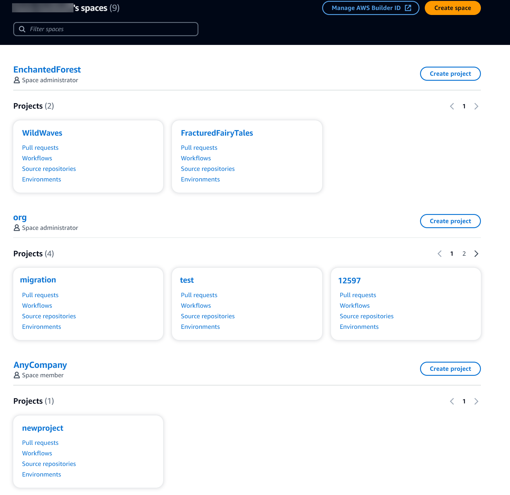

Amazon CodeCatalyst is no longer open to new customers. Existing customers can continue to use the service as normal. For more information, see [How to migrate from CodeCatalyst](migration.md "migration.md").

# Viewing all spaces and projects for a user

You can view a listing of your spaces and projects on the user home page. The user
home page shows a listing of each space to which the user belongs, the role for the
user in that space, such as **Space administrator**, and the projects in
each space where the user has membership.

1. Open the CodeCatalyst console at [https://codecatalyst.aws/](https://codecatalyst.aws/ "https://codecatalyst.aws/").
2. In the browser, enter the following address: [https://codecatalyst.aws/home](https://codecatalyst.aws/home "https://codecatalyst.aws/home")

 3. Choose the space or project you want to open. If you do not see a space
or project you expected to see, your might need to sign in as a different
user.
