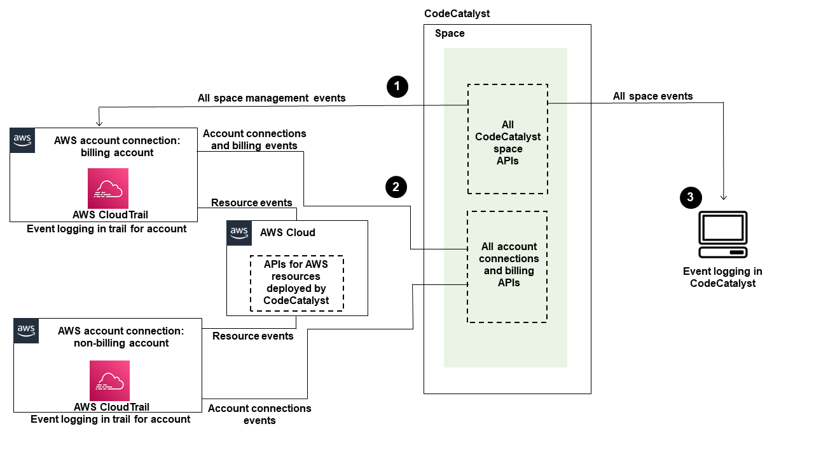

Amazon CodeCatalyst will no longer be open to new customers starting on November
7, 2025. If you would like to use the service, please sign up prior to November 7, 2025. For
more information, see [How to migrate from CodeCatalyst](migration.md "migration.md").

# Monitoring events and API calls using logging

In Amazon CodeCatalyst, management events for the space are collected by AWS CloudTrail and are logged
in the trail for the billing account for the space. CloudTrail logging is the primary method to
manage logging for CodeCatalyst events, and a secondary method is viewing event logging in
CodeCatalyst.

Events in the account are logged with the trail and designated bucket that is set up for the
AWS account.

The following diagram shows how all management events for the space are logged in CloudTrail for
the billing account, while account connections/billing events and AWS resource events are logged
in CloudTrail for the respective account.

The diagram illustrates the following steps:

1. When a space is created, an AWS account is connected to the space and is designated as
   the billing account. The trail used is the trail that was created in CloudTrail for the billing
   account, where space events are logged. CloudTrail captures API calls and related events made by or on
   behalf of a CodeCatalyst space and delivers the log files to an S3 bucket that you specify. If
   the billing account changes to another AWS account, then space events are logged in the trail
   and bucket for that account. For more information about CodeCatalyst management events that are logged
   by CloudTrail, see [CodeCatalyst information in CloudTrail](ipa-logging-connections.md#info-in-cloudtrail "ipa-logging-connections.md#info-in-cloudtrail").
2. Other accounts connected to the space, including the billing account, log a subset of
   events for account connections and billing events. CodeCatalyst workflows that generate account events
   for AWS resources deployed for that account are also logged in the trail and bucket for the
   AWS account. CloudTrail captures API calls and related events made by or on behalf of a CodeCatalyst
   space and delivers the log files to an S3 bucket that you specify. For more information
   about CodeCatalyst management events that are logged by CloudTrail, see [Accessing logged events using event logging](ipa-logging-connections.md "ipa-logging-connections.md").
3. You can also monitor CodeCatalyst actions in your space within a specific time in the
   space with the [**list-event-logs**](../../../cli/latest/reference/codecatalyst/list-event-logs.md "../../../cli/latest/reference/codecatalyst/list-event-logs.md") command using the AWS CLI. For more information, see
   [the Amazon CodeCatalyst
   API Reference Guide](../APIReference/Welcome.md "../APIReference/Welcome.md"). You must have the **Space administrator** role to
   call the list of events for CodeCatalyst actions in your space. For more information, see [Accessing logged events using event logging](ipa-logging-connections.md "ipa-logging-connections.md").

###### Note

`ListEventLogs` guarantees events for the last 30 days in a given space. You
can also view and retrieve a list of management events over the last 90 days for CodeCatalyst in the
AWS CloudTrail console by viewing **Event history**, or by creating a trail to
create and maintain a record of events that extends past 90 days. For more information, see
[Working with CloudTrail Event history](../../../awscloudtrail/latest/userguide/view-cloudtrail-events.md "../../../awscloudtrail/latest/userguide/view-cloudtrail-events.md") and [Working with CloudTrail trails](../../../awscloudtrail/latest/userguide/cloudtrail-getting-started.md "../../../awscloudtrail/latest/userguide/cloudtrail-getting-started.md").

###### Note

AWS resources that are deployed into connected accounts for CodeCatalyst workflows, are not
logged as part of CloudTrail logging for the CodeCatalyst space. For example, CodeCatalyst resources include a
space or project. AWS resources include an Amazon ECS service or Lambda function. You must
configure CloudTrail logging separately for each AWS account where resources are deployed
into.

Here is one possible flow for event monitoring in CodeCatalyst.

Mary Major is a **Space administrator** for a CodeCatalyst space
and views all management events in CodeCatalyst for space-level and project-level resources in the space
that are logged in CloudTrail. See [CodeCatalyst information in CloudTrail](ipa-logging-connections.md#info-in-cloudtrail "ipa-logging-connections.md#info-in-cloudtrail") for example events that are logged in CloudTrail.

For resources that are created in CodeCatalyst, such as Dev Environments, Mary views the
**Event history** in the billing account for the space and investigates events
where Dev Environments were created by project members in CodeCatalyst. The event provides the identity
store IAM identity type and credentials for the AWS Builder ID for the user who created the
Dev Environment. For resources that are created in AWS when deployed by workflows in CodeCatalyst, such as
a Lambda function for a serverless deployment, the AWS account owner can view the event history
for the trail associated with the separate AWS account (which is also a connected account to
CodeCatalyst) for the workflow deploy action.

To investigate further, Mary can also view events for all CodeCatalyst APIs in the space by
using the [**list-event-logs**](../../../cli/latest/reference/codecatalyst/list-event-logs.md "../../../cli/latest/reference/codecatalyst/list-event-logs.md") command in the AWS CLI.

###### Topics

- [Monitoring API calls by AWS accounts using AWS CloudTrail logging](ipa-logging-connections.md "ipa-logging-connections.md")
- [Accessing logged events using event logging](ipa-logs.md "ipa-logs.md")
