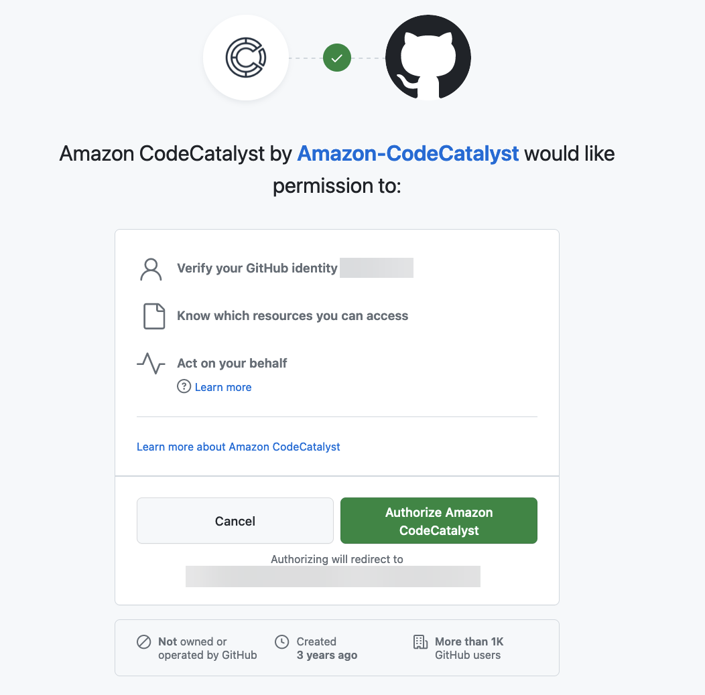

Amazon CodeCatalyst is no longer open to new customers. Existing customers can continue to use the service as normal. For more information, see [How to migrate from CodeCatalyst](migration.md "migration.md").

# Accessing GitHub resources with personal

connections

You can use personal connections to authorize and connect your third-party GitHub resources with
CodeCatalyst. For example, use a personal connection to authorize CodeCatalyst to access your GitHub
account and create a repository as the source for your project or blueprint. The
connection is mapped to your CodeCatalyst identity and can be used to connect to one or more
source repositories. Connections you create are associated with your user identity across
all spaces and projects in CodeCatalyst.

###### Note

You can manage personal connections with blueprints in GitHub organizations where
you have access to do so.

You can create one personal connection for one user identity (CodeCatalyst alias) across all
spaces, per provider type.

You can use your personal connections in CodeCatalyst to create a GitHub repository for a
project, choose a GitHub source repository for a blueprint, and manage pull requests in
CodeCatalyst for your GitHub repository.

###### Note

The use of personal connections for associating blueprints with a GitHub repository is
not the same as use of extensions in CodeCatalyst to link a GitHub repository. For more
information about extensions, see [Add functionality to projects with extensions in CodeCatalyst](extensions.md "extensions.md").

## Creating personal connections

You can use the console to create a personal connection associated with your user
identity in CodeCatalyst.

###### To create a personal connection

1. Open the CodeCatalyst console at [https://codecatalyst.aws/](https://codecatalyst.aws/ "https://codecatalyst.aws/").
2. In the top menu bar, choose your profile badge, and then choose
   **My settings**. The CodeCatalyst **My
   settings** page opens.

###### Tip

You can also find your user profile by going to the members page for a
project or space and choosing your name from the members
list. 3. Under **Personal connections**, choose
**Create**.

The **Create connection** page displays. 4. Choose **Create**. A **Create
connection** page displays. 5. On the **Create connection** page, in
**Provider**, choose **GitHub**. In
**Connection name**, type a name for your connection.
Choose **Create**. 6. If prompted, sign in to your GitHub account. 7. On the connection confirmation page, choose
**Accept**. 8. On the installation confirmation page, choose the authorization button to
confirm that you want to install the connector application.

## Deleting personal connections

You can delete a personal connection associated with your user identity in
CodeCatalyst.

###### Note

Deleting the personal connection in CodeCatalyst does not uninstall the application in
your GitHub account. If you create a new personal connection, the app installation
can be used. To uninstall the application in GitHub, you can revoke the application
and reinstall at a later time.

###### To delete a personal connection in CodeCatalyst

1. Open the CodeCatalyst console at [https://codecatalyst.aws/](https://codecatalyst.aws/ "https://codecatalyst.aws/").
2. In the top menu bar, choose your profile badge, and then choose
   **My settings**. The CodeCatalyst **My
   settings** page opens.

###### Tip

You can also find your user profile by going to the members page for a
project or space and choosing your name from the members
list. 3. Under **Personal connections**, choose the selector
next to the connection you want to delete, and then choose
**Delete**.

On the **Delete connection: <name>?** page, to confirm
deletion, type _delete_ in the text field.
Choose **Delete**.

1. Sign in to GitHub and navigate to your account settings for installed apps.
   Choose your profile icon, choose **Settings**, and then choose
   **Applications**.
2. On the **Authorized GitHub Apps** tab, in the list of
   authorized applications, view the app installed for CodeCatalyst. To revoke the
   installation, choose **Revoke**.
