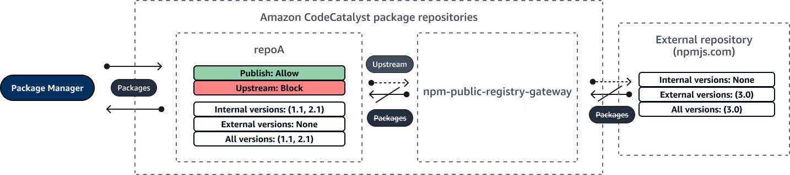
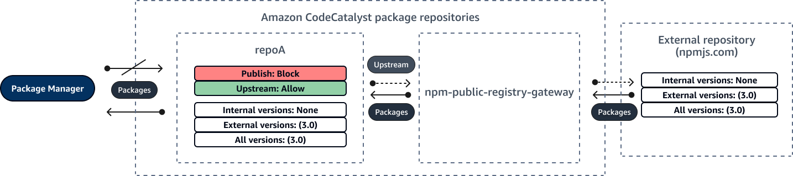

Amazon CodeCatalyst will no longer be open to new customers starting on November
7, 2025. If you would like to use the service, please sign up prior to November 7, 2025. For
more information, see [How to migrate from CodeCatalyst](migration.md "migration.md").

# Editing package origin controls

In Amazon CodeCatalyst, package versions can be added to a package repository by directly publishing
them, pulling them down from an upstream repository, or ingesting them from an external, public
repository through a gateway. If you allow versions of a package to be added both by direct publishing and
ingesting from public repositories, then you are vulnerable to a dependency substitution attack.
For more information, see [Dependency substitution attacks](#dependency-substitution-attacks "#dependency-substitution-attacks"). To protect yourself against a dependency
substitution attack, configure package origin controls on a package in a repository to limit how
versions of that package can be added to the repository.

You should consider configuring package origin controls to make new versions of different
packages come from both internal sources, such as direct publishing, and external sources, such
as public repositories. By default, package origin controls are configured based on how the first
version of a package is added to the repository.

## Package origin control settings

With package origin controls, you can configure how package versions can be added to a repository.
The following lists include the available package origin control settings and values.

**Publish**

This setting configures whether package versions can be published directly to the
repository using package managers or similar tools.

- **ALLOW**: Package versions can be published directly.
- **BLOCK**: Package versions cannot be published directly.

**Upstream**

This setting configures whether package versions can be ingested from external, public repositories, or retained from
upstream repositories when requested by a package manager.

- **ALLOW**: Any package version can be retained from other CodeCatalyst repositories configured as upstream repositories or
  ingested from a public source with an external connection.
- **BLOCK**: Package versions cannot be retained from other CodeCatalyst repositories configured as upstream repositories or
  ingested from a public source with an external connection.

### Default package origin control settings

The default package origin controls for a package will be based on how the first version of that package is added to the package repository.

- If the first package version is published direcly by a package manager, the settings will be **Publish: ALLOW** and **Upstream: BLOCK**.
- If the first package version is ingested from a public source, the settings will be **Publish: BLOCK** and **Upstream: ALLOW**.

## Common package access control scenarios

This section describes some common scenarios of when a package version is added to a
CodeCatalyst package repository. Package origin control settings are set for new packages depending on
how the first package version is added.

In the following scenarios, an _internal package_ is published directly
from a package manager to your repository, such as a package that you maintain. An
_external package_ is a package that exists in a public repository that can
be ingested into your repository through a gateway repository upstream.

**An external package version is published for an existing internal package**

In this scenario, consider an internal package, _packageA_. Your team
publishes the first package version for _packageA_ to a CodeCatalyst package
repository. Because this is the first package version for that package, the package origin
control settings are automatically set to **Publish: Allow** and
**Upstream: Block**. After the package is published in your
repository, a package with the same name is published to a public repository that is connected
to your CodeCatalyst package repository. This could be an attempted dependency substitution attack
against the internal package, or it could be a coincidence. Regardless, package origin controls
are configured to block the ingestion of the new external version to protect themselves against
a potential attack.

In the following image, _repoA_ is your CodeCatalyst package repository with
an upstream connection to the `npm-public-registry-gateway`
repository. Your repository contains versions 1.1 and 2.1 of
_packageA_, but version 3.0 is published to the public repository. Normally,
_repoA_ would ingest version 3.0 after the package is requested by a package
manager. Because package ingestion is set to **Block**, version 3.0 is not
ingested into your CodeCatalyst package repository and is not available to package managers connected
to it.

**An internal package version is published for an existing external package**

In this scenario, a package, _packageB_, exists externally in a public
repository that you have connected to your repository. When a package manager connected to your
repository requests _packageB_, the package version is ingested into your
repository from the public repository. Because this is the first package version of
_packageB_ added to your repository, the package origin settings are
configured to **Publish: BLOCK** and **Upstream: ALLOW**. Later, you try to publish a version with the same package name to
the repository. You may not be aware of the public package and trying to publish an unrelated
package by same name, or you may be trying to publish a patched version, or you may be trying to
directly publish the exact package version that already exists externally. CodeCatalyst rejects the
version that you are trying to publish, but you can explicitly override the rejection and
publish the version, if necessary.

In the following image, _repoA_ is your CodeCatalyst package repository with
an upstream connection to the `npm-public-registry-gateway`
repository. Your package repository contains version 3.0 that
it ingested from the public repository. You want to publish version 1.2 to your package
repository. Typically, you could publish version 1.2 to _repoA_, but because
publishing is set to **Block**, version 1.2 cannot be published.

**Publishing a patched package version of an existing external package**

In this scenario, a package, _packageB_, exists externally in a public
repository that you have connected to your package repository. When a package manager connected
to your repository requests _packageB_, the package version is ingested into
your repository from the public repository. Because this is the first package version of
_packageB_ added to your repository, the package origin settings are
configured to **Publish: BLOCK** and **Upstream: ALLOW**. Your team decides to publish patched package versions of this
package to the repository. To be able to publish package versions directly, your team changes
the package origin control settings to **Publish: ALLOW** and
**Upstream: BLOCK**. Versions of this package can now be published
directly to your repository and ingested from public repositories. After your team publishes the
patched package versions, your team reverts the package origin settings to **Publish: BLOCK** and **Upstream: ALLOW**.

## Editing package origin controls

Package origin controls are configured automatically based on how the first package
version of a package is added to the package repository. For more information, see [Default package origin control settings](#default-package-origin-control-settings "#default-package-origin-control-settings"). To add or edit package origin
controls for a package in a CodeCatalyst package repository, perform the steps in the following
procedure.

###### To add or edit package origin controls

1. In the navigation pane, choose **Packages**.
2. Choose the package repository that contains the package that you want to edit.
3. In the **Packages** table, search for and choose the package that you
   want to edit.
4. From the package summary page, choose **Origin controls**.
5. In **Origin controls**, choose the package origin controls that you
   want to set for this package. Both package origin control settings,
   **Publish** and **Upstream**, must be set at the same
   time.
   - To allow publishing package versions directly, in **Publish**, choose
     **Allow**. To block publishing of package versions, choose
     **Block**.
   - To allow ingestion of packages from external repositories and pulling packages from
     upstream repositories, in **Upstream sources**, choose
     **Allow**. To block all ingestion and pulling of package versions from
     external and upstream repositories, choose **Block**.

6. Choose **Save**.

## Publishing and upstream

repositories

In CodeCatalyst, you cannot publish package versions that are present in reachable upstream
repositories or public repositories. For example, suppose that you want to publish an npm
package `lodash@1.0` to a repository, `myrepo`, and
`myrepo` has an upstream repository with an external connection to npmjs.com.
Consider the following scenarios.

1. The package origin control settings on `lodash` are **Publish: ALLOW** and **Upstream: ALLOW**.
   If `lodash@1.0` is present in the upstream repository or in npmjs.com, CodeCatalyst rejects any attempt to publish to it in `myrepo` by issuing a 409
   conflict error. You could still publish a different version, such as
   `lodash@1.1`.
2. The package origin control settings on `lodash` are **Publish: ALLOW** and **Upstream: BLOCK**.
   You can publish any version of `lodash` to your repository that
   does not already exist because package versions are not reachable.
3. The package origin control settings on `lodash` are **Publish: BLOCK** and **Upstream: ALLOW**. You cannot
   publish any package versions directly to your repository.

## Dependency substitution attacks

Package managers simplify the process of packaging and sharing reusable code. These
packages may be private packages developed by an organization for use in their applications,
or they may be public, typically open-source packages that are developed outside an organization and
distributed by public package repositories. When requesting packages, developers rely on their package manager
to fetch new versions of their dependencies. Dependency substitution attacks, also known as dependency
confusion attacks, exploit the fact that a package manager typically has no way to distinguish legitimate
versions of a package from malicious versions.

Dependency substitution attacks belong to a subset of attacks known as software supply chain attacks.
A software supply chain attack is an attack that takes advantage of vulnerabilities anywhere in the
software supply chain.

A dependency substitution attack can target anyone who uses both internally developed
packages and packages fetched from public repositories. The attackers identify internal package
names and then strategically place malicious code with the same name in public package
repositories. Typically, the malicious code is published in a package with a high version
number. Package managers fetch the malicious code from these public feeds because they believe
that the malicious packages are the latest versions of the package. This causes a "confusion" or
"substitution" between the desired package and the malicious package, which leads to the code
being compromised.

To prevent dependency substitution attacks, Amazon CodeCatalyst provides package origin controls. Package origin controls are settings that control how packages can be added to your repositories. The controls
are configured automatically when the first package version of a new package is added to a CodeCatalyst repository The controls can ensure package versions
cannot be both published directly to your repository and ingested from public sources, protecting you from dependency substitution attacks.
For more information about package origin controls and how to change them, see [Editing package origin controls](package-origin-controls.md "package-origin-controls.md").
