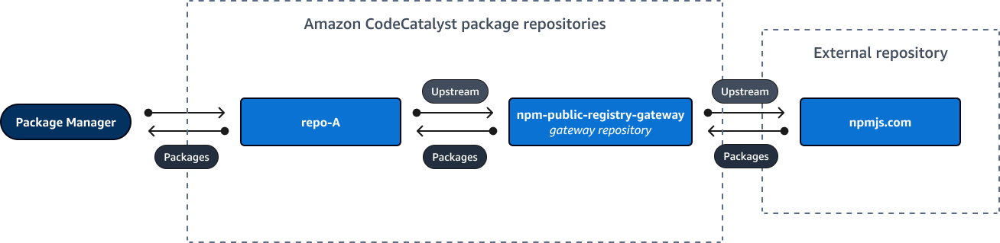
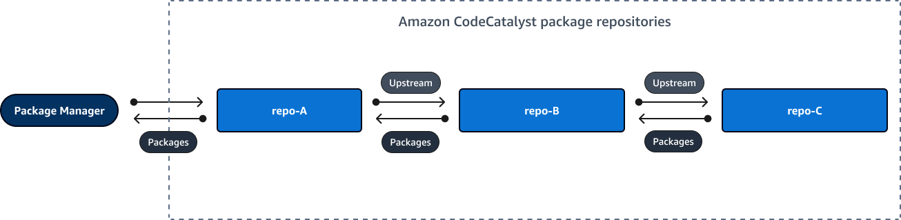
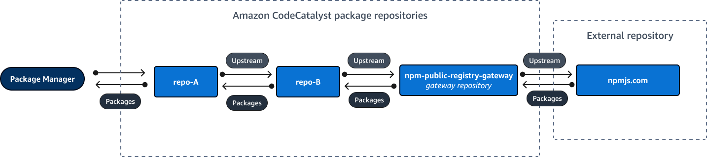

Amazon CodeCatalyst will no longer be open to new customers starting on November
7, 2025. If you would like to use the service, please sign up prior to November 7, 2025. For
more information, see [How to migrate from CodeCatalyst](migration.md "migration.md").

# Requesting a package version with upstream repositories

The following example shows the possible scenarios when a package manager requests a package from a CodeCatalyst
package repository that has upstream repositories.

For this example, a package manager, such as `npm`, requests a package version from a
package repository named `downstream` that has multiple upstream repositories. When the package
is requested, the following can occur:

- If `downstream` contains the requested package version, it is returned to
  the client.
- If `downstream` does not contain the requested package version, CodeCatalyst searches
  for it in `downstream`'s upstream repositories, in their configured search order. If the package version is found, a
  reference to it is copied to `downstream`, and the package version is returned to the
  client.
- If neither `downstream` or its upstream repositories contain the package version,
  an HTTP 404 `Not Found` response is returned to the client.
  The maximum number of direct upstream repositories allowed for one repository is 10. The
  maximum number of repositories CodeCatalyst searches in when a package version is requested is 25.

## Package retention from upstream repositories

If a requested package version is found in an upstream repository, a reference to it is
retained and is always available in the repository that requested it. This ensures that you have
access to your packages if there is an unexpected outage of the upstream repository. The
retained package version is not affected by any of the following:

- Deleting the upstream repository.
- Disconnecting the upstream repository from the downstream repository.
- Deleting the package version from the upstream repository.
- Editing the package version in the upstream repository (for example, by adding a
  new asset to it).

## Fetching packages through

an upstream relationship

CodeCatalyst can fetch packages through multiple linked repositories called upstream repositories. If
a CodeCatalyst package repository has an upstream connection to another CodeCatalyst package repository
that has an upstream connection to a gateway repository, requests for packages not
in the upstream repository are copied from the external repository. For example, consider the
following configuration: a repository named `repo-A` has an upstream connection to
the gateway repository, `npm-public-registry-gateway`. `npm-public-registry-gateway` has an upstream
connection to the public package repository, [https://npmjs.com](https://npmjs.com "https://npmjs.com").



If `npm` is configured to use the `repo-A`
repository, running `npm install` initiates the copying of packages from
[https://npmjs.com](https://npmjs.com "https://npmjs.com") into
`npm-public-registry-gateway`. The versions installed are also pulled into
`repo-A`. The following example installs
`lodash`.

```
$ npm config get registry
https://packages.`region`.codecatalyst.aws/npm/`space-name`/`proj-name`/`repo-name`/
$ npm install lodash
+ lodash@4.17.20
added 1 package from 2 contributors in 6.933s
```

After running `npm install`, `repo-A` contains only the latest
version (`lodash 4.17.20`) because that's the version that was fetched by
`npm` from `repo-A`.

Because `npm-public-registry-gateway` has an external upstream connection to [https://npmjs.com](https://npmjs.com "https://npmjs.com"), all the package versions that are
imported from [https://npmjs.com](https://npmjs.com "https://npmjs.com") are stored in
`npm-public-registry-gateway`. These package versions could have been fetched by any
downstream repository with an upstream connection that leads to `npm-public-registry-gateway`.

The contents of `npm-public-registry-gateway` provide a way for you to see all the packages
and package versions imported from [https://npmjs.com](https://npmjs.com "https://npmjs.com") over time.

## Package retention in intermediate

repositories

CodeCatalyst allows you to chain upstream repositories. For example, `repo-A` can
have `repo-B` as an upstream repository and `repo-B` can have
`repo-C` as an upstream repository. This configuration makes the package versions in
`repo-B` and `repo-C` available from `repo-A`.



When a package manager connects to repository `repo-A` and fetches a package
version from repository `repo-C`, the package version is not retained in repository
`repo-B`. The package version is only retained in the furthest downstream
repository, which in this example is `repo-A`. It is not retained in any intermediate
repositories. This is also true for longer chains; for example, if there were four repositories:
`repo-A`, `repo-B`, `repo-C`, and `repo-D`, and a
package manager connected to `repo-A` fetched a package version from
`repo-D`, the package version would be retained in `repo-A` but not in
`repo-B` or `repo-C`.

Package retention behavior is similar when pulling a package version from a public package
repository, except that the package version is always retained in the gateway repository that
has the direct upstream connection to the public repository. For example, `repo-A`
has `repo-B` as an upstream repository. `repo-B` has `npm-public-registry-gateway` as an
upstream repository, which has an upstream connection to the public repository, **npmjs.com**; see the diagram below.



If a package manager connected to `repo-A` requests a specific package version,
_lodash 4.17.20_ for example, and the package version is not present in any
of the three repositories, it will be fetched from **npmjs.com**.
When _lodash 4.17.20_ is fetched, it is retained in `repo-A`
as that is the furthest downstream repository and `npm-public-registry-gateway` as it has the upstream
connection to the public external repository, **npmjs.com**.
_lodash 4.17.20_ is not retained in `repo-B` because that is an
intermediate repository.
