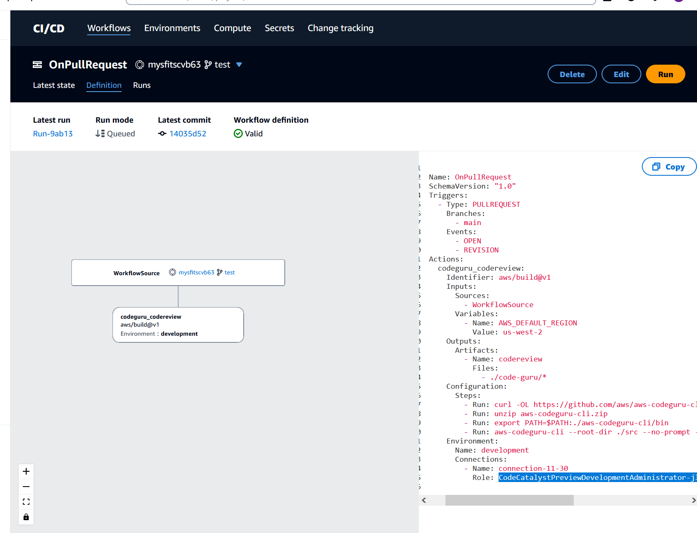

Amazon CodeCatalyst is no longer open to new customers. Existing customers can continue to use the service as normal. For more information, see [How to migrate from CodeCatalyst](migration.md "migration.md").

# Modern three-tier web application blueprint

workflow **OnPullRequest** fails with permissions error for
Amazon CodeGuru

**Issue:** When I try to run a workflow for my project,
the workflow fails to run with the following message:

```
Failed at codeguru_codereview: The action failed during runtime. View the action's logs for more details.
```

**Solution:** One possible cause of this action failure
might be due to missing permissions in the IAM role policy, where your version of the
service role used by CodeCatalyst in the connected AWS account is missing required
permissions for the **codeguru_codereview** action to run successfully.
To fix this problem, either the service role must be updated with the required
permissions, or you must change the service role used for the workflow to one that has
the required permissions for Amazon CodeGuru and Amazon CodeGuru Reviewer. Using the following steps,
find your role and update the role policy permissions in order to allow the workflow to
run successfully.

###### Note

These steps apply for the following workflows in CodeCatalyst:

- The **OnPullRequest** workflow provided for projects
  created with the Modern three-tier web application blueprint in CodeCatalyst.
- Workflows added to projects in CodeCatalyst with actions that access
  Amazon CodeGuru or Amazon CodeGuru Reviewer.
  Each project contains workflows with actions that use a role and environment provided
  by the AWS account connected to your project in CodeCatalyst. The workflow with the actions
  and their designated policy is stored in your source repository in the directory
  /.codecatalyst/workflows. Modifying the workflow YAML is not required unless you are
  adding a new role ID to the existing workflow. For information about YAML template
  elements and formatting, see [Workflow YAML definition](workflow-reference.md "workflow-reference.md").

These are the high-level steps to follow to edit your role policy and verify the
workflow YAML.

###### To reference your role name in the workflow YAML and update the policy

1. Open the CodeCatalyst console at [https://codecatalyst.aws/](https://codecatalyst.aws/ "https://codecatalyst.aws/").
2. Navigate to your CodeCatalyst space. Navigate to your project.
3. Choose **CI/CD**, and then choose
   **Workflows**.
4. Choose the workflow titled **OnPullRequest**. Choose the
   **Definition** tab.
5. In the workflow YAML, in the `Role:` field under the
   **codeguru_codereview** action, make a note of the role
   name. This is the role with the policy that you will modify in IAM. The
   following example shows the role name.

 6. Do one of the following:

    * (Recommended) Update the service role connected to your project with
     the required permissions for Amazon CodeGuru and Amazon CodeGuru Reviewer. The role will
     have a name `CodeCatalystWorkflowDevelopmentRole-`spaceName`` with a unique identifier appended. For more
     information about the role and role policy, see [Understanding the CodeCatalystWorkflowDevelopmentRole-spaceName service role](ipa-iam-roles.md#ipa-iam-roles-service-role "ipa-iam-roles.md#ipa-iam-roles-service-role"). Proceed to the next steps to
     update the policy in IAM.


    ###### Note

    You must have AWS administrator access to the AWS account with
     the role and policy.
    * Change the service role used for the workflow to one that has the
     required permissions for Amazon CodeGuru and Amazon CodeGuru Reviewer or create a new
     role with the required permissions.

7. Sign in to the AWS Management Console and open the IAM console at [https://console.aws.amazon.com/iam/](https://console.aws.amazon.com/iam/ "https://console.aws.amazon.com/iam/").

In the IAM console, find the role from step 5, such as
`CodeCatalystPreviewDevelopmentRole`. 8. In the role from step 5, change the permission policy to include the
`codeguru-reviewer:*` and `codeguru:*` permissions.
After adding these permissions, the permission policy should look similar to the
following: 9. After you make the policy corrections, return to CodeCatalyst and start the workflow
run again.
