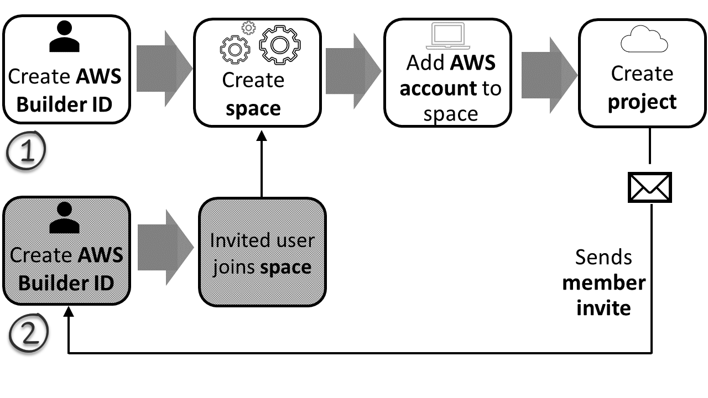

Amazon CodeCatalyst is no longer open to new customers. Existing customers can continue to use the service as normal. For more information, see [How to migrate from CodeCatalyst](migration.md "migration.md").

# Set up and sign in to CodeCatalyst

There are two types of space that you can set up in CodeCatalyst: spaces that support
AWS Builder ID users, and creating a space that supports identity federation, where SSO users and
groups are managed in IAM Identity Center. Users in an AWS Builder ID space sign in to CodeCatalyst with their
AWS Builder ID, and users in a space set up for identity federation sign in to CodeCatalyst using the
SSO portal for the company associated with the space.

###### Note

CodeCatalyst user names have a minimum length of 3 and a maximum length of 100 characters.
Provided user names longer than 100 characters will be truncated. This can result in a user
name that appears to be a duplicate of another 100-character user name. For more information,
see [I can’t access my BID space as a
new user or can’t be added as a new SSO user due to truncated user name](troubleshooting.md#troubleshoot-username-truncated "troubleshooting.md#troubleshoot-username-truncated").

The steps to set up and administer a AWS Builder ID space are provided in this guide. To work
with a CodeCatalyst AWS Builder ID space, you will set up CodeCatalyst using the user settings and
AWS Builder ID that you use to sign in to CodeCatalyst.

The steps to set up and administer a space that supports identity federation are provided in
the _CodeCatalyst Administrator Guide_. To work with spaces that
are set up for identity federation, see [Setup and administration for
CodeCatalyst spaces](../adminguide/what-is.md "../adminguide/what-is.md") in the Amazon CodeCatalyst Administrator Guide.

This section provides two common paths for setting up to work in Amazon CodeCatalyst with an
AWS Builder ID space: creating a space and a project as the first user, and accepting an
invitation to an existing space or project. These setup workflows are necessarily quite
different. The following diagram shows both sign-up processes as follows:

1. In the first case, you create and set up a space for your company, team, or group,
   and create a project before inviting others to these resources. An AWS account must be
   provided for billing purposes, where you can still default to the Free tier.
2. In the second case, if you join CodeCatalyst by accepting an invitation to a project, someone
   else has already created a space and project for you. However, you'll still want to
   configure your profile so that you're ready to start working with others.

###### Tip

CodeCatalyst uses spaces to group projects and resources. When you first sign up for
CodeCatalyst, you'll be prompted to create a space as well as a project.

Whether you sign up to create a space and project or you sign up as part of accepting
an invitation, you create an AWS Builder ID that you will use to log in to CodeCatalyst. To create an
AWS Builder ID, you provide the full name, password, and email address that you use to sign in to
AWS applications. You use the email and password to sign in to CodeCatalyst after this point. You
can also use this AWS Builder ID to log in to other applications that use AWS Builder ID
credentials.

In CodeCatalyst and in AWS Builder ID, a _profile_ is generated based on your login
information. Your profile contains your CodeCatalyst preferences for language and notification
settings in your CodeCatalyst projects.

###### Tip

If you encounter any problems while signing up for your Amazon CodeCatalyst profile, follow the
steps provided on that page. If you need additional help, see [Problems signing up](ipa-troubleshooting.md#id-troubleshooting-sign-up "ipa-troubleshooting.md#id-troubleshooting-sign-up").

###### Topics

- [Creating a new space and
  development role (starting without an invitation)](sign-up-create-resources.md "sign-up-create-resources.md")
- [Accepting an invitation and creating an AWS Builder ID](sign-up-sign-in.md "sign-up-sign-in.md")
- [Signing in with an AWS Builder ID](id-how-to-sign-in.md "id-how-to-sign-in.md")
- [Signing in with SSO](sign-in-sso.md "sign-in-sso.md")
- [Viewing all spaces and projects for a user](home.md "home.md")
- [Viewing and managing CodeCatalyst profiles](view-profiles.md "view-profiles.md")
- [Setting up to use the AWS CLI with CodeCatalyst](set-up-cli.md "set-up-cli.md")
