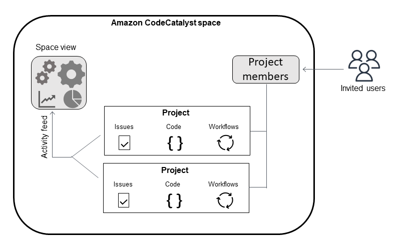

Amazon CodeCatalyst will no longer be open to new customers starting on November
7, 2025. If you would like to use the service, please sign up prior to November 7, 2025. For
more information, see [How to migrate from CodeCatalyst](migration.md "migration.md").

# Organize resources with spaces in CodeCatalyst

You create a space that represents you, your company, department, or group, and
provides a place where your development teams can manage projects. You must create a space
to add projects, members, and the associated cloud resources you create in Amazon CodeCatalyst.

###### Note

Space names must be unique across CodeCatalyst. You cannot reuse names of deleted spaces.

When you create a space, you are automatically assigned the
**Space administrator** role. You can add this role to other users in the
space.

With the **Space administrator** role, you can manage the space as
follows:

- Add other space administrators to the space
- Change member roles and permissions
- Edit or delete the space
- Create projects and invite members to the project
- View a list of all projects in the space
- View the activity feed for all projects in the space
  When you create a space, you are automatically added to the space with two roles:
  the **Space administrator** role, and the **Project administrator** role for the project you created as part of creating the
  space. Additional users are added as members to the space automatically when they
  accept invitations to projects. This membership in the space does not grant any permissions
  in the space. What users can do in a space is determined by the role the user has in a
  specific project.

For more information about roles, see [Granting access with user roles](ipa-roles.md "ipa-roles.md").

The following are additional considerations for added accounts:

- AWS accounts added to a CodeCatalyst space can be used in any project in that
  space.
- While each environment can support multiple AWS accounts, you can only use one account
  per environment in an action.
- Billing is configured at the space level. Multiple accounts can be configured for
  billing, but only one can be active in a CodeCatalyst space. An AWS account can be used as
  a billing account for more than one space in CodeCatalyst. The AWS account that is
  specified as the billing account for your CodeCatalyst space has different quotas from other
  account connections for a space. For more information, see [Quotas for CodeCatalyst](quotas.md "quotas.md").
- After you create a connection, you must add AWS IAM roles to your connection if your
  workflow must access those IAM roles with your CodeCatalyst environment. For more information
  about how environments are used, see [Deploying into AWS accounts and VPCs](deploy-environments.md "deploy-environments.md").

###### Topics

- [Creating a space](spaces-create.md "spaces-create.md")
- [Editing a space](spaces-edit.md "spaces-edit.md")
- [Deleting a space](spaces-delete.md "spaces-delete.md")
- [Monitoring activity for users and resources in a space](spaces-activity.md "spaces-activity.md")
- [Allowing access to AWS resources with connected
  AWS accounts](ipa-connect-account.md "ipa-connect-account.md")
- [Configuring IAM roles for connected accounts](spaces-manage-roles.md "spaces-manage-roles.md")
- [Granting users space permissions](spaces-members.md "spaces-members.md")
- [Allowing space access using teams](managing-teams.md "managing-teams.md")
- [Allowing space access for machine resources](managing-machine-resources.md "managing-machine-resources.md")
- [Administering Dev Environments for a space](spaces-devenv.md "spaces-devenv.md")
- [Quotas for spaces](spaces-quotas-limits.md "spaces-quotas-limits.md")
