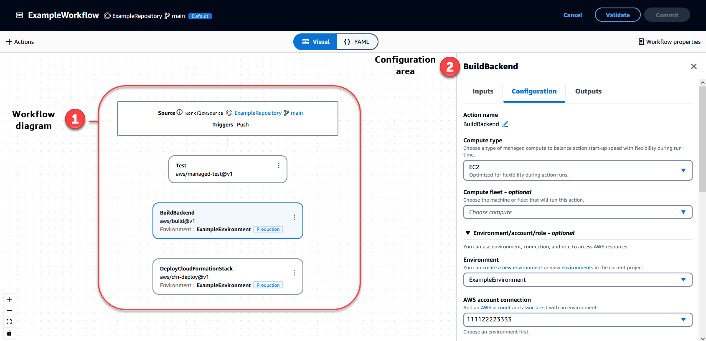
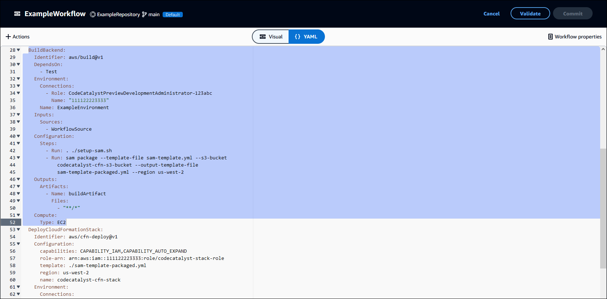
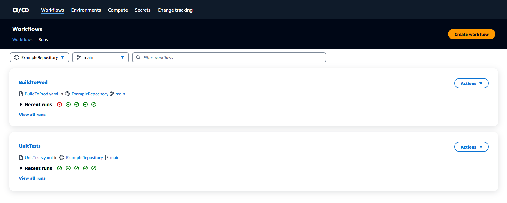
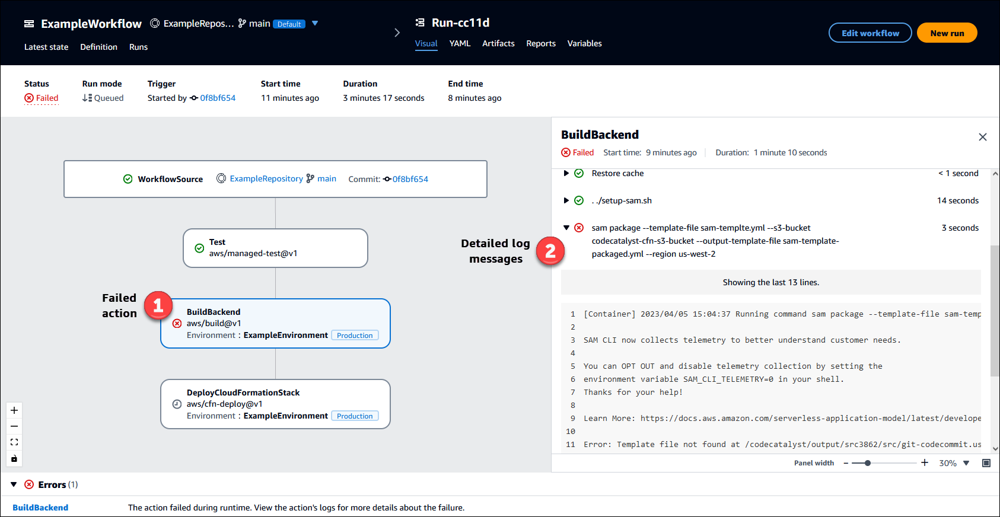

Amazon CodeCatalyst is no longer open to new customers. Existing customers can continue to use the service as normal. For more information, see [How to migrate from CodeCatalyst](migration.md "migration.md").

# Build, test, and deploy with workflows

After writing your application code in a [CodeCatalyst
Dev Environment](devenvironment.md "devenvironment.md") and pushing it to your [CodeCatalyst source
repository](source.md "source.md"), you're ready to deploy it. The way to do this automatically is through a
workflow.

A _workflow_ is an automated procedure that describes how to build, test,
and deploy your code as part of a continuous integration and continuous delivery (CI/CD) system.
A workflow defines a series of steps, or _actions_, to take during a workflow
run. A workflow also defines the events, or _triggers_, that cause the
workflow to start. To set up a workflow, you create a _workflow definition
file_ using the CodeCatalyst console's
[visual
or YAML editor](flows.md#workflow.editors "flows.md#workflow.editors").

###### Tip

For a quick look at how you might use workflows in a project, [create a project with a blueprint](projects-create.md#projects-create-console-template "projects-create.md#projects-create-console-template"). Each blueprint deploys a functioning workflow
that you can review, run, and experiment with.

## About the workflow definition file

A _workflow definition file_ is a YAML file that describes your workflow.
By default, the file is stored in a `~/.codecatalyst/workflows/` folder in the root of
your [source repository](source-repositories.md "source-repositories.md"). The file can have a .yml or
.yaml extension, and the extension must be lowercase.

The following is an example of a simple workflow definition file. We explain each line of
this example in the table that follows.

```
Name: MyWorkflow
SchemaVersion: 1.0
RunMode: QUEUED
Triggers:
  - Type: PUSH
    Branches:
      - main
Actions:
  Build:
    Identifier: aws/build@v1
    Inputs:
      Sources:
        - WorkflowSource
    Configuration:
      Steps:
        - Run: docker build -t MyApp:latest .
```

| Line                                                      | Description                                                                                                                                                                                                                                                                |
| --------------------------------------------------------- | -------------------------------------------------------------------------------------------------------------------------------------------------------------------------------------------------------------------------------------------------------------------------- |
| `<br>Name: MyWorkflow<br>`                                | Specifies the name of the workflow. For more information about the<br>`Name` property, see [Top-level properties](workflow-reference.md#workflow.top.level "workflow-reference.md#workflow.top.level").                                                                    |
| `<br>SchemaVersion: 1.0<br>`                              | Specifies the workflow schema version. For more information about the<br>`SchemaVersion` property, see [Top-level properties](workflow-reference.md#workflow.top.level "workflow-reference.md#workflow.top.level").                                                        |
| `<br>RunMode: QUEUED<br>`                                 | Indicates how CodeCatalyst handles multiple runs. For more information about the run<br>mode, see [Configuring the queuing behavior of runs](workflows-configure-runs.md "workflows-configure-runs.md").                                                                   |
| `<br>Triggers:<br>`                                       | Specifies the logic that will cause a workflow run to start. For more<br>information about triggers, see [Starting a workflow run automatically using<br>triggers](workflows-add-trigger.md "workflows-add-trigger.md").                                                   |
| `<br>• Type: PUSH<br>Branches:<br>• main<br>`             | Indicates that the workflow must start whenever you push code to the<br>`main` branch of the default source repository. For more information<br>about the workflow source, see [Connecting source repositories to workflows](workflows-sources.md "workflows-sources.md"). |
| `<br>Actions:<br>`                                        | Defines the tasks to perform during a workflow run. In this example, the<br>`Actions` section defines a single action called `Build`.<br>For more information about actions, see [Configuring workflow actions](workflows-actions.md "workflows-actions.md").              |
| `<br>Build:<br>`                                          | Defines the properties for the `Build` action. For more information<br>about the build action, see [Building with workflows](build-workflow-actions.md "build-workflow-actions.md").                                                                                       |
| `<br>Identifier: aws/build@v1<br>`                        | Specifies the unique, hard-coded identifier for the build action.                                                                                                                                                                                                          |
| `<br>Inputs:<br>Sources:<br>• WorkflowSource<br>`         | Indicates that the build action should look in the `WorkflowSource`<br>source repository to find the files it needs to complete its processing. For more<br>information, see [Connecting source repositories to workflows](workflows-sources.md "workflows-sources.md").   |
| `<br>Configuration:<br>`                                  | Contains the configuration properties that are specific to the build<br>action.                                                                                                                                                                                            |
| `<br>Steps:<br>• Run: docker build -t MyApp:latest .<br>` | Tells the build action to build a Docker image called `MyApp` and tag<br>it with `latest`.                                                                                                                                                                                 |

For a complete list of all the properties available in the workflow definition file, see
the [Workflow YAML definition](workflow-reference.md "workflow-reference.md").

## Using the CodeCatalyst console's visual and YAML editors

To create and edit the workflow definition file, you can use your preferred editor, but we
recommend using the CodeCatalyst console's visual editor or YAML editor. These editors offer helpful
file validation to help ensure YAML property names, values, nesting, spacing, capitalization,
and so on, are correct.

The following image shows a workflow in the visual editor. The visual editor offers you a
complete user interface through which to create and configure your workflow definition file.
The visual editor includes a workflow diagram (1) showing the workflow's main components, and
a configuration area (2).



Alternatively, you can use the YAML editor, shown in the next image. Use the YAML editor
to paste in large code blocks (from a tutorial, for example), or to add advanced properties
that are not offered through the visual editor.



You can toggle from the visual editor to the YAML editor to see the effect that your
configurations have on the underlying YAML code.

## Discovering workflows

You can view your workflow on the **Workflows** summary page, along with
other workflows you've set up in the same project.

The following image shows the **Workflows** summary page. It is populated
with two workflows: **BuildToProd** and **UnitTests**. You
can see that both have been run a few times. You can choose **Recent runs**
to quickly see the run history, or choose the name of the workflow to see the workflow's YAML
code and other detailed information.



## Viewing workflow run details

You can view the details of a workflow run by choosing the run in the
**Workflows** summary page.

The following image shows the details of a workflow run called
**Run-cc11d** that was started automatically on a commit to source. The
workflow diagram indicates that an action has failed (1). You can navigate to the logs (2) to
view the detailed log messages and troubleshoot issues. For more information about workflow
runs, see [Running a workflow](workflows-working-runs.md "workflows-working-runs.md").



## Next steps

To learn more about workflows concepts, see [Workflows concepts](workflows-concepts.md "workflows-concepts.md").

To create your first workflow, see [Getting started with workflows](workflows-getting-started.md "workflows-getting-started.md").
