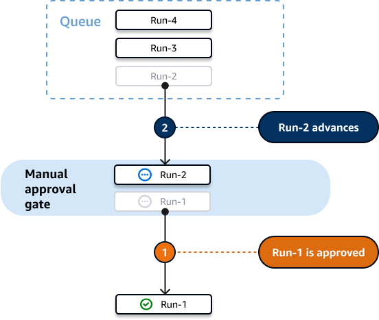
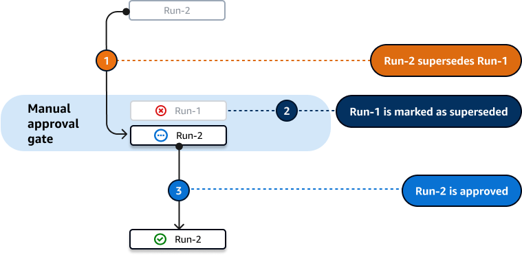
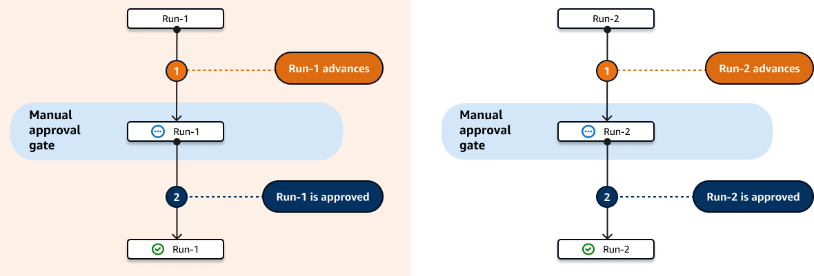

Amazon CodeCatalyst is no longer open to new customers. Existing customers can continue to use the service as normal. For more information, see [How to migrate from CodeCatalyst](migration.md "migration.md").

# Requiring approvals on workflow runs

You can configure a workflow run to require an approval before it can proceed. To
accomplish this, you must add a **Approval**
[gate](workflows-gates.md "workflows-gates.md") to the workflow. An _Approval
gate_ prevents a workflow from proceeding until a user or set of users submit
one or more approvals in the CodeCatalyst console. Once all approvals are given, the gate is
'unlocked' and the workflow run is allowed to resume.

Use an **Approval** gate in your workflow to give your development,
operations, and leadership teams a chance to review your changes before they are deployed to
a wider audience.

For more information about workflow runs, see [Running a workflow](workflows-working-runs.md "workflows-working-runs.md").

###### Topics

- [How do I unlock an approval
  gate?](#workflows-approval-conditions "#workflows-approval-conditions")
- [When to use the 'Approval' gate](#workflows-approval-when "#workflows-approval-when")
- [Who can provide an approval?](#workflows-approval-who "#workflows-approval-who")
- [How do I notify users that an
  approval is required?](#workflows-approval-notify-methods "#workflows-approval-notify-methods")
- [Can I use an 'Approval' gate to prevent a
  workflow run from starting?](#workflows-approval-prevent "#workflows-approval-prevent")
- [How do workflow approvals work with
  queued, superseded, and parallel run modes?](#workflows-approval-run-mode "#workflows-approval-run-mode")
- [Example: An 'Approval' gate](workflows-approval-example.md "workflows-approval-example.md")
- [Adding an 'Approval' gate](workflows-approval-add.md "workflows-approval-add.md")
- [Configuring approval notifications](workflows-approval-notify.md "workflows-approval-notify.md")
- [Approving or rejecting a workflow run](workflows-approval-approve.md "workflows-approval-approve.md")
- ['Approval' gate YAML](approval-ref.md "approval-ref.md")

## How do I unlock an approval

gate?

To unlock an **Approval** gate, _all_ of the
following conditions must be met:

- **Condition 1**: The required number of approvals
  must be submitted. The required number of approvals is configurable, and each
  user is allowed to submit a single approval.
- **Condition 2**: All approvals must be submitted
  before the gate times out. The gate times out 14 days after it is activated.
  This period is not configurable.
- **Condition 3**: No one must reject the workflow
  run. A single rejection will cause the workflow run to fail.
- **Condition 4**: (Only applies if you are using
  the superseded run mode.) The run must not be superseded by a later run. For
  more information, see [How do workflow approvals work with
  queued, superseded, and parallel run modes?](#workflows-approval-run-mode "#workflows-approval-run-mode").

If any of the conditions are not met, CodeCatalyst stops the workflow and sets the run
status to **Failed** (in the case of **Conditions
1** to **3**) or
**Superseded** (in the case of **Condition
4**).

## When to use the 'Approval' gate

Typically, you would use an **Approval** gate in a workflow that
deploys applications and other resources to a production server or any environment where
quality standards must be validated. By placing the gate before the deployment to
production, you give reviewers a chance to validate your new software revision before it
becomes available to the public.

## Who can provide an approval?

Any user who is a member of your project and who has the
**Contributor** or **Project administrator**
role can provide an approval. Users with the **Space administrator** role
who belong to your project's space can also provide an approval.

###### Note

Users with the **Reviewer** role cannot provide
approvals.

## How do I notify users that an

approval is required?

To notify users that an approval is required, you must:

- Have CodeCatalyst send them a Slack notification. For more information, see [Configuring approval notifications](workflows-approval-notify.md "workflows-approval-notify.md").
- Go to the page in the CodeCatalyst console where the **Approve**
  and **Reject** buttons are, and paste that page's URL into an
  email or messaging application addressed to the approvers. For more information
  about how to navigate to this page, see [Approving or rejecting a workflow run](workflows-approval-approve.md "workflows-approval-approve.md").

## Can I use an 'Approval' gate to prevent a

workflow run from starting?

Yes, with qualifications. For more information, see [Can I use a gate to prevent a workflow run
from starting?](workflows-gates.md#workflows-gates-prevent "workflows-gates.md#workflows-gates-prevent").

## How do workflow approvals work with

queued, superseded, and parallel run modes?

When using the queued, superseded, or parallel run mode, the
**Approval** gate works in a similar way to [actions](workflows-actions.md "workflows-actions.md"). We suggest reading the [About queued run mode](workflows-configure-runs.md#workflows-configure-runs-queued "workflows-configure-runs.md#workflows-configure-runs-queued"), [About superseded run mode](workflows-configure-runs.md#workflows-configure-runs-superseded "workflows-configure-runs.md#workflows-configure-runs-superseded"), [About parallel run mode](workflows-configure-runs.md#workflows-configure-runs-parallel "workflows-configure-runs.md#workflows-configure-runs-parallel") sections to familiarize yourself
with these run modes. Once you have a basic understanding of them, return to this
section to find out how these run modes work when the **Approval** gate
is present.

When the **Approval** gate is present, runs are processed as
follows:

- If you're using the [queued run
  mode](workflows-configure-runs.md#workflows-configure-runs-queued "workflows-configure-runs.md#workflows-configure-runs-queued"), runs will queue up behind the run that is currently waiting for
  approval at the gate. When that gate becomes unlocked (that is, all approvals
  have been given), the next run in the queue advances to the gate, and waits for
  approvals. This process continues with queued runs being processed through the
  gate one-by-one. [Figure 1](#figure-1-workflow-queued-run-mode-ma "#figure-1-workflow-queued-run-mode-ma")
  illustrates this process.
- If you're using the [superseded run mode](workflows-configure-runs.md#workflows-configure-runs-superseded "workflows-configure-runs.md#workflows-configure-runs-superseded"), the behavior is the same as for the queued run
  mode, except that instead of having runs pile up in the queue at the gate, newer
  runs supersede (take over from) earlier runs. There are no queues, and any run
  that is currently waiting at the gate for an approval will be cancelled and
  superseded by a newer run. [Figure 2](#figure-2-workflow-superseded-run-mode-ma "#figure-2-workflow-superseded-run-mode-ma") illustrates this
  process.
- If you're using the [parallel
  run mode](workflows-configure-runs.md#workflows-configure-runs-parallel "workflows-configure-runs.md#workflows-configure-runs-parallel"), runs start in parallel and no queues form. Each run gets
  processed by the gate immediately since there are no runs in front of it. [Figure 3](#figure-3-workflow-parallel-run-mode-ma "#figure-3-workflow-parallel-run-mode-ma") illustrates this
  process.

**Figure 1**: 'Queued run mode' and an
**Approval** gate

**Figure 2**: 'Superseded run mode' and an
**Approval** gate

**Figure 3**: 'Parallel run mode' and an
**Approval** gate

