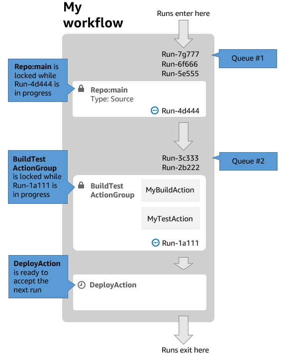

Amazon CodeCatalyst is no longer open to new customers. Existing customers can continue to use the service as normal. For more information, see [How to migrate from CodeCatalyst](migration.md "migration.md").

# Configuring the queuing behavior of runs

By default in Amazon CodeCatalyst, when multiple workflow runs occur at the same time, CodeCatalyst queues them up, and
processes them one by one, in the order that they were started. You can change this default
behavior by specifying a _run mode_. There are a few run modes:

- (Default) Queued run mode – CodeCatalyst processes runs one by one
- Superseded run mode – CodeCatalyst processes runs one by one, with newer runs
  overtaking older ones
- Parallel run mode – CodeCatalyst processes runs in parallel
  For more information about workflow runs, see [Running a workflow](workflows-working-runs.md "workflows-working-runs.md").

###### Topics

- [About queued run mode](#workflows-configure-runs-queued "#workflows-configure-runs-queued")
- [About superseded run mode](#workflows-configure-runs-superseded "#workflows-configure-runs-superseded")
- [About parallel run mode](#workflows-configure-runs-parallel "#workflows-configure-runs-parallel")
- [Configuring the run mode](#workflows-configure-runs-configure "#workflows-configure-runs-configure")

## About queued run mode

In _queued run mode_, runs occur in series, with waiting runs
forming a queue.

Queues form at the entry points to actions and action groups, so you can have
_multiple queues within the same workflow_ (see [Figure 1](#figure-1-workflow-queued-run-mode "#figure-1-workflow-queued-run-mode")). When a queued run enters an action,
the action is locked and no other runs can enter. When the run finishes and exits the
action, the action becomes unlocked and ready for the next run.

[Figure 1](#figure-1-workflow-queued-run-mode "#figure-1-workflow-queued-run-mode") illustrates a workflow configured
in queued run mode. It shows:

- Seven runs working their way through the workflow.
- Two queues: one outside the entry to the input source
  (**Repo:main**), and one outside the entry to the
  **BuildTestActionGroup** action.
- Two locked blocks: the input source (**Repo:main**) and the
  **BuildTestActionGroup**.

Here's how things will transpire as the workflow runs finish processing:

- When **Run-4d444** finishes cloning the source repository, it
  will exit the input source and join the queue behind
  **Run-3c333**. Then, **Run-5e555** will
  enter the input source.
- When **Run-1a111** finishes building and testing, it will
  exit the **BuildTestActionGroup** action and enter the
  **DeployAction** action. Then,
  **Run-2b222** will enter the
  **BuildTestActionGroup** action.

**Figure 1**: A workflow configured in 'queued run mode'



Use queued run mode if:

- **You want to keep a one-to-one relationship between
  features and runs – these features may be grouped when using
  superseded mode**. For example, when you merge feature 1 in commit
  1, run 1 starts, and when you merge feature 2 in commit 2, run 2 starts, and so
  on. If you were to use superseded mode instead of queued mode, your features
  (and commits) will be grouped together in the run that supersedes the
  others.
- **You want to avoid race conditions and unexpected
  problems that may occur when using parallel mode**. For example, if
  two software developers, Wang and Saanvi, start workflow runs at roughly the
  same time to deploy to an Amazon ECS cluster, Wang's run might begin integration
  tests on the cluster while Saanvi's run deploys new application code to the
  cluster, causing Wang's tests either to fail or to test the wrong code. As
  another example, you might have a target that doesn't have a locking mechanism,
  in which case the two runs could overwrite each other's changes in unexpected
  ways.
- **You want to limit the load** on the compute
  resources that CodeCatalyst uses to process your runs. For example, if you have three
  actions in your workflow, you can have a maximum of three runs occurring at the
  same time. Imposing a limit on the number of runs that can occur at once makes
  run throughput more predictable.
- **You want to constrain the number of requests made to
  third-party services** by the workflow. For example, your workflow
  might have a build action that includes instructions to pull an image from
  Docker Hub. [Docker Hub
  limits the number of pull requests](https://www.docker.com/increase-rate-limits "https://www.docker.com/increase-rate-limits") you can make to a certain number
  per hour per account, and you will be locked out if you go over the limit. Using
  queued run mode to slow down your run throughput will have the effect of
  generating fewer requests to Docker Hub per hour, thus limiting the potential
  for lockouts and resulting build and run failures.

**Maximum queue size**: 50

Notes on **Maximum queue size**:

- The maximum queue size refers to the maximum number of runs allowed across
  _all queues_ in the workflow.
- If a queue becomes longer than 50 runs, then CodeCatalyst drops the 51st and
  subsequent runs.

**Failure behavior**:

If a run becomes unresponsive while it's being processed by an action, then the runs
behind it are held up in the queue
until the action times out. Actions time out after an hour.

If a run fails inside an action, then the first queued run behind it is allowed to
proceed.

## About superseded run mode

_Superseded run mode_ is the same as _queued run
mode_ except that:

- If a queued run catches up to another run in the queue, the later run
  supersedes (takes over from) the earlier run, and the earlier run is canceled
  and marked as 'superseded'.
- As an outcome of the behavior described in the first bullet, a queue can only
  include one run when superseded run mode is used.

Using the workflow in [Figure 1](#figure-1-workflow-queued-run-mode "#figure-1-workflow-queued-run-mode") as a guide,
applying superseded run mode to this workflow would result in the following:

- **Run-7g777** would supersede the other two runs in its
  queue, and would be the only run remaining in **Queue #1**.
  **Run-6f666** and **Run-5e555** would be
  canceled.
- **Run-3c333** would supersede **Run-2b222**
  and be the only run remaining in **Queue #2**.
  **Run-2b222** would be canceled.

Use superseded run mode if you want:

- better throughput than with queued mode
- even fewer requests into third-party services than with queued mode; this is
  advantageous if the third-party service has rate limits, such as Docker
  Hub

## About parallel run mode

In _parallel run mode_, runs are independent of one another and
don’t wait for other runs to complete before starting. There are no queues, and run
throughput is limited only by how fast the actions inside the workflow take to complete.

Use parallel run mode in development environments where each user has their own
feature branch and deploys to targets that are not shared by other users.

###### Important

If you have a shared target that multiple users can deploy to, such as a Lambda
function in a production environment, do not use parallel mode, because race
conditions may result. A _race condition_ occurs when parallel
workflow runs attempt to change a shared resource at the same time, leading to
unpredictable results.

**Maximum number of parallel runs**: 1000 per CodeCatalyst
space

## Configuring the run mode

You can set the run mode to queued, superseded, or parallel. The default is
queued.

When you change the run mode from queued or superseded to parallel, CodeCatalyst cancels the
runs that are queued, and allows the runs that are currently being processed by an
action to finish before canceling them.

When you change the run mode from parallel to queued or superseded, CodeCatalyst lets all
currently-running parallel runs complete. Any runs that you start after changing the run
mode to queued or superseded use the new mode.

Visual

###### To change the run mode using the visual editor

1. Open the CodeCatalyst console at [https://codecatalyst.aws/](https://codecatalyst.aws/ "https://codecatalyst.aws/").
2. Choose your project.
3. In the navigation pane, choose **CI/CD**, and then choose **Workflows**.
4. Choose the name of your workflow. You can filter by the source
   repository or branch name where the workflow is defined, or filter
   by workflow name or status.
5. Choose **Edit**.
6. At the top-right, choose **Workflow
   properties**.
7. Expand **Advanced**, and under **Run
   mode**, choose one of the following:
   1. **Queued** – see [About queued run mode](#workflows-configure-runs-queued "#workflows-configure-runs-queued")
   2. **Superseded** – see [About superseded run mode](#workflows-configure-runs-superseded "#workflows-configure-runs-superseded")
   3. **Parallel** – see [About parallel run mode](#workflows-configure-runs-parallel "#workflows-configure-runs-parallel")

8. (Optional) Choose **Validate** to validate the
   workflow's YAML code before committing.
9. Choose **Commit**, enter a commit message, and
   choose **Commit** again.

YAML

###### To change the run mode using the YAML editor

1. Open the CodeCatalyst console at [https://codecatalyst.aws/](https://codecatalyst.aws/ "https://codecatalyst.aws/").
2. Choose your project.
3. In the navigation pane, choose **CI/CD**, and then choose **Workflows**.
4. Choose the name of your workflow. You can filter by the source
   repository or branch name where the workflow is defined, or filter
   by workflow name or status.
5. Choose **Edit**.
6. Choose **YAML**.
7. Add the `RunMode` property, like this:

```
Name: Workflow_6d39
SchemaVersion: "1.0"
RunMode: `QUEUED|SUPERSEDED|PARALLEL`
```

For more information, see the description of the
`RunMode` property in the [Top-level properties](workflow-reference.md#workflow.top.level "workflow-reference.md#workflow.top.level") section of the [Workflow YAML definition](workflow-reference.md "workflow-reference.md"). 8. (Optional) Choose **Validate** to validate the
workflow's YAML code before committing. 9. Choose **Commit**, enter a commit message, and
choose **Commit** again.
