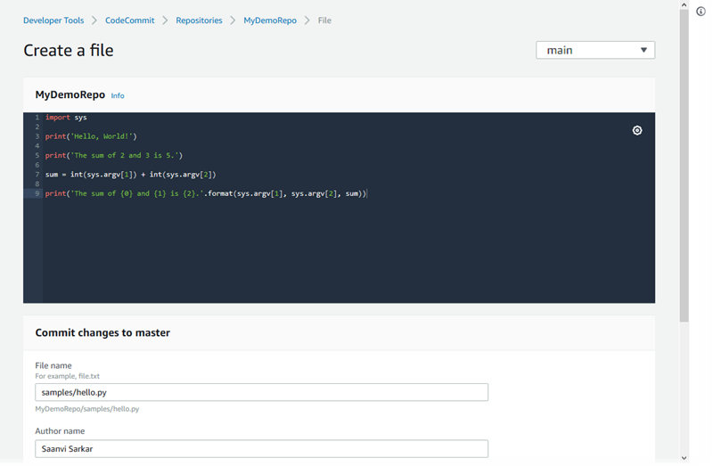

AWS CodeCommit is no longer available to new customers. Existing customers of
AWS CodeCommit can continue to use the service as normal.
[Learn more"](https://aws.amazon.com/blogs/devops/how-to-migrate-your-aws-codecommit-repository-to-another-git-provider "https://aws.amazon.com/blogs/devops/how-to-migrate-your-aws-codecommit-repository-to-another-git-provider")

# Working with files in AWS CodeCommit repositories

In CodeCommit, a file is a version-controlled, self-contained piece of information available to you and other
users of the repository and branch where the file is stored. You can organize your repository files with a directory structure,
just as you would on a computer. Unlike your computer, CodeCommit automatically tracks every change to a file. You can
compare versions of a file and store different versions of a file in different repository branches.

To add or edit a file in a repository, you can use a Git client. You can also use the CodeCommit
console, the AWS CLI, or the CodeCommit API.

For information about working with other aspects of your repository in CodeCommit, see [Working with repositories](repositories.md "repositories.md"), [Working with pull requests](pull-requests.md "pull-requests.md"), [Working with branches](branches.md "branches.md"), [Working with commits](commits.md "commits.md"), and [Working with user preferences](user-preferences.md "user-preferences.md").

###### Topics

- [Browse files in an AWS CodeCommit repository](how-to-browse.md "how-to-browse.md")
- [Create or add a file to an AWS CodeCommit repository](how-to-create-file.md "how-to-create-file.md")
- [Edit the contents of a file in an AWS CodeCommit repository](how-to-edit-file.md "how-to-edit-file.md")
