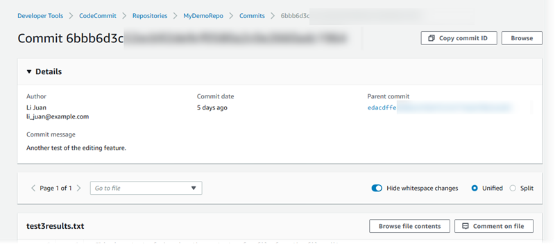
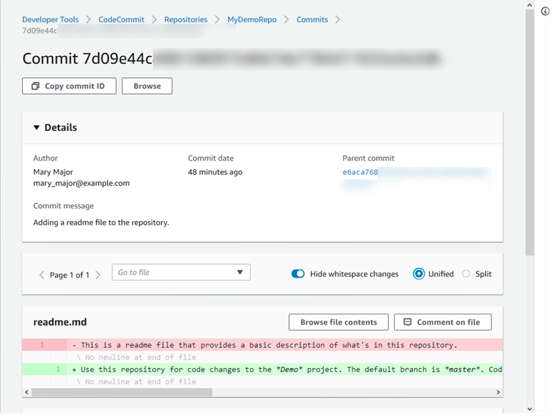
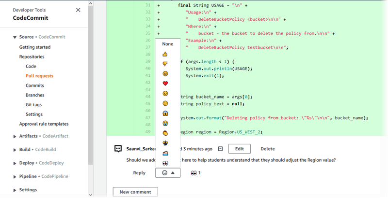
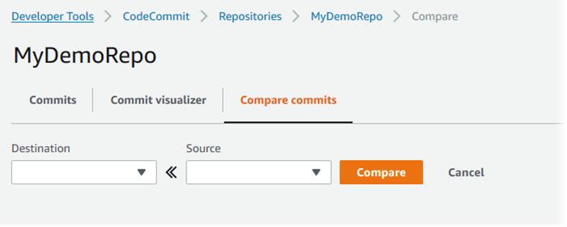
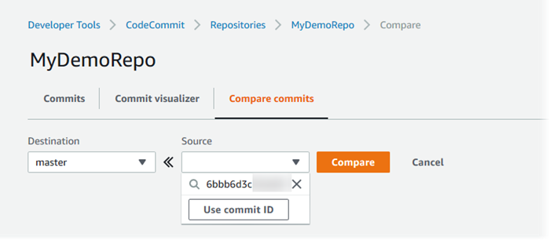
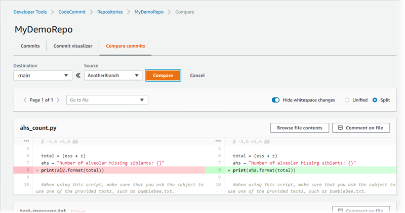

# Compare commits in AWS CodeCommit

You can use the CodeCommit console to view the differences between commit specifiers in a CodeCommit
repository. You can quickly view the difference between a commit and its parent. You can
also compare any two references, including commit IDs.

###### Topics

- [Compare a commit to its parent](#how-to-compare-commits-parent "#how-to-compare-commits-parent")
- [Compare any two commit specifiers](#how-to-compare-commits-compare "#how-to-compare-commits-compare")

## Compare a commit to its parent

You can quickly view the difference between a commit and its parent to review the
commit message, the committer, and what changed.

1. Open the CodeCommit console at [https://console.aws.amazon.com/codesuite/codecommit/home](https://console.aws.amazon.com/codesuite/codecommit/home "https://console.aws.amazon.com/codesuite/codecommit/home").
2. On the **Repositories** page, choose the repository where you
   want to view the difference between a commit and its parent.
3. In the navigation pane, choose **Commits**.
4. Choose the abbreviated commit ID of any commit in the list. The view changes
   to show details for this commit, including the differences between it and its
   parent commit.

You can show changes side by side (**Split** view) or inline
(**Unified** view). You can also hide or show white space
changes. You can also add comments. For more information, see [Comment on a commit](how-to-commit-comment.md "how-to-commit-comment.md").

###### Note

Your preferences for viewing code and other console settings are saved as
browser cookies whenever you change them. For more information, see [Working with user preferences](user-preferences.md "user-preferences.md").

###### Note

Depending on line ending style, your code editor, and other factors, you
might see entire lines added or deleted instead of specific changes in a
line. The level of detail matches what's returned in the **git
show** or **git diff** commands. 5. To compare a commit to its parent, from the **Commit
visualizer** tab, choose the abbreviated commit ID. The commit
details, including the changes between the commit and its parent, are
displayed.

## Compare any two commit specifiers

You can view the differences between any two commit specifiers in the CodeCommit console. Commit specifiers are references, such as branches, tags, and commit IDs.

1. Open the CodeCommit console at [https://console.aws.amazon.com/codesuite/codecommit/home](https://console.aws.amazon.com/codesuite/codecommit/home "https://console.aws.amazon.com/codesuite/codecommit/home").
2. On the **Repositories** page, choose the repository where you
   want to compare commits, branches, or tagged commits.
3. In the navigation pane, choose **Commits**, and then choose
   **Compare commits**.

 4. Use the boxes to compare two commit specifiers.

    * To compare the tip of a branch, choose the branch name from the list. This
     selects the most recent commit from that branch for the
     comparison.
    * To compare a commit with a specific tag associated with it, choose the tag
     name from the list, if any. This selects the tagged commit for the
     comparison.
    * To compare a specific commit, enter or paste the commit ID in the box. To
     get the full commit ID, choose **Commits** in the
     navigation bar, and copy the commit ID from the list. On the
     **Compare commits** page, paste the full commit ID
     in the text box, and choose **Use commit ID**.

    

5. After you have selected the specifiers, choose **Compare**.

You can show differences side by side (**Split** view) or
inline (**Unified** view). You can also hide or show white
space changes. 6. To clear your comparison choices, choose **Cancel**.
