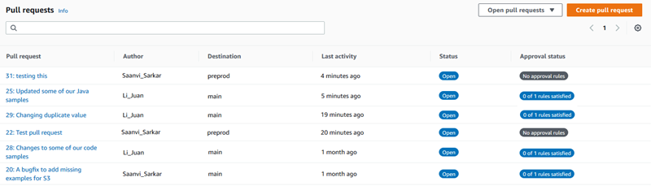
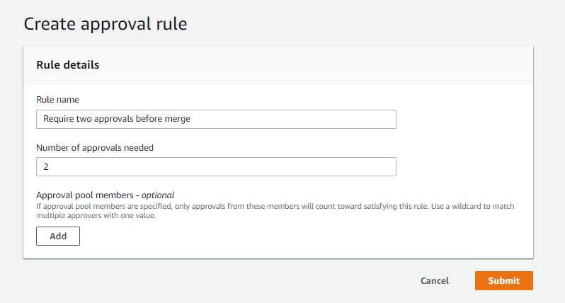

AWS CodeCommit is no longer available to new customers. Existing customers of
AWS CodeCommit can continue to use the service as normal.
[Learn more"](https://aws.amazon.com/blogs/devops/how-to-migrate-your-aws-codecommit-repository-to-another-git-provider "https://aws.amazon.com/blogs/devops/how-to-migrate-your-aws-codecommit-repository-to-another-git-provider")

# Create an approval rule for a pull

request

Creating approval rules for your pull requests helps ensure the quality of your code by
requiring users to approve the pull request before the code can be merged into the destination
branch. You can specify the number of users who must approve a pull request. You can also specify
an approval pool of users for the rule. If you do so, only approvals from those users count toward
the number of required approvals for the rule.

###### Note

You can also create approval rule templates, which can help you automate the creation of
approval rules across repositories that will apply to every pull request. For more information, see [Working with approval rule templates](approval-rule-templates.md "approval-rule-templates.md").

You can use the AWS CodeCommit console or the AWS CLI to create approval rules for your
repository.

###### Topics

- [Create an approval rule for a
  pull request (console)](#how-to-create-pull-request-approval-rule-console "#how-to-create-pull-request-approval-rule-console")
- [Create an approval rule for a pull
  request (AWS CLI)](#how-to-create-pull-request-approval-rule-cli "#how-to-create-pull-request-approval-rule-cli")

## Create an approval rule for a

pull request (console)

You can use the CodeCommit console to create an approval rule for a pull request in a
CodeCommit repository.

1. Open the CodeCommit console at [https://console.aws.amazon.com/codesuite/codecommit/home](https://console.aws.amazon.com/codesuite/codecommit/home "https://console.aws.amazon.com/codesuite/codecommit/home").
2. In **Repositories**, choose the name of the repository where you want to
   create an approval rule for a pull request.
3. In the navigation pane, choose **Pull Requests**.
4. Choose the pull request for which you want to create an approval rule from the list. You
   can only create approval rules for open pull requests.

 5. In the pull request, choose **Approvals**, and then choose
**Create approval rule**. 6. In **Rule name**, give the rule a descriptive name so you know what it is
for. For example, if you want to require two people to approve a pull request before it can be
merged, you might name the rule `Require two approvals before merge`.

###### Note

You cannot change the name of an approval rule after you create it.

In **Number of approvals needed**, enter the number you want. The default
is 1.

 7. (Optional) If you want to require that the approvals for a pull request come from a
specific group of users, in **Approval rule members**, choose
**Add**. In **Approver type**, choose one of the following:

    * **IAM user name or assumed role**: This option prepopulates the AWS
     account ID with the account you used to sign in, and only requires a name. It can be used for
     both IAM users and federated access users whose name matches the provided name. This is a
     very powerful option that offers a great deal of flexibility. For example, if you are signed
     in with the Amazon Web Services account 123456789012 and choose this option, and you specify
     `Mary_Major`, all of the following are counted as approvals coming from
     that user:


    	+ An IAM user in the account (`arn:aws:iam::123456789012:user/Mary_Major`)
    	+ A federated user identified in IAM as Mary\_Major (`arn:aws:sts::123456789012:federated-user/Mary_Major`)
    This option would not recognize an active session of someone assuming the role of
     `CodeCommitReview` with a role session name of Mary\_Major
     (`arn:aws:sts::123456789012:assumed-role/CodeCommitReview/Mary_Major`) unless you include a
     wildcard (`*Mary_Major`). You can also specify the role name explicitly
     (`CodeCommitReview/Mary_Major`).
    * **Fully qualified ARN**: This option allows you to specify the fully qualified Amazon Resource
     Name (ARN) of the IAM user or role. This option also supports assumed roles used by other AWS services, such
     as AWS Lambda and AWS CodeBuild. For assumed roles, the ARN format should be
     `arn:aws:sts::`AccountID`:assumed-role/`RoleName``
     for roles and
     `arn:aws:sts::`AccountID`:assumed-role/`FunctionName``
     for functions.

If you chose **IAM user name or assumed role** as the approver type, in
**Value**, enter the name of the IAM user or role or the fully qualified
ARN of the user or role. Choose **Add** again to add more users or roles,
until you have added all the users or roles whose approvals count toward the number of required
approvals.

Both approver types allow you to use wildcards (\*) in their values. For example, if you
choose the **IAM user name or assumed role** option, and you specify
`CodeCommitReview/*`, all users who assume the role of
`CodeCommitReview` are counted in the approval pool. Their individual role
session names count toward the required number of approvers. In this way, both Mary_Major and
Li_Juan are counted as approvals when signed in and assuming the role of
`CodeCommitReview`. For more information about IAM ARNs, wildcards, and formats, see
[IAM
Identifiers](../../../IAM/latest/UserGuide/reference_identifiers.md#identifiers-arns "../../../IAM/latest/UserGuide/reference_identifiers.md#identifiers-arns").

###### Note

Approval rules do not support cross-account approvals. 8. When you have finished configuring the approval rule, choose
**Submit**.

## Create an approval rule for a pull

request (AWS CLI)

To use AWS CLI commands with CodeCommit, install the AWS CLI. For more information, see
[Command line reference](cmd-ref.md "cmd-ref.md").

## To create an approval rule for a

pull request in a CodeCommit repository

- Run the **create-pull-request-approval-rule** command, specifying:

      + The ID of the pull request (with the **--id** option).
      + The name of the approval rule (with the **--approval-rule-name**
       option).
      + The content of the approval rule (with the **--approval-rule-content**
       option).

  When you create the approval rule, you can specify approvers in an approval pool in one of
  two ways:

      + **CodeCommitApprovers**: This option only requires an Amazon Web Services account
       and a resource. It can be used for both IAM users and federated access users whose name
       matches the provided resource name. This is a very powerful option that offers a great deal
       of flexibility. For example, if you specify the Amazon Web Services account 123456789012 and
       `Mary_Major`, all of the following are counted as approvals coming from
       that user:


      	- An IAM user in the account
      	 (`arn:aws:iam::123456789012:user/Mary_Major`)
      	- A federated user identified in IAM as Mary\_Major
      	 (`arn:aws:sts::123456789012:federated-user/Mary_Major`)
      This option would not recognize an active session of someone assuming the role of
       `CodeCommitReview` with a role session name of Mary\_Major
       (`arn:aws:sts::123456789012:assumed-role/CodeCommitReview/Mary_Major`)
       unless you include a wildcard (`*Mary_Major`).
      + **Fully qualified ARN**: This option allows you to specify the fully
       qualified Amazon Resource Name (ARN) of the IAM user or role.

  For more information about IAM ARNs, wildcards, and formats, see [IAM
  Identifiers](../../../IAM/latest/UserGuide/reference_identifiers.md#identifiers-arns "../../../IAM/latest/UserGuide/reference_identifiers.md#identifiers-arns").

The
following example creates an approval rule named `Require two approved approvers`
for a pull request with the ID of `27`. The rule specifies two approvals are
required from an approval pool. The pool includes all users who access CodeCommit and assume the
role of `CodeCommitReview` in the `123456789012` Amazon Web Services
account. It also includes either an IAM user or federated user named
`Nikhil_Jayashankar` in the same Amazon Web Services account:

```
aws codecommit create-pull-request-approval-rule --pull-request-id `27` --approval-rule-name "`Require two approved approvers`" --approval-rule-content "{\"Version\": \"2018-11-08\",\"Statements\": [{\"Type\": \"Approvers\",\"NumberOfApprovalsNeeded\": 2,\"ApprovalPoolMembers\": [\"CodeCommitApprovers:`123456789012`:`Nikhil_Jayashankar`\", \"arn:aws:sts::123456789012:assumed-role/CodeCommitReview/*\"]}]}"
```
