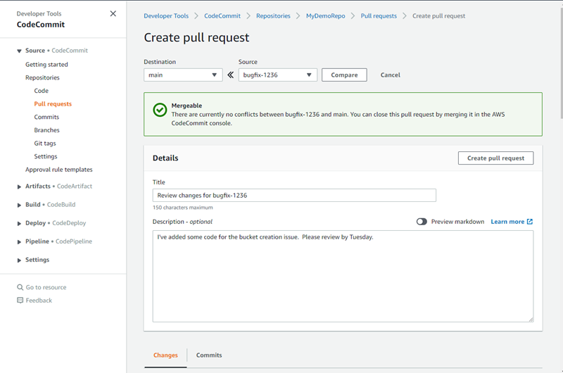

# Create a pull request

Creating pull requests helps other users see and review your code changes before you merge
them into another branch. First, you create a branch for your code changes. This is referred to as
the source branch for a pull request. After you commit and push changes to the repository, you can
create a pull request that compares the contents of that branch (the source branch) to the branch
where you want to merge your changes after the pull request is closed (the destination branch).

You can use the AWS CodeCommit console or the AWS CLI to create pull requests for your
repository.

###### Topics

- [Create a pull request (console)](#how-to-create-pull-request-console "#how-to-create-pull-request-console")
- [Create a pull request (AWS CLI)](#how-to-create-pull-request-cli "#how-to-create-pull-request-cli")

## Create a pull request (console)

You can use the CodeCommit console to create a pull request in a CodeCommit repository. If your
repository is [configured with notifications](how-to-repository-email.md "how-to-repository-email.md"),
subscribed users receive an email when you create a pull request.

1. Open the CodeCommit console at [https://console.aws.amazon.com/codesuite/codecommit/home](https://console.aws.amazon.com/codesuite/codecommit/home "https://console.aws.amazon.com/codesuite/codecommit/home").
2. In **Repositories**, choose the name of the repository where you want to
   create a pull request.
3. In the navigation pane, choose **Pull Requests**.

###### Tip

You can also create pull requests from **Branches** and
**Code**. 4. Choose **Create pull request**.

 5. In **Create pull request**, in **Source**, choose the branch that contains
the changes you want reviewed. 6. In **Destination**, choose the branch where you intend to merge your code
changes when the pull request is closed. 7. Choose **Compare**. A comparison runs on the two branches, and the
differences between them are displayed. An analysis is also performed to determine whether the
two branches can be merged automatically when the pull request is closed. 8. Review the comparison details and the changes to be sure that the pull request contains
the changes and commits you want reviewed. If not, adjust your choices for source and
destination branches, and choose **Compare** again. 9. When you are satisfied with the comparison results for the pull request, in
**Title**, enter a short but descriptive title for this review. This is the
title that appears in the list of pull requests for the repository. 10. (Optional) In **Description**, enter details about this review and any
other useful information for reviewers. 11. Choose **Create**.



Your pull request appears in the list of pull requests for the repository. If you [configured notifications](how-to-repository-email.md "how-to-repository-email.md"), subscribers to the Amazon SNS
topic receive an email to inform them of the newly created pull request.

## Create a pull request (AWS CLI)

To use AWS CLI commands with CodeCommit, install the AWS CLI. For more information, see
[Command line reference](cmd-ref.md "cmd-ref.md").

**To use the AWS CLI to create a pull request in a
CodeCommit repository**

- Run the **create-pull-request** command, specifying:

      + The name of the pull request (with the **--title** option).
      + The description of the pull request (with the **--description**
       option).
      + A list of targets for the **create-pull-request** command,
       including:


      	- The name of the CodeCommit repository where the pull request is created (with the
      	 **repositoryName** attribute).
      	- The name of the branch that contains the code changes you want reviewed, also known as
      	 the source branch (with the **sourceReference** attribute).
      	- (Optional) The name of the branch where you intend to merge your code changes, also
      	 known as the destination branch, if you do not want to merge to the default branch (with
      	 the **destinationReference** attribute).
      + A unique, client-generated idempotency token (with the
       **--client-request-token** option).

  This example creates a pull request named `Pronunciation difficulty
 analyzer` with a description of `Please review these changes by
 Tuesday` that targets the `jane-branch` source branch.
  The pull request is to be merged into the default branch `main` in a
  CodeCommit repository named `MyDemoRepo`:

```
aws codecommit create-pull-request --title "`Pronunciation difficulty analyzer`" --description "`Please review these changes by Tuesday`" --client-request-token 123Example --targets repositoryName=MyDemoRepo,sourceReference=jane-branch
```
