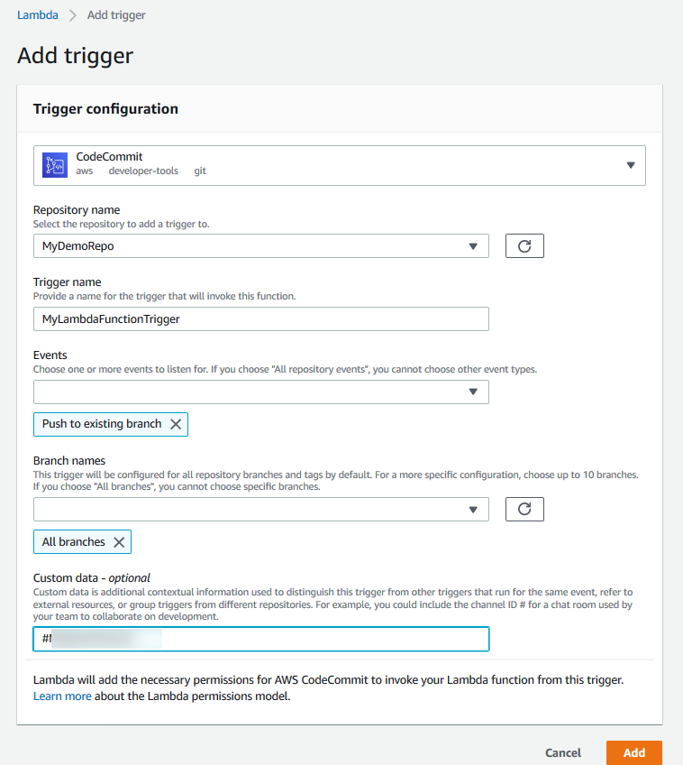

# Example: Create an AWS CodeCommit trigger for an AWS Lambda function

You can create a trigger for a CodeCommit repository so that events in the repository invoke a
Lambda function. In this example, you create a Lambda function that returns the URL used to
clone the repository to an Amazon CloudWatch log.

###### Topics

- [Create the Lambda function](#how-to-notify-lambda-create-function "#how-to-notify-lambda-create-function")
- [View the trigger for the Lambda function in the AWS CodeCommit
  repository](#how-to-notify-lam-view "#how-to-notify-lam-view")

## Create the Lambda function

When you use the Lambda console to create the function, you can also create a CodeCommit
trigger for the Lambda function. The following steps include a sample Lambda function. The
sample is available in two languages: JavaScript and Python. The function returns the
URLs used for cloning a repository to a CloudWatch log.

###### To create a Lambda function using a Lambda blueprint

1. Sign in to the AWS Management Console and open the AWS Lambda console at
   [https://console.aws.amazon.com/lambda/](https://console.aws.amazon.com/lambda/ "https://console.aws.amazon.com/lambda/").
2. On the **Lambda Functions** page, choose **Create
   function**.
   (If you have not used Lambda before, choose **Get Started
   Now**.)
3. On the
   **Create
   function** page, choose
   **Author
   from
   scratch**.
   In **Function Name**, provide a name for the function, for
   example `MyLambdaFunctionforCodeCommit`. In
   **Runtime**, choose the language you want to use to write
   your function, and then choose **Create
   function**.
4. On the
   **Configuration**
   tab, choose
   **Add trigger**.
5. In
   **Trigger configuration**, choose
   **CodeCommit**
   from the services drop-down list.



    * In **Repository name**, choose the name of the
     repository where you want to configure a trigger that uses the Lambda
     function in response to repository events.
    * In **Trigger name**, enter a name for the trigger
     (for example,
     `MyLambdaFunctionTrigger`).
    * In **Events**, choose the repository events that
     trigger the Lambda function. If you choose **All repository
     events**, you cannot choose any other events. If you want
     to choose a subset of events, clear **All repository
     events**, and then choose the events you want from the
     list. For example, if you want the trigger to run only when a user
     creates a tag or a branch in the AWS CodeCommit repository, remove
     **All repository events**, and then choose
     **Create branch or tag**.
    * If you want the trigger to apply to all branches of the repository, in
     **Branches**, choose **All
     branches**. Otherwise, choose **Specific
     branches**. The default branch for the repository is added
     by default. You can keep or delete this branch from the list. Choose up
     to 10 branch names from the list of repository branches.
    * (Optional) In **Custom data**, enter information you
     want included in the Lambda function (for example, the name of the IRC
     channel used by developers to discuss development in the repository).
     This field is a string. It cannot be used to pass any dynamic
     parameters.

Choose
**Add**. 6. On the
**Configuration**
page, in
**Function
Code**,
in
Code entry type, choose Edit code inline.. In
**Runtime**, choose **Node.js**. If you want
to create a sample Python function, choose
**Python**. 7. In **Code entry type**, choose **Edit code
inline**, and then replace the hello world code with one of the two
following samples.

For Node.js:

```
import {
  CodeCommitClient,
  GetRepositoryCommand,
} from "@aws-sdk/client-codecommit";

const codecommit = new CodeCommitClient({ region: "your-region" });

/**
 * @param {{ Records: { codecommit: { references: { ref: string }[] }, eventSourceARN: string  }[]} event
 */
export const handler = async (event) => {
  // Log the updated references from the event
  const references = event.Records[0].codecommit.references.map(
    (reference) => reference.ref,
  );
  console.log("References:", references);

  // Get the repository from the event and show its git clone URL
  const repository = event.Records[0].eventSourceARN.split(":")[5];
  const params = {
    repositoryName: repository,
  };

  try {
    const data = await codecommit.send(new GetRepositoryCommand(params));
    console.log("Clone URL:", data.repositoryMetadata.cloneUrlHttp);
    return data.repositoryMetadata.cloneUrlHttp;
  } catch (error) {
    console.error("Error:", error);
    throw new Error(
      `Error getting repository metadata for repository ${repository}`,
    );
  }
};

```

For Python:

```

import json
import boto3

codecommit = boto3.client("codecommit")


def lambda_handler(event, context):
    # Log the updated references from the event
    references = {
        reference["ref"]
        for reference in event["Records"][0]["codecommit"]["references"]
    }
    print("References: " + str(references))

    # Get the repository from the event and show its git clone URL
    repository = event["Records"][0]["eventSourceARN"].split(":")[5]
    try:
        response = codecommit.get_repository(repositoryName=repository)
        print("Clone URL: " + response["repositoryMetadata"]["cloneUrlHttp"])
        return response["repositoryMetadata"]["cloneUrlHttp"]
    except Exception as e:
        print(e)
        print(
            "Error getting repository {}. Make sure it exists and that your repository is in the same region as this function.".format(
                repository
            )
        )
        raise e


```

8. In the
   **Permissions** tab, in
   **Execution
   role**,
   choose
   the role to open it in the IAM console. Edit the attached policy to add
   `GetRepository` permission for the repository you want to use the
   trigger.

## View the trigger for the Lambda function in the AWS CodeCommit

repository

After you have created the Lambda function, you can view and test the trigger in AWS CodeCommit.
Testing the trigger runs the function in response to the repository events you
specify.

###### To view and test the trigger for the Lambda function

1. Open the CodeCommit console at [https://console.aws.amazon.com/codesuite/codecommit/home](https://console.aws.amazon.com/codesuite/codecommit/home "https://console.aws.amazon.com/codesuite/codecommit/home").
2. In **Repositories**, choose the repository where you want to
   view triggers.
3. In the navigation pane for the repository, choose
   **Settings**, and then choose
   **Triggers**.
4. Review the list of triggers for the repository. You should see the trigger you
   created in the Lambda console. Choose it from the list and then choose **Test
   trigger**. This option attempts to invoke the function with sample
   data about your repository, including the most recent commit ID for the
   repository. (If no commit history exists, sample values consisting of zeroes are
   generated instead.) This helps you confirm that you have correctly configured
   access between AWS CodeCommit and the Lambda function.
5. To further verify the functionality of the trigger, make and push a commit to
   the repository where you configured the trigger. You should see a response from
   the Lambda function on the **Monitoring** tab for that function
   in the Lambda console. From the **Monitoring** tab, choose
   **View logs in CloudWatch**. The CloudWatch console opens in a
   new tab and displays events for your function. Select the log stream from the
   list that corresponds to the time you pushed your commit. You should see event
   data similar to the following:

```
START RequestId: 70afdc9a-EXAMPLE Version: $LATEST
2015-11-10T18:18:28.689Z	70afdc9a-EXAMPLE	References: [ 'refs/heads/`main`' ]
2015-11-10T18:18:29.814Z	70afdc9a-EXAMPLE	Clone URL: https://git-codecommit.us-east-2.amazonaws.com/v1/repos/`MyDemoRepo`
END RequestId: 70afdc9a-EXAMPLE
REPORT RequestId: 70afdc9a-EXAMPLE Duration: 1126.87 ms Billed Duration: 1200 ms Memory Size: 128 MB Max Memory Used: 14 MB
```
