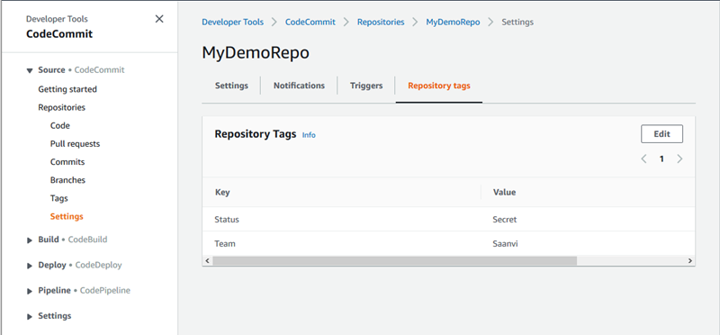

# View tags for a repository

Tags can help you identify and organize your AWS resources and manage access to
them. For more information about tagging
strategies, see [Tagging AWS Resources](../../../general/latest/gr/aws_tagging.md "../../../general/latest/gr/aws_tagging.md"). For examples of tag-based access policies, see [Example 5: Deny or allow
actions on repositories with tags](customer-managed-policies.md#identity-based-policies-example-5 "customer-managed-policies.md#identity-based-policies-example-5").

## View tags for a repository (console)

You can use the CodeCommit console to view the tags associated with a CodeCommit repository.

1. Open the CodeCommit console at [https://console.aws.amazon.com/codesuite/codecommit/home](https://console.aws.amazon.com/codesuite/codecommit/home "https://console.aws.amazon.com/codesuite/codecommit/home").
2. In **Repositories**, choose the name of the repository where you want to view
   tags.
3. In the navigation pane, choose **Settings**. Choose
   **Repository tags**.



## View tags for a repository (AWS CLI)

Follow these steps to use the AWS CLI to view the AWS tags for a CodeCommit repository. If
no tags have been added, the returned list is empty.

At the terminal or command line, run the
**list-tags-for-resource** command. For example, to view a list of
tag keys and tag values for a repository named
`MyDemoRepo` with the ARN
`arn:aws:codecommit:us-east-2:111111111111:MyDemoRepo`:

```
aws codecommit list-tags-for-resource --resource-arn arn:aws:codecommit:`us-west-2`:`111111111111`:`MyDemoRepo`
```

If successful, this command returns information similar to the following:

```
{
    "tags": {
        "Status": "Secret",
        "Team": "Saanvi"
    }
}
```
