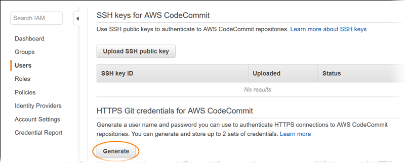
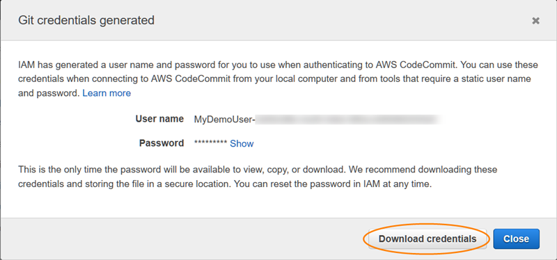

# Setup for HTTPS users using Git credentials

The simplest way to set up connections to AWS CodeCommit repositories is to configure Git
credentials for CodeCommit in the IAM console, and then use those credentials for HTTPS
connections. You can also use these same credentials with any third-party tool or integrated
development environment (IDE) that supports HTTPS authentication using a static user name
and password. For examples, see [For connections from development tools](setting-up-ide.md "setting-up-ide.md").

###### Note

If you have previously configured your local computer to use the credential helper
for CodeCommit, you must edit your .gitconfig file to remove the credential helper
information from the file before you can use Git credentials. If your local computer
is running macOS, you might need to clear cached credentials from Keychain
Access.

## Step 1: Initial configuration for CodeCommit

Follow these steps to set up an Amazon Web Services account, create an IAM user, and configure access
to CodeCommit.

###### To create and configure an IAM user for accessing CodeCommit

1. Create an Amazon Web Services account by going to [http://aws.amazon.com](http://aws.amazon.com "http://aws.amazon.com") and choosing **Sign Up**.
2. Create an IAM user, or use an existing one, in your Amazon Web Services account. Make sure you have an access key ID and a secret access key associated with that IAM user. For more
   information, see [Creating an IAM User in Your Amazon Web Services account](../../../IAM/latest/UserGuide/Using_SettingUpUser.md "../../../IAM/latest/UserGuide/Using_SettingUpUser.md").

###### Note

CodeCommit requires AWS Key Management Service. If you are using an existing IAM user, make sure there are no policies attached to the user that expressly deny the AWS KMS actions required
by CodeCommit. For more information, see [AWS KMS and encryption](encryption.md "encryption.md"). 3. Sign in to the AWS Management Console and open the IAM console at [https://console.aws.amazon.com/iam/](https://console.aws.amazon.com/iam/ "https://console.aws.amazon.com/iam/"). 4. In the IAM console, in the navigation pane, choose **Users**, and then choose the IAM user you want to configure for CodeCommit access. 5. On the **Permissions** tab, choose **Add Permissions**. 6. In **Grant permissions**, choose **Attach existing policies
directly**. 7. From the list of policies, select **AWSCodeCommitPowerUser** or another
managed policy for CodeCommit access. For more information, see [AWS managed policies for
CodeCommit](security-iam-awsmanpol.md "security-iam-awsmanpol.md").

After you have selected the policy you want to attach, choose **Next:
Review** to review the list of policies to attach to the IAM user. If the
list is correct, choose **Add permissions**.

For more information about CodeCommit managed policies and sharing access to repositories with other groups and users, see [Share a repository](how-to-share-repository.md "how-to-share-repository.md")
and [Authentication and access control for
AWS CodeCommit](auth-and-access-control.md "auth-and-access-control.md").

If you want to use AWS CLI commands with CodeCommit, install the AWS CLI. We recommend that
you create a profile for using the AWS CLI with CodeCommit. For more information, see [Command line reference](cmd-ref.md "cmd-ref.md") and [Using named profiles](../../../cli/latest/userguide/cli-configure-files.md#cli-configure-files-using-profiles "../../../cli/latest/userguide/cli-configure-files.md#cli-configure-files-using-profiles").

## Step 2: Install Git

To work with files, commits, and other information in CodeCommit repositories, you must install
Git on your local machine. CodeCommit supports Git versions 1.7.9 and later. Git version 2.28 supports configuring the branch name for initial commits. We recommend using a recent version of Git.

To install Git, we recommend websites such as [Git Downloads](http://git-scm.com/downloads "http://git-scm.com/downloads").

###### Note

Git is an evolving, regularly updated platform. Occasionally, a feature change
might affect the way it works with CodeCommit. If you encounter issues with a specific version of
Git and CodeCommit, review the information in [Troubleshooting](troubleshooting.md "troubleshooting.md").

## Step 3: Create Git credentials for HTTPS connections to CodeCommit

After you have installed Git, create Git credentials for your IAM user in IAM.

###### To set up HTTPS Git credentials for CodeCommit

1. Sign in to the AWS Management Console and open the IAM console at [https://console.aws.amazon.com/iam/](https://console.aws.amazon.com/iam/ "https://console.aws.amazon.com/iam/").

Make sure to sign in as the IAM user who will create and use the Git credentials
for connections to CodeCommit. 2. In the IAM console, in the navigation pane, choose **Users**, and
from the list of users, choose your IAM user.

###### Note

You can directly view and manage your CodeCommit credentials in **My Security Credentials**.
For more information, see [View and manage your credentials](setting-up.md#setting-up-view-credentials "setting-up.md#setting-up-view-credentials"). 3. On the user details page, choose the **Security Credentials** tab,
and in **HTTPS Git credentials for AWS CodeCommit**, choose **Generate**.



###### Note

You cannot choose your own user name or password for Git credentials. For
more information, see [Use Git
Credentials and HTTPS with CodeCommit](../../../IAM/latest/UserGuide/id_credentials_ssh-keys.md#git-credentials-code-commit "../../../IAM/latest/UserGuide/id_credentials_ssh-keys.md#git-credentials-code-commit"). 4. Copy the user name and password that IAM generated for you, either by showing,
copying, and then pasting this information into a secure file on your local computer, or
by choosing **Download credentials** to download this information as a
.CSV file. You need this information to connect to CodeCommit.



After you have saved your credentials, choose **Close**.

###### Important

This is your only chance to save the user name and password. If you do not save them, you can copy the user name from the IAM
console, but you cannot look up the password. You must reset the password and then save it.

## Step 4: Connect to the CodeCommit console and clone

the repository

If an administrator has already sent you the name and connection details for the CodeCommit
repository, you can skip this step and clone the repository directly.

###### To connect to a CodeCommit repository

1. Open the CodeCommit console at [https://console.aws.amazon.com/codesuite/codecommit/home](https://console.aws.amazon.com/codesuite/codecommit/home "https://console.aws.amazon.com/codesuite/codecommit/home").
2. In the region selector, choose the AWS Region where the repository was created.
   Repositories are specific to an AWS Region. For more information, see [Regions and Git connection endpoints](regions.md "regions.md").
3. Find the repository you want to connect to from the list and choose it. Choose **Clone URL**, and then choose the protocol you want to use when
   cloning or connecting to the repository. This copies the clone URL.
   - Copy the HTTPS URL if you are using either Git credentials with your IAM user or the credential helper included with the AWS CLI.
   - Copy the HTTPS (GRC) URL if you are using the **git-remote-codecommit** command on your local computer.
   - Copy the SSH URL if you are using an SSH public/private key pair with your IAM user.

###### Note

If you see a **Welcome** page instead of a list of repositories, there are no
repositories associated with your AWS account in the AWS Region where you are signed in. To create a repository, see [Create an AWS CodeCommit repository](how-to-create-repository.md "how-to-create-repository.md") or
follow the steps in the [Getting started with Git and CodeCommit](getting-started.md "getting-started.md") tutorial. 4. Open a terminal, command line, or Git shell. Run the **git
clone** command with the HTTPS clone URL you copied to clone the
repository. For example, to clone a repository named
`MyDemoRepo` to a local repo named
`my-demo-repo` in the US East (Ohio)
Region:

```
git clone https://git-codecommit.us-east-2.amazonaws.com/v1/repos/MyDemoRepo my-demo-repo
```

The first time you connect, you are prompted for the user name and
password for the repository. Depending on the configuration of your local
computer, this prompt either originates from a credential management system
for the operating system, a credential
manager utility for your version of Git (for example, the Git Credential Manager
included in Git for Windows), your IDE, or Git itself. Enter the user name and
password generated for Git credentials in IAM (the ones you created in [Step 3: Create Git credentials for HTTPS connections to CodeCommit](#setting-up-gc-iam "#setting-up-gc-iam")).
Depending on your operating system and other software, this information might be
saved for you in a credential store or credential management utility. If so, you
should not be prompted again unless you change the password, inactivate the Git
credentials, or delete the Git credentials in IAM.

If you do not have a credential store or credential management utility
configured on your local computer, you can install one. For more information
about Git and how it manages credentials, see [Credential
Storage](https://git-scm.com/book/en/v2/Git-Tools-Credential-Storage "https://git-scm.com/book/en/v2/Git-Tools-Credential-Storage") in the Git documentation.

For more information, see [Connect to the CodeCommit repository by cloning the repository](how-to-connect.md#how-to-connect-http "how-to-connect.md#how-to-connect-http") and [Create a commit](how-to-create-commit.md "how-to-create-commit.md").

## Next steps

You have completed the prerequisites. Follow the steps in [Getting started with CodeCommit](getting-started-cc.md "getting-started-cc.md") to start using CodeCommit.

To learn how to create and push your first commit, see [Create a commit in AWS CodeCommit](how-to-create-commit.md "how-to-create-commit.md"). If
you're new to Git, you might also want to review the information in [Where can I learn more about Git?](welcome.md#welcome-get-started-with-git "welcome.md#welcome-get-started-with-git") and [Getting started with Git and AWS CodeCommit](getting-started.md "getting-started.md").
