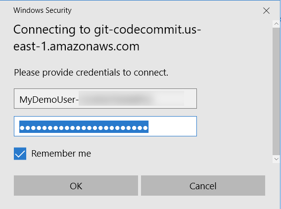
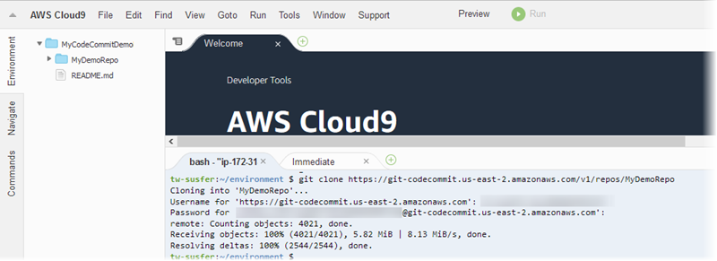
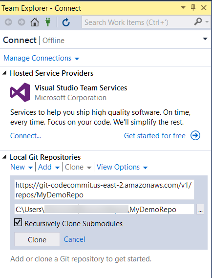

# Set up connections from development tools using Git credentials

After you have configured Git credentials for AWS CodeCommit in the IAM console, you can use those credentials
with any development tool that supports Git credentials. For example, you can configure access to your CodeCommit
repository in AWS Cloud9, Visual Studio, Xcode, IntelliJ, or any integrated development environment
(IDE) that integrates Git credentials. After you configure access, you can edit your code, commit your changes,
and push directly from the IDE or other development tool.

###### Note

If you access CodeCommit repositories using federated access, temporary credentials, or a
web idenity provider, you cannot use Git credentials. We recommend that you set up your
local computer using the `git-remote-codecommit` command. However, not all
IDEs are fully compatible with Git remote helpers such as
**git-remote-codecommit**. If you encounter problems, see [Troubleshooting git-remote-codecommit and AWS CodeCommit](troubleshooting-grc.md "troubleshooting-grc.md").

###### Topics

- [Integrate AWS Cloud9 with AWS CodeCommit](setting-up-ide-c9.md "setting-up-ide-c9.md")
- [Integrate Visual Studio with AWS CodeCommit](setting-up-ide-vs.md "setting-up-ide-vs.md")
  When prompted by your IDE or development tool for the user name and password used to connect to the CodeCommit
  repository, provide the Git credentials for **User name** and **Password** you
  created in IAM.

For more information about AWS Regions and endpoints for CodeCommit, see [Regions and Git connection endpoints](regions.md "regions.md").

You might also see a prompt from your operating system to store your user name and password. For example, in
Windows, you would provide your Git credentials as follows:

For information about configuring Git credentials for a particular software program or development tool,
consult the product documentation.

The following is not a comprehensive list of IDEs. The links are provided solely to help you learn more about
these tools. AWS is not responsible for the content of any of these topics.

- [AWS Cloud9](setting-up-ide-c9.md "setting-up-ide-c9.md")

- [Visual Studio](https://www.visualstudio.com/en-us/docs/git/tutorial/creatingrepo#clone-an-existing-git-repo "https://www.visualstudio.com/en-us/docs/git/tutorial/creatingrepo#clone-an-existing-git-repo")

Alternatively, install the AWS Toolkit for Visual Studio. For more information, see [Integrate Visual Studio with AWS CodeCommit](setting-up-ide-vs.md "setting-up-ide-vs.md").

- [XCode](https://developer.apple.com/library/content/documentation/IDEs/Conceptual/xcode_guide-continuous_integration/PublishYourCodetoaSourceRepository.html "https://developer.apple.com/library/content/documentation/IDEs/Conceptual/xcode_guide-continuous_integration/PublishYourCodetoaSourceRepository.html")
